# RAGStack — Roadmap

The **unified plan**: milestones → workstreams → issues → **dependencies**. This ties
together the four planning artifacts that were previously scattered:

| Artifact | Role |
|---|---|
| [SPEC.md](SPEC.md) | Milestones M1–M8 (the *what*, one line each) |
| [STATUS.md](STATUS.md) | Current state + checkpoints (the *where we are*) |
| GitHub issues | Subtasks (the *how*, granular) |
| [docs/adr/0001](docs/adr/0001-execution-topology.md) | Execution topology (the *with what*) |

This file adds what none of them had on its own: an explicit **dependency graph** and a
**recommended next sequence**, so "what do we build next, and what blocks what" has one answer.

---

## 1. Status snapshot

**Shipped (v0.15.0 + post-v0.15.0 merges):** M1 foundation · M2 scalable ingestion · M3
hybrid retrieval · **M4 knowledge graph** (Phase 1 + 2, Python) · M5 intelligence
(rewriting, reranking) · the dashboard **MVP slice** (scaffold #92, Explore console #93)
· the RBAC spine (#84) and tenant-scoped read endpoints (#85).

**Open milestones:** **M6** (API & Auth) · **M7** (Observability) · **M8** (Production).

**Cross-cutting workstreams** surfaced by the design study + audits (not in the original SPEC):
config-hardening, per-component ablation/eval, the HA/security gap backlog, and the
ADR-0001 execution-topology migration.

Go remains a Phase-1 stub; per ADR 0001 it is built out later, gated by the Go gateway.

---

## 2. Milestone → workstream → issues

Status: ✅ done · 🟡 partial · ⛔ not started. "Blocked by" names the hard dependency.

### M6 — API & Auth
| Issue | What | Status | Blocked by |
|---|---|---|---|
| #84 RBAC spine + `/v1/config` | ✅ | done (PR #81) | — |
| #85 tenant-scoped read endpoints | ✅ | done (PR #98) | — |
| #86 doc registry + `/v1/catalog` | ⛔ | **foundational** | — |
| #100 `GET /v1/jobs` (tenant-stamped) | ⛔ | | JobStore `tenant_id` migration |
| #87 rate limiting + request bounds | ⛔ | | — |
| #88 authz conformance 401/403 | 🟡 | 4 of ~10 ops annotated | — |
| #109 defense-in-depth tenant isolation | ⛔ | (do-now, cheap) | — |
| #110 RAG threat controls (injection/DLP) | ⛔ | security workstream | — |
| #111 answer-surface trust (streaming/citations/confidence/degradation) | ⛔ | | #29 for citations |
| #29 doc-level citations | ⛔ | (impl of #111 citations) | #86 |
| #112 per-tenant compute/token quotas | ⛔ | | — |
| #113 structured errors + feedback + explain | ⛔ | | — |
| #91 BV-BRC SSO + CSRF | ⛔ | greenfield | RBAC spine (done) |
| config-hardening | ⛔ | (weighted RRF, threshold, timeouts, runtime-config docs) | PR #120 lands first |

### M7 — Observability
| Issue | What | Status | Blocked by |
|---|---|---|---|
| #89 `/metrics` + OTEL + Prometheus/Grafana | ⛔ | concrete impl | — |
| #114 OTel across planes + RED/USE + burn-rate SLOs | ⛔ | design framing (dedupe w/ #89) | — |
| #90 usage log + `/v1/stats/usage` + per-stage timings | ⛔ | | overlaps #89 |

### M8 — Production
| Issue | What | Status | Blocked by |
|---|---|---|---|
| #118 infra setup (IaC, Helm/K8s, sizing, backup/restore, TLS) | ⛔ | gated by an infra ADR | — |
| #115 HA correctness (consistency, model-version cutover, erasure, encryption) | ⛔ | | read replicas (#118) |
| #116 split query/ingest embedding pools (bulkhead) | ⛔ | | Go router (ADR 0001) |
| #6 API-level ingest resume | ⛔ | | JobStore resume wiring |
| #7 Postgres `fail_interrupted` lease | ⛔ | | owner/heartbeat column |

### Dashboard epic (#82 — spans M6 + M7)
Frontend: #92 ✅ · #93 ✅ · #94 ⛔ (catalog/graph/debug) · #95 ⛔ (ops) · #96 ⛔ (eval/overview) · #97 ⛔ (prod StaticFiles+CSP).
Backend it waits on: #86 (→#94), #100 (→#95), #89 (→#95), #90 (→#96), #87.

### Ingestion & eval (ADR-0001 execution topology)
- **ADR-0001 migration:** accept ADR → build `GoWeBackend` (per-shard Python tool) → **subsumes** #71 (look-ahead), #25 (script/pipeline dup), #63 (metrics observer). Also #62 (collection agreement → receipts), #64 (token cache), #77 (gap tracker).
- **Per-component benchmarking:** ablation-harness (new) — the missing ability to isolate embedding/BM25/RRF-k/rewriting/graph/answer-quality; today only chunking is isolated. Depends on PR #120 (quality knobs now config-driven).
- **Eval experiments (low priority):** #46/#47 cross-system chunking, #55 localization metric, #56 BioASQ.
- **Refactor/duplication:** #103 (bisect isolation), #104 (OpenAILLM→SidecarClient), #105 (`_ChunkListStore`), #106 (argparse defaults), #107 (store id helpers).

### Go parity
- #41 KG extraction + graph fusion — **deferred**; per ADR 0001 the Go gateway is built first.

---

## 3. Dependency graph

```mermaid
flowchart TD
  RBAC["#84 RBAC spine ✅"] --> AUTHZ["#88 authz conformance"]
  RBAC --> SSO["#91 SSO"]
  RBAC --> QUOTA["#112 compute quotas"]

  REG["#86 doc registry"] --> CATBROWSE["#94 catalog browser"]
  REG --> CITE["#29 doc citations"]
  CITE --> TRUST["#111 answer-surface trust"]

  JOBS["#100 GET v1 jobs"] --> OPS["#95 Ops module"]
  METRICS["#89 metrics + OTEL"] --> OPS
  METRICS --> EVALMOD["#96 Eval + Overview"]
  USAGE["#90 usage log"] --> EVALMOD
  METRICS -. dedupe .- OBSDESIGN["#114 obs design"]

  CFG["PR #120 config knobs ✅"] --> CFGHARD["config-hardening"]
  CFG --> ABLATE["ablation-harness"]
  CFGHARD --> ABLATE

  ADR["ADR 0001 accept"] --> GOWE["GoWeBackend"]
  GOWE --> SUBSUME["subsumes #71 #25 #63"]
  ADR --> ROUTER["Go embedding router"]
  ROUTER --> BULKHEAD["#116 pool bulkhead"]

  INFRA["#118 infra setup"] --> HACORR["#115 HA correctness"]

  REG --> EPIC["#82 Dashboard epic"]
  JOBS --> EPIC
  METRICS --> EPIC
  CATBROWSE --> EPIC
  OPS --> EPIC
  EVALMOD --> EPIC
```

**Critical path to a usable dashboard:** **#86** (doc registry) + **#100** (jobs) + **#89**
(metrics) are the three backend unblockers — every remaining frontend module (#94/#95/#96)
waits on one of them. Build those three and the epic #82 largely falls out.

---

## 4. Recommended next sequence

Ordered by leverage (unblocks the most, cheapest first):

1. **PR #120 → merge** (config quality knobs) — unblocks the ablation-harness and stops the phantom-knob no-ops.
2. **#109 defense-in-depth tenant isolation** — cheap, closes a security gap now.
3. **#86 doc registry** — the single highest-leverage backend unblock (→ #94, #29, #82).
4. **#100 `GET /v1/jobs`** — unblocks the Ops module (#95).
5. **#89 / #114 observability** (consolidated) — unblocks #95/#96 and is M7 outright.
6. **#111 answer-surface trust** (streaming/citations/confidence/visible-degradation) + **#29** — the biggest UX lift; the frontend was built to light up when these land.
7. **ablation-harness** — now possible post-#120; make retrieval quality measurable per component.
8. **ADR 0001 accept → `GoWeBackend`** — retires the ingest-script debt (#71/#25/#63).
9. **M8 infra** (#118 → #115/#116) — only when moving past single-node; don't advertise HA SLOs until it exists.

**Deferred (measured trigger, not now):** Go parity (#41), the low-value eval experiments (#46/#47/#55/#56), SSO (#91).

---

## 5. Notes

- **Milestone tags:** issues filed from the design study carry `[M6]/[M7]/[M8]`; older dashboard/ingest issues (#6, #7, #25, #82–#100) predate the tagging — this file is their mapping.
- **Dedupe:** #89↔#114 (observability), #87↔#112 (limits vs quotas), #29↔#111 (citations) are cross-linked on the issues; treat the older/concrete one as the impl and the newer/design one as context.
- **This roadmap is descriptive, not a commitment** — it reflects current issue state and dependencies as of the date in git history; re-derive from the open-issue list when it drifts.
