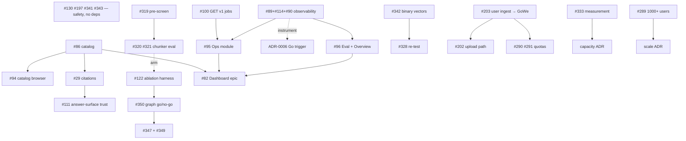

# RAGStack — Roadmap

The **unified plan**: milestones → workstreams → issues → **dependencies**. This ties
together the planning artifacts that would otherwise be scattered:

| Artifact | Role |
|---|---|
| [SPEC.md](SPEC.md) | Milestones M1–M8 (the *what*, one line each) |
| [STATUS.md](STATUS.md) | Current state + checkpoints (the *where we are*) |
| GitHub issues | Subtasks (the *how*, granular) |
| [docs/adr/](docs/adr/README.md) | Decisions (the *with what* — ADR-0006 is the execution topology) |

This file adds what none of them has on its own: an explicit **dependency graph** and a
**recommended next sequence**, so "what do we build next, and what blocks what" has one answer.

**Re-derived 2026-08-24** from the open-issue list after the open-access production build
and [ADR-0006](docs/adr/0006-execution-topology-revised.md). The previous revision
(2026-07-03) is in git history.

---

## 1. Status snapshot

**Shipped:** M1 foundation · M2 scalable ingestion · M3 hybrid retrieval · M4 knowledge
graph (Python, default-off) · M5 intelligence (rewriting, reranking — rerank now **on by
default**) · the **access-control MVP** (ADR-0002/0003/0004/0005: registry, ownership,
shares, groups, service accounts, per-tenant stores, scripted provisioning) · the dashboard
MVP slice (#92, #93) · `GET /v1/documents` (#86, PR #129) · the **offline ingest plane on
GoWe/CWL**, production-validated by the open-access build (32/32 batches, 47.6M chunks,
1.41M articles — [reports/oa-ingest-run.md](reports/oa-ingest-run.md)).

**Open milestones:** M6 (API & Auth, partial) · M7 (Observability, not started) · M8
(Production).

**Decisions taken this cycle:** shared embedding pool over pinned worker-per-GPU, on the
condition of a per-batch floor alarm (#336 → #343) · execution topology revised — one
ingest plane, Python online plane, Go by measured trigger ([ADR-0006](docs/adr/0006-execution-topology-revised.md),
supersedes ADR-0001) · quantization research complete, measurement pending (#333,
[reports/quantization-research.md](reports/quantization-research.md)).

**Decisions pending, with their own issue:** graph leg go/no-go (#350) · scale to 1,000+
users vs the collection budget (#289) · store capacity — quantization/sharding/replicas
(#333).

---

## 2. Milestone → workstream → issues

Status: ✅ done · 🟡 partial · ⛔ not started. "Blocked by" names the hard dependency.

### Safety and silent-loss (no milestone — first)
| Issue | What | Status | Notes |
|---|---|---|---|
| #130 | `GET /v1/ingest/{job_id}` not tenant-scoped (IDOR) | ⛔ | tagged security, open since July; one `tenant_id` argument |
| #197 | `get_chunks` silently drops every filter key but tenant | ⛔ | same class; ADR-0003 made it "an ordinary bug" — still a bug |
| #341 | loader must restore the parked ES refresh on SIGTERM | ⛔ | bit twice during the build |
| #343 | per-batch fleet-utilisation floor alarm | ⛔ | the condition of the shared-pool decision |
| #260 / #261 / #264 | drain-agent silent drop · FileSink truncation · manifest blind overwrite | ⛔ | verify which paths the GoWe plane retired; close as superseded where it did |

### Decisions with the research done — run the measurement
| Issue | What | Status | Blocked by |
|---|---|---|---|
| #333 | quantization + sharding/replica decision | 🟡 research landed (PR #344) | one eval collection through the 5-step protocol |
| #319 | zero-GPU boundary-discordance pre-screen | ⛔ | — ; gates #320/#321 |
| #320 / #321 | span-coverage metric · 4-arm chunker eval driver | ⛔ | #319 says "worth running" |

### Ingest plane (ADR-0006)
| Issue | What | Status | Blocked by |
|---|---|---|---|
| #342 | binary embedding-file vectors | ⛔ | — ; likely dissolves #328 |
| #328 | `--file-concurrency` 142 GB memory | 🟡 held at 1 | re-test after #342 |
| #203 | route user-triggered ingest to GoWe (`GoWeBackend` as the API's door) | ⛔ decided, plan in issue | — |
| #202 | file upload / Workspace-reference ingest | ⛔ | #203 |
| #25 / #71 / #63 | ingest_jsonl fork · look-ahead · metrics observer | close by decision | ADR-0006 §2 — retire `ingest_jsonl.py` |
| #265 | `ingest-paths.md` stale | ⛔ | rewrite against ADR-0006 |

### M6 — API & Auth
| Issue | What | Status | Blocked by |
|---|---|---|---|
| #84 / #85 | RBAC spine · tenant-scoped reads | ✅ | — |
| #86 | doc registry + `GET /v1/documents` | ✅ listing (PR #129); `/v1/catalog` open | narrow the issue to catalog or close |
| #100 | `GET /v1/jobs` | ⛔ | JobStore `tenant_id` migration |
| #87 | rate limiting + request bounds | ⛔ | — |
| #88 | authz conformance 401/403 | 🟡 | — |
| #290 / #291 | per-user quota on acquisition · per-collection size cap | ⛔ | — (personal-collections chain) |
| #253 | multi-collection fused retrieval | ⛔ | — ; the "search everything I can see" ask |
| #322 | retrieval-time prev/next chunk expansion | ⛔ | — ; neighbour ids already persisted |
| #109 / #110 | defence-in-depth isolation · RAG threat controls | ⛔ | — |
| #111 / #29 | answer-surface trust · doc-level citations | ⛔ | #86 catalog |
| #112 / #113 | quotas · structured errors + explain | ⛔ | — |
| #91 | BV-BRC SSO + CSRF | 🟡 identity layer landed | — |
| #123 | config-hardening | ⛔ | — |

### M7 — Observability
| Issue | What | Status | Blocked by |
|---|---|---|---|
| #89 + #114 + #90 | `/metrics` + OTEL · design · usage log + per-stage timings | ⛔ — **consolidate into one** | — ; also the instrument for ADR-0006's Go trigger |
| #122 | per-component ablation harness | ⛔ | — ; the graph go/no-go (#350) and the chunking eval both need it |
| #125 | eval on built corpora + regression gate | 🟡 seam landed | fold into #122 |

### M8 — Production
| Issue | What | Status | Blocked by |
|---|---|---|---|
| #118 | infra setup (IaC, sizing, backup/restore, TLS) | ⛔ | an infra ADR |
| #115 | HA correctness | ⛔ | #118 |
| #116 | ingest/query embedding bulkhead | ⛔ | — ; per ADR-0006 §3 two pool configs, not a Go router |
| #6 / #7 | API-level ingest resume · Postgres lease | ⛔ | largely moot under GoWe (#203) — re-scope |

### Dashboard epic (#82)
Frontend: #92 ✅ · #93 ✅ · #94 ⛔ (catalog/graph/debug) · #95 ⛔ (ops) · #96 ⛔ (eval/overview) · #97 ⛔ (prod StaticFiles+CSP).
Backend it waits on: #86-catalog (→#94), #100 + #89 (→#95), #90 (→#96), #87.

### Graph cluster — gated by #350
#347 (evidence fields + confidence floor) · #349 (query-side entity extraction — the leg is
near-inert without it) · #295 · #256 · #198-triples · #41. Recommendation in #350: **no-go
until #122 exists**, then evaluate as one ablation arm.

### Maintenance / code health
| Issue | What | Notes |
|---|---|---|
| #351 | collapse store backends (drop JSON; one SQL impl, two dialects) | ~5k lines → ~half; amends ADR-0004 |
| #103–#107 | small refactors from the July design study | opportunistic |
| #132 | eval CWL step-tools as console-scripts | with the ADR-0006 ingest cleanup |

### Go
Frozen scaffold, path kept open by contract + conformance (ADR-0006 §4). Live: `cmd/mcp`.
No parity work (#41, `TODO(parity)`) until a trigger in ADR-0006's table fires.

---

## 3. Dependency graph

---

## 4. Recommended next sequence

Ordered by leverage; each step is independently shippable.

1. **Safety block** — #130, #197, #341, #343; triage #260/#261/#264 against the shipped plane. Small, no dependencies, one PR each.
2. **#322 prev/next expansion** — a day; the seam the user guide already describes.
3. **#333 measurement** — run the published quantization protocol on one eval collection; the answer decides the next collection build's RAM footprint (~770 GB → ~240 GB if int8 + cold originals holds).
4. **#319 pre-screen** → decide whether #320/#321 run at all.
5. **#342 binary vectors** → re-test #328 → close or re-scope.
6. **ADR-0006 follow-through** — retire `ingest_jsonl.py` (deprecate → delete after next tag), close #25/#71/#63, rewrite #265, fix README/STATUS wording on the Go implementation.
7. **Personal-collections chain** — #203 → #202, #290/#291, #253. This is what the access-control MVP was built for, and the GoWe plane makes #203 tractable now.
8. **M7 observability** — consolidate #89/#114/#90, build once. Unblocks #95/#96 **and** produces the p95 number ADR-0006's Go gate is waiting on.
9. **#122 ablation harness** — then take the graph go/no-go (#350) and fold #125.
10. **#351 store collapse** — when the next store invariant would otherwise be written four times.
11. **M8 infra** (#118 → #115) — only when moving past single node.

**Deferred (measured trigger, not now):** Go parity (#41), the low-value eval experiments (#46/#47/#55/#56), BV-BRC SSO beyond what the identity layer already does (#91).

---

## 5. Notes

- **ADR-0001 is superseded** by ADR-0006; its offline half was validated by the production
  build, its Go embedding-router premise was refuted by measurement (the pool ran 1.3 of 6
  GPUs because of a 64-doc group size, not the runtime), and its Go gateway has no measured
  trigger. Details and the trigger table are in the ADR.
- **Dedupe:** #89↔#114↔#90 (observability — build as one), #87↔#112 (limits vs quotas),
  #29↔#111 (citations), #6/#7↔#203 (resume is the engine's job once ingest routes to GoWe).
- **This roadmap is descriptive, not a commitment** — re-derive from the open-issue list
  when it drifts; the previous revision drifted in six weeks.
