# RAGStack — Deep-Dive: Algorithms, Scalability & Duplication

A per-capability deep dive: for each capability, the **algorithm/workflow**, the
**tools & models** it uses, its **inputs → outputs**, whether it is **scalable and
parallelizable**, whether it distinguishes **single vs bulk** operation, and a
**Mermaid diagram** of the algorithm. It closes with a cross-cutting analysis of
**shared functionality and code duplication**.

> Companion to [ARCHITECTURE.md](ARCHITECTURE.md) (the high-level overview) and the
> [ADRs](adr/README.md). Scope: the **Python** implementation and the offline ingest
> plane (GoWe/CWL, ADR-0006); `ragstack-ctl` (Go) appears only where it bounds a
> tenant (§9).
>
> **Verified against `main` @ `22b44be` on 2026-09-23.** Rewritten section by
> section from the code; the previous version (2026-07-03) predated ADR-0002–0009.
> **Citations** are repo-relative path + symbol; the **symbol is authoritative**,
> and a line number, where given, was checked at that commit — re-derive it from the
> symbol if the file has moved. Numbers are quoted only from committed documents
> and are cited to them. Where the code and an ADR disagree, the section says so;
> §9.9 collects those.

## Contents

1. [Single vs bulk — the ingest paths and one query path](#0-single-vs-bulk--the-ingest-paths-and-one-query-path)
2. [Loading & Enrichment](#1-loading--enrichment)
3. [Chunking](#2-chunking)
4. [Embedding & Embedder Pool](#3-embedding--embedder-pool)
5. [Single-document Ingestion Pipeline](#4-single-document-ingestion-pipeline)
6. [Bulk / Sharded Ingestion](#5-bulk--sharded-ingestion)
7. [Retrieval & RRF Fusion](#6-retrieval--rrf-fusion)
8. [Rewriting, Reranking, Answer Generation](#7-rewriting-reranking-answer-generation)
9. [Storage Adapters & Knowledge Graph](#8-storage-adapters--knowledge-graph)
10. [Identity, Access Control, Tenancy & Lifecycle](#9-identity-access-control-tenancy--lifecycle)
11. [Shared functionality & code duplication](#10-shared-functionality--code-duplication)

---

## 0. Single vs bulk — the ingest paths and one query path

This is the most important structural fact about the system, so it comes first and
the capability sections below refer back to it.

**One pipeline, four drivers.** Every path that writes chunks runs the same
`IngestionPipeline` halves (`python/ragstack/ingestion/pipeline.py`:
`prepare_documents` → `_embed_and_link` → `index_chunks`), except the legacy
`ingest_jsonl.py` (path D), which is still a fork. What differs between paths is
*who drives the pipeline, and where*.

**Which API path runs is a deployment setting.** `INGEST_BACKEND` is `local` (the
default, `python/ragstack/config.py` `ingest_backend`) or `gowe`, normalised by
`python/ragstack/ingestion/backends.py` `ingest_backend_name`. Both ingest routes
start with `_refuse_unknown_backend` (`python/ragstack/api/routers/documents.py:461`),
which answers **501** for any other value. On `gowe`, `ingest`
(`documents.py:997`) and `ingest_upload` (`documents.py:1428`) return from the GoWe
branch **before** `_resolve_ingest_target` (`documents.py:1060` / `:1490`) is
reached, so on a GoWe deployment the API process never loads, chunks or embeds a
document — the CWL workflow does.

ADR-0006 (Status: Proposed, supersedes ADR-0001) records the intent behind this
split: the offline plane on GoWe/CWL is "accepted as built"; the in-process path is
"dev/test only, selected by `ingest_backend=local` and never exposed to
self-service users"; `ingest_jsonl.py` is "retired: deprecated now … deleted after
the next tagged release".

| Path | Entry point | Unit of work | Concurrency model | Resume / retry | Status at `22b44be` |
|---|---|---|---|---|---|
| **A. API, local, in-process** | `POST /v1/ingest` (server path under `INGEST_ROOT`) and `POST /v1/ingest/upload` (staged under `{INGEST_ROOT}/uploads/{tenant}/{job_id}/`) → `_run_ingest` → `ShardedIngestor.ingest_manifest` → `LocalAsyncIORunner` | one file = one manifest item = one `IngestionPipeline.ingest` | `asyncio` shards under a semaphore (`ingest_concurrency`, default 4) of `ingest_shard_size` (default 64) items; items within a shard run in order; optional per-tenant `TenantQuota` slot per item | per-item checkpoints in `JobStore`; the public API has no way to resume a job id (`ingest` docstring). At startup, `job_store.fail_interrupted()` marks interrupted jobs failed; on the Postgres store it is a no-op (`api/deps.py`) | Works. ADR-0006 §2: dev/test only |
| **B. API → GoWe/CWL (the user plane)** | the same two routes with `INGEST_BACKEND=gowe` → `_run_gowe_ingest` → `GoWeBackend.run_submission` → `cwl/pdf-ingest-scatter.cwl` | a **batch** of PDFs (`batch_size`, default 20) per task chain `pdf_extract.py` → `ingest_shard.py`; one receipt row per document | the GoWe engine scatters batches over its workers; the API holds only a background poll task | the engine retries tasks; each task is idempotent (deterministic ids + upsert). No API-side resume | The user-facing path. Needs a BV-BRC bearer token and a registered collection |
| **C. Operator bulk CWL** | `python/scripts/gowe_batch_ingest.py` over `cwl/jats-ingest.cwl`, or `cwl/ingest-bulk.cwl`, `cwl/embed-bulk.cwl` + `cwl/load-embeddings.cwl`, `cwl/pdf-ingest.cwl`, submitted by an operator | a pre-planned JSONL shard (`plan_shards.py`) per scatter task | engine scatter over workers; the load is a single un-scattered task; the driver pipelines batch N's load behind batch N+1's embed | engine retry per task; the driver keeps a resumable ledger and checks both store legs after each batch | ADR-0006 §1: "the reference shape for every future bulk job" |
| **D. Legacy `ingest_jsonl.py`** | `python/scripts/ingest_jsonl.py` (operator CLI) | cross-document chunk batches streamed from one JSONL file | its own producer → N workers pipeline | its own `.ckpt` frontier + `done_ranges`, `--resume`, `--batch-retries` | ADR-0006 says retire it. **The code does not yet say so** — see §5.5 |

A fifth writer, `python/scripts/ingest_chunks.py`, loads pre-chunked JSON (the caller
supplies the chunks). It resolves its target through the registry like the other bulk
writers (`ingest_target.resolve_or_exit`) and runs `validate_chunks`. It is a small
tool, not a separate ingest plane.

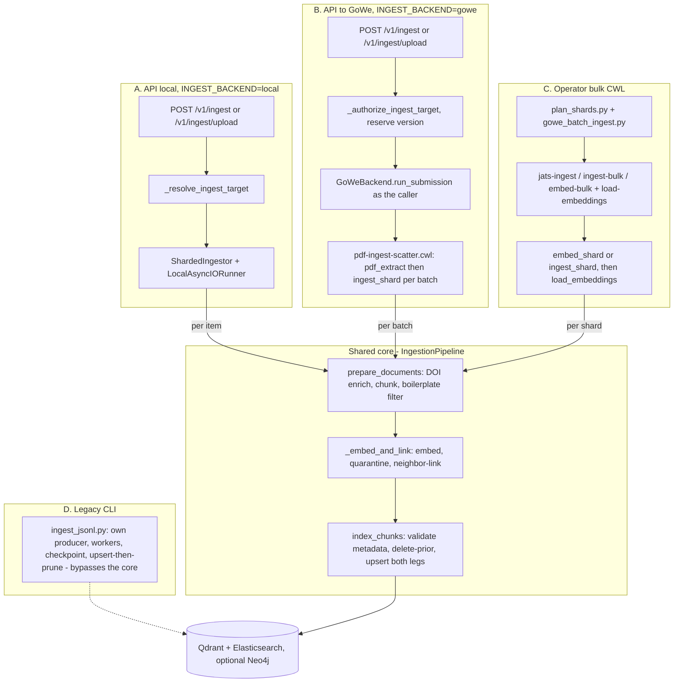
```mermaid
flowchart TD
    subgraph CORE["Shared core - IngestionPipeline"]
        P1["prepare_documents: DOI enrich, chunk, boilerplate filter"]
        P2["_embed_and_link: embed, quarantine, neighbor-link"]
        P3["index_chunks: validate metadata, delete-prior, upsert both legs"]
        P1 --> P2 --> P3
    end
    subgraph A["A. API local, INGEST_BACKEND=local"]
        A1["POST /v1/ingest or /v1/ingest/upload"] --> A2["_resolve_ingest_target"]
        A2 --> A3["ShardedIngestor + LocalAsyncIORunner"]
    end
    subgraph B["B. API to GoWe, INGEST_BACKEND=gowe"]
        B1["POST /v1/ingest or /v1/ingest/upload"] --> B2["_authorize_ingest_target, reserve version"]
        B2 --> B3["GoWeBackend.run_submission as the caller"]
        B3 --> B4["pdf-ingest-scatter.cwl: pdf_extract then ingest_shard per batch"]
    end
    subgraph C["C. Operator bulk CWL"]
        C1["plan_shards.py + gowe_batch_ingest.py"] --> C2["jats-ingest / ingest-bulk / embed-bulk + load-embeddings"]
        C2 --> C3["embed_shard or ingest_shard, then load_embeddings"]
    end
    subgraph D["D. Legacy CLI"]
        D1["ingest_jsonl.py: own producer, workers, checkpoint, upsert-then-prune - bypasses the core"]
    end
    A3 -- "per item" --> P1
    B4 -- "per batch" --> P1
    C3 -- "per shard" --> P1
    D1 -.-> STORES
    P3 --> STORES[("Qdrant + Elasticsearch, optional Neo4j")]
```

**Querying has one path and no bulk API.** `POST /v1/query` and `POST /v1/retrieve`
(`python/ragstack/api/routers/query.py`) each serve one query; there is no
batch-query route. Intra-request fan-out and fairness belong to §6–§7.

**Why it matters.** Paths A, B and C call the same pipeline, so chunk ids, neighbour
links, quarantine, the metadata contract and the delete-prior rule cannot drift
between them. What they do **not** share is *where the build spec comes from*: path A
builds the chunker from the collection entry in-process (`api/deps.py`
`build_ingestor_for`), while paths B and C receive it as CLI arguments and check it
against the registry (`IngestTarget.check_build`, §5.4). The one remaining fork is
path D.

---

---

## 1. Loading & Enrichment

A source becomes chunk metadata in up to five steps. Which of them run depends on the ingest path (§0), and two are switched by settings:

| Step | Module / symbol | Local API pipeline (paths A/B) | GoWe shard tools (`ingest_shard.py`, `embed_shard.py`) | `ingest_jsonl.py` (path C) |
|---|---|---|---|---|
| Load + dispatch | `ingestion/loaders.py` `LoaderRegistry` | yes | `JsonlLoader` only | own reader + `enrich` |
| Offline scholarly enrichment | `ingestion/enrich.py` `enrich` / `index_metadata` | JSONL sources only | yes, through `JsonlLoader` | yes |
| Network metadata resolution (Crossref / DataCite / NCBI ID Converter) | `ingestion/doi_metadata.py` `DoiEnricher` | when `doi_enrichment_enabled` | when `--doi-enrichment` is passed | no |
| Chunk-level boilerplate flag/drop | `ingestion/boilerplate.py` `BoilerplateFilter` | `boilerplate_detection_enabled` (default on), `boilerplate_drop` (default off) | `--boilerplate off/flag/drop`, default `flag` | `--boilerplate`, default `flag` |
| Declared-schema check at the ingest boundary | `metadata_schema.validate_chunks` | in `IngestionPipeline.index_chunks` | through `index_chunks` | direct call before the store write |

All citations below are repo-relative paths at `main` 22b44be. `python/ragstack/` is abbreviated to `ragstack/`, and `python/scripts/` to `scripts/`.

### 1.1 Document Loading & LoaderRegistry Dispatch

**What it is:** `ragstack/ingestion/loaders.py` `LoaderRegistry` is the single ingest ingress. It confines a source path to `ingest_root` (the LFI guard), enforces a per-file size ceiling (the DoS guard), then dispatches on file suffix. It satisfies the `DocumentLoader` protocol, so it drops into `IngestionPipeline` in place of a bare loader.

**Algorithm / workflow:**
1. `LoaderRegistry.__init__` resolves `ingest_root` once, stores `max_bytes`, and defaults to `TextFileLoader`.
2. `default_loader_registry(ingest_root, max_bytes, profile)` registers `.pdf` → `PdfLoader`, `.txt` / `.md` → one shared `TextFileLoader`, and `.jsonl` → `JsonlLoader(profile=profile)`. `DEFAULT_INGEST_SUFFIXES` is the matching tuple that a directory ingest enqueues.
3. `load(source)` → `_resolve(source)` → `confine_to_root(source, root)`. `Path.resolve()` collapses `..` and follows symlinks. Anything that is neither the root nor `is_relative_to(root)` raises `LoaderError("source is outside the permitted ingest root")`. Directory-manifest builds call the same function, so the guard has one home.
4. `_resolve` then rejects non-files (`source not found`) and, when `max_bytes` is truthy, files over the limit.
5. It looks up the loader by `path.suffix.lower()`, falling back to the default.
6. Failure classes (new since the old doc):
   - `LoaderError` carries caller-safe messages only.
   - `NoTextExtracted(LoaderError)` is raised for an image-only PDF. It carries the constant `job_error = NO_TEXT_ERROR` ("no extractable text (scanned PDF?)"), so a job can count such items with a GROUP BY.
   - `no_loader_error(suffix)` produces a constant per-suffix string ("no loader for .xml") for staged files with no registered loader (#202).

**Tools & models:** stdlib only (`pathlib`, `uuid.uuid5`).

**Inputs → Outputs:** `source: str` → `list[Document]`, or a `LoaderError` subclass.

**Scalability & parallelization:** Synchronous and single-source. `IngestionPipeline.prepare_source` calls `self.loader.load(source)` directly on the event loop. Only chunking is moved off the loop with `asyncio.to_thread`. Concurrency across sources comes from the caller: path B's `LocalAsyncIORunner`, or the GoWe scatter.

**Single vs bulk:** One path in per call. `.jsonl` is the in-file batch format (one file yields many documents). The `default_loader_registry` docstring still points very large corpora at `scripts/ingest_jsonl.py`, which streams and is not subject to `max_bytes`.

**Diagram:**
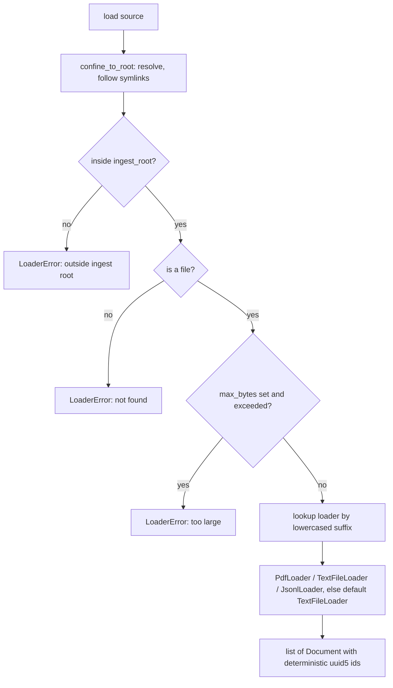
```mermaid
flowchart TD
    A["load source"] --> B["confine_to_root: resolve, follow symlinks"]
    B --> C{"inside ingest_root?"}
    C -- "no" --> E["LoaderError: outside ingest root"]
    C -- "yes" --> D{"is a file?"}
    D -- "no" --> F["LoaderError: not found"]
    D -- "yes" --> G{"max_bytes set and exceeded?"}
    G -- "yes" --> H["LoaderError: too large"]
    G -- "no" --> I["lookup loader by lowercased suffix"]
    I --> J["PdfLoader / TextFileLoader / JsonlLoader, else default TextFileLoader"]
    J --> K["list of Document with deterministic uuid5 ids"]
```

### 1.2 PDF / Text / JSONL Loaders, and the JATS extract that feeds JSONL

**What it is:** These are the concrete `DocumentLoader`s in `ragstack/ingestion/loaders.py`. Each derives the document id with `deterministic_doc_id(key)` = `uuid5(NAMESPACE_URL, key)`, so a re-ingest overwrites in place. `ragstack/ingestion/jats.py` is not a loader. It is the stdlib-only parser behind `scripts/jats_extract.py` that produces the JSONL `JsonlLoader` consumes.

**Algorithm / workflow:**
- **`TextFileLoader`** reads the file as UTF-8 and returns one `Document` with `metadata={"filename"}`. The id key is the resolved path.
- **`PdfLoader`** does a lazy `import pymupdf` (the `pdf` extra), then `pymupdf.open` and `page.get_text()` per page, and joins the pages with a newline.
  - It now also calls `_doi_from_pdf_metadata(doc)`, which scans the PDF info dictionary's `subject`, `keywords`, `title`, `creator` and `producer` for a DOI and normalises it with `doi_metadata.normalize_doi`. A hit is stamped as `doi` with `doi_source="pdf-metadata"`.
  - Empty text raises `NoTextExtracted`.
  - Metadata is deliberately `{filename, pages[, doi, doi_source]}`. The class docstring says the PDF's embedded `title` and `author` are not lifted because they are mostly producer junk, and under the "existing metadata wins" rule junk would permanently block the resolved title (§1.4).
- **`JsonlLoader`** streams lines, skips blank and undecodable lines, and runs `_document(record)`:
  1. `enrich(record, profile)` (§1.3). Records whose `doc_type` is in `skip_types` (default `{EMPTY}`) are skipped.
  2. The id key has three cases. An absolute `path` is `resolve()`d. A relative path (for example `PMC123#table-2`) is used as the literal string, because resolving would make the id depend on the worker's cwd; a GoWe re-ingest once duplicated a corpus that way. With no path, the id key is the text.
  3. `_metadata(enriched, record)` = `index_metadata(enriched)` plus opted-in raw keys from `passthrough_keys`. The enriched value always wins a name collision. `_passthrough_value` keeps scalars and flat scalar lists, drops dicts and blank strings, and coerces `KNOWN_INT_FIELDS` keys (today `year`) through `metadata_schema.coerce_declared`.
  4. Every raw key that does not reach the document is counted in `self.dropped`, a `DropReport` with two causes: `not_allowed` (policy: the key is not in the allow-list) and `unusable` (data: opted in but empty, nested, or the wrong type). `abstract` and `citations` are excluded from the report (`_CONSUMED_BY_DESIGN`). `scripts/embed_shard.py` builds `JsonlLoader(passthrough_keys=...)` from `--metadata-passthrough`. `scripts/ingest_shard.py` and the API registry build a bare `JsonlLoader()`.
  5. A file with no usable documents raises `LoaderError`.
- **`jats.py` `article_records`** emits two record kinds:
  - One `content_type="article"` record per article: abstract plus body, with every `<table-wrap>` and `<fig>` lifted out.
  - One record per table or figure unit (`content_type="table"` or `"figure"`, `section_title` = the unit suffix, `path` = `PMC123#table-2[-part-N]`). Oversized tables are pre-split by row with the caption and header repeated.

  `front_meta` sets `year` from the first `<pub-date>` whose `<year>` passes `metadata_schema.coerce_year`, as an int. It reads no month or day, so JATS extraction produces no `date` (see §1.6). `authors` and `keywords` are emitted as `"; "`-joined strings, which `enrich.parse_authors` / `split_keywords` turn into lists.

**Tools & models:** PyMuPDF (optional `pdf` extra); stdlib `json`, `xml.etree.ElementTree` (JATS), `uuid5`. `jats.py`'s only non-stdlib import is `ragstack.metadata_schema`, a dependency-free leaf.

**Inputs → Outputs:**
- Text and PDF: path → one `Document`.
- JSONL: path → N `Document`s, plus a `DropReport` on the loader instance.
- JATS: XML path → `(records, skipped)` dicts. Nothing is dropped silently.

**Scalability & parallelization:** All synchronous. PDF and text read the whole file. JSONL streams lines but accumulates the whole `list[Document]` before returning, which is the memory ceiling. `enrich` runs serially per record. `jats.py` is written to run once per document inside a CPU-only CWL worker, and its module docstring explains the import-cost constraint behind the stdlib-only design.

**Single vs bulk:** Text and PDF loaders are single-document. `JsonlLoader` is the batch loader, and the only one that skips bad records instead of failing.

**Diagram:**
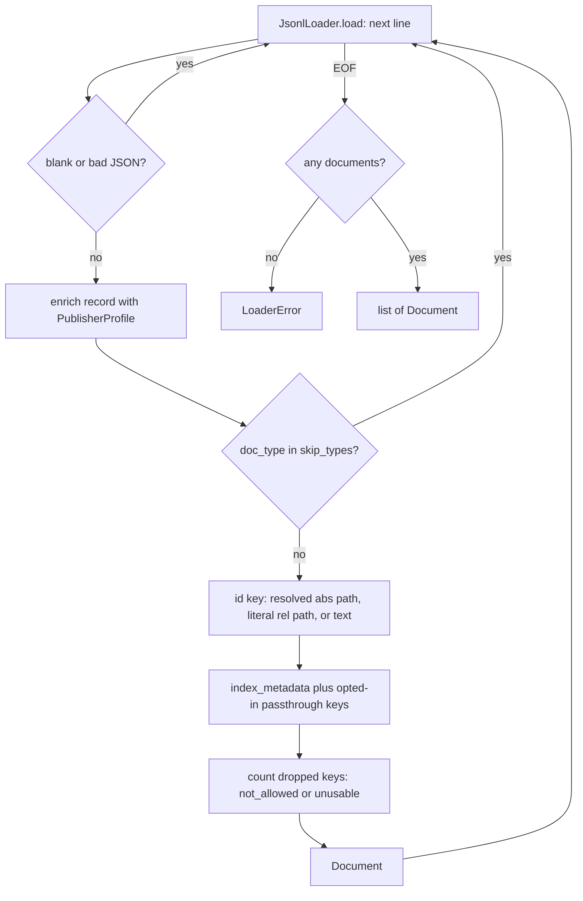
```mermaid
flowchart TD
    A["JsonlLoader.load: next line"] --> B{"blank or bad JSON?"}
    B -- "yes" --> A
    B -- "no" --> C["enrich record with PublisherProfile"]
    C --> D{"doc_type in skip_types?"}
    D -- "yes" --> A
    D -- "no" --> E["id key: resolved abs path, literal rel path, or text"]
    E --> F["index_metadata plus opted-in passthrough keys"]
    F --> G["count dropped keys: not_allowed or unusable"]
    G --> H["Document"]
    H --> A
    A -- "EOF" --> I{"any documents?"}
    I -- "no" --> J["LoaderError"]
    I -- "yes" --> K["list of Document"]
```

### 1.3 Offline Scholarly Enrichment (`enrich.py`)

**What it is:** `ragstack/ingestion/enrich.py` is a pure module with no I/O and no network. It recovers `doc_type`, DOI, title, authors, keywords, year and citations from the signals that survive extraction. Publisher specifics are isolated in a frozen `PublisherProfile`. `DEFAULT_PROFILE` is ASM (`10.1128`), and `resolve_profile(name)` falls back to it for unknown names.

**Algorithm / workflow (`enrich`):**
1. `classify(path, text, profile)` → `EMPTY`, `SUPPLEMENT` (`/suppl/` in the path, or a basename starting with `suppl`), `FRONT_MATTER` (basename in `profile.front_matter_names`), `SHORT` (under 1500 chars), or `ARTICLE`.
2. `derive_doi(path, text, meta_doi, profile=)` → `(doi, doi_source)`. The legs are tried in priority order:
   1. `metadata`: a non-blank `meta_doi`.
   2. `filename`: the `.pdf`-stripped stem through `profile.doi_from_filename`.
   3. `text`: the first `_DOI_IN_TEXT` match in `text[:4000]`, cleaned by `_trim_text_doi` (strips sentence punctuation and only an *unbalanced* trailing `)`).
   4. Otherwise `("", "")`.
3. `extract_citations(text)` runs only for `ARTICLE`. It finds a `LITERATURE CITED` / `REFERENCES` / `BIBLIOGRAPHY` header, coalesces numbered entries, and stops on a list restart. It caps at 250 entries.
4. `derive_year(path, doi, text, meta_year)` has changed since the old doc:
   - The record's own declared year (`meta.get("year")`, for example from JATS) now wins, via `metadata_schema.coerce_year`.
   - Otherwise it scans path, then DOI, for *every* `_YEAR` candidate (1950–2049) and takes the first plausible one.
   - Otherwise it looks for an anchored text year (copyright / received / accepted / … within 40 chars) in `text[:4000]`.
   - Every arm goes through `coerce_year`. The docstring records why: scratch UUIDs, ISSNs and accessions had produced future years in production.
   - The result is an `int` or `None`, never a string.
5. `EnrichedDoc` holds `source_path`, `filename`, `doc_type`, `doi`, `doi_source`, `title`, `authors` (`parse_authors`), `keywords` (`split_keywords`), `year`, `abstract`, `n_citations` and `citations`.
6. `index_metadata(doc)` = `model_dump(exclude={"citations","abstract"})`, then drops `""`, `[]` and `None`. `n_citations` is kept, including 0. This is where "absent is a state" (§1.6) starts: a field the record did not have is omitted, not defaulted.

**`packed_date` / `year_from_packed_date` (new):**
- `enrich.packed_date(year, month=None, day=None)` returns `yyyymmdd` with unknown parts set to 0. It returns `None` for an implausible year. A day without a month is dropped to 0.
- `year_from_packed_date(date)` returns `date // 10000` when plausible.
- At 22b44be **no production code calls either function**: the only references are `python/tests/unit/test_packed_date.py`, and no ingest path writes a `date` key.

**Tools & models:** stdlib `re`; `pydantic` (`PublisherProfile`, `EnrichedDoc`). Year coercions are re-exported from `metadata_schema`.

**Inputs → Outputs:** `enrich(record, *, prefix, profile) -> EnrichedDoc`; `index_metadata(EnrichedDoc) -> dict`; `derive_doi(...) -> (str, str)`; `derive_year(...) -> int | None`; `packed_date(...) -> int | None`.

**Scalability & parallelization:** CPU-bound and per-record. Scans are bounded (4000 chars for DOI and year text, 250 citations). The functions are pure, so they are trivially parallel, but no caller parallelises them.

**Single vs bulk:** Per record. `JsonlLoader` keeps only `index_metadata`. `scripts/ingest_jsonl.py` also writes the full `EnrichedDoc` (with citations) to a catalog.

**Diagram (DOI and year derivation):**
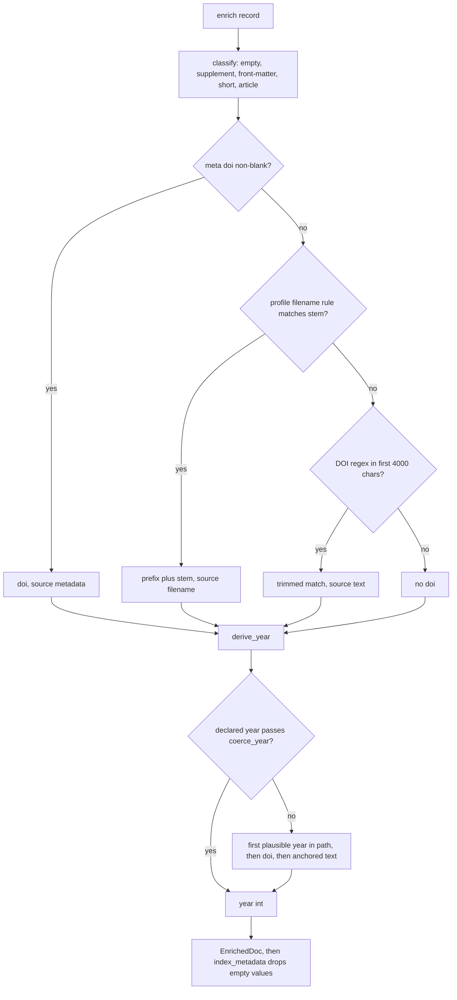
```mermaid
flowchart TD
    A["enrich record"] --> B["classify: empty, supplement, front-matter, short, article"]
    B --> C{"meta doi non-blank?"}
    C -- "yes" --> CD["doi, source metadata"]
    C -- "no" --> D{"profile filename rule matches stem?"}
    D -- "yes" --> DD["prefix plus stem, source filename"]
    D -- "no" --> E{"DOI regex in first 4000 chars?"}
    E -- "yes" --> ED["trimmed match, source text"]
    E -- "no" --> EN["no doi"]
    CD --> Y["derive_year"]
    DD --> Y
    ED --> Y
    EN --> Y
    Y --> Y1{"declared year passes coerce_year?"}
    Y1 -- "yes" --> YR["year int"]
    Y1 -- "no" --> Y2["first plausible year in path, then doi, then anchored text"]
    Y2 --> YR
    YR --> Z["EnrichedDoc, then index_metadata drops empty values"]
```

### 1.4 Scholarly Metadata Resolution at Upload (`doi_metadata.py`, #596 / #602)

**What it is:** `ragstack/ingestion/doi_metadata.py` is the network leg. It turns each document's DOI into a bibliographic record from Crossref (DataCite as a 404 fallback) plus `pmid` / `pmcid` from the NCBI ID Converter, and fills metadata that is absent. It exists because an uploaded PDF otherwise arrives with only `{filename, pages[, doi]}`, so every downstream label falls back to the filename (module docstring).

**Where it runs:** It runs between load and chunk, so one write per `Document` reaches every chunk (`chunkers._make_chunk` copies `dict(doc.metadata)`):
- **Local backend:** `IngestionPipeline._apply_doi_enrichment` is called from `prepare_documents` and `iter_embed_source`, using the enricher `api/deps.py` `_build_doi_enricher` builds at startup (`app.state.doi_enricher`).
- **GoWe backend:** the CWL step `scripts/ingest_shard.py` or `scripts/embed_shard.py` passes `enricher_from_args(args, http)` into its pipeline. Its flags come from `add_doi_enrichment_args` and are seeded per job by `api/routers/documents.py` `_gowe_inputs`, which sends `doi_enrichment=True` (plus `doi_mailto` / `doi_cache_dir`) only when `settings.doi_enrichment_enabled`.
- `scripts/ingest_jsonl.py` does not use it.

**Default state (verify before relying on it):** `ragstack/config.py` `Settings.doi_enrichment_enabled` is **`False`** at 22b44be. The comment above it says it "ships off anyway" because the shared GoWe worker image must learn `--doi-enrichment` before the API sends it. The docstrings of `doi_metadata.py` and `api/deps.py` `_build_doi_enricher` still say "ON by default since #596". The worker-tool flag is off unless passed.

**Algorithm / workflow (`DoiEnricher._enrich`):**
1. **Discover (local, no network).** `document_doi(doc, profile)` calls `enrich.derive_doi(path, "", meta_doi)` for the metadata and filename legs only, normalises with `normalize_doi` (lowercases and strips `doi:` / `https://doi.org/` wrappers), and falls back to `scan_text_for_doi(doc.content)`.
   - `scan_text_for_doi` looks at the first `TEXT_SCAN_CHARS = 20_000` chars (wider than `derive_doi`'s 4000). The most frequent candidate wins, with earliest position as the tie-break.
   - A discovered DOI is written onto the document only if `doi` is absent.
2. **Resolve distinct DOIs.** `DoiMetadataResolver.resolve_many` de-duplicates and consults `DoiCache` first. The cache is in memory, plus one JSON file per DOI under `doi_enrichment_cache_dir`; negatives are cached, transient failures are not.
3. **Batched ID Converter.** `_fetch_pubmed_ids` sends one GET per `MAX_IDCONV_IDS = 200` DOIs to `IDCONV_URL`. `map_idconv` keys on `requested-id` and coerces `pmid` / `pmcid` to `str`.
4. **Per-DOI Crossref.** Up to `concurrency` (default 4) Crossref fetches run at once, via `asyncio.gather` under a semaphore. DataCite is tried only on an authoritative Crossref 404. `map_crossref` produces title, authors, journal, `year` (int, from the `issued` / `published*` / `created` date-parts), doi, publisher, `type` → `publication_type`, and url.
5. **Politeness and failure handling:**
   - Requests carry a descriptive `User-Agent` with a `mailto`.
   - There is one bounded retry that honours `Retry-After` up to `MAX_RETRY_AFTER_SECONDS = 30`.
   - A circuit breaker stops making requests after `BREAKER_THRESHOLD = 5` consecutive transport failures.
   - `enrich_documents` swallows every exception, so enrichment can never fail an ingest.
6. **Merge.** `merge_enrichment(metadata, fields, service)` applies "existing explicit metadata wins": it fills only missing keys. If it filled anything, it stamps `doi_enriched_from` and `metadata_source` with the service list, for example `crossref+idconv`.

**Tools & models:** `httpx.AsyncClient` (shared app client on the API; a per-tool client in workers); Crossref, DataCite and NCBI ID Converter HTTP APIs. No ML models.

**Inputs → Outputs:** `list[Document]` → the same list, metadata mutated in place, plus the count of changed documents.

**Scalability & parallelization:** The unit of work is the distinct DOI, not the document or the chunk. The docstring's example: a two-paper upload of 382 chunks costs two Crossref requests and one ID Converter request. Concurrency is bounded by the resolver semaphore. With a cache dir, re-ingests make no requests. One air-gapped failure costs at most 5 timeouts before the breaker opens.

**Single vs bulk:** One call per source's document list. Bulk is amortised by de-duplication, the 200-id batch, and the cache.

**Diagram:**
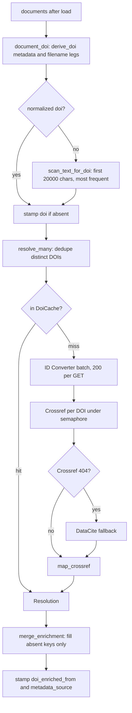
```mermaid
flowchart TD
    A["documents after load"] --> B["document_doi: derive_doi metadata and filename legs"]
    B --> C{"normalized doi?"}
    C -- "no" --> D["scan_text_for_doi: first 20000 chars, most frequent"]
    C -- "yes" --> E["stamp doi if absent"]
    D --> E
    E --> F["resolve_many: dedupe distinct DOIs"]
    F --> G{"in DoiCache?"}
    G -- "hit" --> M["Resolution"]
    G -- "miss" --> H["ID Converter batch, 200 per GET"]
    H --> I["Crossref per DOI under semaphore"]
    I --> J{"Crossref 404?"}
    J -- "yes" --> K["DataCite fallback"]
    J -- "no" --> L["map_crossref"]
    K --> L
    L --> M
    M --> N["merge_enrichment: fill absent keys only"]
    N --> O["stamp doi_enriched_from and metadata_source"]
```

### 1.5 Chunk-level Boilerplate Classification (`boilerplate.py`)

**What it is:** `ragstack/ingestion/boilerplate.py` is the chunk-level counterpart to `enrich.classify`. It is a pure classifier (no model, no network) that labels a chunk `references`, `license`, `acknowledgements` or `body`. `BoilerplateFilter` stamps, and optionally drops, the non-body chunks between chunking and embedding.

**Algorithm / workflow:**
1. `classify_chunk(text, config)` tests the most certain rules first:
   - **Licence:** at least `license_min_markers = 2` distinct licence markers, or one marker in a chunk of at most `license_short_chars = 400` chars.
   - **Acknowledgements:** an end-matter header that starts within `ack_header_window = 240` chars, or at least `ack_min_headers = 2` distinct headers. In both cases the evidence must begin within `max_onset_fraction = 0.5` of the chunk.
   - **References:** density-based, on chunks of at least 25 words whose `function_word_ratio` is at most 0.22. A chunk qualifies with `reference_signal_density ≥ 12`/100 words, or `≥ 7` when a References header or at least 3 numbered entries start in the dominant half.
   - Anything else is `BODY`.
2. `BoilerplateFilter.apply(chunks)` works only on a non-body verdict:
   - It sets `metadata["section"]` to the verdict and `metadata["is_boilerplate"]` to `section in config.boilerplate_sections`.
   - A body chunk's metadata is not touched.
   - So `is_boilerplate` is a **presence flag**. In the default config it is only ever `true`. It is `false` only when an operator narrowed `boilerplate_sections` to exclude a detected section.
3. With `drop=True`, chunks whose section is in `boilerplate_sections` are removed, except under the **all-boilerplate guard**: a document whose every chunk would be dropped keeps all of them (`FilterResult.rescued_docs`).
4. `IngestionPipeline._filter_boilerplate` logs counts at INFO, and at WARNING when more than half a source's chunks were dropped. Any classifier exception keeps every chunk.

**Modes:**
- API: `boilerplate_detection_enabled` (default `True`) and `boilerplate_drop` (default `False`) in `ragstack/config.py`, wired by `api/deps.py` `_build_boilerplate_filter`.
- CLIs: `boilerplate.filter_from_mode("off" | "flag" | "drop")` for `ingest_jsonl.py`, `ingest_shard.py` and `embed_shard.py`, all defaulting to `flag`.
- Threshold overrides come from `BOILERPLATE_CONFIG_JSON` or `--boilerplate-config` via `config_from_json`.
- `_gowe_inputs` does not forward any boilerplate setting, so GoWe workers always run their `flag` default (see findings).

**`section` is not `section_title`:**
- `section` is this filter's verdict: one of `references`, `license`, `acknowledgements`, never `body`.
- `section_title` is the source's own heading or unit suffix, for example from `jats.article_records`.
- `contracts/schemas/chunk_metadata.json` declares them as separate fields.

**Tools & models:** stdlib `re`, `collections.Counter`.

**Inputs → Outputs:** `list[Chunk]` → `FilterResult(chunks, flagged, dropped, rescued_docs)`, with metadata mutated in place.

**Scalability & parallelization:** Some regex passes plus a word count per chunk; linear and single-threaded. Dropping happens before embedding, so it also saves GPU work.

**Single vs bulk:** Applied per source's chunk list. The drop guard works per `doc_id` within that list.

**Diagram:**
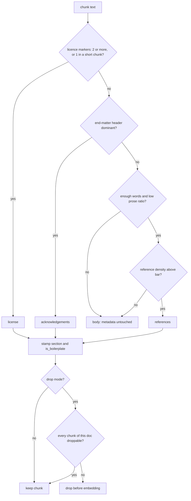
```mermaid
flowchart TD
    A["chunk text"] --> B{"licence markers: 2 or more, or 1 in a short chunk?"}
    B -- "yes" --> L["license"]
    B -- "no" --> C{"end-matter header dominant?"}
    C -- "yes" --> K["acknowledgements"]
    C -- "no" --> D{"enough words and low prose ratio?"}
    D -- "no" --> BODY["body: metadata untouched"]
    D -- "yes" --> E{"reference density above bar?"}
    E -- "no" --> BODY
    E -- "yes" --> R["references"]
    L --> S["stamp section and is_boilerplate"]
    K --> S
    R --> S
    S --> F{"drop mode?"}
    F -- "no" --> KEEP["keep chunk"]
    F -- "yes" --> G{"every chunk of this doc droppable?"}
    G -- "yes" --> KEEP
    G -- "no" --> DROP["drop before embedding"]
```

### 1.6 The Declared Chunk-Metadata Contract (#603)

**What it is:** `contracts/schemas/chunk_metadata.json` is the source of truth for which chunk-metadata fields exist and what type each one is. `ragstack/metadata_schema.py` `DECLARED_FIELDS` mirrors it field-for-field for runtime use, because `contracts/` is not packaged into the wheel and `metadata_schema` must stay a stdlib-only leaf that `jats.py` can import. `python/tests/unit/test_chunk_metadata_schema.py` pins the two together (`test_python_declares_exactly_the_contract_fields`, `test_python_agrees_with_the_contract_on_every_type`).

**The table:**
- 35 declared fields.
- Exactly one is required: `tenant_id`, the row-level isolation boundary.
- Types are `string`, `integer` or `boolean`. Only `authors` and `keywords` are arrays.
- `pmid` and `pmcid` are declared **strings**.
- The integer fields are `year`, `date`, `chunk_index`, `n_citations`, `n_tables`, `n_figures` and `pages`.
- The namespace is **open** (`additionalProperties: true`). Undeclared keys pass through to ES's dynamic template or to dynamic inference. `ragstack/ops/metadata_conformance.py` reports what a live collection carries that is not declared.
- `KNOWN_INT_FIELDS = {"year"}` is a separate, narrower set: the filter-side type check. `INT_FIELDS` is the producer-side set, and a test asserts the first is a subset of the second.

**Absent is a state (`x-ragstack-absence`):** No producer may invent a default. `null` is accepted wherever a value is and means the same as absent. `link_neighbors` writes `prev_chunk_id` / `next_chunk_id = None` at a document's edges on purpose. The worked example is `is_boilerplate`: it is stamped only on non-body verdicts (§1.5), so `{"is_boilerplate": false}` matches nothing, and `/v1/query`'s `exclude_boilerplate` is built as a negation of `true` (#601). Backfilling `false` would reclassify every pre-#597 chunk from "never classified" to "asserted not boilerplate".

**Store shape (`x-ragstack-store-shape`):**
- **Elasticsearch** nests metadata under `metadata.*`. `metadata_schema.es_field_path(name)` returns `metadata.{name}`.
- **Qdrant** is flat at the payload top level. `qdrant_field_path(name)` returns `name`, sharing the namespace with the reserved `chunk_id`, `doc_id`, `content`, `start_char` and `end_char`. `stores/qdrant.py` drops metadata keys in `stores.filters.PAYLOAD_RESERVED` on upsert.
- The caller-facing filter key is bare in both stores, and `stores/elasticsearch.py` `_build_query` adds the prefix.

**Derived ES mapping:** `DeclaredField.elasticsearch_mapping` maps `integer` → `long`, `boolean` → `boolean`, and everything else → `keyword` with `ignore_above = KEYWORD_IGNORE_ABOVE = 8191`. `elasticsearch_metadata_properties()` is spliced into `stores/elasticsearch.py` `_MAPPINGS["properties"]["metadata"]["properties"]`, so a newly created index types declared fields by decision rather than by whichever document lands first.

**Enforcement at ingest:**
- `metadata_problems(metadata)` iterates the chunk's keys: required-field presence, then per-field type checks. `bool` is refused for integer fields, and a joined author string is refused for the `authors` list.
- `validate_chunks(chunks, where=...)` raises `ChunkMetadataTypeError` on the first bad chunk.
- It is called in `ragstack/ingestion/pipeline.py` `IngestionPipeline.index_chunks` **before** the delete-prior and before any store write, so a refused batch never destroys the prior version. It is also called in `scripts/ingest_jsonl.py` and `scripts/ingest_chunks.py`, which write without `index_chunks`.
- `tenant_id` is stamped earlier, in `IngestionPipeline._embed_and_link`.

**Packed `date`:**
- Declared as an integer `yyyymmdd` with unknown parts set to 0. The contract states the invariant `year == date // 10000` and that `year` is derived, never captured separately.
- `enrich.packed_date` is the only function in the tree that produces it.
- **No ingest path writes `date` at 22b44be.** The contract's own description says so, and a repo-wide search finds `packed_date` called only from its unit test. The field exists only where an out-of-tree backfill put it.
- The filter grammar does not yet support range operators. `stores/filters.py` refuses a dict value such as `{"gte": ...}` with a 400, so `date >= 20200315` is not expressible today (`docs/plans/date-filtering.md` Part A is unbuilt).

**Tools & models:** stdlib only (`dataclasses`, `re`, `datetime`).

**Inputs → Outputs:** chunk `metadata: dict` → `list[str]` of problems (`metadata_problems`), or a raise (`validate_chunks`). `elasticsearch_metadata_properties() -> dict`.

**Scalability & parallelization:** O(keys per chunk). The loop deliberately iterates the chunk's roughly 20 keys rather than the 35-row table, because it runs once per chunk across very large corpora. It fails fast on the first bad chunk.

**Single vs bulk:** The same check runs on every write path that reaches a store: the local pipeline, the shard tools through `index_chunks`, and the two direct-write scripts.

**Diagram:**
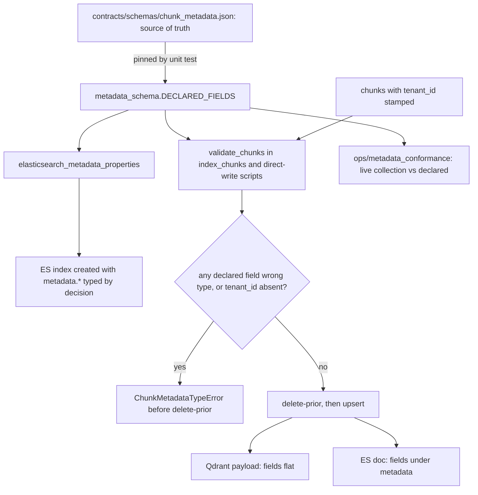
```mermaid
flowchart TD
    J["contracts/schemas/chunk_metadata.json: source of truth"] -- "pinned by unit test" --> P["metadata_schema.DECLARED_FIELDS"]
    P --> M["elasticsearch_metadata_properties"]
    M --> ES["ES index created with metadata.* typed by decision"]
    P --> V["validate_chunks in index_chunks and direct-write scripts"]
    C["chunks with tenant_id stamped"] --> V
    V --> Q{"any declared field wrong type, or tenant_id absent?"}
    Q -- "yes" --> X["ChunkMetadataTypeError before delete-prior"]
    Q -- "no" --> W["delete-prior, then upsert"]
    W --> QD["Qdrant payload: fields flat"]
    W --> ED["ES doc: fields under metadata"]
    P --> CF["ops/metadata_conformance: live collection vs declared"]
```

Files analyzed:
- `python/ragstack/ingestion/loaders.py`
- `python/ragstack/ingestion/jats.py`
- `python/ragstack/ingestion/enrich.py`
- `python/ragstack/ingestion/doi_metadata.py`
- `python/ragstack/ingestion/boilerplate.py`
- `python/ragstack/ingestion/pipeline.py`
- `python/ragstack/metadata_schema.py`
- `contracts/schemas/chunk_metadata.json`
- `python/ragstack/config.py`
- `python/ragstack/api/deps.py`
- `python/ragstack/api/routers/documents.py`
- `python/ragstack/stores/elasticsearch.py`
- `python/ragstack/stores/filters.py`
- `docs/plans/date-filtering.md`

---

---

## 2. Chunking

Four facts frame this section:

- **The algorithms are frozen.** `ragstack/ingestion/chunkers.py` behaviour is pinned by the chunking study: `docs/plans/results/stage0/s0_common.py` sets `EXPECT_COMMIT = "55a0fc2…"` (the #488 commit), and `provenance()` raises if HEAD differs. Between 55a0fc2 and 22b44be, `git diff` on `chunkers.py` is comment-only: an explanatory comment in the semantic branch of `make_chunker`. `docs/plans/chunking-one-factory.md` §8 records the rule that consolidation work "must not change `chunkers.py` semantics".
- **The method is collection identity.** `chunk_method` / `chunk_size` / `chunk_overlap` / `chunk_params` are part of a collection's spec. A collection cannot be moved to another method in place; it has to be recreated (`docs/plans/results/semantic-vs-pooled-2026-09-18.md`, *Consequences*).
- **Chunk ids are deterministic.** `chunkers._make_chunk` is the only `Chunk` constructor. It sets `id = uuid5(NAMESPACE_URL, "{doc_id}:{start}:{end}")`, `doc_id = doc.id` and `metadata = dict(doc.metadata)`, so everything §1 put on the document reaches every chunk.
- **Methods:** `chunkers.CHUNK_METHODS = ("fixed", "fixed_token", "sentence", "words", "semantic", "semantic_pooled")`.

### 2.1 Chunker Construction: the Five Builders, and what #615 Consolidated

**What it is:** Every path ends at `chunkers.make_chunker(method, ...)`, but the arguments it receives are decided by several different builders. `docs/plans/chunking-one-factory.md` §8 counts five, with three different answers to "is there a token budget?":

| Builder | Used by | Token budget passed to `make_chunker` |
|---|---|---|
| `ragstack/api/deps.py` `_chunker_for(entry, embed_fn=)` | per-collection ingest on the local backend (`build_ingestor_for`) | none. `fixed_token` gets an HF counter as its window unit, nothing else gets a `max_tokens` |
| `ragstack/api/deps.py` `_build_chunker()` | the app-default collection | only when `settings.chunk_max_tokens` is set (`resolve_max_tokens`) |
| `ragstack/ingestion/chunker_config.py` `build_chunker(...)` | the bulk tools | always. `resolve_max_tokens` uses the override or a live `GET /v1/models` (default 4096, minus a 16-token reserve) |
| `scripts/ingest_shard.py` `_build_chunker` | GoWe `pdf-ingest-scatter.cwl` | inherits `build_chunker` |
| `scripts/embed_shard.py` `_build_chunker` | `embed-bulk`, `pdf-ingest`, `jats-ingest` CWL | inherits `build_chunker` |

`scripts/ingest_jsonl.py` also calls `build_chunker` inline.

**Why it matters:** The builders give identical results for `fixed`, `fixed_token` and `semantic`. They differ for `sentence` and `words`, because once a token budget is present `_pack_spans` delegates to `_pack_spans_tokens`, which ignores `chunk_size` and packs to the model window. The plan's measurement on a 4,489-char document (size 200, overlap 20) gave 30 vs 1 chunks for `sentence` and 25 vs 1 for `words` (chunking-one-factory.md §8). The same plan reports zero live collections on hackathon or dev using `sentence` or `words` (read 2026-09-18).

**What #615 (`a2be96f`) consolidated:**
- `chunker_config.SEMANTIC_METHODS = ("semantic", "semantic_pooled")` and `needs_embed_fn(method)` are the single membership test. `api/deps.py` `_chunker_for` / `_embed_fn_for` / `_build_chunker`, `ingest_shard.py`, `embed_shard.py` and `ingest_jsonl.py` call `needs_embed_fn`. `api/routers/collections.py` re-exports the constant. `SHARD_UNSUPPORTED_METHODS` is derived from it.
- The one deliberate literal left is `chunkers.make_chunker`'s own `method in ("semantic", "semantic_pooled")` (plus `scripts/eval/chunking_compare_7way.py`), because `chunkers.py` is frozen.
- `scripts/ingest_shard.py` now builds a `SyncEmbedBridge` from its own `--embedding-*` endpoints when `needs_embed_fn(args.chunk_method)` (`_build_bridge`, closed in a `finally`). It reads the semantic tunables from the registry entry's `chunk_params` (`_semantic_params(spec)`), never from CWL inputs.
- The API's GoWe guard is now a per-tenant setting, `Settings.ingest_worker_unsupported_methods`, parsed by `chunker_config.parse_unsupported_methods` (unknown names raise) and rendered by `shard_refusal`.
- `embed_shard.py` keeps a **local** refusal for semantic methods, because it builds no bridge.

**Still open:** the single `chunker_for` factory (§8 of the plan) is not built. The five builders remain.

**Other construction rules at 22b44be:**
- `chunker_config.resolve_token_backend` forces `hf` for `fixed_token` and raises when an `hf` or `endpoint` backend has no model.
- `tokenization.make_token_counter` **no longer degrades** hf → endpoint → estimate. A tokenizer that fails to load raises `TokenCounterUnavailable`. The estimator has to be requested explicitly.

**Tools & models:** the embedding model's HF tokenizer (`transformers`), vLLM `/v1/models`, and, for the semantic methods, the collection's embedding endpoints via `SyncEmbedBridge`.

**Inputs → Outputs:** a collection spec or CLI args → a chunker. `build_chunker` also returns `(token_counter, resolved_max_tokens)`.

**Scalability & parallelization:** Construction runs once per app, collection or tool run. `api/deps.py` `_embed_bridge_for` caches one bridge per collection id on `app_state`.

**Single vs bulk:** The API builders serve paths A and B. `build_chunker` serves the bulk tools. That split is where the `sentence` / `words` divergence comes from.

**Diagram:**
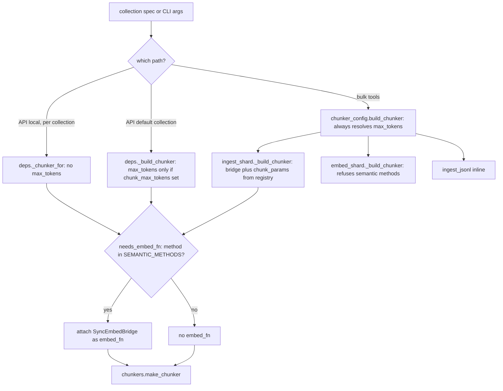
```mermaid
flowchart TD
    S["collection spec or CLI args"] --> Q{"which path?"}
    Q -- "API local, per collection" --> A["deps._chunker_for: no max_tokens"]
    Q -- "API default collection" --> B["deps._build_chunker: max_tokens only if chunk_max_tokens set"]
    Q -- "bulk tools" --> C["chunker_config.build_chunker: always resolves max_tokens"]
    C --> C1["ingest_shard._build_chunker: bridge plus chunk_params from registry"]
    C --> C2["embed_shard._build_chunker: refuses semantic methods"]
    C --> C3["ingest_jsonl inline"]
    A --> N{"needs_embed_fn: method in SEMANTIC_METHODS?"}
    B --> N
    C1 --> N
    N -- "yes" --> E["attach SyncEmbedBridge as embed_fn"]
    N -- "no" --> F["no embed_fn"]
    E --> M["chunkers.make_chunker"]
    F --> M
```

### 2.2 RecursiveCharacterChunker (`fixed`)

**What it is:** A character sliding window of `chunk_size` with `chunk_overlap`, optionally hard-capped to a token budget (`chunkers.py` `RecursiveCharacterChunker`).

**Algorithm / workflow:**
1. Start at 0 and set `end = min(start + chunk_size, len)`.
2. `_emit(doc, start, end)` produces one `_make_chunk`, or `_token_split_span` pieces when `max_tokens` and `token_counter` are set.
3. Stop at the end of the text, otherwise continue from `start = end - chunk_overlap`.

**Tools & models:** none, except the injected `TokenCounter` on the cap path.

**Inputs → Outputs:** `Document` → `list[Chunk]`.

**Scalability & parallelization:** O(n) per document with no internal parallelism. The cap path uses the O(n) offset split (§2.6).

**Single vs bulk:** One `chunk(doc)` per document.

**Diagram:**
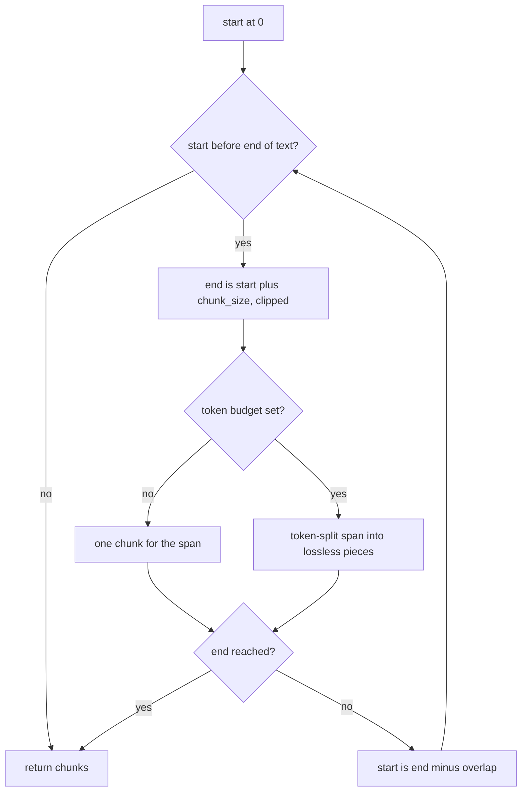
```mermaid
flowchart TD
    A["start at 0"] --> B{"start before end of text?"}
    B -- "no" --> Z["return chunks"]
    B -- "yes" --> C["end is start plus chunk_size, clipped"]
    C --> D{"token budget set?"}
    D -- "no" --> E["one chunk for the span"]
    D -- "yes" --> F["token-split span into lossless pieces"]
    E --> G{"end reached?"}
    F --> G
    G -- "yes" --> Z
    G -- "no" --> H["start is end minus overlap"]
    H --> B
```

### 2.3 SentenceChunker (`sentence`) & WordChunker (`words`), with the #488 fill fix

**What it is:** Greedy packers over unit spans. The units are sentences (`sentence_spans`: NLTK Punkt when available, else the `_SENTENCE_END` regex, then `_subsplit_long_spans` for spans over 2000 chars) or words (`word_spans`, `\S+` runs with trailing whitespace). Both classes share `_pack_spans`, `_pack_spans_tokens` and `_overlap_resume`.

**Algorithm / workflow:**
1. Empty text returns `[]`. `chunk_size == -1` returns the whole document (`_whole_doc`).
2. **Char budget** (no `max_tokens`): `_pack_spans` accumulates units until the next would exceed `chunk_size`, always taking at least one unit.
3. **Token budget** (`max_tokens` + `token_counter`): `_pack_spans_tokens` has two `budget_mode`s (`BUDGET_MODES = ("joined", "summed")`, `DEFAULT_BUDGET_MODE = "joined"`). This is the #488 fix (`55a0fc2`):
   - **`joined`** (default): `_furthest_fitting_unit` gallops, then binary-searches, for the furthest unit boundary whose *joined* text measures within `max_tokens`. That is O(log k) counter calls per chunk, and every emitted boundary was actually measured.
   - **`summed`** (legacy): pack while the sum of per-unit counts, each tokenized in isolation, stays within budget. The docstring gives the measured over-count with the SFR tokenizer: 1.47–1.50× per word (realised fill about 0.68) and 1.00–1.04× per sentence (fill about 0.92–0.97). Legacy is kept so the chunking study's completed Leg A / Leg B grids stay reproducible.
   - In both modes, a single unit over budget is hard-split with `_token_split_span`, and `assert emitted <= max_tokens` holds.
4. **Overlap:** `_overlap_resume` walks back whole trailing units while their char length stays within `chunk_overlap` (chars in both modes), always advancing at least one unit.
5. `budget_mode` is a `make_chunker` parameter, but no production builder passes it (§2.1). Only `scripts/eval/chunking_compare_7way.py` sets `summed`. Every ingest path gets `joined`.

**Tools & models:** NLTK Punkt (optional `[chunking]` extra) with a regex fallback; the injected `TokenCounter` on the token path.

**Inputs → Outputs:** `Document` → `list[Chunk]`. Overlapping chunks have distinct ids because their spans differ.

**Scalability & parallelization:** O(n) segmentation. Packing is O(k) on the char path, O(log k) counter calls per chunk in `joined` mode, and O(k) memoized counts in `summed` mode. No internal parallelism.

**Single vs bulk:** One `chunk(doc)` per document. Which packer runs depends on the builder (§2.1).

**Diagram:**
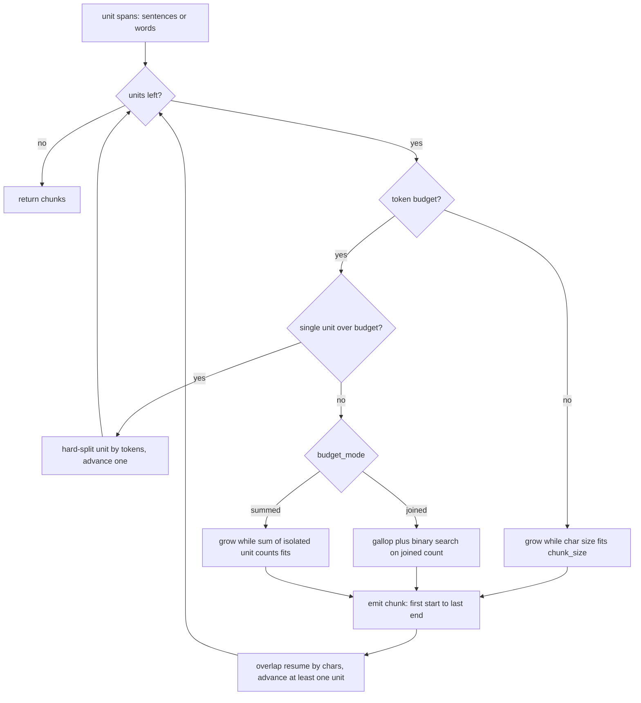
```mermaid
flowchart TD
    A["unit spans: sentences or words"] --> B{"units left?"}
    B -- "no" --> Z["return chunks"]
    B -- "yes" --> C{"token budget?"}
    C -- "no" --> D["grow while char size fits chunk_size"]
    C -- "yes" --> E{"single unit over budget?"}
    E -- "yes" --> F["hard-split unit by tokens, advance one"]
    E -- "no" --> G{"budget_mode"}
    G -- "joined" --> H["gallop plus binary search on joined count"]
    G -- "summed" --> I["grow while sum of isolated unit counts fits"]
    D --> J["emit chunk: first start to last end"]
    H --> J
    I --> J
    J --> K["overlap resume by chars, advance at least one unit"]
    F --> B
    K --> B
```

### 2.4 FixedTokenWindowChunker (`fixed_token`)

**What it is:** A true token-size sliding window. It tokenizes the document once with the embedding model's HF fast tokenizer, slides `chunk_size` tokens forward by `chunk_size - overlap`, and maps each window back to exact char offsets (`chunkers.py` `FixedTokenWindowChunker`).

**Algorithm / workflow:**
1. Construction requires a counter exposing a callable `_tokenizer` (the offset mapping). `make_chunker("fixed_token")` without a `token_counter` raises.
2. Tokenize with `return_offsets_mapping=True, add_special_tokens=False`.
3. For each window, take the char span from the offsets. For a full window, trim whole tokens while re-counting the slice exceeds the window.
4. Advance from the trimmed end minus `overlap`, always moving forward by at least one token. If the degenerate case emits nothing, return one whole-document chunk.
5. `max_tokens` is not threaded here: the window is the cap (see the `make_chunker` comment).

**Tools & models:** the HF `transformers` tokenizer of the collection's embedding model.

**Inputs → Outputs:** `Document` → `list[Chunk]`. `chunk_size` and `chunk_overlap` are in tokens.

**Scalability & parallelization:** One O(n) tokenization plus bounded trim re-counts. Also used as `SemanticChunker`'s oversize fallback.

**Single vs bulk:** One `chunk(doc)` per document.

**Diagram:**
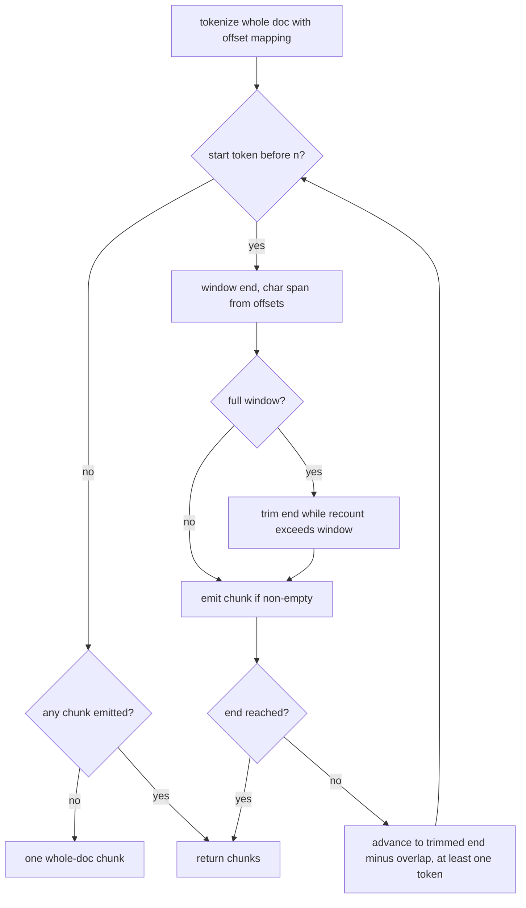
```mermaid
flowchart TD
    A["tokenize whole doc with offset mapping"] --> B{"start token before n?"}
    B -- "no" --> Y{"any chunk emitted?"}
    Y -- "no" --> W["one whole-doc chunk"]
    Y -- "yes" --> Z["return chunks"]
    B -- "yes" --> C["window end, char span from offsets"]
    C --> D{"full window?"}
    D -- "yes" --> E["trim end while recount exceeds window"]
    D -- "no" --> F["emit chunk if non-empty"]
    E --> F
    F --> G{"end reached?"}
    G -- "yes" --> Z
    G -- "no" --> H["advance to trimmed end minus overlap, at least one token"]
    H --> B
```

### 2.5 SemanticChunker (`semantic` / `semantic_pooled`)

**What it is:** Splits a document at topic boundaries detected from embedding similarity (`chunkers.py` `SemanticChunker`). The two method names are **the same class with different arguments**. `make_chunker` sets `pool_sentences = (method == "semantic_pooled")` and `distance_round = 6 if pooled else None`.

**The two methods place different boundaries, not the same boundaries at different cost.** `docs/plans/results/semantic-vs-pooled-2026-09-18.md` compared them on identical input:
- Setup: **3 synthetic documents** (1,624 chars each, 51 distance pairs), `buffer_size=2`, percentile 80, SFR-Embedding-Mistral on the dev fleet.
- Between methods: Spearman rank correlation of the two distance series **0.4254**; overall span Jaccard **0.111**. On the two documents that split, the methods agree on chunk *count* but share **no** boundary.
- Each method against itself: Spearman 0.9984 (`semantic`) and 0.9993 (`semantic_pooled`), with identical spans. So the difference is algorithmic, not fleet noise.
- Tokens embedded: 10,032 vs 2,244, a 4.47× ratio at `buffer_size=2` (about 7× expected at the default 3).
- The results document flags this as **small-n**. It does not establish which method is better, or anything at corpus scale. The corpus-scale comparison is still open (chunking-one-factory.md §7c).

**Algorithm / workflow:**
1. `sentence_spans(text)`. With zero or one span, emit the whole document (token-split if budgeted).
2. **Oversize fallback:** if `len(spans) > max_breakpoint_sentences` (default 3000), `_oversize_fallback` uses a lazily built `FixedTokenWindowChunker` when an HF counter is present, else a whole-document token split. No breakpoint embedding happens.
3. `_buffer_embeddings(text, spans)`:
   - **`semantic`:** embed each window text `spans[i-b .. i+b]`, capped by `_cap_tokens` to `breakpoint_max_tokens` or else `max_tokens`, using `breakpoint_token_counter` or else `token_counter`.
   - **`semantic_pooled`:** embed each sentence once, then `_mean_pool` the same window.
   - Either way it is one `embed_fn` call per document.
4. Take `_cosine_distance` between consecutive buffer vectors (pure Python). With `distance_round` set, round to 6 places.
5. `_breakpoint_groups` computes `threshold = _percentile(distances, breakpoint_percentile_threshold)` and splits after every distance above it.
6. Map groups to char spans, then `_merge_short` folds spans under `min_chunk_length` into a neighbour, including a short leading span.
7. `_emit` each span, token-splitting when over `max_tokens`.

**Tools & models:**
- A sync `embed_fn`: a `SyncEmbedBridge` over the collection's own embedding endpoints (`api/deps.py` `_embed_bridge_for`; `scripts/ingest_shard.py` `_build_bridge`), so boundaries are detected with the model that stores the vectors.
- `scripts/ingest_jsonl.py` can instead point breakpoints at a separate endpoint, with `breakpoint_max_tokens` / `breakpoint_token_counter`.
- Tunables: `buffer_size` (default 3), `breakpoint_percentile_threshold` (80.0) and `min_chunk_length` (500), read from the collection's `chunk_params`.

**Inputs → Outputs:** `Document` → `list[Chunk]`; intermediate `list[list[float]]`.

**Scalability & parallelization:** This is the embed-heavy chunker.
- Cost scales with sentence count: roughly `(2·buffer_size+1)×` the document's tokens for `semantic`, about 1× for pooled.
- The bridge fans one document's buffers out in sub-batches (§2.7).
- Distance and pool math are single-threaded O(spans·dim).
- The 3000-span fallback bounds the worst case.
- Legacy `semantic` has no rounding, so reproducibility across fleets is observed, not guaranteed (results doc).

**Single vs bulk:** One `chunk(doc)` per document with one bridge call. Bulk parallelism comes from `--chunk-concurrency` threads in `ingest_jsonl.py`, or the GoWe scatter.

**Diagram:**
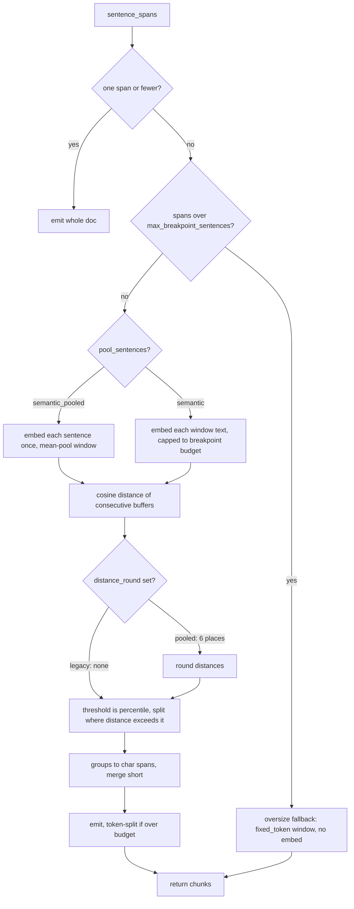
```mermaid
flowchart TD
    A["sentence_spans"] --> B{"one span or fewer?"}
    B -- "yes" --> Z1["emit whole doc"]
    B -- "no" --> C{"spans over max_breakpoint_sentences?"}
    C -- "yes" --> F["oversize fallback: fixed_token window, no embed"]
    C -- "no" --> D{"pool_sentences?"}
    D -- "semantic_pooled" --> E1["embed each sentence once, mean-pool window"]
    D -- "semantic" --> E2["embed each window text, capped to breakpoint budget"]
    E1 --> G["cosine distance of consecutive buffers"]
    E2 --> G
    G --> H{"distance_round set?"}
    H -- "pooled: 6 places" --> H1["round distances"]
    H -- "legacy: none" --> I
    H1 --> I["threshold is percentile, split where distance exceeds it"]
    I --> J["groups to char spans, merge short"]
    J --> K["emit, token-split if over budget"]
    K --> Z["return chunks"]
    F --> Z
```

### 2.6 Token-budget Splitting & TokenCounter

**What it is:** `chunkers.split_text_to_token_budget` splits one text losslessly into pieces of at most `max_tokens` each. `ragstack/ingestion/tokenization.py` provides the `TokenCounter` backends.

**Algorithm / workflow:**
1. **HF offset path.** With an HF fast tokenizer (`_hf_offset_tokenizer`), `_split_by_offsets` tokenizes once and carves at `max(1, max_tokens - 1)` tokens (one token of headroom) on offset boundaries. It is O(n) and gapless.
2. **Estimate path.** Otherwise, if `count(text)` is within budget, return the whole text. If not, `_split_by_estimate` seeks to an estimated chars-per-token boundary and adjusts locally.
3. **Backends:**
   - `HFTokenCounter`: lazy `AutoTokenizer`, `add_special_tokens=False`.
   - `EndpointTokenCounter`: POST to vLLM `/tokenize` over one lock-guarded `httpx.Client`.
   - `EstimatingTokenCounter`: `ceil(len/2.5)`.
4. **`make_token_counter(backend, ...)` changed:** `hf` loads the tokenizer eagerly and raises `TokenCounterUnavailable` on failure. The endpoint and estimate backends are selected only when asked for by name.
5. **`resolve_max_tokens(explicit, base_url=)` changed:** an explicit value is now treated as the model window and reduced by `DEFAULT_TOKEN_RESERVE = 16`. Without one, it reads `max_model_len` from `GET {base_url}/v1/models` minus 16, and defaults to 4096 on any failure.

**Tools & models:** HF `transformers`; vLLM `/tokenize` and `/v1/models`; `httpx`.

**Inputs → Outputs:** `(text, max_tokens, TokenCounter) -> list[str]`, which concatenates back to `text` exactly.

**Scalability & parallelization:** O(n) on the HF path. The endpoint counter makes a network round-trip per count, which makes it the slowest backend. The HF and endpoint counters are safe to share across chunking threads.

**Single vs bulk:** Called per span or window by every chunker.

**Diagram:**
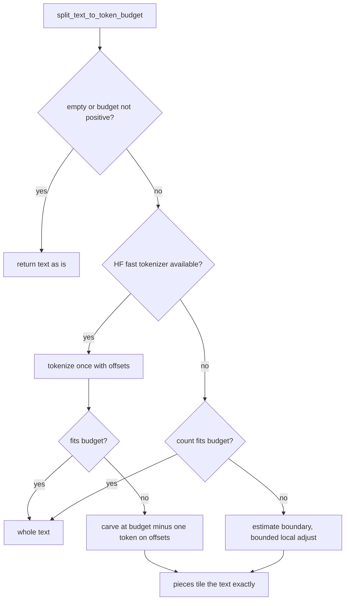
```mermaid
flowchart TD
    A["split_text_to_token_budget"] --> B{"empty or budget not positive?"}
    B -- "yes" --> Z1["return text as is"]
    B -- "no" --> C{"HF fast tokenizer available?"}
    C -- "yes" --> D["tokenize once with offsets"]
    D --> E{"fits budget?"}
    E -- "yes" --> Z2["whole text"]
    E -- "no" --> F["carve at budget minus one token on offsets"]
    C -- "no" --> G{"count fits budget?"}
    G -- "yes" --> Z2
    G -- "no" --> H["estimate boundary, bounded local adjust"]
    F --> Z["pieces tile the text exactly"]
    H --> Z
```

### 2.7 SyncEmbedBridge (bounded sub-batch fan-out)

**What it is:** `ragstack/ingestion/embed_bridge.py` `SyncEmbedBridge` lets the synchronous semantic chunker call an async `Embedder`. It owns a background event loop on a daemon thread, and fans a document's buffers out in sub-batches so a pooled embedder spreads them across endpoints.

**Algorithm / workflow:**
1. `__call__(texts)` → `_ensure_loop()` (lock-guarded, lazy) → `run_coroutine_threadsafe(self._embed(texts), loop).result()`.
2. On first use, `_embed` builds an `httpx.AsyncClient`, the embedder from `embedder_factory`, and an `asyncio.Semaphore(max_inflight)` on the bridge loop, so nothing crosses event loops.
3. If `batch_size <= 0` or `n <= batch_size` (default 64), it makes one `embedder.embed(texts)` call.
4. Otherwise it `gather`s sub-batches of `batch_size`, each under the **bridge-wide** semaphore `max_inflight` (default 8, new since the old doc). It re-concatenates in input order, so vectors and ids match the single-call path.
5. `close()` closes the client on its loop, stops the loop, and joins with a 5 s timeout. `scripts/ingest_shard.py` wraps this in its own try (chunking-one-factory.md §3).

**Tools & models:** `asyncio`, `httpx.AsyncClient`, the injected embedder (typically `PooledEmbedder`).

**Inputs → Outputs:** `Sequence[str]` → `list[list[float]]`, order-preserving.

**Scalability & parallelization:** `max_inflight` caps concurrent sub-batches across all documents chunked concurrently on one bridge. This protects a single-endpoint breakpoint service that has no semaphore of its own (module docstring). The in-code note says there is no CLI flag for it, so raising `--embedding-max-concurrency` above 8 is silently re-capped here.

**Single vs bulk:** Inherently bulk: one call per document. The API caches one bridge per collection. `ingest_shard.py` builds one per tool run.

**Diagram:**
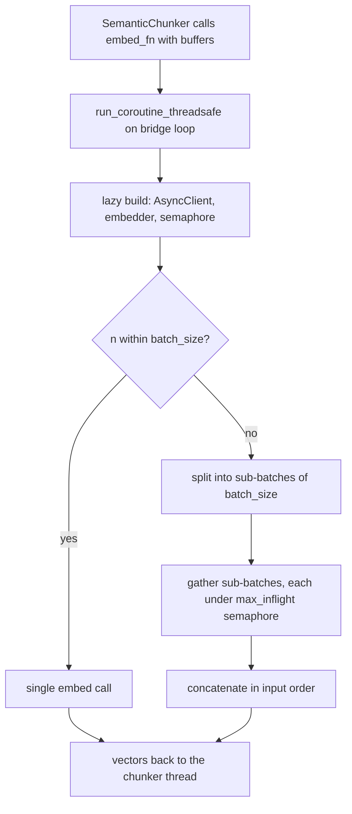
```mermaid
flowchart TD
    A["SemanticChunker calls embed_fn with buffers"] --> B["run_coroutine_threadsafe on bridge loop"]
    B --> C["lazy build: AsyncClient, embedder, semaphore"]
    C --> D{"n within batch_size?"}
    D -- "yes" --> E["single embed call"]
    D -- "no" --> F["split into sub-batches of batch_size"]
    F --> G["gather sub-batches, each under max_inflight semaphore"]
    G --> H["concatenate in input order"]
    E --> I["vectors back to the chunker thread"]
    H --> I
```

### 2.8 SegmentationCache

**What it is:** `ragstack/ingestion/segmentation_cache.py` `SegmentationCache` is a content-addressed, append-only JSONL cache of per-document chunk spans. Its only caller at 22b44be is `scripts/ingest_jsonl.py`, behind `--segmentation-cache`.

**Algorithm / workflow:**
1. `config_fingerprint(**parts)` builds a stable string from the segmentation config.
2. The key is `sha1(fingerprint + "\x00" + content)`.
3. `get_or_compute(doc, chunk_fn)`:
   - **Hit:** rebuild chunks from the cached `(start, end)` pairs via `_make_chunk`. The ids are identical and there is no embedding.
   - **Miss:** run `chunk_fn` outside the lock, then append `{"k", "s"}` under the lock and flush.

**Tools & models:** `hashlib.sha1`, `json`, `threading.Lock`.

**Inputs → Outputs:** `(Document, chunk_fn) -> list[Chunk]`. Only integer spans are persisted, never text.

**Scalability & parallelization:** Thread-safe under `--chunk-concurrency`; distinct documents segment concurrently. The whole cache is held in memory.

**Single vs bulk:** Bulk CLI only. The API and the shard tools do not use it.

**Diagram:**
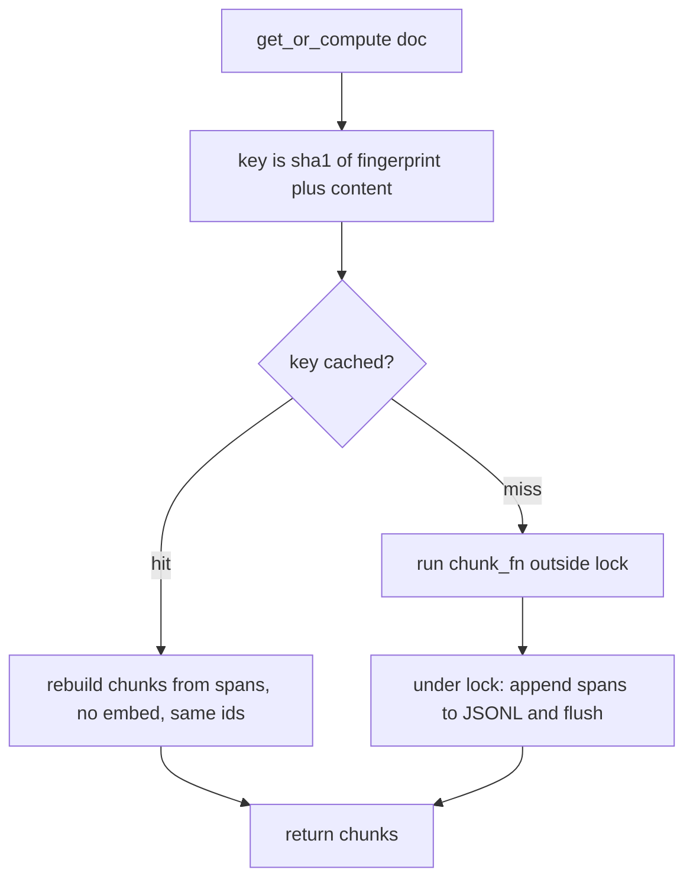
```mermaid
flowchart TD
    A["get_or_compute doc"] --> B["key is sha1 of fingerprint plus content"]
    B --> C{"key cached?"}
    C -- "hit" --> D["rebuild chunks from spans, no embed, same ids"]
    C -- "miss" --> E["run chunk_fn outside lock"]
    E --> F["under lock: append spans to JSONL and flush"]
    D --> G["return chunks"]
    F --> G
```

### 2.9 link_neighbors_by_document

**What it is:** `chunkers.link_neighbors_by_document` stamps `chunk_index`, `prev_chunk_id` and `next_chunk_id` on the final stored chunk list, grouping by `doc_id` so a multi-document batch never cross-links documents.

**Algorithm / workflow:**
1. Group by `doc_id`, preserving order.
2. `link_neighbors(group)` sets `chunk_index = i` and `prev_chunk_id` / `next_chunk_id` to the neighbour's doc-level chunk id. They are set to `None` at the edges, deliberately, as the contract's absence rules describe (§1.6).
3. Return the grouping.
4. `IngestionPipeline._embed_and_link` calls it **after** embedding drops unembeddable chunks, so links never point at a quarantined chunk.

**Tools & models:** none.

**Inputs → Outputs:** `list[Chunk]` (mutated in place) → `dict[str, list[Chunk]]`.

**Scalability & parallelization:** O(total chunks).

**Single vs bulk:** Designed for flattened multi-document batches. `docs/plans/structured-ingest.md` notes the consequence that one ingest record per section would restart `chunk_index` and break linking at section edges. That is one reason the plan (status "Not started") rejects per-section records.

**Diagram:**
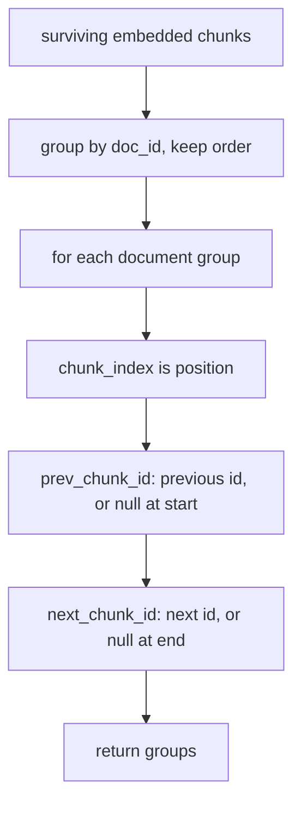
```mermaid
flowchart TD
    A["surviving embedded chunks"] --> B["group by doc_id, keep order"]
    B --> C["for each document group"]
    C --> D["chunk_index is position"]
    D --> E["prev_chunk_id: previous id, or null at start"]
    E --> F["next_chunk_id: next id, or null at end"]
    F --> G["return groups"]
```

Files analyzed:
- `python/ragstack/ingestion/chunkers.py`
- `python/ragstack/ingestion/chunker_config.py`
- `python/ragstack/ingestion/tokenization.py`
- `python/ragstack/ingestion/embed_bridge.py`
- `python/ragstack/ingestion/segmentation_cache.py`
- `python/ragstack/api/deps.py`
- `python/ragstack/api/routers/collections.py`
- `python/scripts/ingest_shard.py`
- `python/scripts/embed_shard.py`
- `python/scripts/ingest_jsonl.py`
- `docs/plans/chunking-one-factory.md`
- `docs/plans/results/semantic-vs-pooled-2026-09-18.md`
- `docs/plans/results/stage0/s0_common.py`
- `docs/plans/structured-ingest.md`

---

## 3. Embedding & Embedder Pool

Embedding is the one model call made at **both** ingest and query time. Four
layers stack on top of each other. Each one satisfies the same
`embed(texts) -> vectors` surface, so a caller never needs to know which layers
are present:

```
BatchingEmbedder            request shaping + poison-input bisection   (embedders.py)
  └─ PooledEmbedder          fan-out, backpressure, failover, health    (embed_pool.py)   [only when >1 URL on the API path]
       └─ SidecarEmbedder | OpenAIEmbedder   one HTTP call              (embedders.py)
```

Which model and which endpoints a given collection uses is decided *before*
these layers, by the collection's build spec. That comes first here.

### 3.1 Model registry & how a collection binds its embedding model

**What it is:** Two separate mechanisms that are easy to mix up:

1. **Collection build spec**: the source of truth for embedding. Every
   registry collection (`CollectionSpec` in `python/ragstack/collection_store.py`)
   records concrete `embedding_api`, `embedding_model`, `embedding_model_dim`,
   `embedding_endpoints` / `embedding_sidecar_url`. Each served collection gets its
   own embedder built from that spec. Build-time config *is* collection identity:
   a collection cannot be re-pointed at a new embedder (docstring of
   `create_collection`, `python/ragstack/api/routers/collections.py`).
2. **Runtime model registry** (`ModelRegistry`, `python/ragstack/api/model_registry.py`):
   an admin-curated catalogue of `ModelEntry {id, task, provider, base_urls, model, dim, params}`.
   `TASKS = {embedding, tokenizer, llm, reranker}`. Only
   `HOT_SWAPPABLE = {llm, reranker}` can be assigned live. An `embedding` entry is
   used only as a **template at collection-create time**: its values are copied
   into the new spec, not linked by reference.

**Algorithm / workflow:**
1. **Registration (admin):** `POST/PUT/DELETE /v1/admin/models/registry[/{id}]`
   (`python/ragstack/api/routers/models_registry.py`, mounted under `/v1/admin` with the
   admin dependency in `python/ragstack/api/main.py`). `ModelRegistry._validate`
   checks task and provider (`sidecar|openai|vllm`), requires ≥1 `base_url`, requires
   a positive `dim` for embedding models, and checks each URL against
   `model_url_allowlist`. `_url_allowed` fails closed when the allowlist is empty and
   compares the parsed `(scheme, host[, port])`, not a string prefix (SSRF guard).
   The default allowlist is loopback only (`Settings.model_url_allowlist`,
   `python/ragstack/config.py`). Persisted as JSON at `models_registry_file`; empty means in-memory only.
2. **Binding an embedding model to a new collection:** `create_collection`
   resolves `body.embedding`, which is admin-only per its docstring. An unknown id
   returns 404. A non-`embedding` task or missing `dim` returns 400. The concrete
   values are then copied into the spec: `provider == "sidecar"` becomes `sidecar`,
   anything else becomes `openai`; the registered model name, `dim`, and `base_urls`
   become the endpoints. If `embedding` is omitted, the spec gets the
   server-default settings, resolved to concrete values at that moment.
3. **Building embedders at startup:** `_build_collection_registry`
   (`python/ragstack/api/deps.py`) builds one embedder per distinct
   `CollectionSpec.emb_signature()` = `(api, model, sorted endpoints, dim)` and caches it
   in `emb_cache`. Collections with the same signature share one embedder, and so
   one pool. `POST /v1/collections` at runtime builds a fresh one
   (`build_collection_entry` with `embedder=None`).
4. **Hot swap (llm/reranker only):** `PATCH /v1/admin/config/assignments` goes
   through `ModelRegistry.resolve_assignment`, then `deps.apply_assignment`, which
   atomically swaps `app.state.generator` + `app.state.rewriters` (llm) or
   `app.state.reranker`. Only `base_urls[0]` is used. Extra URLs log a warning
   because fan-out for those tasks is deferred to the Go router (ADR-0001, per the
   `apply_assignment` docstring).
5. **Per-request override:** `GET /v1/models/available`
   (`list_available_models`, `python/ragstack/api/routers/collections.py`) lists
   `HOT_SWAPPABLE` entries **without `base_urls`** to any authenticated caller.
   `/v1/query` `llm` and `/v1/query`/`/v1/retrieve` `reranker` name one of those ids
   (§7.2, §7.3). No public `GET /v1/models` route exists. `/v1/models` is only
   probed *outbound* against the LLM server by the admin `GET /v1/stats/models`.

**Tools & models:** Pydantic models, a JSON file, `urllib.parse.urlsplit`. The
defaults in `Settings` are `embedding_api="sidecar"`, `embedding_model_dim=768`,
`embedding_sidecar_url=http://localhost:50053`. The sidecar default model is
`BAAI/bge-base-en-v1.5` (`sidecars/embedding/main.py`). `embedding_model` itself
defaults to `text-embedding-3-small`, which matters only for `api=openai`.

**Inputs → Outputs:** registry CRUD: `ModelEntry` → persisted entry.
Create-collection: an `embedding` model id → a `CollectionSpec` with concrete
embedding fields. Startup: specs → `CollectionEntry.embedder` (a `BatchingEmbedder`).

**Scalability & parallelization:** Embedders are shared by signature, so N
same-model collections do not open N connection pools. Registry writes are rare
admin actions. The registry is documented as not thread-safe and runs on a
single event loop.

**Single vs bulk:** Same spec on both paths. The API ingest path reuses the
entry's endpoints (`_embed_bridge_for`). The bulk CLIs build their own pool from
the same URLs (§3.4, `make_embedder_auto`).

**Diagram:**
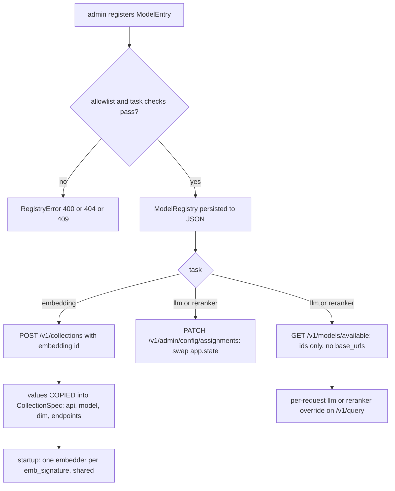
```mermaid
flowchart TD
  A["admin registers ModelEntry"] --> B{"allowlist and task checks pass?"}
  B -- "no" --> E1["RegistryError 400 or 404 or 409"]
  B -- "yes" --> R["ModelRegistry persisted to JSON"]
  R --> C{"task"}
  C -- "embedding" --> D["POST /v1/collections with embedding id"]
  D --> S["values COPIED into CollectionSpec: api, model, dim, endpoints"]
  S --> T["startup: one embedder per emb_signature, shared"]
  C -- "llm or reranker" --> H["PATCH /v1/admin/config/assignments: swap app.state"]
  C -- "llm or reranker" --> P["GET /v1/models/available: ids only, no base_urls"]
  P --> Q["per-request llm or reranker override on /v1/query"]
```

### 3.2 SidecarEmbedder & OpenAIEmbedder — the HTTP clients

**What it is:** Two async clients with the same `embed(texts)` interface
(`python/ragstack/embedders.py`). `SidecarEmbedder` calls the RAGStack embedding
sidecar: `POST <base>/embed {"texts": [...]}`. `OpenAIEmbedder` calls any
OpenAI-compatible server: `POST <base>/v1/embeddings {"model", "input"}`, e.g.
vLLM `--runner pooling`. `make_embedder(api, http, base_url, model, api_key)`
chooses between them.

**Algorithm / workflow:**
1. Both wrap a shared `httpx.AsyncClient` in `SidecarClient`
   (`python/ragstack/sidecar_http.py`) using `DEFAULT_TIMEOUT`. They expose
   `base_url`/`http`, which the Ops status probe uses.
2. `SidecarEmbedder.embed` returns `body["embeddings"]` and trusts the order.
3. `OpenAIEmbedder.embed` adds `Authorization: Bearer` when `api_key` is set. It
   then **sorts `data` by `index`** before extracting vectors, because some
   compatible servers do not preserve input order and a silent reorder would
   attach vectors to the wrong chunks.
4. `make_embedder`: `sidecar` returns a `SidecarEmbedder`. `openai` requires `model`
   and otherwise raises `ValueError`. Any other value raises `ValueError`.

**Tools & models:** httpx. External services: the embedding sidecar
(`sidecars/embedding/main.py`, sentence-transformers, `MODEL_NAME` default
`BAAI/bge-base-en-v1.5`, port 50053), or vLLM/OpenAI. The sidecar's `/embed`
handler calls `model.encode(...)` synchronously inside an `async def`, so one
sidecar process serves one encode at a time.

**Inputs → Outputs:** `list[str]` → `list[list[float]]`.

**Scalability & parallelization:** One HTTP request per call, with no size bound
of its own. Request shaping belongs to `BatchingEmbedder`/`PooledEmbedder`.
Many concurrent calls can interleave on one event loop.

**Single vs bulk:** No distinction. A single query is a one-element list.

**Diagram:**
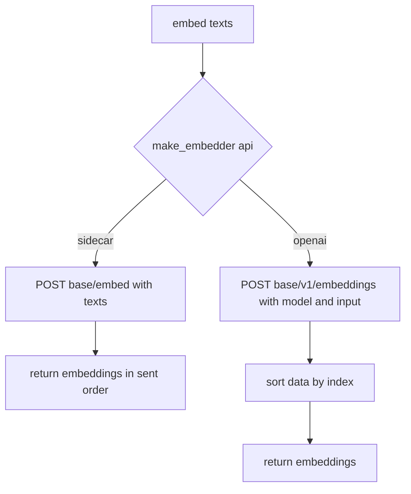
```mermaid
flowchart TD
  A["embed texts"] --> B{"make_embedder api"}
  B -- "sidecar" --> C["POST base/embed with texts"]
  B -- "openai" --> D["POST base/v1/embeddings with model and input"]
  C --> E["return embeddings in sent order"]
  D --> F["sort data by index"]
  F --> G["return embeddings"]
```

### 3.3 BatchingEmbedder: bounded batching and poison-input bisection

**What it is:** The outermost layer for every embedder the API builds
(`deps._make_embedder`). It splits a text list into batches bounded by item
count and estimated tokens. It also offers `embed_isolated`, which bisects a
failing batch so that a single bad input is quarantined instead of failing the
whole document. Infrastructure failures (5xx, network) are always re-raised.

**Algorithm / workflow:**
1. `_batches`: a greedy walk. Token estimate is `len(text)//chars_per_token + 1`.
   A new group starts when the current one reaches `max_batch_items` or the next
   text would exceed `max_batch_tokens`. Defaults are 64 / 8192 / 4, set in
   `Settings.embedding_max_batch_items|tokens` and
   `embedding_chars_per_token`.
2. `embed`: runs the groups **sequentially** and is all-or-nothing.
3. `embed_isolated` → `_embed_group`: on `httpx.HTTPStatusError` with status
   4xx, it quarantines if the group has one item, otherwise splits at `len//2`
   and recurses on both halves. A non-4xx status is re-raised. The return value
   is `(vectors with None holes, quarantined_count)`.
4. `base` property: exposes the wrapped client or pool, so
   `routers/models.py::_pool_load` can read live per-endpoint load.

**Tools & models:** Pure Python plus `httpx.HTTPStatusError`. No model.

**Inputs → Outputs:** `embed`: `list[str] → list[list[float]]`.
`embed_isolated`: `list[str] → (list[list[float] | None], int)`.

**Scalability & parallelization:** Not concurrent at this layer, because groups
are awaited one after another. When the base is a `PooledEmbedder`, a group
larger than the pool's `request_batch` (default 128) is fanned out again below
(§3.4). With the API defaults (64-item groups) that split usually does not fire.
The main fan-out beneficiaries are the bulk CLIs, which call the pool directly
with large lists.

**Single vs bulk:** Same class for both. `embed` is the strict path.
`embed_isolated` is the fault-tolerant path used by the bulk ingest backstop
(`scripts/ingest_jsonl.py` `_embed_drop_bad`, per the `PooledEmbedder.embed_isolated` docstring).

**Diagram:**
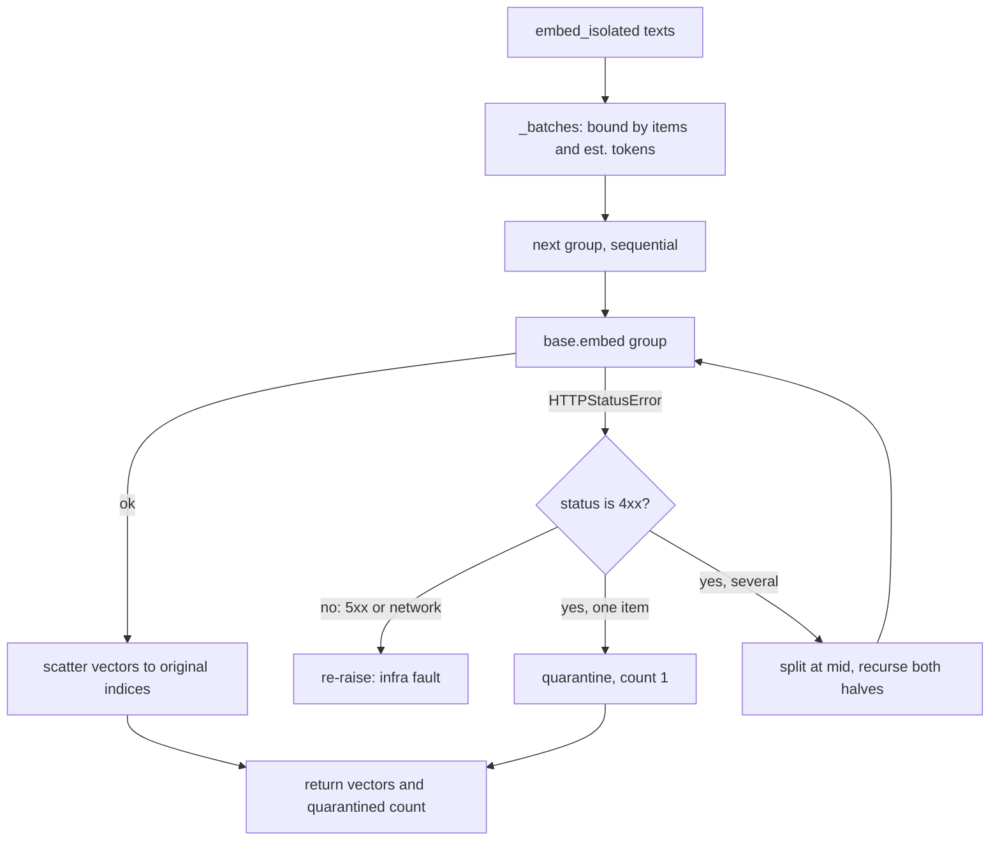
```mermaid
flowchart TD
  A["embed_isolated texts"] --> B["_batches: bound by items and est. tokens"]
  B --> C["next group, sequential"]
  C --> D["base.embed group"]
  D -- "ok" --> E["scatter vectors to original indices"]
  D -- "HTTPStatusError" --> F{"status is 4xx?"}
  F -- "no: 5xx or network" --> G["re-raise: infra fault"]
  F -- "yes, one item" --> H["quarantine, count 1"]
  F -- "yes, several" --> I["split at mid, recurse both halves"]
  I --> D
  E --> L["return vectors and quarantined count"]
  H --> L
```

### 3.4 PooledEmbedder: multi-endpoint fan-out, backpressure, failover

**What it is:** Spreads embedding across several backend endpoints, such as vLLM
replicas (`python/ragstack/embed_pool.py`). It provides least-loaded routing, a
global concurrency cap, per-endpoint health, and failover. **Since the previous
revision it also splits one oversized call into sub-requests and runs them
concurrently** (`request_batch`, #308).

**When it is used:**
- **API process:** `deps._make_embedder` builds a pool **only when more than one
  URL is configured** (`embedding_endpoints`, or a spec's endpoints). With one URL
  it wraps the plain client directly.
- **Bulk CLIs** (`ingest_shard` / `embed_shard`): `make_embedder_auto` **always**
  builds a pool, even for a single URL. The docstring says this is because the
  pool is what bounds request size and keeps several requests in flight.

**Algorithm / workflow:**
1. **Construct:** requires ≥1 `Endpoint`, each with `embedder`, `health_url`,
   optimistic `healthy=True`, and `active=0`. Creates
   `Semaphore(max_concurrency)` (default 8, `Settings.embedding_max_concurrency`),
   `request_batch` (default 128), and `health_interval` 30 s. The first probe is
   deferred by a full interval.
2. **`embed` fan-out (new):** when `len(texts) > request_batch`, the list is cut
   into `request_batch`-sized slices. Each slice runs through `_embed_one` under
   **`asyncio.gather`**, and the results are concatenated in order. The docstring
   records the motivating measurement (#308, OA pilot): a 6-endpoint fleet
   benchmarked at 2,606 texts/s, but the pipeline reached 58 texts/s because one
   22k-text request pinned one endpoint.
3. **`_embed_one`:** runs `_maybe_refresh_health()` **outside** the semaphore,
   then acquires it (the global in-flight cap). It then loops up to
   `len(endpoints)` times: `_select(tried)` picks the least-`active` healthy
   endpoint not yet tried, falling back to any untried endpoint. It increments
   `active` and calls the endpoint's `embed`.
4. **Error classification:** a 4xx other than `{408, 425, 429}`
   (`_RETRIABLE_STATUS`) is **re-raised** as a bad input so the caller can
   quarantine it. A 5xx or network error **demotes** the endpoint
   (`healthy=False`) and fails over. A retriable 4xx fails over **without** demoting.
   When every endpoint fails, it raises `RuntimeError("all embedding endpoints failed")`.
5. **Observability:** a successful call records `note("embed_ep", health_url)`.
   This is the per-request `embed_ep=` field on the summary log line (#427). Before
   #427 the endpoint was visible only in muted httpx INFO lines.
6. **`embed_isolated`:** the pool's own bisection over `self.embed`. Only a
   genuine bad-input `HTTPStatusError` is bisected. `RuntimeError`/retriable errors
   propagate so that `--resume` / `--batch-retries` can re-feed the batch.
7. **Health:** `_maybe_refresh_health` uses double-checked locking, so there is
   at most one probe round per interval. `check_health` sends `GET health_url`
   (5 s) to every endpoint via `asyncio.gather`, and `healthy = status==200`.
   `health_path` comes from `Settings.embedding_health_path`.
8. **`endpoint_load()`:** returns `(base_url, in_flight, healthy)` per endpoint for
   the admin `GET /v1/stats/models`.

**Tools & models:** `asyncio` (Semaphore, Lock, gather), `time.monotonic`, httpx.
`make_pooled_embedder` builds each endpoint with `make_embedder`.

**Inputs → Outputs:** `embed`: `list[str] → list[list[float]]` in order.
`embed_isolated`: `(vectors | None, quarantined)`. `check_health`: updates the
flags as a side effect.

**Scalability & parallelization:** This is the scaling layer. It fans out both
across concurrent callers and within one oversized call. `max_concurrency`
caps in-flight requests per pool across the whole fleet. It is per pool, and
pools are per embedding signature (§3.1), so two distinct-signature collections
have independent caps. Failover inside one request is sequential. Tenant
fairness sits above this layer (`tenant_max_concurrency`, default 0 =
unlimited; `config.py` notes it must be set below `embedding_max_concurrency` to
matter). **Query-time cost:** each `HybridRetriever` embeds its query
separately, so a request with V rewrite variants over N collections issues
V×N one-text embed calls, even when collections share a spec. STATUS.md lists
"same-spec shared embedding call" as not yet done.

**Single vs bulk:** The class has no single/bulk fork. The fork is in *which
factory* builds it: `_make_embedder` (API, pooled only if >1 URL) or
`make_embedder_auto` (CLI, always pooled). Note that the module docstring
("with one endpoint configured the plain single-endpoint embedder is used
instead") describes only the API path.

**Diagram (routing, fan-out, failover):**
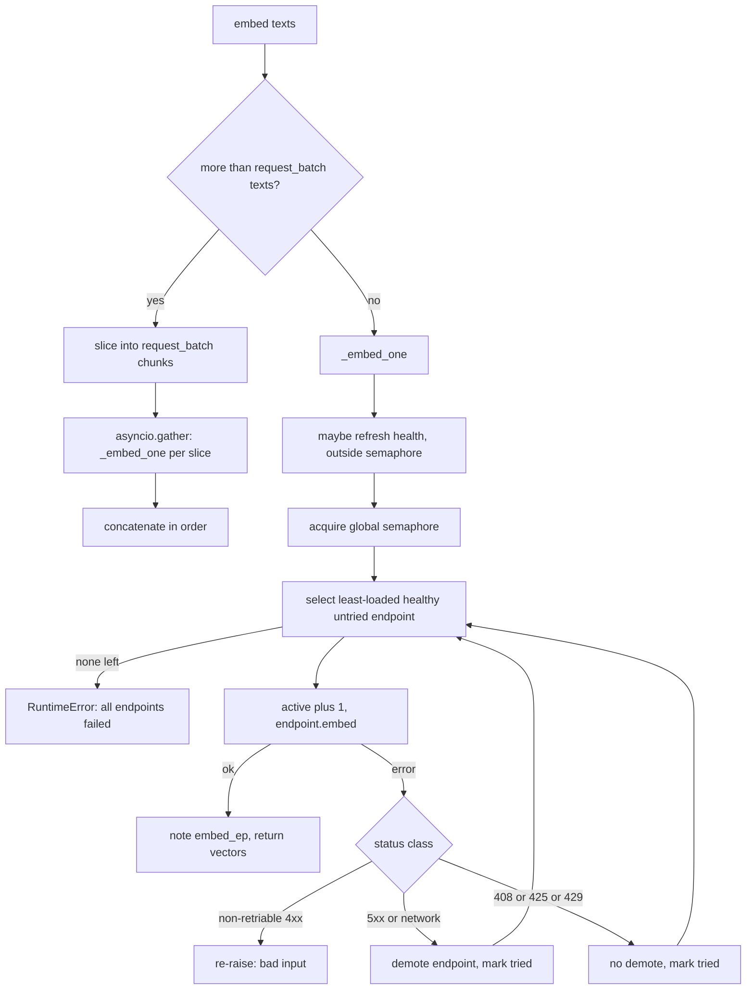
```mermaid
flowchart TD
  A["embed texts"] --> B{"more than request_batch texts?"}
  B -- "yes" --> C["slice into request_batch chunks"]
  C --> D["asyncio.gather: _embed_one per slice"]
  D --> Z2["concatenate in order"]
  B -- "no" --> E["_embed_one"]
  E --> F["maybe refresh health, outside semaphore"]
  F --> G["acquire global semaphore"]
  G --> H["select least-loaded healthy untried endpoint"]
  H -- "none left" --> X["RuntimeError: all endpoints failed"]
  H --> I["active plus 1, endpoint.embed"]
  I -- "ok" --> J["note embed_ep, return vectors"]
  I -- "error" --> K{"status class"}
  K -- "non-retriable 4xx" --> L["re-raise: bad input"]
  K -- "5xx or network" --> M["demote endpoint, mark tried"]
  K -- "408 or 425 or 429" --> N["no demote, mark tried"]
  M --> H
  N --> H
```

Source files: `python/ragstack/embedders.py`, `python/ragstack/embed_pool.py`,
`python/ragstack/api/model_registry.py`, `python/ragstack/api/deps.py`
(`_make_embedder`, `embedding_urls`, `_build_collection_registry`,
`apply_assignment`), `python/ragstack/api/routers/collections.py`
(`create_collection`, `list_available_models`), `python/ragstack/api/routers/models.py`,
`sidecars/embedding/main.py`.

---

---

## 4. Single-document Ingestion Pipeline

### Document Ingestion Pipeline (`IngestionPipeline`, the shared unit)

**What it is:** `IngestionPipeline` (`python/ragstack/ingestion/pipeline.py`) turns a
source into stored, retrievable chunks in the vector store, the text index and,
optionally, the knowledge graph. It is no longer one method. It is **two halves
plus a pre-embed step**, so each driver can run the part it needs:

| Method | What it does | Who calls it |
|---|---|---|
| `ingest(source, tenant_id)` | `index_chunks(embed_source(...))` — the coupled path | `ShardedIngestor._ingest_item` (path A, uncapped) |
| `prepare_source` / `prepare_documents` | load; DOI enrichment; chunk; boilerplate filter. Text only: no GPU, no store | the chunk-cap gate `ShardedIngestor._admit` |
| `embed_prepared` / `ingest_prepared` | embed an already-prepared source; with the empty-ingest guard | path A when a chunk cap applies |
| `embed_documents(documents, ...)` | `prepare_documents` + embed; **does not raise** when nothing survives | `ragstack.ingestion.shard.run_shard` (the `ingest_shard.py` core, paths B and C) |
| `iter_embed_source(source, group_size=64)` | streaming embed in document groups; no store | `ragstack.ingestion.embed_shard.run_embed_shard` (`embed_shard.py`, path C) |
| `index_chunks(chunks, tenant_id)` | validate → delete-prior → upsert both legs → optional KG | every path; also `load_embeddings.py` over embedding files |

**Algorithm / workflow (the coupled `ingest`):**

1. **Load.** `self.loader.load(source)` returns `list[Document]`. On path A this is
   `default_loader_registry` (confined to `INGEST_ROOT`, `max_document_bytes`); on the
   worker tools it is `JsonlLoader` over a shard that the extract step wrote.
2. **DOI enrichment (optional, #596).** `_apply_doi_enrichment` runs
   `DoiEnricher.enrich_documents` *between load and chunk*, so one metadata write per
   document reaches every chunk. `doi_enricher=None` disables it. Any exception is
   logged and swallowed — enrichment never fails an ingest. The metadata detail is
   covered in the metadata section.
3. **Chunk (in a worker thread).** `await asyncio.to_thread(self.chunker.chunk, doc)`
   per document, one at a time. Semantic chunkers block on a bridged embed call, so
   `to_thread` keeps the event loop free. Chunk ids are deterministic (`uuid5` over
   doc id and span; see §2).
4. **Boilerplate filter (optional).** `_filter_boilerplate` flags or drops chunks
   through `BoilerplateFilter.apply`. It logs counts, and warns when more than half a
   source's chunks are dropped. It never fails an ingest.
5. **Stamp tenant + embed with poison isolation.** `_embed_and_link` sets
   `metadata["tenant_id"]` on every chunk, then calls the embedder's `embed_isolated`
   when it has one (found with `getattr`), so a poison input comes back as `None`
   rather than failing the batch; otherwise it calls plain `embed`.
6. **Drop quarantined, link survivors.** Chunks whose vector is `None` are dropped.
   `link_neighbors_by_document(kept)` stamps `chunk_index` / `prev_chunk_id` /
   `next_chunk_id` on the survivors only, so no chain points at a quarantined chunk.
7. **Empty-ingest guard.** In `embed_prepared`, no survivors raises
   `EmptyIngestError` *before any store is touched*, so an empty or all-quarantined
   re-ingest cannot delete the prior version. Documents that loaded but kept no chunk
   are named in a warning ("kept prior data for N document(s)").
8. **Metadata contract (#603/#604).** `index_chunks` first calls
   `ragstack.metadata_schema.validate_chunks(chunks, where="index_chunks")`
   (`pipeline.py:446`). A declared field with the wrong type is refused **before the
   delete-prior and before either store is written**. Undeclared keys pass through.
9. **Delete-prior, bounded-concurrent, survivors only.** For each `doc_id` that has a
   surviving chunk, it deletes that document's rows from the vector store, the text
   index and, if configured, the graph (scoped by `collection`, #209). The deletes run
   under `asyncio.Semaphore(delete_concurrency)` (default 8). A document with no
   survivor keeps its prior rows — they may be stale, but they are not lost.
   `delete_prior=False` skips this step. Only `load_embeddings.py` sets it
   (`--no-delete-prior`, and always in `--replay`, which does its own per-version
   delete).
10. **Index both legs together.** `asyncio.gather(vector_store.upsert(chunks),
    text_index.index(chunks), return_exceptions=True)`, then the first exception is
    re-raised. Both legs run to completion before the method returns, so a failed
    load cannot still be writing to one store afterwards.
11. **Optional KG extraction.** If both `kg_extractor` and `graph_store` are set,
    triples are extracted, stamped with `tenant_id` **and** `collection`, and added.
    (Path B never sets a KG extractor. Graph extraction is its own workflow,
    `cwl/graph-extract.cwl`.)
12. **Return** the surviving chunk ids.

**Ordering, restated:** the pipeline is **delete-then-upsert**. It is safe because the
delete runs only after a successful embed *and* a successful metadata validation.
Path D alone uses upsert-then-prune (`delete_except` after `upsert`, §5.5).

**Tools & models:** stdlib `asyncio` (`to_thread`, `Semaphore`, `gather`), `uuid5`.
Collaborators are injected and typed by protocol (`ragstack.protocols`):
`DocumentLoader`, `Chunker`, `Embedder` (the pooled/batching embedders of §3),
`VectorStore` (Qdrant), `TextIndex` (Elasticsearch), optional `GraphStore` +
`KGExtractor`, optional `DoiEnricher`
(`python/ragstack/ingestion/doi_metadata.py`) and `BoilerplateFilter`
(`python/ragstack/ingestion/boilerplate.py`). On path A the pipeline for a
non-surface collection is built per request by `api/deps.py` `build_ingestor_for`:
that collection's own chunker (`_chunker_for`, with a per-collection
`SyncEmbedBridge` for the semantic methods), embedder and stores, plus the app's
shared `doi_enricher`.

**Inputs → Outputs:** In: `source: str`, `tenant_id`. Out: `list[str]` of surviving
chunk ids. Side effects: Qdrant points, ES documents, and optionally Neo4j triples.
Raises `EmptyIngestError` (no survivors), `ChunkMetadataTypeError` (contract
violation), or infra errors from the embedder or the stores.

**Scalability & parallelization:** Inside one call, loading and chunking are
sequential per document. The parallelism is below (the embedder's batching and
pool, §3), inside `index_chunks` (bounded-concurrent deletes, the two legs gathered),
and above (drivers: path A shards, path B/C engine scatter). The embedding
round-trip is the dominant cost.

**Single vs bulk:** the algorithm is the same on every path except D; only the
driver changes. Path A calls `ingest` / `ingest_prepared` once per manifest item.
Path B's `ingest_shard.py` calls `embed_documents` → writes an embedding file →
`index_chunks` for a *batch* of documents (`run_shard`), and turns per-document
emptiness into receipt rows instead of `EmptyIngestError`. Path C either does the
same (`ingest-bulk.cwl`) or splits the halves across two tools: `embed_shard.py`
(`iter_embed_source`, no store) and `load_embeddings.py` (`index_chunks` over files).

**Diagram:**

```mermaid
flowchart TD
    S["source"] --> L["loader.load"]
    L --> E1["_apply_doi_enrichment - optional, never fatal"]
    E1 --> CH["chunker.chunk per doc in to_thread"]
    CH --> BF["_filter_boilerplate - optional, never fatal"]
    BF --> EM["_embed_and_link: stamp tenant, embed_isolated, drop None, link neighbors"]
    EM --> G1{"any survivors?"}
    G1 -- "no" --> X1["EmptyIngestError - prior data untouched"]
    G1 -- "yes" --> V["validate_chunks - metadata contract"]
    V -- "type error" --> X2["ChunkMetadataTypeError - nothing deleted, nothing written"]
    V -- "ok" --> DP["delete-prior for docs with survivors, Semaphore delete_concurrency"]
    DP --> UP["gather: vector upsert + text index"]
    UP --> KG{"kg_extractor and graph_store?"}
    KG -- "yes" --> T["extract triples, stamp tenant + collection, add_triples"]
    KG -- "no" --> R["return chunk ids"]
    T --> R
```

Key files: `python/ragstack/ingestion/pipeline.py`, `python/ragstack/metadata_schema.py`,
`python/ragstack/ingestion/doi_metadata.py`, `python/ragstack/ingestion/boilerplate.py`,
`python/ragstack/ingestion/chunkers.py` (`link_neighbors_by_document`),
`python/ragstack/api/deps.py` (`build_ingestor_for`).

---

---

## 5. Bulk / Sharded Ingestion

### 5.1 Path A — `ShardedIngestor` + `LocalAsyncIORunner` (in-process)

**What it is:** the library-level driver that `_run_ingest`
(`python/ragstack/api/routers/documents.py`) uses when `INGEST_BACKEND=local`. It turns
a file or directory into a `Manifest` and runs each item through `IngestionPipeline`
under bounded concurrency, checkpointing each item in the `JobStore`.

**Algorithm / workflow:**

1. **Request gates** (`ingest` / `ingest_upload`): `_refuse_unknown_backend`; **503**
   if `INGEST_ROOT` is unset (otherwise the route would be an arbitrary server-side
   file read). Uploads are checked first by `_admit_uploads`: file count, content
   type and `%PDF` magic, per-file and per-request byte caps (413/415). The upload
   route also has `single_inflight_ingest`, which returns 429 while one of the
   caller's jobs is in flight.
2. **Target** — `_resolve_ingest_target` → `_authorize_ingest_target`: an implicit
   target (the field omitted, or the reserved pointer name) goes to
   `resolve_ingest_default_entry`; an explicit id goes through the allowlist,
   `resolve`, then `enforce_access`. The action is `"read"` on the legacy shared
   surface and `"write"` otherwise. `_guard` runs `check_ingest_build_spec` (409 on a
   manifest mismatch, ADR-0002). A non-surface entry gets a per-collection ingestor
   from `build_ingestor_for`. A tokenizer that cannot load returns **503**.
3. **Job row** — `job_lifecycle` (#415) owns the row from creation until
   `background_tasks.add_task`, so a failure in between cannot leave a row stranded
   in `accepted`.
4. **Manifest** — `build_manifest(source, suffixes, ingest_root)`
   (`python/ragstack/ingestion/manifest.py`): a sorted `rglob`, filtered by
   `DEFAULT_INGEST_SUFFIXES`. Every file is re-confined to the root, and its
   `item_id = deterministic_doc_id(resolved path)`. For uploads (`every_file=True`),
   files with no loader become failed items (`no_loader_error`) instead of being
   dropped silently (`_fail_unsupported_items`).
5. **Chunk cap (#291)** — `_chunk_cap_for` resolves the cap once per job: the
   registry `max_chunks` override, else `max_chunks_per_collection` for a
   user-created collection. The shared surface is never capped. With a cap,
   `ShardedIngestor._admit` takes **one** live `vector_store.count()`, prepares
   every remaining item (text only), and refuses the whole job with
   `ChunkCapExceeded` before the first embed. Every item is then marked failed.
6. **Resume filter** — `add_items` (idempotent), then already-`completed_item_ids`
   are skipped.
7. **Partition + run** — `partition(items, shard_size)`, then
   `LocalAsyncIORunner.run_shards` runs `asyncio.gather` under
   `Semaphore(max_concurrency)` with `return_exceptions=True`. If a shard raises as a
   whole, all its items become `FAILED` results. Inside a shard, `_run_shard` runs
   items **in order** and calls `mark_item` after each.
8. **Per item** — `_ingest_item` (or `_ingest_prepared_item` on the capped path)
   holds `TenantQuota.slot(tenant_id)` around `pipeline.ingest`. An exception becomes
   a `FAILED` `ItemResult` whose label is `job_error` or the exception class name.
9. **Finalise** — `_final_status`: `failed` only if items existed and none completed.
   The response carries `chunk_ids` only for a single completed item. On success,
   `write_ingest_manifest_for` writes the provenance manifest (for the shared
   surface, `write_ingest_manifest`). **No archive version is written on this path**
   (compare §5.2).

**Tools & models:** `asyncio`; Pydantic `WorkItem` / `Manifest` / `ItemResult`;
`JobStore` backends in `python/ragstack/jobstore.py` (memory / sqlite / postgres);
`TenantQuota` (`python/ragstack/quota.py`, LRU-bounded per-tenant semaphores;
`tenant_max_concurrency` defaults to 0 = unlimited).

**Inputs → Outputs:** In: a server path or uploaded files, an optional `collection`.
Out: `IngestResponse{job_id, status, collection}` right away; per-item rows and a
provenance manifest after the background task finishes.

**Scalability & parallelization:** parallel across shards (`ingest_concurrency`
shards × `ingest_shard_size` items), serial within a shard, and bounded by one
process's event loop and the shared embedder pool. ADR-0006's context records that
this in-process `BackgroundTasks` path "cannot take self-service load" (#203). That
is why path B exists.

**Single vs bulk:** one code path. A single file is a 1-item manifest.

```mermaid
flowchart TD
    R["POST /v1/ingest or /v1/ingest/upload, INGEST_BACKEND=local"] --> G["INGEST_ROOT set? uploads admitted?"]
    G --> T["_resolve_ingest_target: authorize, build-spec 409, build_ingestor_for"]
    T --> J["job_lifecycle creates row, add_task _run_ingest"]
    J --> M["build_manifest: rglob, confine, item_id = doc id"]
    M --> CAP{"chunk cap applies?"}
    CAP -- "yes" --> AD["_admit: one count, prepare all, refuse whole or keep prepared"]
    CAP -- "no" --> RS["resume filter via JobStore"]
    AD --> RS
    RS --> PT["partition shard_size"]
    PT --> LR["LocalAsyncIORunner: gather under Semaphore"]
    LR --> SH["per shard, items in order, quota slot, pipeline.ingest"]
    SH --> MK["mark_item in JobStore"]
    MK --> FS["_final_status, write provenance manifest"]
```

### 5.2 Path B — API → GoWe/CWL (`INGEST_BACKEND=gowe`)

**What it is:** the user-triggered ingest plane (#203/#353). The API validates,
authorizes, reserves an archive version, and submits `cwl/pdf-ingest-scatter.cwl` to
the GoWe engine **as the caller**. The workers do all the loading, chunking,
embedding and writing. The API then waits for completion *and* delivery, and maps
per-document receipts onto the job.

**Algorithm / workflow** (`documents.py` gowe branches of `ingest` and
`ingest_upload`, then `_run_gowe_ingest`):

1. **Identity** — `_gowe_caller` → `api/security.py` `gowe_caller`. Without a BV-BRC
   bearer token this returns **401**: API keys and bearers from other issuers cannot
   submit.
2. **Source** — `POST /v1/ingest` accepts only a Workspace reference
   (`_workspace_reference`: `ws:///<user>/home/…` or `/<user>/home/…`, otherwise
   400). `INGEST_ROOT` is not checked because nothing on the API host is read. For
   `POST /v1/ingest/upload`, `_admit_uploads` runs first.
3. **Target + gates, all before any write or version reservation:**
   `_authorize_ingest_target` (the same authorization and build-spec 409 as path A);
   `_refuse_unrunnable_chunk_method` (**422** when the entry's `chunk_method` is in
   `INGEST_WORKER_UNSUPPORTED_METHODS`, see below); `_registry_row` (**400** unless
   the collection is a registered row — the settings-derived default is not); and
   `_chunk_cap_for`.
4. **Reserve the version** — `_reserve_version` → `CollectionStore.next_version`. A
   registry that cannot reserve (the JSON backend) returns **503**.
5. **Upload only: write the sources** — `_gowe_upload_sources` writes each file into
   the caller's Workspace, under `.ragstack/collections/<id>/sources/`, with the
   caller's token. File names are ASCII-folded (`_safe_upload_name` →
   `_ascii_fold`) because the Workspace cannot address non-ASCII paths. A same-named
   file returns **409** and is never overwritten.
6. **Per-job inputs** — `_gowe_inputs` seeds `version`, `collection_id`,
   `spec_hash`, `job_id`, `tenant`, the physical `collection` / `es_index`, and
   `qdrant_url` / `es_url` from **this API's** routing (`ragstack.store_routing`,
   #407). When the entry records them, it adds `embedding_model`, `embedding_url`,
   `chunk_method` / `chunk_size` / `chunk_overlap` and `max_chunks`. It adds
   `registry` when `COLLECTION_REGISTRY_NAME` is set (#563, ADR-0009), and
   `doi_enrichment` / `doi_mailto` / `doi_cache_dir` when DOI enrichment is on
   (#596). `make_ingest_backend` refuses at boot any
   `GOWE_WORKFLOW_INPUTS_JSON` that sets `qdrant_url` / `es_url`.
7. **Submit** — `GoWeBackend.run_submission`
   (`python/ragstack/ingestion/gowe_backend.py`): refuse duplicate source basenames;
   `register_workflow`; `submit` with `{**static_inputs, **inputs, pdfs: [File…]}`,
   the `worker_group` label, and
   `output_destination = <collection folder>/versions/`; then `wait` with
   `require_delivery=True`.
8. **Workflow** (`cwl/pdf-ingest-scatter.cwl`): the `batch` ExpressionTool groups
   `pdfs` by `batch_size` (default 20). Then, per batch, `extract` (`pdf_extract.py`
   → one JSONL shard + a skip report) and `ingest` (`ingest_shard.py` → both stores +
   one `ShardReceipt` with a row per document + the batch's embedding file). Finally
   `pack` (`archive_version.py`) gathers everything into the `archive` Directory
   named by the version — the workflow's **only** output. GoWe post-stages it to
   `<output_destination>/<version>/`.
9. **Inside `ingest_shard.py`** (`python/scripts/ingest_shard.py`, core
   `ragstack.ingestion.shard.run_shard`): `ingest_target.resolve_or_exit` resolves
   `--collection-id` through the registry named by `--registry` and checks
   model/chunk spec (§5.4). `_build_pipeline` probes the embedding dim and calls
   `target.check_build(dim=...)`. Semantic methods get a `SyncEmbedBridge` built from
   the same `--embedding-url` (#609 steps 2–3). `run_shard` then does
   `embed_documents` → `check_chunk_cap` → `write_embedding_file` → `index_chunks`.
   Per-document failures, such as `NO_TEXT_ERROR` from the extract report or no
   embeddable chunk, are **rows**, and the task still exits 0. Only a batch-level
   error exits non-zero (1), and a chunk-cap refusal exits
   `CAP_REFUSED_EXIT_CODE` = 4 (`permanentFailCodes: [4]` in the CWL).
10. **Results** — for a COMPLETED and delivered submission,
    `_map_archive_receipts` reads `versions/<n>/receipt.json` through the Workspace
    with the caller's token and matches rows to items by source basename.
    `_run_gowe_ingest` then calls `append_version(collection, version)`, marks each
    item, sets `archive_ref`, and writes the provenance manifest. The failure modes
    are:
    - `OutputStagingFailed`: the job fails with `OUTPUT_STAGING_FAILED` and the row
      gets `set_archive_pending(True)`, so the collection cannot be evicted before it
      is re-archived.
    - Any other non-COMPLETED terminal state: every item fails under the engine state
      or the chunk-cap label (`cap_refusal_of`).
    - `GoWeContractError` (delivered but with unusable receipts): the job fails with
      that class name.

**Where the per-deployment guards sit:**

- **`INGEST_WORKER_UNSUPPORTED_METHODS`** (`python/ragstack/config.py`, default
  `semantic,semantic_pooled`; parsed by `chunker_config.parse_unsupported_methods`,
  which rejects unknown names at boot). The same set is enforced in two places:
  `collections.py` refuses to *create* such a collection on a gowe deployment, and
  `documents.py` `_refuse_unrunnable_chunk_method` refuses to *ingest* into one that
  already exists. It is a deployment setting, not a constant, because what a worker
  can run depends on the deployed image (`shard_refusal` docstring).
- **Metadata at upload (#596/#602):** DOI resolution happens **in the worker**
  (`ingest_shard.py` passes `doi_enricher=enricher_from_args(...)` into the
  pipeline) because the API's enricher never sees a GoWe document.
- **Metadata contract (#603/#604):** enforced in `index_chunks` inside the worker,
  the same call as on path A.

**Tools & models:** `GoWeClient` (`python/ragstack/ingestion/gowe_client.py`),
`WorkspaceClient` (`python/ragstack/workspace.py`), the `ragstack-worker` Apptainer
image (built from `apptainer/ragstack-worker.def`, see `cwl/README.md`), the receipt
contract `ragstack.ingestion.receipts` (`ShardReceipt` / `DocRow`), and the archive
format `ragstack.ingestion.archive` (`FORMAT = "ragstack-archive/1"`).

**Inputs → Outputs:** In: a Workspace reference or uploaded files, a registered
`collection`, and a BV-BRC bearer token. Out: an immediate job id. Later: per-item
rows, `archive_ref`, points in both stores, and `versions/<n>/` (`manifest.json`,
`chunks.jsonl.gz`, `vectors.f32`, `receipt.json`) in the owner's Workspace.

**Scalability & parallelization:** the engine scatters batches across the worker
group, and each batch's embed fans out over the collection's embedding endpoints.
The API holds only a poll loop: small submissions use `interactive_poll_interval`
(`GoWeBackend.poll_interval_for`). The chunk cap is checked **per task** on this
path: concurrent batches can together go over the cap (`run_shard` docstring). On
path A the whole job is sized first.

**Single vs bulk:** a Workspace-reference ingest is one work item; an upload is N
items. Both take the same submission path. `batch_size` is set by the workflow and
the API does not pass it.

```mermaid
sequenceDiagram
    participant U as Caller with BV-BRC token
    participant API as documents.py gowe branch
    participant REG as CollectionStore
    participant WS as BV-BRC Workspace
    participant GW as GoWe engine
    participant WK as Worker pdf_extract then ingest_shard
    participant ST as Qdrant and ES
    U->>API: POST /v1/ingest or /v1/ingest/upload
    API->>API: gowe_caller, authorize, build-spec 409, unsupported-method 422
    API->>REG: registry row, chunk cap, next_version
    opt upload
        API->>WS: write sources with caller token
    end
    API-->>U: 200 or 202 with job_id
    API->>GW: submit pdf-ingest-scatter as caller, output_destination versions/
    GW->>WK: per batch of 20 PDFs
    WK->>WK: resolve collection_id via named registry, check_build
    WK->>ST: embed_documents, cap check, index_chunks
    WK->>GW: receipt with a row per document
    GW->>WS: post-stage archive to versions/N
    API->>GW: wait for COMPLETED and delivered
    API->>WS: read versions/N/receipt.json
    API->>REG: append_version or set_archive_pending
    API->>API: mark items, archive_ref, provenance manifest
```

### 5.3 Path C — operator bulk CWL

**What it is:** CWL workflows that an operator submits directly (the `gowe` CLI, GoWe,
or `cwltool`) to build or rebuild a corpus. ADR-0006 §1 calls this the operator
plane: "CWL workflows + per-stage Python CLIs + the batch driver". The open-access
build ran on it: 32 of 32 batches, 47,625,155 chunks (ADR-0006 Context; run record
`reports/oa-ingest-run.md`).

| Workflow | Shape | Tools |
|---|---|---|
| `cwl/jats-ingest.cwl` | scatter `extract` → scatter `embed` (two flat scatters: GoWe runs scatter-over-subworkflow children one at a time, GoWe#164) → `merge` → **single** `load` | `jats_extract.py`, `embed_shard.py`, `merge_receipts.py`, `load_embeddings.py` |
| `cwl/ingest-bulk.cwl` | scatter coupled `ingest_shard` per JSONL shard → `merge` | `ingest_shard.py`, `merge_receipts.py` |
| `cwl/embed-bulk.cwl` + `cwl/load-embeddings.cwl` | decoupled (#141): scatter `embed_shard` → embedding files; then one `load` task | `embed_shard.py`, `load_embeddings.py` |
| `cwl/pdf-ingest.cwl` | one shard per run: `pdf_extract` → `embed_shard` → `load_embeddings` → `pack` | as named, plus `archive_version.py` |

**Algorithm / workflow (the JATS reference build):**

1. **Register first.** The collection must already exist in the registry
   (`POST /v1/collections`). `load_embeddings.py` refuses an id the registry does not
   hold (`jats-ingest.cwl` header).
2. **Plan.** `plan_shards.py` assigns each article to
   `int(sha1(pmcid)[:16], 16) % n_shards`. The assignment is stable while the corpus
   grows, because `n_shards` is set by the operator rather than derived from the
   count.
3. **Drive in batches.** `gowe_batch_ingest.py` submits a batch of shards
   (`gowe submit … --group`), polls, and **verifies against the stores**: submission
   COMPLETED, a load summary with `n_shards_failed == 0`, and Qdrant and ES agreeing
   with each other. A zero delta is accepted as an idempotent re-run. It then deletes
   that batch's `*.emb.jsonl` and appends a row to a resumable ledger.
4. **Per shard.** `jats_extract.py` (JATS → `{text, path, metadata}` JSONL) →
   `embed_shard.py` (`run_embed_shard` → `pipeline.iter_embed_source`, document groups
   sized from the fleet; no store contact).
5. **Load.** A single `load_embeddings.py` task reads the embedding files. Its dim
   comes from each file's header, and a mismatched file is rejected before any write.
   It optionally wraps the store in `BackpressuredVectorStore`
   (`python/ragstack/stores/backpressure.py`, `--backpressure`), sets `--bulk-refresh`
   and `--file-concurrency`, then calls `index_chunks`, and writes the provenance
   manifest.

**Differences from path B:** `embed_shard.py` refuses the semantic methods locally,
whatever the deployment setting, because it builds no embed bridge (its
`_build_chunker`). `jats-ingest.cwl`'s load step fixes the registry through
`EnvVarRequirement` (`COLLECTION_STORE_BACKEND: sqlite`,
`COLLECTION_STORE_PATH: $(inputs.registry_db.path)`) and binds no `--registry`. This
is the exemption ADR-0009 decision 6 names.

**Scalability & parallelization:** engine scatter over workers for extract and embed.
The load is deliberately a single task, because backpressure is a control loop
(`cwl/load-embeddings.cwl` header). The driver's batching pipelines one batch's load
behind the next batch's embed and caps the intermediate disk it uses
(`gowe_batch_ingest.py` docstring).

**Single vs bulk:** the tools are shard-granular. A "single document" on this plane is
a one-line shard.

```mermaid
flowchart TD
    REGF["collection registered via POST /v1/collections"] --> PL["plan_shards.py: shard = sha1 pmcid mod n"]
    PL --> DRV["gowe_batch_ingest.py: batch of shards"]
    DRV --> SUB["gowe submit jats-ingest.cwl"]
    SUB --> EX["scatter: jats_extract.py per shard"]
    EX --> EMB["scatter: embed_shard.py per shard, no store"]
    EMB --> MG["merge_receipts.py"]
    MG --> LD["single task: load_embeddings.py, resolve registry, check dim, index_chunks"]
    LD --> VER["driver verifies: COMPLETED, no failed shards, legs agree"]
    VER -- "ok" --> CL["delete batch emb files, append ledger row"]
    VER -- "fail" --> STOP["stop, rerun retries that batch"]
    CL --> DRV
```

### 5.4 Target resolution for workers — `IngestTarget` and registry selection

**What it is:** `python/ragstack/ops/ingest_target.py`. Every bulk writer —
`ingest_shard.py`, `load_embeddings.py`, `ingest_jsonl.py`, `ingest_chunks.py` —
resolves where it writes through the collection registry, never from its own CLI
names (#263, ADR-0005 decision 6).

**Algorithm:**

1. `add_arguments` adds `--collection-id`, `--create-via-api`, `--api-key`,
   `--api-bearer` and `--registry`. `--registry` has **no** environment default
   (ADR-0009 decision 6).
2. `resolve_from_args` → `registry_settings(name)`. The name is checked against
   `^[a-z0-9][a-z0-9_]{0,63}$`, upper-cased into a suffix, and read from
   `COLLECTION_STORE_BACKEND_<NAME>` + `COLLECTION_STORE_{DSN,PATH}_<NAME>`, with every
   unsuffixed coordinate blanked. A named registry that is not configured is fatal
   and never falls back. An empty name keeps the unsuffixed variables — the
   behaviour before #563.
3. `resolve(collection_id)` returns an `IngestTarget` (physical `collection`,
   `qdrant_url`, `es_index`, `es_url`, all taken from the entry and its routes), or
   refuses with the known ids. Without `--collection-id`, `resolve_by_store_name`
   matches the physical `--collection` against the registry. That is the migration
   path: an unclaimed name is refused, and so is a name claimed more than once.
   `--create-via-api` creates the entry through `POST /v1/collections` and then
   resolves it again from the registry.
4. `_checked` refuses a `--collection` / `--es-index` that contradicts the entry.
5. `IngestTarget.check_build(model, dim, chunk_method, chunk_size, chunk_overlap)`
   compares **field by field**. A field that is unset on either side is not a
   mismatch; a field both sides state differently raises `TargetError`.
   `resolve_or_exit` turns any `TargetError` into exit 2 with the message.
6. After a successful load, `IngestTarget.write_manifest` writes the provenance
   manifest from the *registry entry*. That manifest is what later arms the API's
   `check_ingest_build_spec`.

**Two build-spec guards, one rule.** The API compares against the provenance
**manifest** (`api/deps.py` `check_ingest_build_spec`, which does nothing when no
manifest exists yet). Workers compare against the **registry entry**
(`IngestTarget.check_build`, where an entry always exists). Both implement ADR-0002
decision 3 (the build spec is immutable).

**Registry selection (ADR-0009, Proposed).** The API sends `registry` as a *name* on
the submission. The credential (DSN) reaches the container only through the worker's
`--secret-file`, because `submitted_inputs` is an immutable, plaintext snapshot.
ADR-0009 also records that a worker group is **not** a confidentiality boundary, and
that GoWe v0.20.0 submission-time `secrets` are now deployed and open as follow-up
work.

### 5.5 Path D — legacy `ingest_jsonl.py`

**What it is:** a streaming operator CLI (`python/scripts/ingest_jsonl.py`) for large
`{text, path, metadata}` JSONL dumps. It still has its own concurrency and resume
machinery: a producer → coordinator `_fold` (which assigns `seq` in file order) →
`--concurrency` embed and upsert workers; `--chunk-concurrency` parallel chunking; an
atomic `.ckpt` frontier plus out-of-order `done_ranges` (#65); and `--batch-retries`
with backoff. The mechanics were described in full in the July edition of this
document and have not changed in kind.

**What changed since July:** it now resolves its target through
`ingest_target.resolve_or_exit` with `check_build` (registry-first, §5.4). It runs
`validate_chunks(kept, where="ingest_jsonl")` before upsert, so it follows the same
metadata contract as `index_chunks`.

**What did not change:** it still does **not** call `IngestionPipeline.index_chunks`.
Its worker upserts first and prunes afterwards (`store.upsert(kept)`, then
`delete_except` only under `--replace`), which is the reverse of the pipeline's
delete-then-upsert order, and it has its own quarantine and neighbour-link calls.
This is the #25 fork.

**Status — decision vs code:** ADR-0006 §2 says the script is "retired: deprecated
now with a pointer to the CWL path, deleted after the next tagged release", and
`ROADMAP.md` lists it as ADR-0006 follow-through. At `22b44be` **the script carries
no deprecation notice or warning**: its module docstring still presents it as "the
operator tool for the large extraction dumps". `docs/ingest-paths.md` still marks it
"**Production** — the operator path for big corpora". Readers should treat it as
**slated for removal**. Its replacements are `ingest-bulk.cwl` (coupled) or
`embed-bulk.cwl` + `load-embeddings.cwl` (decoupled) over shards.

### 5.6 How ingest touches the collection lifecycle (short)

- **Path B writes archive versions.** Each delivered GoWe ingest creates
  `versions/<n>/` (`ragstack-archive/1`) in the owner's Workspace and appends `n` to
  the registry row's ordered `versions` list (`CollectionStore.append_version`). A
  failed post-stage sets `archive_pending`, which blocks eviction until the
  collection is re-archived. **Path A writes no archive**: only the provenance
  manifest.
- **Restore replays those versions.** `python/ragstack/restore.py`
  `CollectionRestorer` submits `cwl/restore-collection.cwl` as the user. The workflow
  runs `load_embeddings.py --replay` (`ragstack.ingestion.load_embeddings`
  `verify_replay` then `run_replay`). It verifies every version's sha256s, geometry
  and `spec_hash` **before any write**, then replays chunk versions and tombstones in
  order. The registry row moves `restoring → active`, back to `dormant` on an engine
  failure, or to `lost` on `ArchiveCorrupt` / `SpecMismatch` (exit 3).
- The graph leg is archived as a delta by `cwl/graph-extract.cwl` into the same
  `versions/<n>/` folder. Lifecycle states, eviction and the graph workflow are
  covered in the storage and tenancy sections.

---

## 6. Retrieval & RRF Fusion

`/v1/retrieve` and `/v1/query` run through one pipeline in
`python/ragstack/api/routers/query.py`:

```
authz: _resolve_retrieval  → filters validated, scoped; retriever chosen (single or multi-collection)
[rewrite: _expand_query]   → /v1/query only (§7.1)
_retrieve_fused            → per-variant retrieve (§6.2/§6.4) → RRF (§6.3) → pool cut → rerank (§7.2) → shape → top_k
expand: _expand_sources    → neighbour context (§6.6), post-rank
[generate]                 → /v1/query only (§7.3)
```

Each bracketed name is also an observability `stage(...)` timer.

### 6.1 Request resolution, filter grammar & tenant scoping

**What it is:** A single seam, `_resolve_retrieval`, that both endpoints pass
through. It validates the caller's `filters`, adds optional server-built
conditions, authorizes every requested collection, and produces the scoped
filter dict every leg uses.

**Algorithm / workflow:**
1. **Value grammar (#471):** `validate_filter_values(filters)`
   (`python/ragstack/stores/filters.py`) runs on **the caller's dict, before
   tenant keys are merged**. A violation returns 400. Filters are
   **equality/membership only** and ANDed across keys. A scalar is
   `str|int|bool`. A list is homogeneous `str` or `int` and means membership;
   `[]` matches nothing. `float`, `None`, nested lists, and **`dict` values are
   refused**. The dict refusal explicitly covers range operators such as
   `{"year": {"gte": 2025}}` (docs/API.md, "Range operators are not supported").
   Types are never coerced: `year` is an int field. The same grammar is
   enforced inside all four interpreters (Qdrant `_build_filter`, ES
   `_build_query`, in-memory `_matches`, `payload_matches`).
   **Range operators are an open issue (#599)**, planned in `docs/plans/date-filtering.md`.
2. **Server-side negation (#597):** when `exclude_boilerplate=true`,
   `_exclude_boilerplate` adds `{is_boilerplate: Not(True)}`. `Not` is
   **server-constructed only**: JSON cannot express it, and a client `dict` value
   is already a 400. It becomes Qdrant `must_not` / ES `bool.must_not`, and a
   chunk with no stamp is kept. `NEGATION_FORBIDDEN_KEYS = {OWNER_FIELD}` (i.e.
   `tenant_id`) makes every interpreter refuse a `Not` on the owner field, so the
   isolation filter can never be inverted.
3. **Collection resolution:** `collections is None` goes to `_resolve_entry` (one
   entry). Otherwise **every** id is resolved in request order *before any leg
   runs* (§6.4).
   `_resolve_entry` covers the `TENANT_COLLECTIONS` allowlist, registry lookup,
   and `enforce_access(principal, id, "read")`. Unknown and unreadable ids return
   the same 404. A dormant collection returns 503 + `Retry-After` through the
   lifecycle gate.
4. **Share widening:** `shared_scope(entry, registry, principal)`
   (`python/ragstack/api/scope.py`) returns the owner's tenant when the caller reaches
   a private collection through a share. It returns nothing for the shared
   surface, for co-resident collections, when auth is off, and on any ACL error
   (fail-soft, never widens).
5. **Tenant pin:** `scope_filters(filters, tenant, extra)`
   (`python/ragstack/tenancy.py`) returns `{**filters, "tenant_id": readable_tenants(tenant, extra)}`.
   `tenant_id` is **set last**, so a caller-supplied `tenant_id` key is
   overwritten and cannot widen scope. `readable_tenants` = own + `public` + extras.

**Tools & models:** Pure Python. The ACL store (Postgres or others) is used
for `enforce_access` / `owner_of`.

**Inputs → Outputs:** `(collection | collections, filters, exclude_boilerplate, principal, tenant)`
→ `(retriever, filters, targets)`. `targets` maps each collection stamp to
`(vector_store, scoped_filters)` for §6.6. In the single-collection case
`filters` is already scoped. In the multi case they are unscoped, and each
`CollectionLeg.filters()` scopes them per leg.

**Scalability & parallelization:** Members are resolved sequentially, one ACL
round trip each (≤5). The whole step is timed as the `authz` stage.

**Single vs bulk:** Single request only. Bulk ingest has its own paths (§4–5).

**Diagram:**
```mermaid
flowchart TD
  A["caller filters"] --> B["validate_filter_values"]
  B -- "dict, float, null, mixed list" --> E["400"]
  B --> C{"exclude_boilerplate?"}
  C -- "yes" --> D["add is_boilerplate: Not True, server-built"]
  C -- "no" --> F["collections given?"]
  D --> F
  F -- "no" --> G["_resolve_entry: allowlist, registry, enforce_access read"]
  F -- "yes" --> H["_resolve_entry for EVERY id, in order, before any leg"]
  G --> I["shared_scope: owner tenant if reached by share"]
  H --> I
  I --> J["scope_filters: tenant_id pinned LAST"]
  J --> K["retriever plus expansion targets"]
```

### 6.2 HybridRetriever: one collection, dense + BM25 + optional graph

**What it is:** The retriever for a single collection
(`HybridRetriever`, `python/ragstack/retrieval/retriever.py`). `deps._hybrid_retriever`
builds one per registry entry, bound to that entry's vector store, ES index,
embedder, and physical collection name.

**Algorithm / workflow (`retrieve(query, top_k, filters, use_graph, tenant_id, mode)`):**
1. `depth = top_k * candidate_multiplier`, where the multiplier is
   `Settings.retrieval_candidate_multiplier` (default 2).
2. **`mode`** (`retrieval_mode` on the request: `hybrid` default, `vector`,
   `bm25`). Anything except `bm25` embeds the query as `embed([query])` (stage
   `embed`) and runs `vector_store.search(vec, top_k=depth, filters)` (stage
   `vector`). Anything except `vector` runs `text_index.search(query, top_k=depth, filters)`
   (stage `text`). An unknown mode falls back to hybrid. The request models
   only accept the three literals.
3. **Graph leg:** if `use_graph` and a `graph_store` is wired, runs
   `_graph_context(query, top_k, tenant_id)`. It is appended only if non-empty (§6.5).
4. `rrf.fuse(ranked_lists)` (stage `fuse`, §6.3), then **`shape(fused)[:top_k]`**.
5. **`shape`** is post-fusion reordering. Both passes are off by default and are
   stable demotions, never deletions:
   - `demote_boilerplate` (`retrieval_demote_boilerplate`) moves chunks stamped
     `is_boilerplate` (or classified by text when unstamped) to the back.
   - `max_per_doc` (`retrieval_max_per_doc`) demotes a document's chunks beyond N.
   The router re-applies `shape` after reranking (§7.2) because rerank re-sorts
   the pool.

**Tools & models:** Protocol-typed `VectorStore` (Qdrant), `TextIndex`
(Elasticsearch BM25), `GraphStore` (Neo4j or in-memory), the collection's
`BatchingEmbedder`, and `RRFScorer(k=settings.rrf_k)`.

**Inputs → Outputs:** query + knobs → `list[ScoredChunk]` (≤ `top_k`,
`retrieval_method="hybrid"`, `collection=None`).

**Scalability & parallelization:** **The legs inside one retriever are still
awaited sequentially** (`embed → vector → text → graph`; there is no `gather` in
`HybridRetriever.retrieve`), so per-collection latency is the sum of the legs.
Concurrency exists one level up: across rewrite variants (`_retrieve_fused`,
§7.1) and across collections (§6.4). `vector` and `bm25` modes skip a leg,
and `bm25` also skips the embed round trip.

**Single vs bulk:** Single query. The embedder is called with a one-element batch.

**Diagram:**
```mermaid
flowchart TD
  Q["query, depth = top_k x multiplier"] --> M{"retrieval_mode"}
  M -- "hybrid or vector" --> E["embed query, batch of 1"]
  E --> V["vector_store.search, scoped filters"]
  M -- "hybrid or bm25" --> B["text_index.search BM25, scoped filters"]
  Q --> G{"use_graph and graph_store?"}
  G -- "yes" --> GC["graph leg, if non-empty"]
  V --> L["ranked lists"]
  B --> L
  GC --> L
  L --> F["RRF fuse"]
  F --> S["shape: demote boilerplate, per-doc cap"]
  S --> T["cut to top_k"]
```
Arrows show data dependencies. The legs run one after another, in source order.

### 6.3 RRF fusion, keyed on (collection, chunk id)

**What it is:** Reciprocal Rank Fusion (`RRFScorer.fuse`,
`python/ragstack/scoring/scorers.py`). It is used at three levels: legs within a
retriever, collections within a fan-out, and rewrite variants in the router
(`_RRF` module singleton, `query.py`).

**Algorithm / workflow:**
1. For each list and each 0-based `rank`, the key is **`(scored.collection, scored.chunk.id)`**.
   Then `scores[key] += 1 / (k + rank + 1)`, and the last chunk object seen per key is kept.
2. Sort by score descending. `sorted` is stable, so ties keep first-seen order,
   and in a multi-collection fan-out that is request order.
3. Emit `ScoredChunk(chunk, score, retrieval_method="hybrid", collection=key[0])`.
4. `k = Settings.rrf_k` (default 60) at every call site built by the API.
   `RRFScorer()` without arguments also defaults to 60.
5. Incoming scores are ignored, so only rank position matters. This is why
   `graph_context_score` is inert (the `config.py` comment says so).
6. `fuse` returns the **full** fused list. Callers do the cutting.

**What changed:** identity used to be `chunk.id` alone. With the
`(collection, id)` key, the same chunk id from two collections stays two
candidates, each with its own stamp. With no stamps (every `collection=None`)
the behaviour is byte-identical to the old chunk-id fusion.

**Tools & models:** Pure Python dict accumulation plus `sorted`.

**Inputs → Outputs:** `list[list[ScoredChunk]]` → `list[ScoredChunk]` (fused, untruncated).

**Scalability & parallelization:** O(M log M) over M total candidates.
In-memory and never the bottleneck.

**Single vs bulk:** One code path for any number of lists.

**Diagram:**
```mermaid
flowchart TD
  IN["ranked lists"] --> L1["for each list, for each rank"]
  L1 --> K["key = collection, chunk id"]
  K --> W["score of key += 1 / k + rank + 1, k = rrf_k"]
  W --> L1
  L1 --> S["stable sort by score, descending"]
  S --> O["ScoredChunk list, method hybrid, collection stamped"]
```

### 6.4 Multi-collection retrieval (`collections: [...]`, #253)

**What it is:** Query up to five collections in one request.
`MultiCollectionRetriever` (`python/ragstack/retrieval/retriever.py`) wraps one
`CollectionLeg` per member and exposes the same `retrieve` surface, so
`_retrieve_fused` drives it unchanged.

**Algorithm / workflow:**
1. **Validation** (`QueryRequest`/`RetrieveRequest`): `collections` has 1–5
   items (`MAX_QUERY_COLLECTIONS = 5`, matching the per-owner quota). It is
   mutually exclusive with `collection`, and duplicates are rejected (422,
   `_check_collections`). Two ids that resolve to the same entry, e.g.
   `default` next to its target, return 422 in `_resolve_retrieval`.
2. **Authorize all members first.** Each id goes through `_resolve_entry`
   (§6.1) in request order. The first refusal answers for the whole request:
   404 for unknown or unreadable, 503 + `Retry-After` for dormant, 409 for lost.
   No partial answers.
3. **Build legs.** Per member, `shared_scope` is computed once and used both for
   the leg's `extra_tenants` and for its context-expansion target
   (`targets[entry.id] = (vector_store, scope_filters(filters, tenant, extra))`).
4. **`retrieve(query, top_k=depth, ...)`:**
   - **One leg:** the leg's list is returned as-is, plus the stamp.
     `collections: [x]` is byte-for-byte `collection: x` plus `Source.collection`.
   - **≥2 legs:** every leg runs **concurrently** (`asyncio.gather`) at the
     **same depth** the single path would use, **with its own graph leg
     disabled**. `CollectionLeg.filters` scopes the caller's filters per leg. If
     `use_graph` is set and a graph store exists, **one** shared graph task
     (`_graph`, §6.5) is added.
   - `_stamp` gives each result `ScoredChunk.collection = leg.id` **and** puts
     `metadata[STAMP_KEY="_rs_collection"]` on a shallow copy of the chunk. The
     metadata stamp survives a reranker that rebuilds chunks.
   - Returns `rrf.fuse(...)` over the legs: the **untruncated union**, up to N × depth.
5. **Router side** (`_retrieve_fused`): when a reranker is active and the
   retriever fans out (`_fans_out`), the union is cut to `depth` (the rerank
   pool) and **reranked once** (§7.2). `_restamp` copies the stamp back from
   `metadata[STAMP_KEY]` after reranking, falling back to object identity.
6. **Output:** `_to_sources` sets `Source.collection`. `_source_metadata`
   strips `STAMP_KEY` so it never shows up as a metadata key. The field is
   omitted on the single-collection path.

**Tools & models:** `asyncio.gather`, each member's own `HybridRetriever`
(and so its own embedder, stores, and embedding model), plus one `RRFScorer`.

**Inputs → Outputs:** `collections` + query → `list[Source]`, each carrying
`collection`. A document present in two collections appears once per
collection.

**Scalability & parallelization:** Legs run concurrently, so wall time is
roughly the slowest leg. Each leg is still internally sequential (§6.2). There
is **never a many-valued store filter**: vector/BM25 scoping is always one
store per leg (#199, #354). Rerank cost is bounded by `rerank_candidates`
regardless of N. The router comment notes that per-collection recall into the
pool is roughly depth/N under RRF interleaving. The query is embedded once per
leg (§3.4).

**Single vs bulk:** Request-level only. The per-leg code is the
single-collection retriever.

**Diagram:**
```mermaid
flowchart TD
  R["collections: ids, 1 to 5 unique"] --> A["resolve and authorize EVERY id first"]
  A -- "any refusal" --> X["404, 503 or 409 for whole request"]
  A --> B{"how many legs"}
  B -- "one" --> O1["leg list as-is, stamped"]
  B -- "two or more" --> C["asyncio.gather"]
  C --> L1["leg 1: HybridRetriever, own scope, no graph"]
  C --> L2["leg N: HybridRetriever, own scope, no graph"]
  C --> G["one graph query across members, if enabled"]
  L1 --> S["stamp collection on ScoredChunk and chunk copy"]
  L2 --> S
  G --> S
  S --> F["RRF on collection and chunk id: union, uncut"]
  F --> P["router: cut to rerank pool, rerank ONCE, restamp"]
  P --> T["shape, cut to top_k, Source.collection"]
  O1 --> P
```

### 6.5 Graph-context leg

**What it is:** An optional ranked list of synthetic "triple" chunks taken from
the knowledge graph (`graph_context` / `query_entities` in
`python/ragstack/retrieval/retriever.py`).

**Effectively off by default.** The request flag `use_graph` defaults to `true`
(contracts), and `graph_backend` defaults to `memory`. But the leg only returns
something when the graph store holds triples for the caller's
`(tenant, collection)`. Triples come only from opt-in extraction: ingest-time
`kg_extraction_enabled` (default `False`, which also needs an LLM) or the
lifecycle step `POST /v1/collections/{id}/graph` ("off by default", docs/API.md).
`graph_backend=disabled` removes the store entirely. docs/USER-GUIDE.md: "most
[deployments] don't" have one.

**Algorithm / workflow:**
1. **Entity extraction (#349), no model:** `query_candidates` produces
   case-folded 1..`graph_query_ngram_max` (default 3) n-grams with 1-gram
   stopwords removed. **One** `graph_store.match_entities(candidates, tenant_id, collection)`
   call returns exact indexed matches. The results are re-validated against the
   candidates, ranked longest-first then by query position, and cut to
   `graph_query_entity_max` (default 5). The raw query string is never sent to
   the store.
2. One `query_neighborhood(entity, depth=graph_context_depth, tenant_id, collection)`
   per matched entity. The loop is sequential, and triples are de-duplicated on
   their full identity.
3. **Re-checks on return:** `t.tenant_id ∈ readable_tenants(tenant_id)` and
   `t.collection ∈ collections`. Both fail closed, so unstamped triples are dropped.
4. **Confidence floor (#347):** `filter_by_confidence(triples, graph_min_confidence)`.
   The default is 0, and it deliberately fails open.
5. The first `top_k` triples become `ScoredChunk`s: `id = graph-{s}-{p}-{o}`,
   content `"s p o"`, `score = graph_context_score` (inert under RRF),
   `retrieval_method="graph"`, and metadata carrying `tenant_id` and `collection`.
6. **Multi-collection:** one call with `collection IN [physical names]` and one
   shared `top_k` budget. Pseudo-chunks are mapped back to the leg id through
   `metadata["collection"]`. Co-resident stores map to the first such leg.

**Scope caveat: no share widening on the graph leg.** The graph leg is scoped
by `readable_tenants(tenant_id)` only, meaning own + `public`. The
`extra_tenants` from `shared_scope` are passed to the vector/BM25 filters
(`CollectionLeg.filters`, `scope_filters`) and **never** to `graph_context`.
A caller who reaches a private collection through a share therefore gets
widened dense/BM25 results but **no graph triples** from the owner's tenant.

**Tools & models:** `GraphStore.match_entities` / `query_neighborhood`
(Neo4j Cypher or in-memory). No embeddings and no LLM.

**Inputs → Outputs:** `(query, top_k, tenant_id, collections)` → ≤ `top_k`
graph pseudo-chunks. Empty means the leg is skipped.

**Scalability & parallelization:** 1 + (≤ `entity_max`) sequential store calls.
In the single-collection path this adds to the leg latency. In the fan-out it
runs as one concurrent task alongside the legs. Stage `graph`.

**Single vs bulk:** Single query.

**Diagram:**
```mermaid
flowchart TD
  Q["query"] --> C["n-gram candidates, stopwords dropped"]
  C --> M["ONE match_entities, tenant and collection scoped"]
  M -- "no match" --> Z["empty leg, no neighbourhood call"]
  M --> R["rank: longest first, then position, keep entity_max"]
  R --> N["query_neighborhood per entity, depth graph_context_depth"]
  N --> K["re-check tenant: own plus public ONLY, no share widening"]
  K --> K2["re-check collection membership"]
  K2 --> F["confidence floor, fails open"]
  F --> P["first top_k triples to pseudo-chunks, method graph"]
```

### 6.6 Neighbour expansion (`context_window`, #322)

**What it is:** A step after ranking that attaches each returned source's
document neighbours as `Source.context`, following the
`prev_chunk_id`/`next_chunk_id` links stamped at ingest. The ranking is not
changed.

**Algorithm / workflow:**
1. `context_window` is 0–3 (`MAX_CONTEXT_WINDOW = 3`; above 3 is a 422). 0 (the
   default) means no store call and a byte-identical response.
2. `_expand_sources(targets, scored, window)` groups the final sources by
   collection stamp. For each collection it runs `expand_context(store, subset, window, filters)`
   with **that collection's own store and scoped filter dict**, all collections
   concurrently (`asyncio.gather`).
3. `expand_context`: per hop, it collects every live walk's next neighbour id
   (`_neighbour_id` treats missing, empty, and the literal `"None"` as a document
   edge) and fetches **all ids not already in hand in one batched
   `store.get_chunks(ids, filters)`**. A neighbour the store does not return
   (out of scope or dangling) ends that direction. A neighbour that is itself a
   returned source is walked through but not attached. Results are
   `ContextChunk(chunk_id, position=±hop, content)` sorted by position.
4. The filters are the same scoped dict the leg used, including tenant pin,
   share widening, and `exclude_boilerplate`. A neighbour outside the caller's
   scope is never returned. `UnknownFilterKey`/`InvalidFilterValue` return 400.
5. `/v1/query` passes the decorated sources to generation (§7.3), which packs
   the neighbours around each passage.

**Tools & models:** `VectorStore.get_chunks` (point-id retrieve plus the Python
`payload_matches` re-check, `stores/filters.py`).

**Inputs → Outputs:** final `list[ScoredChunk]` + window →
`{(collection, chunk_id): [ContextChunk]}` → `Source.context`, omitted when empty.

**Scalability & parallelization:** At most `window` batched round trips per
collection, independent of `top_k`. Across collections this is ≤ 5 × 3.
Collections run concurrently, and hops within one are necessarily sequential.
Stage `expand`, recorded even when it is a no-op.

**Single vs bulk:** Same code for one or many collections. `GET /v1/chunks`
is the client-driven, single-collection equivalent.

**Diagram:**
```mermaid
flowchart TD
  A["final ranked sources"] --> B{"context_window > 0?"}
  B -- "no" --> Z["no store call"]
  B -- "yes" --> C["group by collection stamp"]
  C --> D["gather: expand_context per collection, own store and scoped filters"]
  D --> H["hop h: collect prev and next ids of live walks"]
  H --> G["ONE batched get_chunks for ids not in hand"]
  G --> K{"neighbour returned?"}
  K -- "no: out of scope or edge" --> S["stop this direction"]
  K -- "is a source" --> W["walk through, do not attach"]
  K -- "yes" --> AT["attach ContextChunk at position plus or minus h"]
  W --> H
  AT --> H
```

Source files: `python/ragstack/api/routers/query.py`
(`_resolve_retrieval`, `_resolve_entry`, `_exclude_boilerplate`, `_retrieve_fused`,
`_expand_sources`, `_to_sources`, `_source_metadata`), `python/ragstack/retrieval/retriever.py`,
`python/ragstack/scoring/scorers.py` (`RRFScorer`), `python/ragstack/stores/filters.py`,
`python/ragstack/tenancy.py`, `python/ragstack/api/scope.py`,
`contracts/schemas/query_request.json`, `contracts/schemas/retrieve_request.json`, `docs/API.md`.

---

---

## 7. Rewriting, Reranking, Answer Generation

### 7.1 Query rewriting and concurrent per-variant retrieval

**What it is:** `/v1/query` only. It expands the query into retrieval variants
through pluggable rewriters, retrieves each variant concurrently, and fuses the
results with RRF. `/v1/retrieve` always uses the single original query.

**Algorithm / workflow:**
1. `_expand_query(query, rewrite_strategies, rewriters)` (stage `rewrite`)
   starts from `[query]`. It runs each requested strategy that is **present in
   the registry**. `deps._build_rewriters` always includes `passthrough`, and
   includes `multiquery`/`hyde` only when an LLM is configured. Unknown or
   unavailable strategies are skipped. A rewriter exception is logged and
   skipped. `CancelledError` is re-raised. Variants are stripped and
   de-duplicated, with the original first.
2. Rewriters (`python/ragstack/rewriting/rewriters.py`):
   `PassthroughRewriter` returns `[query]`. `MultiQueryRewriter(n=Settings.multiquery_n,
   default 3)` asks for N paraphrases and returns `[query] + lines[:n]`.
   `HyDERewriter` returns `[query, hypothetical_answer]`. Both LLM rewriters
   call `OpenAILLM.complete_text` (512 max tokens, temperature 0).
3. `_retrieve_fused`: a single variant makes one `retriever.retrieve`. Several
   variants go through **`asyncio.gather`**, one `retrieve` each (single or
   multi-collection), followed by `_RRF.fuse` keyed on `(collection, id)`.
4. The rewrite stage is independent of templates (ADR-0008 decision 6): the
   template never changes `query`. A per-request `llm` override changes
   generation only, not the rewriters (`build_generator_for`).

**Tools & models:** The rewriters' LLM is the globally assigned one
(`llm_endpoint`/`llm_model`, default `gpt-4o-mini`, or the registry assignment).
`asyncio.gather` for variant fan-out.

**Inputs → Outputs:** `(query, rewrite_strategies)` → `list[str]` variants,
echoed as `QueryResponse.rewritten_queries`. Variants × retrieve produce the
fused `list[ScoredChunk]`.

**Scalability & parallelization:** Variant retrieval is concurrent. **Rewriter
calls are sequential** (a `for` loop of awaits), so each LLM strategy adds a
full LLM round trip before retrieval starts. Admission control is
`tenant_slot` → `quota.slot(tenant)`, with a cap of `tenant_max_concurrency`
(default 0 = unlimited).

**Single vs bulk:** `/v1/retrieve` takes the one-variant path with no fuse.
There is no batch-of-queries endpoint.

**Diagram:**
```mermaid
flowchart TD
  A["POST /v1/query"] --> B["_expand_query, sequential rewriters"]
  B --> C{"strategy registered?"}
  C -- "passthrough" --> D["original query"]
  C -- "multiquery" --> E["LLM: N paraphrases"]
  C -- "hyde" --> F["LLM: hypothetical answer"]
  C -- "missing or raised" --> G["skip"]
  D --> H["dedupe, original first"]
  E --> H
  F --> H
  G --> H
  H --> I{"one variant?"}
  I -- "yes" --> J["single retrieve"]
  I -- "no" --> K["asyncio.gather retrieve per variant"]
  K --> L["RRF fuse on collection and chunk id"]
  J --> M["pool cut, rerank, shape, top_k"]
  L --> M
```

### 7.2 Cross-encoder reranking: on by default, per-request control

**What it is:** A final precision stage over the fused pool, using the
crossencoder sidecar (`SidecarReranker`, `python/ragstack/scoring/scorers.py`). It
is **on by default**: `Settings.rerank_enabled = True`, and the `config.py`
comment explains that an unreachable sidecar costs latency, not availability.
`rerank_enabled=false` opts a deployment out.

**Algorithm / workflow (`_retrieve_fused` + `_maybe_rerank`):**
1. **Choose the reranker:** the server default `app.state.reranker`
   (`deps._build_reranker`, `None` when disabled), or the per-request
   `reranker: <registry id>` (`_override_model` → `build_reranker_for`: unknown
   id 404, wrong task 400, `base_urls[0]` only).
2. **Per-request control:** `rerank: null` (default) follows the server.
   `false` skips reranking and the pool stays shallow at `top_k`. `true` is a
   no-op when nothing is wired. `rerank_candidates` overrides the pool depth.
3. **Pool sizing:** when active, `depth = max(top_k, rerank_candidates ?? settings.rerank_candidates)`
   (default 50). Each variant and leg retrieves at `depth`. The multi-collection
   union is cut to `depth` before reranking (§6.4).
4. `_maybe_rerank` (stage `rerank`) calls `reranker.score(query, chunks, top_k=top_k)`.
   It passes `top_k=None` instead when post-rerank shaping is active, so
   `shape` has the full pool to promote from.
5. `SidecarReranker.score` POSTs `/rerank {query, documents, top_k}`. The
   sidecar returns parallel `scores`/`indices` sorted descending. The client
   **validates** matching lengths, int indices in range, and no duplicates,
   raising `ValueError` otherwise.
6. `_restamp` carries multi-collection stamps across the rerank (§6.4).
7. **Graceful degradation:** `KeyError`/`ValueError` is logged at ERROR as a
   contract bug, and any other exception at WARNING. Both fall back to fused
   order. `CancelledError` is re-raised.
8. Then `shape` if active, and finally `[:top_k]`.

**Reranker token truncation:** In the sidecar (`sidecars/crossencoder/main.py`),
`CrossEncoder(MODEL_NAME, max_length=MAX_LENGTH)` truncates each
(query, document) pair to `MAX_LENGTH` tokens. The default is **4096**, via env
`MAX_LENGTH` or `CROSSENCODER_MAX_LENGTH` in `deploy/docker-compose.sidecars.yml`.
The code comment says this default lets the reranker see whole chunks up to the
4096-token chunk cap, and suggests 512 to trade long-chunk recall for latency.
`RERANK_BATCH_SIZE` (default 32) bounds each forward pass. `predict` runs in a
threadpool, and fp16 is used on CUDA. The model is loaded at startup (lifespan warm-up).
The API client sends full chunk text and does no truncation of its own.

**Tools & models:** `BAAI/bge-reranker-v2-m3` (`Settings.reranker_model`,
sidecar `MODEL_NAME`) at `crossencoder_sidecar_url` (default `:50052`). The
in-process `CrossEncoderScorer` (sentence-transformers) implements the same
`Scorer` protocol but blocks the event loop on `predict`. The API builds only
the sidecar client.

**Inputs → Outputs:** `(query, list[Chunk], top_k | None)` →
`list[ScoredChunk]` (`retrieval_method="reranked"`). On the wire:
`{query, documents, top_k}` → `{scores, indices}`.

**Scalability & parallelization:** One HTTP call per request, however many
variants or collections there are. Cost scales with pool size × `MAX_LENGTH`.
The sidecar batches internally and stays responsive under concurrent requests
because of the threadpool.

**Single vs bulk:** Same `score` entry point for any pool size. There is no
cross-query batching.

**Diagram:**
```mermaid
flowchart TD
  A["fused pool"] --> B{"reranker active? default ON, rerank not false"}
  B -- "no" --> C["pool depth was top_k, keep fused order"]
  B -- "yes" --> D["pool depth = max top_k, rerank_candidates"]
  D --> E["fan-out only: cut union to depth"]
  E --> F["POST /rerank: query, documents, top_k or full pool"]
  F --> G["sidecar: truncate pairs to MAX_LENGTH tokens, batched predict"]
  G --> H{"indices valid?"}
  H -- "no" --> I["log ERROR, fused order"]
  H -- "yes" --> J["reranked order, restamp collection"]
  F -- "outage" --> K["log WARNING, fused order"]
  J --> L["shape if active, cut to top_k"]
  I --> L
  K --> L
  C --> L
```

### 7.3 Answer generation: `RagGenerator` and context packing

**What it is:** `/v1/query` only. It turns the final sources, including their
`context_window` neighbours, into a grounded answer with `[n]` citations
through an OpenAI-compatible chat call (`python/ragstack/llm.py`).

**Algorithm / workflow:**
1. **Choose the generator:** `app.state.generator` (built only when an LLM is
   configured, or swapped by assignment), or a per-request `llm: <registry id>`
   → `build_generator_for`. This is an ephemeral `RagGenerator` over
   `_llm_from_entry`, where the entry's `params` become the chat `extra_body`.
   It does not touch the rewriters.
2. **No generator:** `_fallback_answer("[LLM not configured]", ...)`, which
   reports the chunk count and top score and still returns the sources.
3. **Untemplated path:** `generator.generate(query, sources, max_tokens=settings.llm_max_output_tokens)`
   (default 512, bounded 1–100,000). Messages are `_SYSTEM_PROMPT` ("answer
   ONLY from the context … say you don't know … cite as [n]") and
   `Context:\n{format_context}\n\nQuestion: {query}`.
4. **Context packing** (`format_context` → `_format_context`):
   - Base budget `max_context_chars` = `Settings.llm_max_context_chars` (default 8000).
   - **Without neighbours** the behaviour is unchanged: blocks `[i] content`
     joined by `\n\n`, added in rank order until the next one no longer fits,
     with a lone oversized first block cut to the budget.
   - **With neighbours** the budget scales by `(2·window + 1)`. Each source gets
     `room` = the remainder minus a reserved share per later source (but never
     less than its own share), so an early hit's context cannot crowd out later
     hits. `_passage_text` is **passage-first**: it renders
     `(context before)` / `(passage)` / `(context after)` blocks. When space is
     short, the before-side is trimmed from the left and the after-side from the
     right, the spare room is split evenly, and an ellipsis marks each cut. The
     passage itself is never trimmed to make room for context.
   - An empty source list becomes `"(no relevant passages found)"`.
5. **Transport:** `OpenAILLM.complete_detailed` sends `POST <base>/v1/chat/completions`
   with `temperature 0`, a 120 s timeout, and optional Bearer auth. It raises
   `ValueError` on no `choices` or empty `content`, naming the `finish_reason`,
   and returns `(text, finish_reason)`.
6. **Failure:** any exception is logged at WARNING and becomes
   `_fallback_answer("[answer generation failed]", ...)`. Retrieval has already
   succeeded, so the sources are still returned.

**Tools & models:** `OpenAILLM` over the shared httpx client. `llm_endpoint`
plus `llm_model` (default `gpt-4o-mini`), or a registered `llm` entry.
`QueryRequest.stream` exists in the schema, but generation always returns a
complete string. No streaming is implemented.

**Inputs → Outputs:** `(query, list[Source])` → `answer: str`. The provenance
fields are covered in §7.4.

**Scalability & parallelization:** One awaited LLM call per request. It is the
last stage and runs strictly after retrieval, rerank, and expansion. Prompt size
is bounded by the character budget, and output by `llm_max_output_tokens`.
Throughput is bounded by the shared LLM endpoint. ADR-0008 notes that
generation spend is not metered (`quota` is off by default, and `ratelimit`
covers writes only).

**Single vs bulk:** One generation per request. `complete` / `complete_detailed`
serve chat generation, and `complete_text` serves single-prompt rewriters.

**Diagram:**
```mermaid
flowchart TD
  A["final sources with optional context"] --> B{"generator wired? per-request llm override applied"}
  B -- "no" --> C["fallback: LLM not configured, sources returned"]
  B -- "yes" --> D{"template named?"}
  D -- "no" --> E["system = fixed _SYSTEM_PROMPT"]
  D -- "yes" --> T["render template, see 7.4"]
  E --> P["format_context: budget x 2w+1, per-source share, passage-first"]
  T --> P
  P --> Q["POST v1/chat/completions, temp 0, max_tokens"]
  Q -- "no choices or empty content" --> F["fallback: generation failed"]
  Q --> R["answer with n citations"]
```

### 7.4 Prompt templates (ADR-0008)

**What it is:** Named, operator-authored generation templates. The caller
**selects** one by id and **fills declared slots**, and never supplies prompt
text ("level 2" in ADR-0008; arbitrary caller prompts, "level 3", are refused).
Implemented in `python/ragstack/prompts.py` and wired in `routers/query.py`.
ADR-0008's header still reads **Status: Proposed**, although the mechanism has shipped.

**Algorithm / workflow:**
1. **Load at startup** (`load_templates`, from `Settings.prompt_templates_file`,
   YAML or JSON, per tenant deployment). Every authoring error fails the boot
   (`TemplateValidationError`): a marker in `system`, a slot referenced but
   undeclared or declared but unreferenced, a missing `max_len`, or
   `max_output_tokens` out of range. Each template's identity is
   `(id, version, content_hash)`.
2. **Discover:** `GET /v1/prompt-templates` returns declarations only (`to_wire`:
   id, version, hash, label, output shape, columns, slots), **never the
   `system`/`user` bodies**. With none configured it returns an empty list.
3. **Fail fast:** `/v1/query` resolves `template` (unknown → 404) and
   `_validate_template_vars` does a dry render (undeclared key, missing or empty
   required slot, over-length, non-string → **422**) **before any retrieval runs**.
4. **Render** (`render(t, vars, context)`): single-pass and append-only, with no
   re-scan of values, so `{{…}}` inside a value is inert. `system` is emitted
   verbatim. Reserved names `context`, `columns` (tab-joined), and `label` come
   from server state, and a caller setting one gets a 422. `{{#slot}}…{{/slot}}`
   sections render only when the slot is non-empty. `context` is exactly
   `generator.format_context(sources)`, the same packing as §7.3.
5. **Generate:** `generate_with(system, user, max_tokens=template.max_output_tokens or settings.llm_max_output_tokens)`
   → `(text, truncated = finish_reason == "length")`.
6. **Provenance (ADR-0008 §3b):** `template`, `template_version`,
   `template_hash`, `model` (read from the live client), and `truncated` (only
   when true) are set **only when a templated generation succeeded**. They are
   omitted otherwise, including on fallback, so an untemplated response is
   byte-identical to one from before ADR-0008.

**Tools & models:** A hand-rolled parser/renderer, `hashlib`, JSON/YAML
loading. A template does not pin a model (ADR-0008 decision 5). The model is
whatever `llm` override or default resolves, and it is echoed back.

**Inputs → Outputs:** `(template id, template_vars, sources)` →
`(system, user)` messages → `(answer, truncated)` + provenance fields.

**Scalability & parallelization:** Rendering is string building. Validation
happens once at load plus one cheap dry render per request.

**Single vs bulk:** One template per request. `/v1/retrieve` takes no template.

**Diagram:**
```mermaid
flowchart TD
  S["startup: load_templates, validate, hash"] --> L["GET /v1/prompt-templates: declarations only"]
  A["/v1/query with template and template_vars"] --> B{"template known?"}
  B -- "no" --> E404["404"]
  B -- "yes" --> V["dry render: slot rules"]
  V -- "bad vars" --> E422["422, before any retrieval"]
  V --> R["retrieve, rerank, expand"]
  R --> C["context = format_context sources"]
  C --> RE["render: system verbatim, user single-pass"]
  RE --> G["generate_with, template or server max tokens"]
  G -- "ok" --> P["answer plus template, version, hash, model, truncated"]
  G -- "fails" --> F["fallback answer, NO provenance fields"]
```

Source files: `python/ragstack/api/routers/query.py` (`_expand_query`,
`_retrieve_fused`, `_maybe_rerank`, `_restamp`, `_override_model`,
`_resolve_template`, `_validate_template_vars`, `query`, `retrieve`),
`python/ragstack/rewriting/rewriters.py`, `python/ragstack/scoring/scorers.py`,
`python/ragstack/llm.py`, `python/ragstack/prompts.py`, `python/ragstack/api/deps.py`
(`_build_rewriters`, `_build_reranker`, `build_generator_for`, `build_reranker_for`,
`apply_assignment`), `python/ragstack/config.py`, `sidecars/crossencoder/main.py`,
`docs/adr/0008-prompt-templates.md`.

---

## 8. Storage Adapters & Knowledge Graph

> Verified against `main` @ `22b44be` (2026-09-23). Citations are repo-relative `path::symbol`; line numbers, where given, were checked at that sha. This section supersedes the 2026-07-03 text, which predates ADR-0002 (collection identity), the shared filter grammar (#471/#597), the `(tenant, collection)` graph scope (#209/#253), and the archive/restore/eviction lifecycle (#353 family).

### 8.0 What a collection physically is (ADR-0002)

A *collection* is one Qdrant collection plus one Elasticsearch index **of the same derived name**, plus a slice of the single shared Neo4j graph tagged with that name. The name is derived from the build spec, never chosen by the caller, and never exposed on the API (only the registry `id` is).

**Naming.** `collection_name(base, model, dim, *, chunk=None, name=None)` lives in `python/ragstack/stores/qdrant.py` (not in `collection_store.py`). Three modes:

| Mode | When | Shape | Hash (sha1, 8 hex) covers |
|---|---|---|---|
| Legacy | `chunk=None` | `{base}_{slug(model)}_{dim}_{digest}` | `model` only — byte-identical to pre-ADR names, so existing stores keep resolving |
| Corpus | `chunk` given, no `name` | `{base}_{slug(model)}_{dim}_{slug(chunk,24)}_{digest}` | `model\|dim\|chunk` |
| Named library | `name` given | `{base}_lib_{slug(name,32)}_{slug(model,24)}_{dim}[_{slug(chunk,20)}]_{digest}` | `name\|model\|dim\|chunk` |

`POST /v1/collections` (`api/routers/collections.py::create_collection`, L611-621) computes `desc = chunk_descriptor(method, size, overlap, params)` (`provenance.py::chunk_descriptor`, `"method/size/overlap[/json(params)]"`), then `physical = collection_name(settings.qdrant_collection, model, dim, chunk=desc, name=body.id or None)`, and the registry id is `body.id or physical` — a corpus created without an id takes its physical name *as* its id (ADR-0002 §"escape hatch", #276). The spec is persisted with `collection = text_index = physical`, so `CollectionSpec.es_index()` rides on the Qdrant name (`collection_store.py::CollectionSpec.es_index`). The settings-derived entry uses `deps.py::_derived_collection_name`: `QDRANT_COLLECTION_EXPLICIT` verbatim if set, else `collection_name(...)` with `chunk=None` unless `collection_name_include_chunk` (default `False`) — i.e. the flagship corpus still carries the legacy `(model, dim)` name.

**`spec_hash`.** `provenance.spec_hash(model, dim, chunk) = sha1("model|dim|chunk")[:8]`, denormalised onto every registry row (`collection_store.py::CollectionRecord.spec_hash`, `make_record`). It equals a corpus-mode name's digest and is what the archive manifest and restore replay compare (see 8.5); note it is **not** what the ingest-time 409 guard compares — see §9.3.

**Instances and routing.** There is no per-tenant routing in the stores: a tenant is a whole API process with its own `QDRANT_URL` / `ELASTICSEARCH_URL` (ADR-0005). Within one process, `python/ragstack/store_routing.py::qdrant_url_for` / `es_url_for` map a **physical** collection/index name to an alternate instance via `qdrant_collection_routes` / `es_collection_routes` (both default `{}`, `config.py`); `deps.py::_build_vector_store` logs "routed to instance". Routed legs are refused for purge and for create-rollback drops (`routers/collections.py::_routed_store_legs`), because the registry cannot enumerate an instance it does not own.

### 8.1 The shared filter grammar (`python/ragstack/stores/filters.py`)

**What it is:** One grammar, four interpreters — `qdrant.py::_build_filter`, `elasticsearch.py::_build_query`, `memory.py::_matches`, and the pure `filters.py::payload_matches` re-check used by both `get_chunks` paths — so a filter value that is a 400 at the API is never a 500 in a store or a silent zero-hit read (#471).

**Algorithm / workflow:**
1. `validate_filter_values` (called at the API seam in `routers/query.py::_resolve_retrieval` L712-715, and again inside each interpreter): a value is `str | int | bool`, or a homogeneous list of `str` or of `int`; floats, `None`, objects (range operators) and nested lists are refused with `InvalidFilterValue`; `KNOWN_INT_FIELDS` (`{"year"}`, from `metadata_schema.py`) refuses a string where an int is declared rather than coercing.
2. `validate_filters` (the `get_chunks` path only) refuses `_REFUSED_KEYS = PAYLOAD_RESERVED | {"library_id"}` with `UnknownFilterKey`, so an unsupported scope key rejects the call instead of silently not applying (#197).
3. **Negation is server-constructed only.** `Not(value)` (L168-196) has no wire syntax; the server builds it for exactly one key today (`is_boilerplate`, for `exclude_boilerplate`) and merges it into the *already-scoped* dict (`query.py::_resolve_retrieval` L723-724).
4. **The owner field may never be negated.** `NEGATION_FORBIDDEN_KEYS = frozenset({OWNER_FIELD})` (L165, `OWNER_FIELD = "tenant_id"` in `tenancy.py` L36); `_check_negation` (L300-329) refuses it in every interpreter with `"'tenant_id' may not be negated — it is the tenant isolation boundary"`. A negated list is also refused.
5. An absent key satisfies a negation (the record is kept) — measured identical on Qdrant and ES (module docstring).

**Fail-closed on an empty readable-tenant list, per store:** Qdrant `_build_filter` emits `MatchAny([])` (matches nothing), `count_tenants` → 0, `get_chunks` → `[]`; ES `_build_query` **raises** `ValueError` on a missing/empty `tenant_id` (built outside `_guard` so it is not misreported as a 503), `count_tenants` → 0, `list_documents` → `([], None)`; memory `_matches` → no match; Neo4j `x IN []` is false. Only `scope_filters` (`tenancy.py` L78-84) ever writes the `tenant_id` key, and it writes it **last**.

**Diagram:**
```mermaid
flowchart TD
    A["caller filters dict"] --> B["validate_filter_values at the API seam"]
    B -->|"bad value"| X["400"]
    B --> C["server merges Not is_boilerplate if requested"]
    C --> D["scope_filters pins tenant_id last"]
    D --> E{"interpreter"}
    E --> F["qdrant _build_filter"]
    E --> G["es _build_query"]
    E --> H["memory _matches"]
    E --> I["payload_matches re-check"]
    F --> J["_check_negation refuses Not on tenant_id"]
    G --> J
    H --> J
    I --> J
```

### 8.2 QdrantVectorStore (`python/ragstack/stores/qdrant.py`)

**What it is:** The `VectorStore`-protocol adapter (`protocols.py::VectorStore`: `upsert`, `search`, `delete`, `delete_except`, `count_tenants`, `get_chunks`, `count`) over one physical Qdrant collection per instance; owner-stamped, deterministic point ids; flat payload.

**Algorithm / workflow:**
1. **`ensure_collection`** creates the collection or raises `VectorDimMismatch` on a vector-size disagreement, then `_ensure_payload_indexes` creates KEYWORD payload indexes on `tenant_id` **and** `doc_id`.
2. **`upsert`** batches `upsert_batch_size` (256) points via `_upsert_points`; with `upsert_concurrency > 1` batches run under `asyncio.gather` + a semaphore. Point id = `_point_id(chunk_id, tenant) = uuid5(NAMESPACE_URL, f"{tenant}:{chunk_id}")` with `tenant = tenancy.tenant_of(chunk)` (still true). Payload is **flat**: `chunk_id, doc_id, content, start_char, end_char` + metadata; metadata keys colliding with `filters.PAYLOAD_RESERVED` are dropped, and `_chunk_from_payload` pops the reserved keys back out on read.
3. **`search`** → `query_points` with `_build_filter` (scalar → `MatchValue`, list → `MatchAny`, `Not` → `must_not MatchValue`, `{}`/`None` → unfiltered — it does not raise on a missing tenant key because the unscoped delete paths need it); an `ApiException` becomes `errors.StoreUnavailable(kind ∈ timeout|unreachable|error)`, which the API maps to 503.
4. **`get_chunks(ids, filters)`** validates keys and values first, returns `[]` unless `filters["tenant_id"]` is a non-empty list, retrieves by `_point_id(cid, t)` for every (id, tenant) pair, and re-checks each record with `payload_matches`.
5. **`count_tenants`** — 0 on empty list; exact filtered count under `_COUNT_TIMEOUT_S` (5 s) with an estimate fallback. **`count()`** is unfiltered and serves only the per-collection chunk cap (#291).
6. **`delete(doc_id, tenant_id)`** is a filtered delete (`tenant_id=None` crosses tenants — only unscoped callers use it); **`delete_except`** scrolls the doc's point ids and deletes stale ones by id (O(stale), not a filtered delete at scale).
7. **`drop_collection() -> bool`** (idempotent), `collection_health() -> CollectionHealth`, `healthcheck()` are *not* on the protocol; callers reach them via `getattr` (`python/ragstack/ops/evict.py::drop_stores`, `routers/collections.py` create rollback).

**Tools & models:** `qdrant-client` (`AsyncQdrantClient`); `stores/backpressure.py::BackpressuredVectorStore` optionally wraps a store and gates **only `upsert`** on `collection_health()` reaching `green` + optimizer-ok (`max_wait` → `BackpressureTimeout`), used by the bulk loader (`scripts/load_embeddings.py`), not by the API.

**Inputs → Outputs:** as the protocol above; `search(list[float], top_k, filters) -> list[ScoredChunk]` with `retrieval_method="vector"`.

**Scalability & parallelization:** one client per physical collection; upsert fan-out is opt-in and bounded; everything else is one request per call and scales at the Qdrant layer. The binding constraint is the **collection count per instance** (ADR-0003 consequences; `max_collections`, §9.6), not this adapter.

**Single vs bulk:** one class; the API path A/B and the bulk CLI both call `upsert` (the CLI additionally wraps it in backpressure and calls `ensure_collection` directly — the registration hole ADR-0005 §6 names).

### 8.3 ElasticsearchTextIndex (`python/ragstack/stores/elasticsearch.py`)

**What it is:** The `TextIndex`-protocol adapter (`index`, `search`, `delete`, `delete_except`, `count_tenants`, `list_documents`) giving BM25 over `content`, with metadata **nested under `metadata.*`** (Qdrant keeps it flat — the two layouts are declared in `contracts/schemas/chunk_metadata.json` `x-ragstack-store-shape` and `metadata_schema.py::es_field_path` / `qdrant_field_path`).

**Algorithm / workflow:**
1. **Mapping is schema-derived.** `_MAPPINGS` = `content: text`; `doc_id`, `chunk_id: keyword`; `start_char`, `end_char: integer`; `metadata: {type: object, properties: elasticsearch_metadata_properties()}` where the properties come from `metadata_schema.py::DECLARED_FIELDS`, which mirrors `contracts/schemas/chunk_metadata.json` field-for-field (35 fields, only `tenant_id` required, `additionalProperties: true`; the JSON is not read at runtime — a test pins the two). `DeclaredField.elasticsearch_mapping`: integer → `long`, boolean → `boolean`, else `keyword` with `ignore_above` 8191. A dynamic template `metadata_strings_as_keyword` (`path_match "metadata.*"`) catches undeclared strings. `python/ragstack/ops/metadata_conformance.py::compare_mapping` reports live-index drift.
2. **`ensure_index`** creates idempotently (`resource_already_exists` is success); on an existing index it `put_mapping(_MAPPINGS)` and, if that is rejected, falls back to the template-only mapping; a transport error warns and returns.
3. **`index`** stamps `metadata.tenant_id` (default `DEFAULT_TENANT`), `_id = _es_id(tenant, chunk_id) = f"{tenant}:{chunk_id}"` (still true), and bulk-writes in batches of 500 / 20 MiB (`_BULK_MAX_BYTES`); `_index_batch` raises `RuntimeError` on `errors: true`.
4. **`search`** → `_build_query`: **raises `ValueError` if `not filters.get("tenant_id")`** (still true), then `validate_filter_values`; each key targets `metadata.<key>` — list → `terms`, scalar → `term`, `Not` → `bool.must_not term`; `must: [match content]`.
5. **`list_documents(tenants, limit, cursor)`** — composite terms aggregation on `doc_id` with a `top_hits` exemplar; the source of `GET /v1/documents` (#86); fails closed to `([], None)`.
6. **`delete` / `delete_except`** — `delete_by_query`, `conflicts="proceed"`; **`drop_index() -> bool`** (404 → `False`); `bulk_load_refresh` / `restore_refresh` / `refresh` for the bulk loader.

**Tools & models:** `AsyncElasticsearch` (lazy import, `text` extra); reads and bulk writes go through `_guard(op)`, which maps transport failures to `StoreUnavailable` and lets 4xx propagate.

**Inputs → Outputs:** `search(str, top_k, filters) -> list[ScoredChunk]` with `retrieval_method="bm25"` and full metadata rehydrated for RRF parity.

**Scalability & parallelization:** single client, one bulk per batch; `refresh_on_write` (default `True`) trades throughput for immediate visibility and is switched off by the bulk loader. Scales at the ES cluster layer.

**Single vs bulk:** one class; batching is internal.

**Diagram (write path, both stores):**
```mermaid
flowchart LR
    C["Chunk with metadata tenant_id"] --> Q["Qdrant point id uuid5 tenant colon chunk_id, flat payload"]
    C --> E["ES doc id tenant colon chunk_id, metadata nested"]
    Q --> QI["payload indexes tenant_id and doc_id"]
    E --> EM["schema-derived mapping plus keyword dynamic template"]
```

### 8.4 Neo4jGraphStore (`python/ragstack/stores/neo4j.py`)

**What it is:** The `GraphStore`-protocol adapter (`add_triples`, `query_neighborhood`, `match_entities`, `list_entities`, `stats`, `delete_by_doc`, `delete_collection`) over one Neo4j database that holds **every** collection's triples; the collection boundary therefore lives in the data, on two axes — `tenant_id` and `collection` (#209/#253).

**Algorithm / workflow:**
1. **`ensure_schema`** drops the old `entity_name_tenant` constraint and creates `entity_name_tenant_collection`: `(e.name, e.tenant_id, e.collection) IS UNIQUE`. **Changed from the old doc:** entities are keyed `(name, tenant_id, collection)`, not `(name, tenant_id)`.
2. **`add_triples`** — `UNWIND $rows`, `MERGE` entities on `{name, tenant_id, collection}`, `MERGE` the edge `[:REL {predicate, doc_id, tenant_id, collection}]` (also changed), with evidence props (`evidence, chunk_id, derived_by, confidence, subject_id, object_id`) set outside the key; an empty tenant becomes `DEFAULT_TENANT`.
3. **Scoping.** `_scope(params, tenant_id, collection)` yields `alias.tenant_id IN $tenants` (`$tenants = readable_tenants(tenant_id)`) plus `alias.collection = $collection` (string) or `IN $collections` (list). `None` on either axis = unscoped on that axis (dev/library reads only; the HTTP API always passes a tenant).
4. **`query_neighborhood`** clamps depth to `[1, _MAX_DEPTH=5]` (still true); anchors the start node on the collection; the path clause is now `all(rel IN rels WHERE <tenant pred> AND <collection pred>)` — every hop is scoped on **both** axes, so a multi-hop traversal cannot tunnel through another tenant's or another collection's edge; the same predicates are re-applied to the returned edge. Entry is `toLower(start.name) CONTAINS` (substring scan). Since #349 the retriever no longer hands it the raw query: `match_entities` does an exact, case-folded, scoped lookup of the query's n-grams first.
5. **`stats`** counts entities on the node predicates and relationships via `OPTIONAL MATCH`; fails closed on an empty tenant list.
6. **`delete_by_doc(doc_id, tenant_id, collection)`** matches the edge on exact `tenant_id` (not the readable set) and `collection`, then sweeps only endpoints left edgeless. **`delete_collection(tenant_id, collection) -> int`** refuses an empty collection name and deletes in `CALL {...} IN TRANSACTIONS OF 1000 ROWS` (auto-commit session).

**Tools & models:** `neo4j` async driver (lazy, `graph` extra); Neo4j 5 (rejects the literal password `neo4j`).

**Inputs → Outputs:** `query_neighborhood(entity, depth, tenant_id, collection) -> list[Triple]` (each `Triple` carries `tenant_id` and `collection`, which `retrieval/retriever.py::graph_context` **re-checks** against `readable_tenants(tenant_id)` and the requested collections — an unstamped triple fails both).

**Scalability & parallelization:** one Cypher per call; depth cap bounds the combinatorial traversal; the per-collection triple cap (`graph_max_triples_per_collection`, default 200 000, `graph/budget.py::check_graph_cap`) bounds the single shared database. Note the graph leg of a query is scoped to the caller's **own + public** tenants only — the share-based widening that the vector/BM25 legs receive is not applied to it (see §9.4, an under-exposure, not a leak).

**Single vs bulk:** one class; `add_triples` is always an `UNWIND` batch.

**Diagram:**
```mermaid
flowchart TD
    A["query_neighborhood entity depth tenant collection"] --> B["clamp depth 1 to 5"]
    B --> C["tenants = readable own plus public"]
    C --> D["MATCH start CONTAINS entity AND start.collection matches"]
    D --> E["rels REL star 1 to depth"]
    E --> F["all rel in rels: rel.tenant_id IN tenants AND rel.collection matches"]
    F --> G["UNWIND DISTINCT re-match directed edge"]
    G --> H["Triples with tenant_id and collection"]
    H --> I["retriever re-checks both stamps"]
```

### 8.5 LLM knowledge-graph extraction (`python/ragstack/graph/`)

**What it is:** Two drivers over one extractor. `extractor.py::LLMKGExtractor` (the `KGExtractor` protocol: `extract(chunks)`) prompts an OpenAI-compatible LLM for strict-JSON `(subject, predicate, object, evidence)` triples; `extract_version.py` is the opt-in **lifecycle** step that runs it concurrently over one *archived* chunk version (#350).

**Default-off, twice over:** `kg_extraction_enabled: bool = False` and `deps.py::_build_kg_extractor` returns `None` unless that is on **and** an LLM is configured; `graph_backend` defaults to `memory`. The ingest path never extracts unless enabled; the lifecycle path is an explicit owner-or-admin `POST /v1/collections/{id}/graph[?version=n]` (202, one in-flight per owner → 429).

**Algorithm / workflow:**
1. **Ingest-path `extract`** — still a sequential `for` loop; `_extract_chunk` wraps any LLM exception as `ExtractionFailed`, which `extract` skips (`continue`) so one failure never fails an ingest; dedup on `(subject, predicate, object, doc_id)`.
2. **`_parse`** — `_extract_json_object` with `re.compile(r"\{.*\}", re.DOTALL)` (greedy, still true); keeps `evidence` only if it appears verbatim in the chunk after whitespace squashing; stamps `derived_by=DERIVED_BY_LLM` and `confidence=LLM_MAX_CONFIDENCE` itself (ignores anything the model claims); never sets typed ids.
3. **Lifecycle `extract_triples`** — `asyncio.Semaphore(concurrency)` + `gather` (`graph_extract_concurrency`, default 8), ordered and deduped by chunk order; stamps `tenant_id` from chunk metadata (fallback: the manifest's tenant) and **leaves `collection` empty — the loader stamps it**. `extract_version` first verifies the archived version via `load_chunks` (`ExtractRefused` on `ArchiveCorrupt` / `SpecMismatch`), refuses when every chunk failed or the failed fraction exceeds `graph_extraction_max_failed_fraction` (0.5), refuses whole at `GraphCapExceeded` (exit 4, job `graph_cap_exceeded`), else writes `triples.jsonl.gz` via `ingestion/archive.py::write_triples` and rewrites the manifest `graph: true`. Delivery records the version in the row's `graph_archived_versions`.
4. **Loading** — `graph/archive_load.py::load_triples` calls `budget.check_graph_cap` (one `stats(tenant_id=None, collection=…)`), then `add_triples` scoped `(tenant, collection)`. A restore replay also loads the graph leg where `manifest.graph` is true and is never capped.

**Tools & models:** injected `llm.complete_text` (vLLM/OpenAI-compatible); GoWe/CWL (`cwl/graph-extract.cwl`) for the lifecycle step.

**Inputs → Outputs:** `extract(list[Chunk]) -> list[Triple]`; `extract_version(...) -> triples.jsonl.gz` in `versions/<n>/`.

**Scalability & parallelization:** the ingest-path extractor is still linear in chunk count (N serialized LLM calls); the lifecycle driver is the scalable one (bounded fan-out, runs as the user off the request path).

**Single vs bulk:** the ingest path is per-document; the lifecycle path is per archived version (bulk by construction).

### 8.6 Archive, restore and physical drops as a storage concern

**What it is:** The physical stores of a collection are **reconstructible from a Workspace archive**, which is what makes eviction (§9.7) safe. The archive is written by the GoWe ingest workflow, not by the API process; the API only reserves versions, records them on the registry row, and submits replays.

**Layout** (`python/ragstack/ingestion/archive.py`): `<subject>/home/.ragstack/collections/<id>/versions/<n>/` holding `manifest.json` (format `ragstack-archive/1`; identity `collection_id / tenant / spec_hash / version / job_id`), `chunks.jsonl.gz`, `vectors.f32`, `receipt.json`, optionally `tombstone.json` (deletes) and, after graph extraction, `triples.jsonl.gz` with `graph: true`. The Workspace folder itself is stamped `ragstack_format / collection_id / tenant / spec_hash` (`workspace.py`).

**Algorithm / workflow:**
1. **Version reservation** — `_reserve_version` → `CollectionStore.next_version` (atomic `UPDATE … RETURNING` on `archive_version`; the JSON backend raises `NotImplementedError`, surfaced as 503 — a GoWe-backed tenant needs sqlite/postgres). `_gowe_inputs` carries `version, collection_id, spec_hash (record.spec_hash), job_id, tenant, collection, es_index, store URLs, build spec`. Output destination is `ws://…/<caller subject>/…/<id>/versions/`.
2. **Delivery** — `_run_gowe_ingest` appends the version to `rec.versions` only if the run produced an `archive_ref`; an `OutputStagingFailed` sets `archive_pending=True`. **`archive_pending` is never cleared** (the only `set_archive_pending` call passes `True`, `routers/documents.py` L764) — once flagged, the collection is non-evictable until the row is edited.
3. **Restore** — `restore.py::CollectionRestorer._submit` locates the archive by **`workspace_subject(rec.spec.owner)`** (the owner, not the caller), lists `versions/`, and submits `cwl/restore-collection.cwl` as the caller with `versions[]`, `collection_id`, `spec_hash`; `load_embeddings.py::verify_replay` checks every version's sha256, geometry, `manifest.spec_hash == registry spec_hash` and `collection_id` **before any store write**. Exit 3 / `ArchiveCorrupt` / `SpecMismatch` → `lost`; any other failure → `dormant` with the reason; COMPLETED → `active` (every write a CAS from `restoring`).
4. **Physical drops** share one driver, `python/ragstack/ops/evict.py::drop_stores(entry, graph_store=…) -> (deleted, absent, failed)`, which calls `drop_collection`, `drop_index` and — only when a graph store is passed — `delete_collection(None, collection)`:

| Caller | Qdrant | ES | Neo4j triples | Manifest | Workspace archive |
|---|---|---|---|---|---|
| `DELETE …?purge=true` (`routers/collections.py::_purge_physical`) | drop | drop | **drop, collection-wide** | delete | untouched |
| Eviction (`api/eviction.py::run_eviction` L179-188) | drop | drop | **kept** (comment: "archive has no triples leg yet" — stale since `write_triples` landed, behaviour unchanged) | kept | is the source of truth |
| Create rollback (`create_collection`) | drop | drop | — | delete | — |

All three are guarded by `_shared_store_users` (another registry id claims a leg) and `_routed_store_legs`.

5. **Startup re-ensures every spec's stores regardless of lifecycle state.** `deps.py::_build_collection_registry` iterates `list_specs()` (unfiltered) and `build_collection_entry` calls `ensure_collection` / `ensure_index` best-effort — so a restart re-creates **empty** Qdrant/ES stores for `dormant` and `lost` rows. They are not counted against `max_collections` (the row is not in `PHYSICAL`), but they exist, and a dormant collection's reads still 503 through the lifecycle gate rather than returning empty.

**Tools & models:** GoWe + CWL (`cwl/restore-collection.cwl`, `cwl/graph-extract.cwl`), BV-BRC Workspace (`workspace.py`), `scripts/load_embeddings.py --replay`.

**Scalability & parallelization:** archive writes happen in the workflow engine off the API host; restore is one workflow per collection with a per-process watcher; `drop_stores` is three sequential network calls.

**Single vs bulk:** one collection per archive/restore/purge; eviction evicts exactly one per create/restore admission and up to `need` via the admin endpoint.

**Diagram:**
```mermaid
flowchart TD
    I["GoWe ingest as caller"] --> V["next_version atomic reserve"]
    V --> W["workflow writes versions n in caller Workspace"]
    W --> R["registry row versions append"]
    R --> E["evictable = active and not archive_pending and versions non-empty"]
    E --> D["evict: CAS active to dormant then drop_stores without graph"]
    D --> G["lifecycle gate: dormant read gets 503 plus Retry-After and one restore submitted"]
    G --> S["restorer lists owner Workspace versions, submits replay"]
    S --> C["verify_replay: sha256, geometry, spec_hash, collection_id"]
    C -->|"ok"| A["CAS restoring to active"]
    C -->|"corrupt or spec mismatch"| L["lost, 409 until repaired"]
    C -->|"other failure"| M["back to dormant with reason"]
```

**Note on `memory.py`:** `InMemoryVectorStore` / `InMemoryTextIndex` / `InMemoryGraphStore` remain the reference fakes for the same three protocols and the same grammar (`_matches` is the fourth interpreter of §8.1); they also implement `drop_collection`, `drop_index` and `delete_collection` so the lifecycle code paths run in tests.

Relevant files: `python/ragstack/stores/{qdrant,elasticsearch,neo4j,filters,memory,backpressure,errors}.py`, `python/ragstack/store_routing.py`, `python/ragstack/graph/{extractor,extract_version,budget,archive_load}.py`, `python/ragstack/ingestion/archive.py`, `python/ragstack/restore.py`, `python/ragstack/ops/evict.py`, `python/ragstack/metadata_schema.py`, `contracts/schemas/chunk_metadata.json`.

---

---

## 9. Identity, Access Control, Tenancy & Lifecycle

> Verified against `main` @ `22b44be` (2026-09-23). This section replaces the 2026-07-03 "Tenancy, RBAC, Quota, Jobs" text in full: the four-role RBAC, the "tenant = payload value" model and the tenant-only read scope it described were superseded by ADR-0003 (collection-level access, two roles), ADR-0004 (users, groups, shares), ADR-0005 (a tenant is a process set), the collection lifecycle (#353/#358/#359/#381) and ADR-0007 (the control plane). Where an ADR and the code disagree, the code is documented and the disagreement is listed in §9.9. Every authorization claim below is traceable to `path::symbol`.

**The model in one paragraph.** A *tenant* is one API process bound to its own stores (ADR-0005); nothing crosses that boundary. Inside a tenant, *access is asserted at the collection*: one decision function, `authz.py::resolve_access`, answers "may this subject perform read / write / owner on this collection id", from an owner row, shares (to a person, a group, or the built-in `public` group) and the logged admin bypass. Underneath, every stored chunk still carries the writer's `tenant_id` and every read is filtered to the tenants the caller may see — that filter is now **owner provenance plus defence in depth**, not the authorization mechanism, except on the one legacy shared surface where it still is.

### 9.1 Identity: API keys, BV-BRC / OIDC bearer identities, `Principal`, roles

**What it is:** `api/security.py::resolve_principal` turns one credential into a frozen `Principal(tenant, role, token, token_id, token_exp, issuer, subject)` (`security.py` L126-162; `token` is redacted in `__repr__`). `tenant` is the *subject string* the whole authorization layer keys on: `f"{issuer}:{sub}"` for a bearer identity, the mapped tenant for an API key, `DEFAULT_TENANT` (`"default"`) for the keyless dev path.

**Algorithm / workflow** (`_authenticate`, L849-870):
1. **Identity layer off** (`identity_provider = "none"`, the default): `Authorization` is ignored entirely; only `X-API-Key` authenticates.
2. **Identity layer on, both headers present** → **400** `"present exactly one credential: X-API-Key or Authorization, not both"` (L859-865) — no silent precedence.
3. **Bearer** (`Authorization`, read with `APIKeyHeader` not `HTTPBearer` because the BV-BRC wire format carries **no `Bearer` prefix**; `_bearer_credential` strips one if present, L657-669): the configured provider verifies it — `IdentityInvalid` → 401, `IdentityUnavailable` → **503**, never a fall-through to the key path (L803-814). BV-BRC (`identity/bvbrc.py`): pipe-separated `k=v…|sig=<hex>`, RSA-PKCS#1v1.5/SHA-1 over the bytes before `|sig=`, `SigningSubject` must be in a pinned allowlist *before* any network call, missing/non-numeric/past expiry is invalid, then `un` and `tokenid` are required; fixture vectors in `contracts/fixtures/identity/bvbrc/` are replayed by both the Python and the Go (ctl) verifiers. OIDC (`identity/oidc.py`): an RS256 ID token checked for `iss`, `aud ∩ client_ids`, `exp`, `nbf`/`iat`, with `sub`, `jti`, `email`, `email_verified`, `name` read after verification. Successful verifications are cached by `sha256(credential)` for `identity_cache_ttl_seconds` (300, hard-capped at 300; `identity/cache.py`).
4. **Bearer role** (`_bearer_role`, L638-654) is a *positive* branch with exactly two admin sources: `ADMIN_SUBJECTS` (env allowlist of `issuer:subject`, a pure set test with no I/O — the break-glass path that works on an empty users table) and then `users.role == admin` via `_stored_role_is_admin`, which **fails closed** (any store error → `user`) and is cached ≤ 300 s. `settings.default_role` is never consulted on this path — it is `admin` on the production deployments, so inheriting it would make every end user a superuser (ADR-0003 §4 amendment; matches code).
5. **API key** (`_principal_from_key`, L165-197): keyless → `Principal(DEFAULT_TENANT, normalize_role(default_role))` (dev only; `deps.py::_validate_production_settings` requires keys under `require_durable_backends`); otherwise a no-short-circuit `sum(secrets.compare_digest(...))` over every configured key, tenant from `api_key_tenants` (fallback `default`), role from `api_key_roles` (fallback `default_role`), 401 on no match. `_principal_from_key_checked` then applies the **service-account disabled check**, which **fails open** (`_service_account_disabled`, L254-333: a store error means "not disabled", cached `service_account_disabled_cache_ttl_seconds` = 30) — the deliberate mirror of the role lookup's fail-closed, per ADR-0004 §7: the authoritative revoke is removing the key from `API_KEYS` and restarting.
6. **Roles** are exactly `{admin, user}` (`VALID_ROLES`, L101); `researcher` is a warned alias for `user`; `engineer`/`manager` are refused at startup (`validate_role_settings`). `require_role(*roles)` (L1226-1259) passes an admin or an allowed role, else 403; its **only** call site is `main.py:237`, gating `GET /v1/config`, `/v1/health/deep`, `/v1/stats/models*`, `/v1/jobs` and everything under `/v1/admin/*` (models registry, service accounts, `PATCH users/{subject}/role`, `collections/evict`, log level). A bearer admin reaches all of them — `require_role` tests the role, not the credential kind.
7. **First-auth profile upsert** is fire-and-forget and debounced 300 s per subject (`_schedule_profile_upsert`); the SQL `ON CONFLICT` assignment list `_SEEN_ASSIGN_COLUMNS` (`user_store.py` L862-864) excludes `role`, `kind` and `disabled*`, so a login can never reset an admin grant or reclassify a service account. Email is stored only when `email_verified`.
8. **Service accounts** (`user_store.py`, `api/routers/service_accounts.py`): `users` rows with `kind='service'`, a **colon-free** subject that *is* the API-key tenant (bearer subjects always carry a colon — disjoint namespaces), `default`/`public` refused as subjects (`RESERVED_SERVICE_SUBJECTS`), self-disable refused (409), converting a human row refused (409). The API manages the record, never the credential: `API_KEYS` has no writer in the process.
9. **Last-admin refusal** (`admin_users.py::set_user_role` → `user_store.set_role(require_remaining_admin=…)`): the count is taken inside the write's own transaction; the refusal is skipped only when `security.admin_recovery_sources()` finds a *usable* `ADMIN_SUBJECTS` entry or a live admin API key (checked with the strict, fail-closed disabled lookup).

**Tools & models:** `secrets.compare_digest`, `cryptography` (RSA), JWKS/OIDC discovery via `identity/_http.py`, the `users` table (memory / sqlite / postgres, `user_store.py`).

**Inputs → Outputs:** headers → `Principal`; 400 / 401 / 503 as above.

**Scalability & parallelization:** per-request, memoized on `request.state`; the identity and role caches bound verification cost; the profile upsert is off the request path.

**Single vs bulk:** one path for every request; a bulk ingest authenticates once at admission and its job carries `tenant_id`.

**Diagram:**
```mermaid
flowchart TD
    A["request headers"] --> B{"identity provider on"}
    B -->|"no"| K["X-API-Key path"]
    B -->|"yes"| C{"both X-API-Key and Authorization"}
    C -->|"yes"| X400["400 exactly one credential"]
    C -->|"no bearer"| K
    C -->|"bearer"| V["provider verifies token"]
    V -->|"invalid"| X401["401"]
    V -->|"unavailable"| X503["503"]
    V -->|"ok"| S["subject = issuer colon sub"]
    S --> R{"ADMIN_SUBJECTS or users.role admin"}
    R -->|"yes"| PA["Principal role admin"]
    R -->|"no or store error"| PU["Principal role user"]
    K --> KC{"key matches constant time"}
    KC -->|"no"| X401
    KC -->|"yes"| KD{"service account disabled"}
    KD -->|"yes"| X401
    KD -->|"no or store error"| KP["Principal tenant and role from maps"]
```

### 9.2 The registry and collection identity (ADR-0002)

**What it is:** `collection_store.py` persists one `CollectionSpec` per collection id (model, dim, chunker + params, `owner`, physical `collection`/`text_index`, `max_chunks`) plus lifecycle fields, behind one `CollectionStore` protocol with `json` (default; `flock` on `{file}.lock`, lifecycle in a `.lifecycle.json` sidecar), `memory`, `sqlite` and `postgres` backends. `api/collections.py::CollectionRegistry` is the in-process view of built entries; `api/deps.py::_build_collection_registry` builds it from the store at startup.

**Algorithm / workflow:**
1. **Ids.** An explicit `id` names a *library* and is folded into the physical name; an omitted id is a *corpus* whose content-addressed physical name becomes its id (§8.0). Ids are `≤128` chars; the pointer name is refused.
2. **No repointing.** There is no PATCH/PUT on `/v1/collections`; `CollectionStore.create` never upserts on `DUPLICATE`; `put()` is called only by the one-time `seed_from_json`. The only way to change a spec is to edit the row/file by hand (`collection_store.py` L118-124 admits this). Changing the build spec means a new collection.
3. **`default` is a pointer, not an entry** (`RESERVED_COLLECTION_ID = "default"`, `collection_store.py` L559-564). No row is synthesised for it; a legacy `default` row is dropped on read (`drop_reserved_rows`, `_live_rows`) and removed on the next write; `CollectionRegistry._refuse_reserved` rejects it in `__init__`/`add`; create and delete answer 409 for it. `registry.canonical(None | "default") → default_id`; `registry.permitted()` expands `"default"` inside a `TENANT_COLLECTIONS` allowlist to the current target. Authorization always runs on the canonical id, never on the literal `"default"` — ACL rows left under that id by a pre-#276 registry must grant nothing.
4. **One physical store, one registry entry** (ADR-0002 §5) is enforced at startup (`_build_collection_registry`): a spec claiming a leg of the settings-derived entry suppresses that entry only if it claims **both** legs — a partial claim, two specs on one leg, or a spec named `default` are a `RuntimeError` — and at runtime by the delete path (§9.3 step 6).
5. **The legacy shared surface** is the settings-derived entry and only it: `CollectionEntry.is_shared_surface=True` is set at exactly one construction site (`deps.py` L699) and `False` for every spec-built entry. It is *not* "is the pointer target" (`entry.id == registry.default_id`); the two carry different exemptions (§9.4).
6. **Caller-relative default** (`api/default_collection.py`, ADR-0003 §2b): `visible_entries` = allowlist ∩ readable (`filter_readable`), `pick_default` = the pointer when visible, else the first visible entry in *insertion* order; no visible entry → 404 naming **no id**. `GET /v1/collections`, `/v1/query`, `/v1/retrieve`, `/v1/chunks`, `GET/DELETE /v1/documents` all import this one symbol. Ingest narrows it further to `writable_entries` (owned, admin, or the shared surface) and answers 403 `NO_WRITABLE_COLLECTION` (no id) when the caller can read but not write anything. One documented divergence remains: `api/collections.py::confined_collection_name` (the graph endpoints' collection scope) applies the allowlist alone, lexicographically — it can name a collection the caller cannot read, though today no deployed tenant sets `TENANT_COLLECTIONS`.

**Tools & models:** `flock`, sqlite `BEGIN IMMEDIATE`, Postgres advisory xact locks (`_COLLECTIONS_CREATE_LOCK_KEY`).

**Inputs → Outputs:** `create(spec, limit) -> CreateOutcome{CREATED, DUPLICATE, AT_CAP, UNSUPPORTED}`, `get`, `list_records`, `set_state(expect=…)`, `begin_restore`, `next_version`, `touch_accessed`, `delete`.

**Scalability & parallelization:** the durable store — not the in-process dict — is the record of truth, so several API processes can share one registry (sqlite/postgres) and the count/reserve section is atomic across them.

**Single vs bulk:** the API creates through `create()`; the bulk CLIs (`scripts/ingest_jsonl.py`, `load_embeddings.py`) still call `ensure_collection()` directly and bypass registration — the hole ADR-0005 §6 names and ADR-0009 (registry selection for bulk workers) addresses.

### 9.3 Ownership, shares, groups: the one authorization seam

**What it is:** `authz.py::resolve_access(subject, role, collection_id, action, store) -> AccessDecision(allowed, reason, via)` is the **only** authorization decision in the tree (routers never run inline SQL or ad-hoc owner checks); `api/access.py::enforce_access` is its HTTP mapping. `authz.py` imports nothing from `ragstack.api` and knows nothing about registry entries — deliberately, so a second consumer (the future ACL sidecar, GoWe) inherits no HTTP carve-outs.

**Algorithm / workflow** (`resolve_access`, `authz.py` L63-131):
1. `role == "admin"` → allowed, `via="admin-bypass"`, **logged on every call** (`"authz admin-bypass: subject=… action=… collection=…"`) — ADR-0003 §5's "a decision the code states". The batch variants log one summary line per listing/picker call.
2. `store.owner_of(collection_id) == subject` → allowed, `via="owner"`.
3. `action == "read"`: any active grant to the subject on this collection — directly, via a group the subject belongs to, or via `public` — allows it (`via="grant"` preferred over `via="public"` when both exist). `grants_for_subject` is the seam that makes groups work: the base `*AclStore` unions direct + `public` only; the `*GroupStore` subclasses **override** it to add shares to every group the subject actively belongs to (`group_store.py` L44-49), and the lifespan installs the *group* store as the ACL store, the user store and the group store — one object, one database (`deps.py` L1883-1888). `public` membership is constant-true (ADR-0004 §4).
4. `action in {"write", "owner"}` → **owner only**. Write shares, `grant_option` and delegated granting are not exposed (ADR-0004 implementation notes); `resolve_write_many` restates the same policy side-by-side so the two must change together.
5. **Any store failure → `AuthzUnavailable`** (fail closed); `access.py` maps it to **503**, never 200.

**HTTP mapping** (`access.py::enforce_access`, L115-166):
- read denied → **404**, byte-identical to an unknown id (no existence oracle);
- write/owner denied → **403** *only if* the caller can read the collection; otherwise the same **404**, so a probing `POST /v1/ingest` cannot distinguish "exists, not yours" from "doesn't exist";
- store down → **503**;
- read/write enforcement is a no-op when auth is unconfigured (`auth_configured()`: no API keys and no identity provider — the open dev path); `owner` is **always** enforced (it replaced a `require_role(admin)` that already gated keyless callers);
- an allowed read/write then passes the **lifecycle gate** (§9.5); `owner` actions never do, so a dormant collection can be managed without restoring it.

**The shares API** (`api/routers/collections.py`, all owner-or-admin via `enforce_access(..., "owner")`):
- `POST /v1/collections/{id}/shares`: `permission` must be `read` — `owner` → **400** naming `POST …/owner`; anything else → **422**. Grantee spellings (`_resolve_grantee`, L1594-1683): `@public`/`public` → the built-in group; `@group:<id>`/`group:<id>` → a RAGStack group (must exist and be active → else 422); `@service:<subject>` → a colon-free user subject (a colon inside, or `default`/`public`, → 422); `issuer:subject` verbatim (degenerate halves → 422); a bare name → `<issuer>:<name>` (BV-BRC usernames). A grant to the current owner → 409; a duplicate active grant → 409; `grant_option` is never writable. A never-seen grantee gets a provisional users row (`ensure_provisional`); there is no BV-BRC existence check, so the resolved subject is echoed back.
- `DELETE …/shares/{share_id}`: soft revoke (`revoked_at`/`revoked_by`, never `DELETE`; ADR-0004 §6). `AclStore.revoke` follows `granted_by` chains with a **grounded least-fixpoint** (`_revocation_plan`) — an onward grant survives if its grantee retains access through an independent share.
- `POST /v1/collections/{id}/owner` (L1982-): the only route by which ownership moves. `AclStore.transfer_owner` revokes the current owner row and inserts the new one **in one transaction on every backend**; replay → 409; a group subject → 400; no active owner row → 409 (only an admin can reach it; the backfill repairs it); the outgoing owner gets **no consolation read grant** and the response reports `previous_owner_retains_read` re-evaluated through the seam. The **recipient's** admin status, not the actor's, exempts from the per-owner quota; a non-admin actor may not transfer to a never-seen subject (422) because a ghost's owned count is always 0.
- **Create** writes the owner row *after* the durable registry write (`access.py::write_owner_row`), private by default (no `public` grant); a residual owner row for a reused id → 409 without revealing whose; a store outage → 503 and the create is rolled back (registry row, manifest, and — guarded — the just-ensured stores).
- **Delete** (`delete_collection`, L1294-1486): pointer name / shared surface / current pointer target → 409 *before* the owner gate; then `enforce_access(owner)`; then, after the gate (so a 409 cannot be an existence oracle), exactly one of the two forms is legal — `purge=true` is refused when another registry id or a routed leg shares a store, and `purge=false` is refused when **nothing** else claims the store (a store no entry claims is governed by no ACL — ADR-0002 §5's "not zero" half). `revoke_collection_acl` soft-revokes every row **before** the registry entry goes, so a later collection reusing the id inherits neither an owner nor a `public` grant.
- **Startup backfill** (`access.py::backfill_collection_owners`, every boot, idempotent): an entry whose spec records a creator gets a lost owner row repaired to that creator and stays private; an entry with no recorded creator and no real active owner is *legacy* and gets `owner = acl_backfill_owner` plus `read → public` — unless the row's full history (revoked rows included) shows the grant was deliberately revoked, or, for the shared surface, the latest public-read row under the legacy `default` id was revoked (#276). A failed lookback skips publishing that boot rather than publishing blind.

**Groups** (`group_store.py`, `api/routers/groups.py`): native per-tenant rows, flat membership (a `@public`/`@group:` member is 422 — no nesting), owner-managed; `public` is a real, listable, never-editable, never-deletable row; a group owner is not implicitly a member. Membership edits are instant access changes.

**Tools & models:** the `shares` table with partial unique indexes `shares_active` (per grantee) and `shares_active_owner` (one active owner per collection) and `shares_active_owned_by` (the per-owner count); memory / sqlite / postgres; Postgres advisory locks for the owner-quota section.

**Inputs → Outputs:** `resolve_access(...) -> AccessDecision`; `resolve_read_many` / `resolve_write_many` (one `grants_for_subject` round trip per listing); `enforce_access` → `None` or `HTTPException(403|404|503)`.

**Scalability & parallelization:** per-collection decisions cost `owner_of` + `grants_for_subject`; listings use the batch resolvers (one round trip for N entries, #314); the admin-bypass log line is the only per-call cost for admins.

**Single vs bulk:** one decision per collection per request; a multi-collection query resolves and authorizes every member before any leg runs (§9.4).

**Diagram:**
```mermaid
flowchart TD
    A["enforce_access principal collection action"] --> B{"auth configured or action owner"}
    B -->|"no"| L["lifecycle gate then allow"]
    B -->|"yes"| C["resolve_access"]
    C -->|"store error"| S503["503 fail closed"]
    C --> D{"role admin"}
    D -->|"yes"| LOG["log admin-bypass"] --> AL["allow"]
    D -->|"no"| E{"owner row equals subject"}
    E -->|"yes"| AL
    E -->|"no"| F{"action"}
    F -->|"read"| G{"active grant direct or group or public"}
    G -->|"yes"| AL
    G -->|"no"| N404["404 unknown collection"]
    F -->|"write or owner"| H{"caller can read"}
    H -->|"yes"| N403["403 no access"]
    H -->|"no"| N404
    AL --> I{"action is owner"}
    I -->|"no"| L
    I -->|"yes"| OK["allow without lifecycle gate"]
```

### 9.4 Row-level scoping: `tenant_id` as owner provenance, share widening, and the one carve-out

**What it is:** Every chunk carries `metadata["tenant_id"]` = the *writer's* subject (`tenancy.py::OWNER_FIELD = "tenant_id"`; conceptually `owner_id` per ADR-0003 §1, but the stored key is never renamed — it is indexed in Qdrant and baked into ES and point ids, `tenancy.py` L8-16). Every read carries a `tenant_id` filter pinned **last** by `scope_filters` (L78-84) to `readable_tenants(tenant, extra)` = own + `public` + any `extra` writer-tenants the caller has been authorized to see for *this* collection.

**Algorithm / workflow** (the authorized read, `routers/query.py::_resolve_retrieval` L674-762):
1. Validate the caller's filter values (400 on a bad value) and, if requested, merge the server-built `Not(is_boilerplate)`.
2. `_resolve_entry`: an explicit id passes the `TENANT_COLLECTIONS` allowlist (404 otherwise, same body as unknown) and the registry; an omitted id (or the literal `"default"`) resolves the caller's own default. Then **`enforce_access(principal, entry.id, "read")`** — the seam and the lifecycle gate.
3. **Share widening** (`api/scope.py::shared_scope`, L39-77): a caller who reaches a collection *through a share* (or `public`) has scope `{own, public}` but the chunks are stamped with the **owner's** tenant, so they would pass the read gate and see nothing. `shared_scope` returns `[owner]` as an `extra` writer-tenant — exactly the grant, no wider — **only** when `_widening_eligible`: not the shared surface (there `tenant_id` *is* the isolation and the owner is only a backfill artifact), and not a collection **co-resident** with another registry entry on either physical leg (the stores filter by `tenant_id` alone, no `collection_id` predicate, so widening one of a pair would expose the other's chunks — the review-caught leak of #244). No-op when auth is unconfigured or the caller is the owner; **never widens on a store error**. `count_scope` uses the same rule so `GET /v1/collections` counts what a query would return.
4. `scope_filters(filters, tenant, extra)` produces the scoped dict for the dense and BM25 legs; `/v1/chunks` uses the same scoped dict for `get_chunks`. A multi-collection request (`collections: [...]`, 1–5 ids) resolves and authorizes **every** member first — the first refusal (404 / 503 / 409) is the answer for the whole request — then computes widening per member and runs one leg per member (`MultiCollectionRetriever`).
5. **Negation of the owner field is refused in every interpreter** (`stores/filters.py::NEGATION_FORBIDDEN_KEYS`, §8.1), and the wire cannot express a negation at all.
6. **The graph leg is scoped differently.** `retrieval/retriever.py::graph_context` scopes the neighbourhood query to `readable_tenants(tenant_id)` (own + public) and to the physical collection(s), and re-checks both stamps on the way back — but it receives **no `extra` writer-tenants**, so a collection reached through a share contributes no graph context (an under-exposure, recorded in STATUS.md as deferred; not a leak). The standalone `/v1/graph/*` endpoints likewise never call the ACL seam: they are `resolve_tenant`-scoped and confined by `confined_collection_name` only (`routers/graph.py`).

**The one carve-out — the legacy shared surface.** On the entry with `is_shared_surface=True`, the ingest and `DELETE /v1/documents/{doc_id}` routes require `"read" if target.is_shared_surface else "write"` (`routers/documents.py` L360-362, L1697-1699): every caller writes into and deletes from its own `tenant_id` stripe, so demanding ownership would lock every non-admin out of the flagship corpus. It keys on the **entry flag**, never on "is this the pointer target" — pointing `default` at an owned collection with a pointer-keyed exemption would let any reader ingest into it by omitting `collection` (ADR-0003 §2b). It lives in `access.py::filter_writable` + the routers, never in `authz.py`.

**Known gap — ownership transfer does not re-stamp chunks** ([#558](https://github.com/wilke/ragstack/issues/558), **still OPEN**, filed 2026-09-15, label `bug`): `transfer_owner` moves the ACL row and nothing else, and `shared_scope` is a no-op for the owner, so after a transfer the new owner passes the read gate with scope `{their tenant, public}` while the chunks remain stamped with the previous owner's tenant — **they see zero chunks in a collection they own** (an empty result, not an error). The same mechanism bites when an admin ingests into someone else's collection. `test_collection_owner_transfer.py` has no read-after-transfer assertion. Until it is fixed, treat transfer as "keeps the data, not the visibility".

**Tools & models:** none — pure filter derivation; enforcement rides on the stores honouring the injected list (§8.1).

**Inputs → Outputs:** `readable_tenants(str, extra) -> list[str]`; `scope_filters(dict, str, extra) -> dict`; `shared_scope(entry, registry, principal) -> list[str]`; `tenant_of(Chunk) -> str`.

**Scalability & parallelization:** `shared_scope` is one `owner_of` per collection on the query path and one `owners_of` per listing (`shared_scope_many`).

**Single vs bulk:** reads scope per query; writes stamp per item (`pipeline.ingest(..., tenant_id=…)`), so the bulk API path and the single path stamp identically; the bulk CLI stamps via `--tenant`.

**Sequence diagram — an authorized read:**
```mermaid
sequenceDiagram
    participant C as Client
    participant Q as query router
    participant D as default_collection
    participant A as access.enforce_access
    participant Z as authz.resolve_access
    participant L as lifecycle gate
    participant S as scope.shared_scope
    participant R as HybridRetriever
    C->>Q: POST v1 query with optional collection and filters
    Q->>Q: validate_filter_values, merge Not is_boilerplate
    alt collection omitted or default
        Q->>D: resolve_default_entry
        D->>Z: resolve_read_many over allowlist entries
        D-->>Q: first visible entry or 404 naming no id
    else explicit id
        Q->>Q: allowlist check and registry resolve, else 404
    end
    Q->>A: enforce_access read
    A->>Z: resolve_access subject role id read
    Z-->>A: allow via owner or grant or public or admin-bypass, else deny
    A-->>Q: 404 on deny, 503 on store error
    A->>L: enforce_lifecycle
    L-->>Q: proceed, or 503 Retry-After dormant or restoring, or 409 lost
    Q->>S: shared_scope entry
    S-->>Q: owner tenant if eligible and not owner, else empty
    Q->>Q: scope_filters filters tenant extra, tenant_id pinned last
    Q->>R: retrieve with scoped filters and tenant_id
    R-->>Q: dense and bm25 legs scoped by extra, graph leg own plus public only
    Q-->>C: sources
```

### 9.5 Collection lifecycle: active / archiving / dormant / restoring / lost

**What it is:** Every registry row carries `state ∈ {active, archiving, dormant, restoring, lost}`, `versions` (archive versions), `archive_pending`, `last_accessed_at`, `graph_archived_versions` (`collection_store.py` L174-227). Transitions are compare-and-swap (`set_state(cid, state, expect=…)`; `begin_restore` adds the capacity count in the same atomic section). The `api/lifecycle.py::LifecycleGate` sits **after** authorization on the read/write path.

**Algorithm / workflow** (`LifecycleGate.enforce`, L191-257; one registry read memoized `collection_state_cache_seconds` = 5):
- `active` / `archiving` → proceed and `AccessTracker.touch(cid)` (batched, flushed every `collection_access_flush_seconds` = 60, never per request).
- `dormant` → the restore is submitted **as the caller**, which requires a BV-BRC bearer token (`security.gowe_caller`): an API-key / keyless / other-issuer caller gets **503 + `Retry-After`** saying a user token is required and the row **stays dormant**. Otherwise `admit()` CASes `dormant → restoring` **within the active bound** (`CollectionStore.begin_restore`, #381): at `AT_CAP` it re-tries under a per-process lock, evicts exactly one (§9.7) and re-tries once — never a loop; still at cap → 503 "tenant at capacity", row left `dormant`. Admitted → `touch_accessed` immediately (so the just-restored collection is not the next LRU victim) and the workflow is spawned; the caller gets 503 + `Retry-After` (`collection_restore_retry_after` = 30) either way.
- `restoring` → 503 + `Retry-After`; a row `restoring` longer than `collection_restore_timeout` (3600 s) that this process is not watching is presumed orphaned and CASed back to `dormant`.
- `lost` → **409** with the recorded reason; only `POST /v1/collections/{id}/restore` (owner-or-admin, 202, idempotent, **may retry from `lost`**, 400 without a BV-BRC token) is the way back after repairing the Workspace archive.
- A row the store does not track (the settings-derived surface) is never gated.

Restore/verification mechanics, `spec_hash` checks and the `lost` classification are in §8.6. Two facts to hold onto: **nothing ever sets `archiving`** — the constant is defined and read but no code path writes it; and **restore locates the archive under the recorded `spec.owner`'s Workspace**, whereas an ingest archives into the *caller's* — a co-writer's versions (an admin ingesting into someone else's collection) are not where restore looks (§9.9).

**Tools & models:** the registry backends' CAS primitives; GoWe (`cwl/restore-collection.cwl`).

**Inputs → Outputs:** `enforce(principal, cid, action) -> None | HTTPException(503 | 409)`; `admit(cid, expect, reason) -> Admission{ADMITTED | AT_CAP | MOVED}`.

**Scalability & parallelization:** N concurrent requests on a dormant row all CAS; exactly one wins and submits; across processes the store's atomic count keeps the bound (two processes may each evict one victim in a narrow window — under-fills, never over-fills).

**Single vs bulk:** one collection per gate call; multi-collection queries gate each member and fail the whole request on the first 503/409.

**Diagram:**
```mermaid
stateDiagram-v2
    [*] --> active: create
    active --> dormant: evict CAS then drop stores
    dormant --> restoring: begin_restore admitted
    dormant --> dormant: at cap or no bearer token 503
    restoring --> active: workflow completed
    restoring --> dormant: workflow failed or watchdog timeout
    restoring --> lost: archive folder missing, no versions, or verification failed sha256 or spec_hash
    lost --> restoring: explicit POST restore after repair
```

### 9.6 Quotas, limits, rate limits and the job store

**What it is:** Five independent admission controls plus the durable job record.

| Control | Where | Default | Scope | Admin | Answer |
|---|---|---|---|---|---|
| `MAX_COLLECTIONS` | `store.create(limit=…)` / `begin_restore` | 100 (`0` = off) | per tenant, counts `PHYSICAL = {active, archiving, restoring}` rows, atomically with the reserve; the shared surface charges one reserved slot (`effective_limit`) | **not exempt** (physical protection, ADR-0005 §5) | evict one, else **507** with per-reason counts; effective cap 0 → 403 |
| `MAX_COLLECTIONS_PER_OWNER` | `AclStore.grant(owner_quota=…)` / `transfer_owner` | 5 (`0` = off) | active owner rows per subject (dormant collections count) | exempt, **logged** (`"owner-quota admin-bypass"`); on transfer the *recipient's* admin-ness decides | **409** `{error: owner_quota_exceeded, owned, limit}` |
| `ALLOW_USER_COLLECTION_CREATE` | `create_collection` first statement | `true` | deployment-wide | never subject to it | 403 (note: body validation and the rate-limit dependency run first, so a malformed body is 422/413 and a refused call still spends a token) |
| Rate limits (`ratelimit.py::TokenBucketLimiter`, `deps.py::rate_limited`) | `ingest` 10/h, `collections_create` 5/h, `shares` 60/h | per `principal.tenant` (per user on bearer, per tenant on keys, one global bucket for keyless) | exempt, logged | **429 + `Retry-After`**; per process, in memory — N replicas ≈ N× the rate |
| Single in-flight ingest (`deps.py::single_inflight_ingest`) | `POST /v1/ingest/upload` only | not configurable | one `accepted`/`running` ingest job per tenant (`JobStore.count_active`, jobs untouched for `STALE_AFTER` = 6 h stop counting) | exempt, logged | **429 + `Retry-After: 30`**; documented check-then-create race |
| `TENANT_MAX_CONCURRENCY` (`quota.py::TenantQuota`) | `/query`, `/retrieve` (one slot per request), sharded ingest (one slot per item) | 0 = unlimited | per-tenant `asyncio.Semaphore`, LRU-bounded map of 10 000, live entries never evicted | no exemption | awaits (backpressure) |

Per-collection **chunk cap** (#291): `CollectionSpec.max_chunks` (`None` = derive, `0` = exempt) applies to *user-created* collections — `access.py::is_user_created` = has an active owner row that is neither the backfill owner nor an admin by any role source, and it fails **toward the cap** on an ACL outage.

**Job store** (`jobstore.py`): `memory | sqlite | postgres` (default `memory`); statuses `accepted → running → completed | failed`, items `pending`; rows carry `tenant_id`, `collection_id`, `kind` (`""` ingest / `"graph"`), `archive_ref`, `updated_at`; `error` holds only a caller-safe label. `GET /v1/ingest/{job_id}` is tenant-scoped with a logged admin bypass (`_apply_tenant_scope`); **`GET /v1/jobs` is admin-only and unscoped** (every tenant's jobs; `source` is a raw path — #100 tracks a scoped listing). `fail_interrupted()` reaps all non-terminal jobs at startup on memory/sqlite; **Postgres deliberately no-ops it (issue #7, still open — no lease/heartbeat exists)**, mitigated only by the 6 h `STALE_AFTER` rule. `api/job_lifecycle.py::job_lifecycle` marks a row `failed` (`never-dispatched`) if the handler exits before dispatching, so a stuck `accepted` row cannot pin a tenant at 429 for six hours.

**Diagram:**
```mermaid
flowchart LR
    A["POST create or upload or share"] --> B["rate_limited bucket 429"]
    B --> C["single_inflight_ingest 429 upload only"]
    C --> D["ALLOW_USER_COLLECTION_CREATE 403"]
    D --> E["store.create with MAX_COLLECTIONS atomic count"]
    E -->|"at cap"| F["evict one LRU archived collection"]
    F -->|"nothing evictable"| G["507 with reasons"]
    E --> H["write_owner_row with MAX_COLLECTIONS_PER_OWNER"]
    H -->|"over"| I["409 owned limit and rollback"]
```

### 9.7 Eviction at `max_collections`

**What it is:** `python/ragstack/ops/evict.py` frees a physical slot by turning the least-recently-accessed **archived** `active` collection `dormant` and dropping its Qdrant and ES stores; wired into create (`api/eviction.py::make_room_for_create`), restore admission (`RestoreCapacity.make_room`) and the operator handle `POST /v1/admin/collections/evict?need=k[&dry_run=true]`.

**Algorithm / workflow:**
1. `plan_eviction`: flush the access tracker, `list_records`, query in-flight jobs (`JobStore.active_collection_ids`), build the protected set.
2. `choose_victims`: sort by `last_accessed_at`, else `created_at`, ties by id; skip with a reason, in order: `not_active`, `archive_pending`, `no_archive` (`versions` empty), `in_flight`, `protected` (either leg belongs to the derived default / a shared-surface entry, or is also claimed by another id in the live registry or the durable records), `unregistered`.
3. `evict`: re-check `evictable` and in-flight (re-queried immediately before the act), **CAS `active → dormant` first** — losing it leaves the stores untouched — then `drop_stores` (Qdrant + ES; **triples are kept**, §8.6), recording leftovers in `state_reason` via a `dormant → dormant` CAS, and invalidating the lifecycle gate's cache after every write.
4. One eviction, one retry, never a loop: a second `AT_CAP` means a concurrent reservation took the freed slot → **507** (`Retry-After: 5` on a lost CAS).

**What makes eviction safe:** it may destroy only what exists elsewhere — hence `versions` non-empty and `!archive_pending` — and a dormant collection restores on first access by a bearer caller (§9.5). What weakens that today: `archive_pending` is set but never cleared; a `GoWeError` (as opposed to `OutputStagingFailed`) does not set it; `DELETE /v1/documents` writes no tombstone version, so a restore can resurrect deleted documents; and with `ingest_backend=local` no archive is ever written, so nothing is evictable and the cap becomes a plain 507.

**Inputs → Outputs:** `evict_collections(need, dry_run) -> EvictionResponse{victims, shortfall}`; `make_room_for_create -> None | reason`.

**Scalability & parallelization:** per-process serialization of the evict-then-retry section; the store's atomic count is the cross-process bound.

**Single vs bulk:** exactly one victim per admission; `need=k` (1–1000) via the admin endpoint.

**Diagram:**
```mermaid
flowchart TD
    A["create or restore at cap"] --> B["plan: flush tracker, list records, in-flight jobs, protected set"]
    B --> C["candidates sorted LRU"]
    C --> D{"eligible: active, not archive_pending, versions non-empty, not in flight, not protected, registered"}
    D -->|"none"| E["507 per-reason counts"]
    D -->|"victim"| F["CAS active to dormant"]
    F -->|"lost CAS"| G["stores untouched, 507 retry"]
    F -->|"won"| H["drop Qdrant and ES, keep triples"]
    H --> I["invalidate gate cache, retry reserve once"]
```

### 9.8 Tenant anatomy and the control plane (ADR-0005 / ADR-0007)

**What a tenant is** (ADR-0005 §1, matched by `apptainer/new-tenant.sh` and `go/internal/ctl/ops/create.go`): one API process + its env (identity config, role maps, keys), a dedicated Qdrant, a dedicated Elasticsearch, and one database holding the collection registry, the job store and the users/shares/groups tables (sqlite by default, or a local/shared Postgres). Shared plumbing: the embedding fleet, reranker, LLM endpoint, the frontend, the host. **Not per tenant in practice:** Neo4j (`GRAPH_BACKEND=disabled` on provisioned tenants; the registry schema marks Neo4j `external`) and Redis. Consequences that follow directly: no global user directory, no cross-tenant sharing, `public` means public *within this tenant*, `MAX_COLLECTIONS=100` is stamped per tenant (`new-tenant.sh` L553, `render.go` L111) and binds admins. Five tenants run today on coconut (`STATUS.md` header), not all on one tag.

**The control plane, `ragstack-ctl`** (`go/cmd/ragstack-ctl`, `go/internal/ctl/**`, contract `contracts/ctl/openapi.yaml`, conformance `conformance/ctl/`): ADR-0007 is *Proposed* but largely implemented. One Go static binary is both CLI and daemon (`serve`, bound to `127.0.0.1:23990`, a non-loopback bind refused without an explicit flag). It owns: tenant create / start / stop / restart / backup / restore-as-fresh / handover / decommission-as-quarantine, credentials (`key mint|revoke`, `admin add|remove` editing a tenant's `ADMIN_SUBJECTS`, `sa create|disable|enable`), gateway render / apply / reload / rollback, boot persistence (`systemd --user` units under the `svcbvbrc` service account), `doctor`, `fleet`. `registry.json` (`contracts/ctl/schemas/registry.json`, `additionalProperties: false`; ports, stores with `ownership: exclusive|shared|unknown`, artifacts, tombstones, key fingerprints, `admin_subjects_count`) is the source of truth; `manifest.tsv`, units and nginx maps are projections. Its own authz is a deny-by-default 27-row operation × role matrix over two roles, `viewer` and `operator` (`go/internal/ctl/authz/matrix_gen.go`); a valid but unenrolled credential is 403; a browser session is read-only and every mutation re-presents an operator ctl key; both credentials together → 400.

**What the ctl does NOT own: collection contents.** *"The ctl manages; it does not query"* is enforced as a fixed name→route table, `go/internal/ctl/drivers/tenantapi.go::routes` (L59-93): `GET /health`, `GET /v1/version`, `GET /v1/health/deep`, `GET /v1/collections` (`counts=false` for inventory; one `counts=true` call), `POST /v1/admin/service-accounts`, `POST …/{subject}/disable|enable`, `GET /v1/jobs` (a handover refuses over a running ingest), and — for the sandbox `selftest` only, origin restricted to the sandbox port block (`sandboxOrigin`) — `POST /v1/ingest` + `GET /v1/ingest/{id}`. A path not in the table cannot be reached; `%s` substitutions are validated against a narrow regex and `PathEscape`d; credentials go only to the tenant's registered loopback origin, no redirects. There is no search, retrieve or query route, so the ctl cannot become the federation gateway ADR-0005 deferred. On the tenant side, the only route added for it is `GET /v1/version` (`routers/version.py`; any credential, no role, Python-only in v1).

**Diagram:**
```mermaid
flowchart TD
    subgraph CTL["ragstack-ctl on loopback 23990 behind the gateway"]
        REG["registry.json source of truth"] --> UNITS["systemd user units"]
        REG --> NGX["nginx maps"]
        REG --> MAN["manifest.tsv projection"]
    end
    subgraph T1["tenant dev: API process, Qdrant, ES, sqlite or PG for registry plus ACL plus jobs"]
        API1["tenant API"]
    end
    subgraph T2["tenant asm-next: same shape, own stores"]
        API2["tenant API"]
    end
    CTL -->|"allowlisted only: health, version, deep health, collections listing, service accounts, jobs"| API1
    CTL -->|"same allowlist"| API2
    U["users and UIs"] -->|"query, ingest, shares"| API1
    U -->|"query, ingest, shares"| API2
    SH["shared: embedding fleet, reranker, LLM"] --- API1
    SH --- API2
```

### 9.9 ADR-vs-code discrepancies and open authorization gaps (verified at 22b44be)

| # | Claim in ADR / doc | What the code does | Where |
|---|---|---|---|
| 1 | ADR-0002 §3: ingesting with a different model/dim/chunker is **rejected with 409** | The guard (`deps.py::check_ingest_build_spec`) compares the entry against the **provenance manifest**, not the registry `spec_hash`, and is a no-op unless `COLLECTION_MANIFEST_DIR` is set — the code default is `""` (`config.py` L288). Provisioned tenants set it (`new-tenant.sh` L592); a bare deployment has no guard. | `deps.py` L607-626 |
| 2 | ADR-0002 §2: `spec_hash` is denormalised "for the guard below to compare against" | The ingest 409 never reads `record.spec_hash`; only the archive manifest and restore replay do. | `documents.py::_gowe_inputs`, `load_embeddings.py::verify_replay` |
| 3 | ADR-0002 §4: `?purge=true` destroys "the Qdrant collection and ES index" | Also drops the collection's Neo4j triples (collection-wide) and the manifest; never the Workspace archive; additionally refused for routed legs, the shared surface and the pointer target. | `routers/collections.py::_purge_physical`, `delete_collection` |
| 4 | ADR-0005 §5 amendment: lifecycle includes `archiving` | The state is defined and read (gate, restore, graph endpoints) but **no code path ever writes it**. | grep `ARCHIVING` |
| 5 | ADR-0005 §5: eviction picks a collection "whose archive is current" | "Current" = `versions` non-empty and `!archive_pending`. `archive_pending` is set (`documents.py` L764) and **never cleared**; a `GoWeError` does not set it; API document deletes write no tombstone version, so a restore can resurrect deleted documents. | `python/ragstack/ops/evict.py::evictable`, `documents.py::_run_gowe_ingest` |
| 6 | ADR-0005 §5: "a dormant collection restores on first access" | Only for a caller with a BV-BRC bearer token; API-key/keyless callers get 503 and the row stays dormant. And every restart re-ensures **empty** Qdrant/ES stores for dormant and lost rows (uncounted, but present). | `lifecycle.py` L234-240; `deps.py::_build_collection_registry` |
| 7 | Ingest and restore Workspace folders | Ingest archives under the **caller's** subject (`documents.py` L999/L1029); restore lists the **owner's** (`restore.py::workspace_subject(rec.spec.owner)`). An admin's (or any non-owner's) ingest into a collection produces versions restore will not find. | `documents.py`, `restore.py` L265-280 |
| 8 | ADR-0004 §2: pending shares keyed on a verified email | **Not implemented**; `ensure_provisional` creates subject-keyed placeholder rows instead, nothing is keyed on email. | grep `pending_shares` |
| 9 | ADR-0004 Consequences: "`oidc.py` currently reads `sub` only" | Stale — it reads `email`, `email_verified`, `name`. | `identity/oidc.py` |
| 10 | ADR-0003 §1: `tenant_id` "is renamed `owner_id`" | Code-level alias only (`OWNER_FIELD = "tenant_id"`); the stored key never changes. | `tenancy.py` L8-16 |
| 11 | ADR-0007 §5 allowlist: `/v1/config` and "user-role admin routes"; matched on `(method, path-template, query-set)` after `path.Clean` | Neither route is in the table; the table also contains `POST /v1/ingest` + `GET /v1/ingest/{id}` (sandbox selftest only) and a `counts=true` listing call not mentioned; matching is a fixed name→route map, not a template matcher. | `tenantapi.go` L59-93 |
| 12 | ADR-0007 §6: backups **fail closed** when no `age` recipients are configured | The bundle is written with the secret files **excluded** and a warning — a fail-safe, not a refusal. | `go/internal/ctl/ops/backup.go` L1244-1266 |
| 13 | ADR-0007 status "Proposed" | Roughly 72k lines under `go/internal/ctl/**` plus contract, conformance and Ansible exist; a built `go/ragstack-ctl` binary is committed. | `git ls-files` |
| 14 | STATUS.md / old §9: `GET /v1/jobs` | Admin-only **and unscoped** — an admin sees every tenant's jobs with raw source paths. | `routers/jobs.py` |
| 15 | Old §9: Postgres `fail_interrupted` "needs a lease (issue #7)" | Still true: no lease/owner column; the sweep is a no-op on Postgres; `STALE_AFTER` = 6 h is the only mitigation. | `jobstore.py` L852-857 |
| 16 | **Open authz gap (#558)** | Ownership transfer does not re-stamp chunks: the new owner passes the read gate and sees nothing. Still open. | §9.4 |
| 17 | Under-exposure, recorded | The graph leg and `/v1/graph/*` receive no share-based widening and never call the ACL seam (tenant + allowlist scoping only). | `retriever.py::graph_context`, `routers/graph.py` |
| 18 | Documented divergence | `confined_collection_name` (graph scope) is allowlist-only, lexicographic; the read default is allowlist ∩ readable, insertion order. Nil blast radius today (no tenant sets `TENANT_COLLECTIONS`). | `api/collections.py` L246-301 |

Relevant files: `python/ragstack/api/security.py`, `python/ragstack/identity/{bvbrc,oidc,cache,factory}.py`, `python/ragstack/user_store.py`, `python/ragstack/acl_store.py`, `python/ragstack/group_store.py`, `python/ragstack/authz.py`, `python/ragstack/api/{access,scope,default_collection,lifecycle,eviction,job_lifecycle}.py`, `python/ragstack/api/collections.py`, `python/ragstack/collection_store.py`, `python/ragstack/tenancy.py`, `python/ragstack/quota.py`, `python/ragstack/ratelimit.py`, `python/ragstack/jobstore.py`, `python/ragstack/ops/evict.py`, `python/ragstack/restore.py`, `python/ragstack/api/routers/{collections,documents,query,graph,jobs,admin_users,service_accounts}.py`, `python/ragstack/api/main.py`, `go/internal/ctl/drivers/tenantapi.go`, `contracts/ctl/schemas/registry.json`, `apptainer/new-tenant.sh`.

---

## 10. Shared functionality & code duplication

*Re-audited at `main` 22b44be (2026-09-23), 412 commits after the 2026-07-03 audit.*
Every finding from the July audit was re-checked against the source. A fresh sweep then
covered the code added since July: the GoWe bulk plane (`scripts/ingest_shard.py`,
`embed_shard.py`, `load_embeddings.py`, `cwl/`), the API ingest routers, the ops and ctl
code, the store adapters, and the control-plane stores.

Each new finding was checked adversarially: both sites were opened and compared, and
candidates that only share a name were rejected (listed at the end).

**Citation rules for this section:**
- Paths are relative to `python/` unless they start with `go/`, `cwl/` or `docs/`.
- A line number appears only where it was checked at 22b44be.
- `§10-old` refers to the July section's own numbering: H = HTTP lens, S = store lens, I = ingest lens.

**Headline:** the July audit predicted that the ingest-script copies "will rot", and two of
them have. Loader fixes #303 and #302 landed in `JsonlLoader` but not in `scripts/ingest_jsonl.py`. The two
ingesters now mint different doc ids, and different metadata, for the same record.
ADR-0006, which would retire the script, is still **Proposed**. The script is still documented
as a supported path in `docs/cookbook-new-org-ingest.md` and `docs/LOCAL-DEMO.md`.

### Status of the July findings

Totals: **1 fixed**, **16 still present**, **3 still correctly "not duplication"**, **8 moved or changed**.
Four of the eight moved/changed items have **already diverged** in behaviour.

| Finding (§10-old id) | July status | Status at 22b44be | Evidence (22b44be) |
|---|---|---|---|
| H6 Bisect-to-quarantine copied verbatim | high, confirmed | **still present** | `embedders.py` `BatchingEmbedder._embed_group` L168-191 ↔ `embed_pool.py` `PooledEmbedder._embed_isolated_range` L184-207. The log string is still byte-identical (L182 / L198). Tracked in #103 (open). |
| H7 4xx `status` predicate | low | **still present** | `embedders.py` L174-178; `embed_pool.py` L117-126 (excludes `_RETRIABLE_STATUS`) and L190-194 |
| H1 `OpenAILLM` bypasses `SidecarClient` | high | **still present** | `llm.py` `OpenAILLM.complete_detailed` L73-88 hand-rolls the header, POST and `raise_for_status`. Compare `embedders.py` `OpenAIEmbedder.embed` L78-87, which goes through `sidecar_http.SidecarClient.post_json`. Tracked in #104 (open). |
| H2 `llm.py` `rstrip` + raw `http` | med (folded into H1) | **still present** | `llm.py` L38 |
| H3 Optional-Bearer idiom | low | **still present** (4 copies) | `llm.py` L75, `embedders.py` L80, `ingestion/tokenization.py` L203, L297. A fifth copy appeared in `python/ragstack/ops/ingest_target.py` L694. |
| H5 `120.0` literal instead of `DEFAULT_TIMEOUT` | med | **still present** (lines moved) | `llm.py` L86, `api/deps.py` L1654, `ingestion/embed_bridge.py` L119 ↔ `sidecar_http.py` L18. Tracked in #104. |
| A1 `base_url.rstrip("/")` | low | **still present**, and more widespread | `sidecar_http.py` L36, `llm.py` L38, `tokenization.py` L184/L299, `embed_pool.py` L270. It is also in `ingestion/gowe_client.py` L98, `workspace.py` L257 and `python/ragstack/ops/store_inventory.py` L490/496/528. |
| A2 Sync vLLM-control HTTP in `tokenization.py` | low | **changed** | `EndpointTokenCounter.count` (L200-210) now reuses a lazily built client (`_http`, L191-198). `resolve_max_tokens` (L297-299) still builds its own `httpx.Client(timeout=30.0)`. There are still two sites. |
| H4 Chat-envelope guard vs. KG JSON extractor | rejected | **still not duplication** | `llm.py` L94 ↔ `graph/extractor.py` `_extract_json_object` L69 |
| S1 `{tenant}:{chunk_id}` scoped id | med | **still present** | `stores/qdrant.py` `_point_id` L734-737 ↔ `stores/elasticsearch.py` `_es_id` L155-156. Tracked in #107. |
| S2 ES re-implements the `tenant_of` fallback | low | **still present** | `stores/elasticsearch.py` `_index_batch` L535 ↔ `tenancy.py` `tenant_of` L70-75 |
| S3 `delete_except` contract | low (the mechanism differs on purpose) | **still not duplication** | `qdrant.py` L699, `elasticsearch.py` L721, `memory.py` L124/L230 |
| S4 In-memory `delete` / `delete_except` / `count_tenants` bodies | med | **still present**, byte-identical | `stores/memory.py` L117-143 (`InMemoryVectorStore`) ↔ L223-249 (`InMemoryTextIndex`). Tracked in #105 (open). |
| S5 Tenant-scope filter builders | low | **changed** | The value grammar and validation moved into `stores/filters.py` (#197/#367, #471, #597/#601). There are now **four** interpreters held together by "keep in sync" comments. One of them is a true same-dialect copy: see N6. |
| S6 `if not tenants: return 0` guard | low | **still present** | `qdrant.py` L551, `elasticsearch.py` L605/L622, `memory.py` L141/L247 |
| S7 `Chunk` reconstruction on the read path | med | **moved** | The Qdrant side is now factored into `qdrant.py` `_chunk_from_payload` L740-751 (fe5ec93) and used at L404 and L632. ES still builds it inline at `elasticsearch.py` L584-594. A **third** copy was added: `scripts/backfill_es_from_qdrant.py` `_chunk` (N13). Tracked in #107. |
| S8 Neo4j per-method `tenant_clause` | low | **fixed** | Collapsed into `stores/neo4j.py` `Neo4jGraphStore._scope` L194-222, which all four reads call (L254/319/341/369). Fixed in ce71716 (#209/#212). |
| S9 `_tenant_or_default` third fallback spelling | low | **still present** | `stores/neo4j.py` L63-64 |
| S10 `(tenant_of(c), c.id)` identity dedup | low | **still present** | `stores/memory.py` L84-85 ↔ L184-189 |
| I1 + I9 Record → `Document` recipe | high | **changed: diverged** | `ingestion/loaders.py` `JsonlLoader._document` L434-461 now uses `self._metadata()` L386-432 (the passthrough allow-list from #301/#302, 8965f7c). `scripts/ingest_jsonl.py` L1036-1042 still uses bare `index_metadata(enriched)`, so passthrough keys are silently missing on the CLI path. |
| I2 Doc-id key derivation | high | **changed: diverged** (the predicted bug happened) | `loaders.py` L452-455 resolves **only absolute** paths; relative paths are used literally (#303, 10b678f). `scripts/ingest_jsonl.py` `_doc_id_key` L90-92 still always calls `resolve()`, so ids are CWD-dependent. It is used at L1005/1016/1031/1038. Parent issue #25 is open. |
| I3 Embed-then-drop-quarantined loop | high | **still present** | `scripts/ingest_jsonl.py` `_embed_drop_bad` L343-376 ↔ `ingestion/pipeline.py` `_embed_and_link` L329-355. The GoWe tools correctly reuse the pipeline. |
| I4 Embedder builder `len(urls)>1` | med | **changed: more copies and more policies** | Four branch copies: `api/deps.py` `_make_embedder` L205-229, `scripts/ingest_jsonl.py` `_make_endpoint_embedder` L302-309, `scripts/ingest_chunks.py` L169-185, `scripts/search.py` L63-76. There is now a **third** policy, `embed_pool.py` `make_embedder_auto` L278-294 ("always pooled", used by the shard tools). API-key sourcing also differs: `settings.openai_api_key` vs `OPENAI_API_KEY` vs `--embedding-api-key`. |
| I5 Neighbor-link + store sequence | low | **still present** (the divergence is by design) | `scripts/ingest_jsonl.py` `_store_batch` L729-770 ↔ `pipeline.py` `index_chunks` L395-480 |
| I6 Chunker construction | low | **moved** | `ingest_jsonl.py` now calls `ingestion/chunker_config.py` `build_chunker` (L559). Semantic-method membership is centralised as `chunker_config.SEMANTIC_METHODS` / `needs_embed_fn` (L58-63, #615 a2be96f). The residual literal is in `chunkers.py` L1374. The divergence moved to the **five builders** in `docs/plans/chunking-one-factory.md` §8, and it now affects behaviour: see N2. |
| I7 argparse default literals vs `Settings` | med | **still present, and spreading** | `scripts/ingest_jsonl.py` L1232-1295 ↔ `config.py` L291-394. The shard tools add more literals: `ingest_shard.py` L345 and `embed_shard.py` L177 default `--embedding-api` to `"openai"`, while `Settings` says `"sidecar"`. Tracked in #106. |
| I8 `BatchingEmbedder` present in deps but not the CLI | rejected | **still not duplication** | The caveat on I4 stands. |

### Executive summary: the debt that will actually rot

Ranked by drift risk. In 2026-07 the risk was predicted; at 22b44be, for most of these, the drift can already be measured.

| Rank | Duplication | Where (22b44be) | Sev | Drifted already? | Issue | Fix |
|---|---|---|---|---|---|---|
| 1 | **Two JSONL ingesters, two doc-id rules, two metadata recipes** | `ingestion/loaders.py` `JsonlLoader._document` L434-461 ↔ `scripts/ingest_jsonl.py` `_doc_id_key` L90-92 + L1036-1042 | **high** | **Yes.** #303's CWD fix and #302's passthrough exist only in the loader. A relative-path record gets different ids on the two paths, so a re-ingest duplicates instead of overwriting in place. | #25 (open), #303 | Export `loaders.record_doc_id(record, text)` + `record_to_document()`, or accept ADR-0006 and delete the script together with its docs |
| 2 | **Five chunker builders; the semantic-param defaults are forked** | `api/deps.py` `_chunker_for` L402-447 / `_semantic_param` L386-399 (defaults from `settings.chunk_*`) ↔ `scripts/ingest_shard.py` `_semantic_params` L73-109 → `chunker_config.build_chunker` L176-223 (literals 3/80.0/500 at L187-189) | **high** | **Latent.** It fires the first time an operator changes `CHUNK_BUFFER_SIZE` and the like: API and GoWe then chunk the same collection differently. The API validates params for every method; the tool validates them only for semantic methods. | #609 (open), plan §8 | The §8 `chunker_for(..., params, defaults: ChunkDefaults)` factory |
| 3 | **Control-plane store backends: bootstrap and DSN copied 4-6×** | `_normalize_dsn` is identical in `jobstore.py` L714, `collection_store.py` L1607, `user_store.py` L1193 and `grading/store.py` L524. The lazy `asyncpg.create_pool` bootstrap is in all six Postgres stores. | **high** | **Yes.** Only users/shares/groups take a DDL advisory lock at boot (`user_store.py` L1236-1239); jobs/collections/grading do not (`jobstore.py` L748-760, `collection_store.py` L1641-1647, `grading/store.py` L557-563), although `user_store.py` explains the race is generic. SQLite `busy_timeout=5000` is set in collection/grading (`collection_store.py` L1370, `grading/store.py` L332) but not in jobs/users (`jobstore.py` L497-498, `user_store.py` L992-993). | #351 (open; broader) | `ragstack/sqlstore.py`: `normalize_dsn`, `sqlite_connect(path)`, `lazy_pg_pool(dsn, ddl, lock_key)` |
| 4 | **Shard-worker CLI skeleton and store opening copied between tools** | `scripts/ingest_shard.py` L64-70/L112-139/L147-176/L310-349 ↔ `scripts/embed_shard.py` L45-85/L170-187 ↔ `scripts/load_embeddings.py` `_build_pipeline` L85-154 | **high** | **Yes.** `--embedding-max-concurrency` is 8 **total** in `ingest_shard` (L349) but 8 **per endpoint** in `embed_shard` (L79, L181). `ingest_shard` makes `--qdrant-url`/`--es-url` required (L335-343, #454), while `load_embeddings`, also a write path, still defaults both to localhost, which is production (L412, L453). | #454, #204, #106 | `ingestion/worker_cli.py` (`add_chunk_args`, `add_embedding_args`, `add_store_args(required=True)`) + `IngestTarget.open_stores(dim, …)` |
| 5 | **Store-construction and routing rules copied** | `store_routing.py` `qdrant_url_for`/`es_url_for` L27-57 ↔ `python/ragstack/ops/ingest_target.py` `_qdrant_url_for`/`_es_url_for` L479-510; `api/deps.py` `_build_vector_store` (constructor L179-187) ↔ `build_collection_entry` L341-348 | **med-high** | **Yes.** The registry-collection `QdrantVectorStore` drops `upsert_batch_size`/`upsert_concurrency`, so those settings are silently ignored for every registered collection. | #445 (Qdrant half only) | `store_routing.*_url_for(…, override=)`; one `_qdrant_store_for()` in deps |
| 6 | **GoWe ingest gate sequence written twice** | `api/routers/documents.py` `ingest` L995-1034 ↔ `ingest_upload` L1426-1476 (`_gowe_caller` → `_authorize_ingest_target` → `_refuse_unrunnable_chunk_method` → … → `_reserve_version` → `add_task(_run_gowe_ingest, …)`) | **med** | Not yet. The gate order is load-bearing (#415), so every new gate (#595, #609) must be added twice. | none | `_prepare_gowe()` + `_dispatch_gowe()` |
| 7 | **Bisect-to-quarantine** (July rank 1) | `embedders.py` L168-191 ↔ `embed_pool.py` L184-207 | med (was high) | No, still verbatim. Neither copy has changed since July, which lowers the practical risk. | #103 | `bisect_isolate(embed_fn, texts, indices, out)` |
| 8 | **#603's metadata key-path helpers are dead; ES `metadata.` prefix hard-coded** | `metadata_schema.py` `es_field_path` L313 / `qdrant_field_path` L330 have **no callers**. The prefix is inlined at `stores/elasticsearch.py` L116/190/610/635/713/732 and in `scripts/backfill_collection_metadata.py` L92/98/185-190. | **med** | No, only spelling today. But the "stated here and nowhere else" contract is fiction. | related #594/#601/#603 | Route all ES keys through `es_field_path()` |
| 9 | **Repair script re-implements the DOI → metadata mapping** | `scripts/backfill_collection_metadata.py` `resolve` L102-137 ↔ `ingestion/doi_metadata.py` `_crossref_authors` L328 / `map_crossref` L344 / `map_idconv` L424 | **med** | **Yes.** Authors are written as "Family, Given" by the script and "Given Family" by ingest. The ID-Converter calls are not batched (ingest caps at 200). DOIs are not normalised. | none | Call `doi_metadata.map_crossref`/`map_idconv` |
| 10 | **Inlined CWL worker tools without agreement tests** | `embed_shard` ×3 (`cwl/embed-bulk.cwl`, `pdf-ingest.cwl`, `jats-ingest.cwl`), `load_embeddings` ×4 (+ `load-embeddings.cwl`, `restore-collection.cwl`), `ingest_shard` ×2 (`ingest-bulk.cwl`, `pdf-ingest-scatter.cwl`) | **med** | **Yes.** `ingest-bulk.cwl` lacks `permanentFailCodes: [4]`, `--max-chunks` and `--shard-id`. `jats-ingest` passes the registry through an env var; the others use `--registry`. | none | Agreement tests modelled on `tests/integration/test_archive_cwl.py::test_standalone_and_inlined_archive_tools_agree` |

**Still correctly *not* duplication:**
- The per-backend filter emitters (`qdrant._build_filter`, `elasticsearch._build_query`) and the `delete_except` mechanisms still diverge on purpose.
- The path-A/path-C delete-vs-upsert order inversion is documented and intentional.
- Neo4j scoping is now factored properly (S8 fixed).
- The Python ↔ Go reimplementations are expected under the polyglot contract and are not counted here.

**Lower-severity spread, unchanged since July:**
- Bearer header (5 copies)
- `rstrip("/")` (now ~12 sites)
- three `DEFAULT_TENANT` fallback spellings (S2, S9, `tenant_of`)
- the `120.0` literal

### Verified per-lens findings

#### HTTP client & LLM/embedding plumbing

Everything from July is still present (see the status table). No new transport copies were added in library code; the new GoWe tools reuse `make_embedder_auto`/`PooledEmbedder`. Hand-rolled `/v1/embeddings` calls exist only in `scripts/eval/` (`chunking_compare.py` L240, `chunking_compare_7way.py` L601). Those are research harnesses and are out of scope.

#### Store adapters & metadata contract

| # | What is duplicated | Site A | Site B | Sev | Verdict | Notes |
|---|---|---|---|---|---|---|
| N6 | Python filter predicate: key loop, `Not` / list / scalar branches, "absent key satisfies `Not`" | `stores/filters.py` `payload_matches` L389-422 | `stores/memory.py` `_matches` L25-63 | med | **NEW, confirmed** | The same dialect (Python over `Chunk.metadata`), so unlike the Qdrant/ES emitters this copy has no reason to exist. They differ in two ways: `_matches` validates once up front and never refuses reserved keys, while `payload_matches` validates per value via `_resolve_key`. Both were edited in lock-step in #471 (9e055bb) and #597/#601 (65315cb). Fix: `payload_matches(chunk.metadata, filters, refuse_reserved=False)`. |
| N8 | ES-nested vs Qdrant-flat key path | `metadata_schema.py` `es_field_path` L313-328 / `qdrant_field_path` L330-335 (no callers anywhere) | `stores/elasticsearch.py` L116, L190, L610, L635, L713, L732; `scripts/backfill_collection_metadata.py` L92, L98, L185-190 | med | **NEW, confirmed** | #603 introduced the helper as the single statement of the shape difference, but nothing adopted it. |
| N13 | Qdrant payload → `Chunk` projection | `stores/qdrant.py` `_chunk_from_payload` L740-751 + `stores/filters.py` `PAYLOAD_RESERVED` L150 | `scripts/backfill_es_from_qdrant.py` `_RESERVED` L26 / `_chunk` L36-45 | low-med | **NEW, confirmed** | The copy raises `KeyError` on a missing `chunk_id` instead of falling back to the point id, and it parses `int(float(...))`. Tracked in #107. |
| N14 | Qdrant payload-index field set | `stores/qdrant.py` `QdrantVectorStore._ensure_payload_indexes` L294-313 | `scripts/copy_collection.py` `PAYLOAD_INDEX_FIELDS` L115 / `ensure_payload_indexes` L811-824 | low-med | **NEW, confirmed** | The copy's docstring says it mirrors A "exactly". A newly indexed field would silently be missing on copied destinations. Export the tuple. |
| N5 | Store routing rule | `store_routing.py` `qdrant_url_for` L27-39 / `es_url_for` L42-57 | `python/ragstack/ops/ingest_target.py` `_qdrant_url_for` L479-491 / `_es_url_for` L494-510 | high | **NEW, confirmed** | B adds `override` (route > `--*-url` > default). The ES copy was added in the same commit as the canonical helper (8cf66b2, #578). Also related: `api/routers/collections.py` `_routed_store_legs` L1250-1251 re-reads both route tables (low). |
| N5b | `QdrantVectorStore(...)` construction | `api/deps.py` `_build_vector_store` (constructor L179-187) | `api/deps.py` `build_collection_entry` L341-348 | med-high | **NEW, confirmed, drifted** | B omits `upsert_batch_size`/`upsert_concurrency` (see rank 5). `timeout` and `postmortem_probe` were each hand-added to both sites. |

#### Ingest: API, GoWe plane, legacy CLI

| # | What is duplicated | Site A | Site B | Sev | Verdict | Notes |
|---|---|---|---|---|---|---|
| N1 | Record → `Document` + doc-id key | `ingestion/loaders.py` `JsonlLoader._document` L434-461, `_metadata` L386-432 | `scripts/ingest_jsonl.py` `_doc_id_key` L90-92, L1036-1042 | high | **July I1/I2/I9, now DIVERGED** | See rank 1. The GoWe tools go through `JsonlLoader`, so only the legacy CLI is wrong. Its docs still direct users to it (`docs/cookbook-new-org-ingest.md` L328-335, `docs/API.md` L1869). |
| N2 | Semantic `chunk_params` parsing + fallback defaults | `api/deps.py` `_semantic_param` L386-399, used by `_chunker_for` L436-447 | `scripts/ingest_shard.py` `_semantic_params` L73-109 → `chunker_config.build_chunker` defaults L187-189 (and again at `chunkers.py` `make_chunker` L1313-1315) | high | **NEW, confirmed** | Defaults come from `settings.chunk_*` in one and hard-coded literals in the other. `ingest_shard`'s own docstring admits "the defaults coincide (3 / 80.0 / 500)". Chunk ids are part of a collection's identity, so a divergence is silent corruption. Tracked in #609. |
| N2b | `fixed_token ⇒ hf + model` token-backend rule | `api/deps.py` `_build_chunker` L1245-1275 | `ingestion/chunker_config.py` `resolve_token_backend` L137-173 | med | **NEW, confirmed** | The API path lacks the endpoint-without-model refusal. In scope for plan §8. |
| N3 | Shard worker CLI skeleton | `scripts/ingest_shard.py` `_build_embedder` L64-70, `build_chunker` call L120-128, argparse L310-349 | `scripts/embed_shard.py` embedder L79-85, `_build_chunker` L45-72, argparse L170-187 | high | **NEW, confirmed, drifted** | See rank 4. `args.embedding_api_key or os.getenv("OPENAI_API_KEY")` is written 4 times across the two files. `embed_shard` has `--metadata-passthrough` and `ingest_shard` does not. |
| N4 | Open stores from an `IngestTarget` | `scripts/ingest_shard.py` `_build_pipeline` L147-176 | `scripts/load_embeddings.py` `_build_pipeline` L85-154; also `ingest_jsonl.py` L666-693, `ingest_chunks.py` L195-200 | med-high | **NEW, confirmed, drifted** | The vector/text-backend consistency guard is verbatim (L147-151 ↔ L85-89). `es_url = target.es_url or args.es_url` is redundant with the ES routing in `ingest_target.py`. The #454 required-URL fix reached only `ingest_shard`. |
| N7 | Delete-prior fan-out (vector + text + graph per doc) | `ingestion/pipeline.py` `index_chunks` `_delete_prior` L451-464 | `ingestion/load_embeddings.py` `_delete_docs` L198-232 | med | **NEW, confirmed** | A change to delete scoping (as happened with #209's collection scoping) has to land twice. Fix: `IngestionPipeline.delete_docs(doc_ids, tenant_id, *, graph=True)`. |
| N9 | `iter_embed_source` re-inlines `prepare_documents` + `_embed_chunks` | `ingestion/pipeline.py` `iter_embed_source` L373-391 | same file, `prepare_documents` L180-188, `_embed_chunks` L196-201 | med | **NEW, confirmed** | A new prepare stage would silently skip `embed_shard`, the decoupled plane. |
| N10 | GoWe/local ingest gate + dispatch | `api/routers/documents.py` `ingest` L995-1082 | `api/routers/documents.py` `ingest_upload` L1426-1552 | med | **NEW, confirmed** | See rank 6. The job-finalisation tail is also paralleled in `_run_ingest` L175-209 ↔ `_run_gowe_ingest` L788-803 (low; the manifest difference is documented). |
| N11 | Run-summary construction | `ingestion/receipts.py` `merge_summary` L139-154 | `scripts/load_embeddings.py` `_refuse_over_cap` L292-296 | low-med | **NEW, confirmed, drifted** | The refusal summary lacks `n_docs_failed`. The `json.dump(indent=2, sort_keys=True)` summary write is repeated ×3 in `load_embeddings.py` and once in `merge_receipts.py`. |
| N12 | Manifest-dir resolution bypasses `Settings` | `config.py` `Settings.collection_manifest_dir` L288 | `args.manifest_dir or os.getenv("COLLECTION_MANIFEST_DIR", "")` in `ingest_shard.py` L259, `load_embeddings.py` L362, `ingest_chunks.py` L225, `ingest_jsonl.py` L1121 | low-med | **NEW, confirmed** | A directory set only in `.env` is seen by the API but not by the tools. Same class as #106. |
| N15 | Inlined CWL tool definitions | see rank 10 | see rank 10 | med | **NEW, confirmed, drifted** | Inlining is by design (GoWe registers CWL text). The archive and pdf_extract copies are already guarded by agreement tests; these three tools are not. |
| N16 | Registry/GoWe knowledge in the batch driver | `scripts/gowe_batch_ingest.py` `resolve_store_name` L190-202 (raw SQLite), `TERMINAL` L59 | `python/ragstack/ops/ingest_target.py` resolve/`target_from_spec`; `ingestion/gowe_client.py` `TERMINAL_STATES` L34 | low-med | **NEW, confirmed** | `store_counts` ignores collection routes, so verification of a routed collection reads the wrong instance. `TERMINAL` adds `"ERROR"`, which is not a GoWe state. |
| N17 | Small same-file copies | `ingestion/sharded.py` `_ingest_item` L195-216 ↔ `_ingest_prepared_item` L218-242; `ingestion/embedding_file.py` `write_embedding_file` L62-64 ↔ `EmbeddingFileWriter.write` L147-154 | — | low | **NEW, confirmed** | The streaming writer omits `count` from the header. |

#### Control-plane stores (users / shares / groups / collections / jobs / grading)

| # | What is duplicated | Sites | Sev | Verdict | Notes |
|---|---|---|---|---|---|
| N18 | `_normalize_dsn` (byte-identical) | `jobstore.py` L714, `collection_store.py` L1607, `user_store.py` L1193, `grading/store.py` L524 | low | **NEW, confirmed** | The docstring in `grading/store.py` says outright that it is "the same helper :mod:`ragstack.jobstore` needs". |
| N19 | Lazy `asyncpg.create_pool` + DDL bootstrap under double-checked `asyncio.Lock` | `jobstore.py` L735-760, `collection_store.py` L1630-1647, `user_store.py` L1215-1242, `grading/store.py` ~L550-563; `acl_store.py` L916 and `group_store.py` L850 inherit and extend it | high | **NEW, confirmed, drifted** | The cross-process DDL advisory lock is present in 3 of 6 stores (see rank 3). |
| N20 | SQLite `_connect` pragmas | `jobstore.py` L492-498, `user_store.py` L989-993, `collection_store.py` L1361-1371, `grading/store.py` L330-334 | med | **NEW, confirmed, drifted** | `busy_timeout=5000` is in 2 of 4. |
| N21 | Read-validate-write transactions written per dialect | e.g. `user_store.py` `SqliteUserStore._set_role_sync` L1084-1111 ↔ `PostgresUserStore.set_role` L1337-1367 | med | **NEW, partly mitigated** | The decision logic is already shared (`_apply_role` L570, `_is_demotion` L620, `_last_admin_error` L631). What is duplicated is the locking and transaction scaffolding and the paired `_SQLITE`/`_POSTGRES` SQL constants (L882-915). #351 proposes one `SqlStore` per protocol with a dialect object. |

#### Ops / ctl

| # | What is duplicated | Site A | Site B | Sev | Verdict | Notes |
|---|---|---|---|---|---|---|
| N22 | Tenant config-file discovery | `python/ragstack/ops/tenant_keys.py` `CONFIG_FILES` / `tenant_files` / `tenant_env` L240-252 | `python/ragstack/ops/store_inventory.py` `discover` L450-452 (globs only `*/config/tenant.env`) | med | **NEW, confirmed, drifted** | The inventory never reads `secrets.env`, which is where `ragstack-ctl env normalize` moves connection strings. The inventory feeds reclaim decisions, so a store could be reported as unclaimed. |
| N23 | ES `_cat/indices` listing + system-index filter | `python/ragstack/ops/store_inventory.py` `probe_elasticsearch` L512-554, `_ES_SYSTEM_PREFIX` L70 | `python/ragstack/ops/metadata_conformance.py` `list_indices` L172-189, `_SYSTEM_PREFIX` L88 | low | **NEW, confirmed** | `metadata_conformance.TEMPLATE_NAME` L80 also re-types the key from `stores/elasticsearch.py` `_DYNAMIC_TEMPLATES` L115. |
| G1 | API-key fingerprint (must match `registry.json`) | `go/internal/ctl/auth/keys.go` `Fingerprint` L75 | `go/internal/ctl/ops/creds.go` `fingerprint` L925; `go/internal/ctl/adopt/adopt.go` `fingerprint` L1400 | med | **NEW, confirmed** | Currently identical. It is authorization-relevant: the `creds.go` copy drives revocation matching. `ops` and `adopt` can import `auth`. |
| G2 | Atomic file write | `go/internal/ctl/drivers/real.go` `writeAtomic` L478 | `go/internal/ctl/registry/registry.go` `writeAtomic` L693; `go/internal/ctl/gateway/gateway.go` `writeFileAtomic` L335; `api/serve.go` `writePIDFile` | med | **NEW, confirmed, drifted** | The durability differs: registry syncs file + dir, gateway syncs the file only, the pidfile does not sync. The `real.go` comment itself warns that two copies are "two places to get it wrong". |
| G3 | Port parsing of store URLs | `go/internal/ctl/adopt/confirm.go` `portOf` L401-416 (`LastIndex(":")`) | `go/internal/ctl/fleet/fleet.go` `portOf` L376-389 (`url.Parse`, 1024-65535) | med | **NEW (sweep-verified)** | The two disagree on the same `Stores.*.URL` fields: a scheme-less URL, or a port below 1024, is parsed differently. |
| G4-G6 | `pgPortOf` ×2, `ctlUID` ×3, `under(path, root)` ×4 | `adopt/confirm.go`, `go/internal/ctl/ops/backup.go`; `cmd/ragstack-ctl/main.go`, `internal/ctl/api/live.go`, `doctor/doctor.go`; `rebase.go`, `adopt.go`, `doctor.go`, `hostfacts/real.go` | low | **NEW (sweep-verified)** | Latent or trivial. Fold into `hostfacts` when next touched. |

G3-G6 line numbers come from the sweep; only G1 and G2's function locations were re-grepped for this section.

### Rejected in this sweep (not duplication)

- **The new tools vs the pooled-vs-single embedder branch:** the bulk tools use `make_embedder_auto` on purpose (always pooled, #308). The branch copies are July's I4, not new code.
- **`load_embeddings._chunk_from_record` vs `embedding_file.read_embedding_file`:** different input formats.
- **Scroll loops** (`qdrant.delete_except`, `copy_collection.copy_vectors`, `backfill_es_from_qdrant`): each needs different payload, vector and checkpoint handling.
- **`scripts/store_inventory.py` and `scripts/metadata_conformance.py`:** thin wrappers over `ops.*.main`.
- **`/v1/query` vs `/v1/retrieve` filter validation:** both go through the single `_resolve_retrieval`.
- **Inlined `archive_version` and `pdf_extract` CWL tools:** already guarded by agreement tests.
- **`qdrant._failure_kind` vs `_describe_failure`:** a documented deliberate copy.
- **`seal.fingerprint` in Go:** a different domain (an age recipient, not an API key).
- **`sharded._admit` vs `check_chunk_cap`:** incremental counting by design.

### Net priority (consolidation order)

1. **Settle `ingest_jsonl.py`.** Either accept ADR-0006 and delete the script (and its docs), or make it call an exported `loaders.record_doc_id()` / `record_to_document()`. This closes N1 and July I1/I2/I3/I7/I9 in one move. Related: #25.
2. **Land plan §8's single `chunker_for` factory** with one `ChunkDefaults` (N2, N2b). Related: #609.
3. **Extract `ragstack/sqlstore.py`** for the DSN, SQLite connect and Postgres bootstrap, and add the DDL lock to the three stores that lack it (N18-N20). This is the cheap first slice of #351.
4. **Add `ingestion/worker_cli.py` and `IngestTarget.open_stores()`** with required store URLs (N3, N4, N12). This finishes #454.
5. **Make `store_routing` take an `override`** and route `python/ragstack/ops/ingest_target.py` through it; add one Qdrant-store factory in `deps` (N5, N5b). Related: #445.
6. **Mechanical cleanups**, each small and already filed: #103 (bisect), #104 (LLM transport + `120.0`), #105 (in-memory base; N6 folds in naturally), #107 (`scoped_id` + `Chunk.from_storage_fields`, also closing N13).
