# RAGStack — Deep-Dive: Algorithms, Scalability & Duplication

A per-capability deep dive: for each capability, the **algorithm/workflow**, the
**tools & models** it uses, its **inputs → outputs**, whether it is **scalable and
parallelizable**, whether it distinguishes **single vs bulk** operation, and a
**Mermaid diagram** of the algorithm. It closes with a cross-cutting analysis of
**shared functionality and code duplication**.

> Companion to [ARCHITECTURE.md](ARCHITECTURE.md) (the high-level overview). Scope:
> the **Python** implementation only (Go is a Phase-1 stub). Every claim is grounded
> in `file:line` references. Produced by a multi-agent sweep of the source, with the
> duplication findings adversarially re-verified against the code.

## Contents

1. [Single vs bulk — the three ingest paths and one query path](#0-single-vs-bulk--the-three-ingest-paths-and-one-query-path)
2. [Loading & Enrichment](#1-loading--enrichment)
3. [Chunking](#2-chunking)
4. [Embedding & Embedder Pool](#3-embedding--embedder-pool)
5. [Single-document Ingestion Pipeline](#4-single-document-ingestion-pipeline)
6. [Bulk / Sharded Ingestion](#5-bulk--sharded-ingestion)
7. [Retrieval & RRF Fusion](#6-retrieval--rrf-fusion)
8. [Rewriting, Reranking, Answer Generation](#7-rewriting-reranking-answer-generation)
9. [Storage Adapters & Knowledge Graph](#8-storage-adapters--knowledge-graph)
10. [Tenancy, RBAC, Quota, Jobs](#9-tenancy-rbac-quota-jobs)
11. [Shared functionality & code duplication](#10-shared-functionality--code-duplication)

---

## 0. Single vs bulk — the three ingest paths and one query path

This is the single most important structural fact about the system, so it is stated
up front and referenced by the capability sections below.

**Ingestion has three distinct code paths, not two:**

| Path | Entry point | Unit | Concurrency model | Resumability | Notes |
|---|---|---|---|---|---|
| **A. Single document** | `IngestionPipeline.ingest()` (`ingestion/pipeline.py`) | one `Document` | none internally; chunking offloaded to a thread | n/a | The atomic unit. `delete`-then-`upsert` with an `EmptyIngestError` guard so a failed/empty re-ingest can't wipe the prior version. |
| **B. Bulk via API** | `POST /v1/ingest` (dir) → `ShardedIngestor` → `LocalAsyncIORunner` (`ingestion/{sharded,backends,manifest}.py`) | many items, each → path A | `asyncio` shards under a semaphore (`ingest_concurrency`) + a per-tenant quota slot per item | per-item checkpoints in `JobStore` (memory/sqlite/postgres) | Each item is a full path-A run; failure is isolated per item. |
| **C. Bulk via CLI** | `scripts/ingest_jsonl.py` | streamed JSONL records → fixed-size chunk batches | bespoke bounded **producer → N workers** pipeline; `--concurrency` workers embed+upsert in parallel, `--chunk-concurrency` chunks fold in file order | filesystem checkpoint **frontier** + out-of-order `done_ranges`; `--resume`, `--batch-retries` | **Does not reuse path A** — it re-implements chunk/enrich/embed-drop/replace inline (this is the [#25](https://github.com/wilke/ragstack/issues/25) overlap; see §10). Uses `upsert`-then-prune, the *inverse* of path A's ordering, deliberately (a filtered delete on a large collection once timed out mid-batch). |

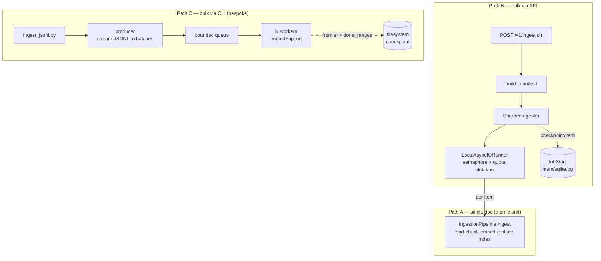
```mermaid
flowchart TD
    subgraph A["Path A — single doc (atomic unit)"]
        AP["IngestionPipeline.ingest<br/>load-chunk-embed-replace-index"]
    end
    subgraph B["Path B — bulk via API"]
        BAPI["POST /v1/ingest dir"] --> BM["build_manifest"] --> BSI["ShardedIngestor"]
        BSI --> BR["LocalAsyncIORunner<br/>semaphore + quota slot/item"]
        BR -->|per item| AP
        BSI -.checkpoint/item.-> BJS[("JobStore<br/>mem/sqlite/pg")]
    end
    subgraph C["Path C — bulk via CLI (bespoke)"]
        CS["ingest_jsonl.py"] --> CP["producer<br/>stream JSONL to batches"]
        CP --> CQ["bounded queue"]
        CQ --> CW["N workers<br/>embed+upsert"]
        CW -.frontier + done_ranges.-> CK[("filesystem<br/>checkpoint")]
    end
```

**Querying has one path and no bulk API.** `POST /v1/query` and `POST /v1/retrieve`
each serve a single query; there is no batch-query endpoint. Intra-request
concurrency is real, though: query rewriting fans out to N variants retrieved with
`asyncio.gather`, and each `HybridRetriever` call runs its dense/BM25/graph legs
concurrently. Cross-request fairness comes from the per-tenant `TenantQuota` slot and
the embedder pool's global concurrency semaphore, not from any batch mechanism. The
`search.py` CLI is likewise one query per invocation.

**Why it matters:** paths A and B share code (B is A-per-item), so they stay
consistent for free. Path C is a parallel implementation optimized for streaming and
crash-safe resume at 500k-document scale — its throughput wins are real, but it
duplicates correctness-critical logic (deterministic IDs, poison isolation, the
replace-orphan contract) that must be kept in lockstep with path A by hand. §10
quantifies that debt.

---

---

## 1. Loading & Enrichment

### Document Loading & LoaderRegistry Dispatch
**What it is:** `LoaderRegistry` is the single ingest ingress: it resolves a source path under two security guards (LFI/path-traversal confinement and a max-bytes DoS ceiling), then dispatches to a per-extension loader (`loaders.py:194-229`). It satisfies the `DocumentLoader` protocol so it drops into the pipeline in place of a bare loader.

**Algorithm / workflow:**
1. `LoaderRegistry.__init__` pre-resolves `ingest_root` to an absolute path once, stores `max_bytes` and a suffix→loader map with a default (`TextFileLoader`) (`loaders.py:204-213`).
2. Callers `register(suffix, loader)` lowercased extensions; `default_loader_registry()` wires `.pdf`→`PdfLoader`, `.txt`/`.md`→shared `TextFileLoader`, `.jsonl`→`JsonlLoader` (`loaders.py:215-216`, `237-259`).
3. `load(source)` first calls `_resolve(source)` (`loaders.py:226-227`).
4. `_resolve` calls `confine_to_root(source, self._root)` — the LFI guard: `Path(source).resolve()` collapses `..` and follows symlinks, then rejects anything that is neither equal to nor relative to the resolved root via `is_relative_to` (`loaders.py:37-47`, `218-219`). This is the single home for the check so per-file and directory-manifest paths can't drift.
5. Still in `_resolve`: reject non-files (`source not found`), then the **DoS guard** — `path.stat().st_size > self._max_bytes` (only when `max_bytes` is truthy) raises `source exceeds the maximum allowed size` (`loaders.py:220-224`).
6. Back in `load`: look up loader by resolved `path.suffix.lower()`, falling back to `_default`, and delegate `loader.load(str(path))` (`loaders.py:228-229`).
7. All failures surface as `LoaderError` with caller-safe messages that never embed raw paths or upstream exception text (`loaders.py:31-34`).

**Tools & models:** stdlib only — `pathlib.Path` (`resolve`, `is_relative_to`, `stat`, `is_file`), `uuid.uuid5` for deterministic IDs. No external services.

**Inputs → Outputs:** in: `source: str` (filesystem path). out: `list[Document]` (`ragstack.models.Document`) or raises `LoaderError`.

**Scalability & parallelization:** Fully synchronous and blocking; no asyncio, threads, or fan-out anywhere in the module. One `load()` handles one source path; concurrency (if any) is entirely the caller's responsibility. The `max_bytes` guard bounds per-file memory but the whole file is read into memory (e.g. `read_text`, all PDF pages joined). Bottleneck: single-threaded disk I/O and parsing.

**Single vs bulk:** The registry itself is per-source (one path in). Bulk is expressed two ways: (a) a directory ingest enqueues files by the `DEFAULT_INGEST_SUFFIXES` set (`loaders.py:232-234`) — each still routed through one `load()` call; (b) `.jsonl` is an intra-file batch format where one `load()` yields many `Document`s. The docstring explicitly steers multi-hundred-MB corpora away from the registry (its per-file `max_bytes` ceiling applies) toward `scripts/ingest_jsonl.py`, which streams and bypasses the ceiling (`loaders.py:246-251`).

**Diagram:**
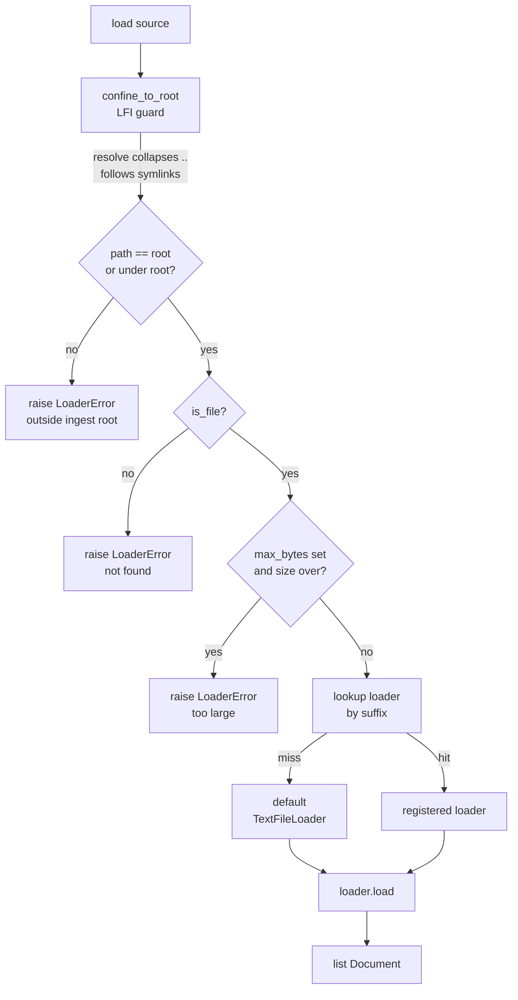
```mermaid
flowchart TD
    A[load source] --> B[confine_to_root<br/>LFI guard]
    B -->|resolve collapses ..<br/>follows symlinks| C{path == root<br/>or under root?}
    C -->|no| E[raise LoaderError<br/>outside ingest root]
    C -->|yes| D{is_file?}
    D -->|no| F[raise LoaderError<br/>not found]
    D -->|yes| G{max_bytes set<br/>and size over?}
    G -->|yes| H[raise LoaderError<br/>too large]
    G -->|no| I[lookup loader<br/>by suffix]
    I -->|miss| J[default<br/>TextFileLoader]
    I -->|hit| K[registered loader]
    J --> L[loader.load]
    K --> L
    L --> M[list Document]
```

### PDF / Text / JSONL Loaders
**What it is:** Three concrete `DocumentLoader` implementations that turn a file on disk into `Document`s, each stamping a deterministic content/path-derived ID so re-ingest overwrites in place rather than duplicating the corpus (`loaders.py:18-28`).

**Algorithm / workflow:**
- **TextFileLoader** (`loaders.py:50-63`): `path.read_text(encoding="utf-8")` → one `Document` with `metadata={"filename": path.name}` and `id = uuid5(NAMESPACE_URL, resolved_path)`.
- **PdfLoader** (`loaders.py:80-121`): lazy `import pymupdf` (raises `LoaderError` prompting the `pdf` extra if missing, `82-95`); `pymupdf.open(path)` (open failure → `LoaderError`); extract `page.get_text()` for every page (`103`); `finally: doc.close()`; join pages with `\n` and `strip()`; **empty text raises `LoaderError`** so scanned/image-only PDFs aren't silently ingested (`109-113`); emit one `Document` with `metadata={"filename", "pages": len(pages)}`.
- **JsonlLoader** (`loaders.py:124-191`): open file, iterate lines; skip blank lines; `json.loads` per line with `JSONDecodeError` swallowed so one corrupt line can't sink the corpus (`165-169`); `_document(record)` calls `enrich(record, profile)` (`178`), skips records whose `doc_type` ∈ `skip_types` (default `{EMPTY}`, `151`, `179`); ID key = resolved `record["path"]` if present else the raw text (`185`); metadata = `index_metadata(enriched)` (`189`). Empty result (no usable docs) raises `LoaderError` (`173-174`).

**Tools & models:** `pymupdf` (PyMuPDF, lazy/optional `pdf` extra) — parser only, no JS execution / no remote fetch (`loaders.py:81-87`); stdlib `json`, `pathlib`, `uuid5`. JSONL loader pulls in the whole `enrich` module.

**Inputs → Outputs:** Text/PDF: `source: str` → `list[Document]` of length 1. JSONL: `source: str` → `list[Document]` of length N (one per surviving line).

**Scalability & parallelization:** All synchronous. Text and PDF load the entire file/all pages into memory. JSONL streams the file line-by-line (constant-ish memory per line) but accumulates every resulting `Document` in a list before returning — so the returned list is the memory ceiling for a big corpus. `enrich()` runs per record serially; no batching or parallelism. Bottleneck: PDF text extraction (per-page, single-threaded) and, for JSONL, the serial per-line enrich + JSON parse.

**Single vs bulk:** `TextFileLoader`/`PdfLoader` are strictly single-document (one file → one `Document`). `JsonlLoader` is the batch entry point (one file → many `Document`s) and is the only loader that per-record skips rather than errors, tolerating malformed/empty records mid-stream.

**Diagram:**
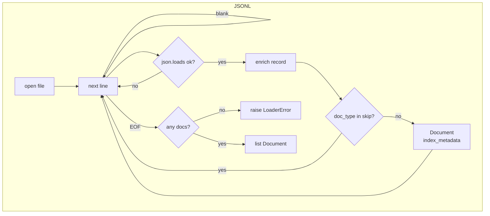
```mermaid
flowchart TD
    subgraph JSONL
    A[open file] --> B[next line]
    B -->|blank| B
    B --> C{json.loads ok?}
    C -->|no| B
    C -->|yes| D[enrich record]
    D --> E{doc_type in skip?}
    E -->|yes| B
    E -->|no| F[Document<br/>index_metadata]
    F --> B
    B -->|EOF| G{any docs?}
    G -->|no| H[raise LoaderError]
    G -->|yes| I[list Document]
    end
```

### Scholarly Enrichment
**What it is:** A pure (no I/O, no network) module that recovers scholarly metadata — DOI, title, authors, year, document class, citations — from the sparse signals that survive PDF extraction: the source path/filename, the body text, and whatever `metadata` was extracted (`enrich.py:1-17`). Publisher specifics are isolated in a frozen `PublisherProfile`.

**Algorithm / workflow (`enrich()` orchestration, `enrich.py:302-341`):**
1. Resolve `profile` (default `DEFAULT_PROFILE` = ASM, `10.1128` prefix); the `prefix=` back-compat arg does a `model_copy` overriding only `doi_prefix` (`317-319`).
2. Pull `path`, `text`, `meta` from the record with `or ""`/`or {}` guards (`320-322`).
3. `classify(path, text, profile)` → `doc_type` (`324`): empty/blank text → `EMPTY`; `/suppl/` in path or basename starts `suppl` → `SUPPLEMENT`; basename ∈ `profile.front_matter_names` → `FRONT_MATTER`; `len(text) < 1500` → `SHORT`; else `ARTICLE` (`151-167`).
4. `derive_doi(...)` → `(doi, doi_source)` — the fallback chain (`170-203`, detailed below).
5. `extract_citations(text)` only when `doc_type == ARTICLE` (`326`).
6. Build `EnrichedDoc` (`328-341`): `title` (stripped meta), `authors = parse_authors` (split on `;`/newline, `135-140`), `keywords = split_keywords` (split on `;`/`,`/newline, `143-148`), `year = derive_year` (path/DOI scanned freely; free text only fires near a copyright/received/accepted anchor, `221-235`), `abstract`, `n_citations`, `citations`.

**`derive_doi` fallback chain (`enrich.py:189-203`):** priority-ordered, returns the source tag:
1. **metadata** — if `meta_doi` is non-empty (after strip), return it with source `"metadata"` (`192-193`).
2. **filename** — strip `.pdf` from basename to get `stem`; `profile.doi_from_filename(stem)` applies the compiled `filename_doi_rule` and, on match, returns `f"{doi_prefix}/{group(1) or group(0)}"`, source `"filename"` (`194-199`, `96-107`). Default rule `_FN_DOI` matches `jvi.02415-06`-style stems (`enrich.py:47`).
3. **text** — scan first 4000 chars for `_DOI_IN_TEXT` (`10\.\d{4,9}/...`); on hit, `_trim_text_doi` strips trailing sentence punctuation and *unbalanced* trailing `)` (preserving balanced parens in DOIs like `10.1016/S0140-6736(98)01085-X`), source `"text"` (`200-202`, `206-218`).
4. **not found** — `("", "")`.

**`extract_citations` (`enrich.py:238-271`):** find a `LITERATURE CITED`/`REFERENCES`/`BIBLIOGRAPHY` header (MULTILINE); walk lines after it matching `_CITE_LINE` (`^\d{1,3}[.)] entry`); coalesce wrapped continuation lines into the current entry; flush on each new number; break when a list restart (n≤2, n < last_num−5, >3 entries collected) signals we've run past the references into e.g. a figure list; cap at 250 (`261-268`).

**`index_metadata` (`enrich.py:344-354`):** `model_dump(exclude={"citations","abstract"})` drops the heavy document-level fields, then filters out empty `""`/`[]`/`None` values so chunk payloads and the ES keyword index aren't littered. Keeps `n_citations` so a chunk still advertises how richly cited its source is.

**Tools & models:** stdlib `re` (compiled patterns for filename-DOI, in-text DOI, year, citation header/line), `pydantic` (`BaseModel`/`ConfigDict(frozen=True)` for `PublisherProfile` and `EnrichedDoc`). No models, no network, no external services — deliberately pure.

**Inputs → Outputs:** `enrich(record: dict[str,Any], *, prefix, profile) -> EnrichedDoc`. `derive_doi(path, text, meta_doi, prefix, profile) -> tuple[str,str]`. `classify(path, text, profile) -> str`. `extract_citations(text, cap) -> list[str]`. `index_metadata(EnrichedDoc) -> dict[str,Any]`.

**Scalability & parallelization:** Purely CPU-bound, synchronous, single-record functions — no concurrency in the module. Being pure/total (`enrich` always returns a record, never raises; `resolve_profile` degrades to default rather than raising, `122-132`) makes it trivially parallelizable by a caller (thread/process pool or `asyncio.to_thread`), but nothing here does so today. Cost is bounded: DOI/year text scans are capped at the first 4000 chars, citations at 250 entries — so per-record work doesn't blow up with document size. `PublisherProfile` is frozen so one shared instance is safely reused across all records without aliasing hazards (`85-89`).

**Single vs bulk:** No dual entry points — enrichment is intrinsically per-record. Bulk-ness is the caller's loop: `JsonlLoader._document` calls `enrich` per line and keeps only `index_metadata` (chunk-safe subset), while the bulk operator script is noted to additionally emit the full catalog with `citations` (`enrich.py:13-16`, `274-299`). The single split that matters is field-weight: `_HEAVY_FIELDS = {citations, abstract}` ride only in the full `EnrichedDoc`, everything else propagates to chunks via `index_metadata`.

**Diagram (DOI fallback chain):**
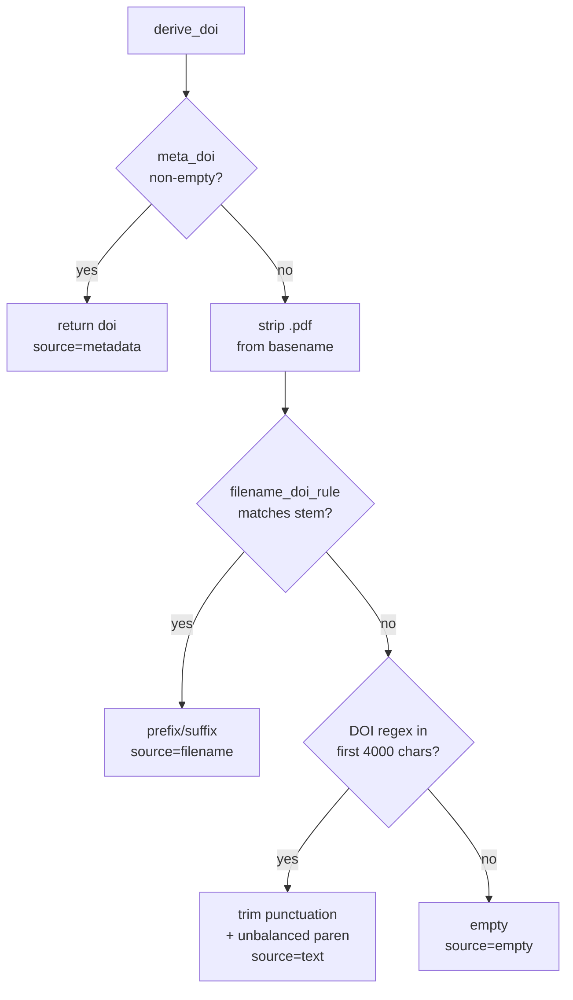
```mermaid
flowchart TD
    A[derive_doi] --> B{meta_doi<br/>non-empty?}
    B -->|yes| BR[return doi<br/>source=metadata]
    B -->|no| C[strip .pdf<br/>from basename]
    C --> D{filename_doi_rule<br/>matches stem?}
    D -->|yes| DR[prefix/suffix<br/>source=filename]
    D -->|no| E{DOI regex in<br/>first 4000 chars?}
    E -->|yes| ER[trim punctuation<br/>+ unbalanced paren<br/>source=text]
    E -->|no| FR[empty<br/>source=empty]
```

Files analyzed: `python/ragstack/ingestion/loaders.py`, `python/ragstack/ingestion/enrich.py`.

---

## 2. Chunking

### RecursiveCharacterChunker (`fixed`)
**What it is:** Character-window chunker that slides a fixed `chunk_size`-char window with `chunk_overlap`-char overlap, optionally hard-capping each emitted window to a token budget so no chunk overflows the embedder context (`chunkers.py:213-251`).
**Algorithm / workflow:**
1. `start=0`; loop while `start < len(text)`, `end = min(start+chunk_size, len(text))` (`chunkers.py:238-240`).
2. `_emit(doc, start, end)` produces chunk(s) for the span (`chunkers.py:241`).
3. If no token budget → one `_make_chunk` for the raw char span (`chunkers.py:249-250`); else `_token_split_span` splits the window losslessly to `<=max_tokens` pieces and maps each to a contiguous sub-span (`chunkers.py:251,254-275`).
4. Break if `end == len(text)`, else advance `start = end - chunk_overlap` (`chunkers.py:242-244`).
**Tools & models:** none beyond the injected `TokenCounter` (only used on the token-cap path). Pure Python string slicing.
**Inputs -> Outputs:** `Document` -> `list[Chunk]` (each with deterministic `uuid5(doc_id:start:end)` id, `start_char`/`end_char`, sliced `content`, copied metadata via `_make_chunk` `chunkers.py:43-56`).
**Scalability & parallelization:** O(n) single-threaded per document; no internal fan-out. Token-cap path uses the offset-map O(n) split (`split_text_to_token_budget`), so no O(n²) blowup. Parallelism is external (ingest-level `--chunk-concurrency` threads over docs). Bottleneck: sequential char walk plus, on the token path, one whole-window tokenization.
**Single vs bulk:** No distinct entry point — one `chunk(doc)` call per doc; bulk is just many independent calls.
**Diagram:**
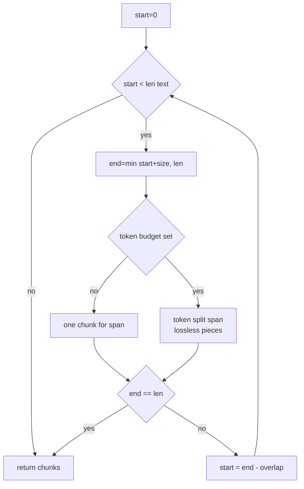
```mermaid
flowchart TD
  A[start=0] --> B{start < len text}
  B -- no --> Z[return chunks]
  B -- yes --> C[end=min start+size, len]
  C --> D{token budget set}
  D -- no --> E[one chunk for span]
  D -- yes --> F[token split span<br/>lossless pieces]
  E --> G{end == len}
  F --> G
  G -- yes --> Z
  G -- no --> H[start = end - overlap]
  H --> B
```

### SentenceChunker (`sentence`)
**What it is:** Packs whole sentences (NLTK Punkt boundaries, regex fallback) greedily into `~chunk_size`-char (or `~max_tokens`-token) chunks with sliding-window overlap, never splitting a sentence except when one sentence alone exceeds the token budget (`chunkers.py:423-467`).
**Algorithm / workflow:**
1. Empty text -> `[]`; `chunk_size == -1` -> `_whole_doc` (whole doc, token-split if budgeted) (`chunkers.py:455-458,534-542`).
2. `sentence_spans(text)` -> gapless `(start,end)` spans: try `_punkt_sentence_spans` (lazy `nltk.PunktSentenceTokenizer`, no punkt data needed), else `_fallback_sentence_spans` regex `[.!?]+["')\]]*\s+|\n{2,}`, then `_subsplit_long_spans` breaks any span > 2000 chars on newline/tab/`;`/whitespace (`chunkers.py:287-420`).
3. `_pack_spans`: greedily accumulate consecutive spans until adding the next would exceed the budget, emit `_make_chunk(cur_start, last_end)` (`chunkers.py:566-616`).
4. Overlap: `_overlap_resume` walks back accumulating trailing whole units until their char length would exceed `chunk_overlap`, always advancing ≥1 unit (`chunkers.py:545-563`).
5. Token variant `_pack_spans_tokens` has two fill modes, selected by `budget_mode`. Default `"joined"`: fill to `max_tokens` measured on the **joined** chunk text — a galloping-then-binary search over joined-prefix counts, O(log k) counter calls per chunk — then cut back to the nearest unit boundary (realised fill ~0.99-1.00). Legacy `"summed"`: pack by the running **sum** of per-unit counts, each unit tokenized in isolation; that sum over-counts the joined chunk (a BPE tokenizer merges the leading space into a word's token, which a lone word can't show) by 1.47-1.50x per word and 1.00-1.04x per sentence, so the arm under-fills to ~0.65-0.68 (words) / ~0.91-0.95 (sentence). The legacy mode is kept, not deleted, so the completed Leg A/Leg B grids stay reproducible and the study's realised-vs-nominal claim stays testable. Both modes hard-split a single over-budget sentence via `_token_split_span` and assert the never-exceed-budget invariant on the measured count.
**Tools & models:** NLTK Punkt (optional `[chunking]` extra) with regex fallback; injected `TokenCounter` on the token path.
**Inputs -> Outputs:** `Document` -> `list[Chunk]`; chunk char ranges may overlap (overlap re-emits earlier sentences), ids differ by span.
**Scalability & parallelization:** O(n) span detection + O(k) packing; on the token path the default `joined` mode costs O(log k) counter calls per chunk (memoized joined-prefix counts) and the legacy `summed` mode O(k) (memoized per-span counts), neither O(k²). No internal parallelism. Bottleneck: Punkt tokenization and (token path) per-span `count` calls. Overlap re-counting avoided via `span_tok` memo.
**Single vs bulk:** Single entry `chunk(doc)`; char vs token packing selected by `max_tokens`/`token_counter` (distinct internal path `_pack_spans` vs `_pack_spans_tokens`).

### WordChunker (`words`)
**What it is:** Same greedy packer as `SentenceChunker` but the atomic unit is a word (`\S+` run with trailing whitespace attached) instead of a sentence (`chunkers.py:492-531`).
**Algorithm / workflow:** identical to SentenceChunker steps 3-5, but units come from `word_spans` (`_WORD = re.compile(r"\S+")`, tiling gaplessly, `chunkers.py:474-489`); `chunk_size == -1` -> `_whole_doc`; empty word list -> single whole-doc chunk (`chunkers.py:517-531`). Shares `_pack_spans`/`_pack_spans_tokens`/`_overlap_resume`.
**Tools & models:** regex only; injected `TokenCounter` on the token path. No NLTK.
**Inputs -> Outputs:** `Document` -> `list[Chunk]`.
**Scalability & parallelization:** O(n) tokenize-to-words + O(k) pack; same memoized token path. No internal parallelism.
**Single vs bulk:** Single `chunk(doc)`; char vs token path as above.

**Diagram (shared sentence/word greedy packer):**
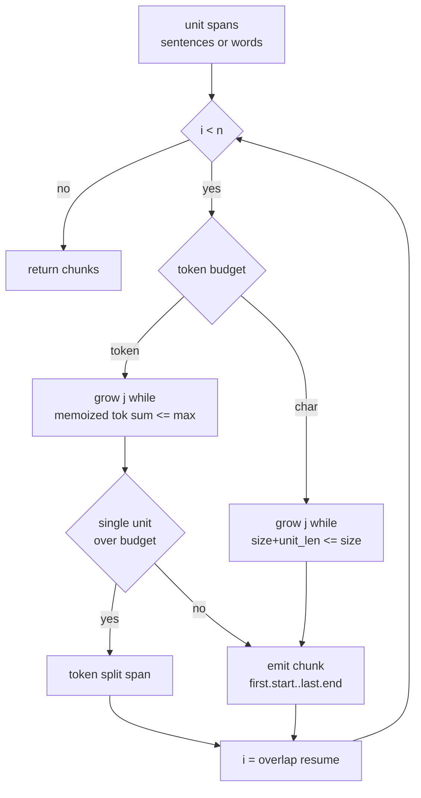
```mermaid
flowchart TD
  A[unit spans<br/>sentences or words] --> B{i < n}
  B -- no --> Z[return chunks]
  B -- yes --> C{token budget}
  C -- char --> D[grow j while<br/>size+unit_len <= size]
  C -- token --> E[grow j while<br/>memoized tok sum <= max]
  E --> F{single unit<br/>over budget}
  F -- yes --> G[token split span]
  F -- no --> H[emit chunk<br/>first.start..last.end]
  D --> H
  G --> I[i = overlap resume]
  H --> I
  I --> B
```

### FixedTokenWindowChunker (`fixed_token`)
**What it is:** A true token-*size* sliding-window chunker: tokenizes the whole doc once with the embedding model's HF fast tokenizer, slides an N-token window advancing `N-overlap` tokens, and maps each window back to exact source char offsets, trimming so the re-tokenized slice fits the window (`chunkers.py:696-796`).
**Algorithm / workflow:**
1. Construction requires an HF `TokenCounter` exposing a callable `_tokenizer` (offset mapping); a non-HF counter is rejected to avoid a silent whole-doc-chunk regression (`chunkers.py:736-746`).
2. Tokenize `text` once, `return_offsets_mapping=True, add_special_tokens=False`; `offsets` len `n` (`chunkers.py:754-756`).
3. `window=max(1,chunk_size)`, `overlap=max(0,min(chunk_overlap,window-1))` (`chunkers.py:759-760`).
4. Loop: `end_tok=min(start_tok+window,n)`, `char_start=offsets[start_tok][0]`, `char_end=offsets[end_tok-1][1]` (`chunkers.py:763-766`).
5. **Trim:** only for a full window, shrink `end_tok` by whole tokens while `count(text[char_start:char_end]) > window` — an isolated boundary re-encode can gain a merge token; stops at a single indivisible token (`chunkers.py:769-780`).
6. Emit chunk if span non-zero; advance `start_tok = max(start_tok+1, end_tok - overlap)` from the *trimmed* end so trimmed tokens are never skipped (`chunkers.py:783-792`).
7. If no chunk emitted (degenerate tail), fall back to one whole-doc chunk (`chunkers.py:794-795`).
**Tools & models:** HF `transformers` fast tokenizer of the embedding model (via `HFTokenCounter._tokenizer`). No embedding calls.
**Inputs -> Outputs:** `Document` -> `list[Chunk]`; `chunk_size`/`chunk_overlap` are **tokens** (unlike char chunkers).
**Scalability & parallelization:** O(n) tokens for the single tokenize; the trim loop re-tokenizes only a full window's slice per step (bounded, typically ≤ a few merge-token shrinks), so effectively near-linear. No internal parallelism; also reused as the SemanticChunker oversize fallback. Bottleneck: the one whole-doc HF tokenization and per-full-window trim `count` calls.
**Single vs bulk:** Single `chunk(doc)` entry; no separate bulk path.
**Diagram:**
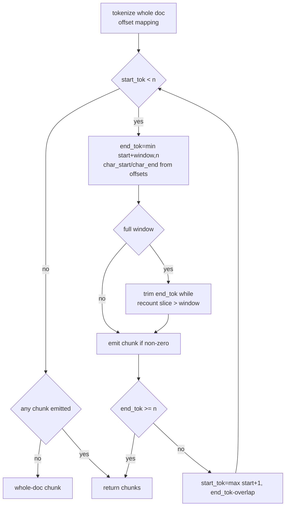
```mermaid
flowchart TD
  A[tokenize whole doc<br/>offset mapping] --> B{start_tok < n}
  B -- no --> Y{any chunk emitted}
  Y -- no --> Z2[whole-doc chunk]
  Y -- yes --> Z[return chunks]
  B -- yes --> C[end_tok=min start+window,n<br/>char_start/char_end from offsets]
  C --> D{full window}
  D -- yes --> E[trim end_tok while<br/>recount slice > window]
  D -- no --> F[emit chunk if non-zero]
  E --> F
  F --> G{end_tok >= n}
  G -- yes --> Z
  G -- no --> H[start_tok=max start+1, end_tok-overlap]
  H --> B
```

### SemanticChunker (`semantic` / `semantic_pooled`)
**What it is:** Splits a document at topic boundaries detected by embedding-similarity: it embeds per-sentence buffers, cosine-distances consecutive buffers, and places breakpoints where the distance exceeds a percentile threshold, then merges short chunks and token-caps the results (`chunkers.py:895-1149`). `semantic_pooled` is the same class with `pool_sentences=True` and `distance_round=6` (`chunkers.py:1217-1236`).
**Algorithm / workflow:**
1. `sentence_spans(text)`; empty/1-sentence -> single emit (`chunkers.py:1077-1082`).
2. **Oversize fallback (before any embed):** if `len(spans) > max_breakpoint_sentences` (default 3000), `_oversize_fallback` chunks via `FixedTokenWindowChunker` (lazily built if an HF counter exists) or a whole-doc token split — zero per-span embedding, protecting the embed fleet from a giant table doc (`chunkers.py:966-980,1084-1092,991-1020`).
3. `_buffer_embeddings` builds per-sentence buffer vectors (`chunkers.py:1042-1070`):
   - Legacy (`pool_sentences=False`): embed each overlapping buffer *text* (window up to `2*buffer_size+1` sentences), each capped by `_cap_tokens` to the breakpoint model's budget (`chunkers.py:1065-1070,1028-1040`).
   - Pooled: embed each sentence once, then `_mean_pool` the adjacent-sentence window per index — ~`(2*buffer_size+1)`× fewer tokens embedded (`chunkers.py:1057-1064,881-892`).
4. `_cosine_distance` between consecutive buffer vectors (pure Python, no numpy); optional `round(d, distance_round)` for cross-host reproducibility (`chunkers.py:1096-1101,855-862`).
5. `_breakpoint_groups`: `threshold = _percentile(distances, breakpoint_percentile_threshold)` (linear-interp, numpy-compatible), split after every distance index `> threshold` (`chunkers.py:1116-1130,865-878`).
6. Map sentence-index groups -> contiguous char spans; `_merge_short` folds chunks `< min_chunk_length` into a neighbour (`chunkers.py:1107-1110,1132-1149`).
7. `_emit` each span, token-splitting if over `max_tokens` (`chunkers.py:1112-1113,1022-1026`).
**Tools & models:** injected sync `embed_fn` (bridged from the async embedder via `SyncEmbedBridge`, backed by a vLLM/pooled embedder e.g. BGE-512 for breakpoints / SFR-4096 for storage); optional separate `breakpoint_token_counter`/`breakpoint_max_tokens`; NLTK/regex sentence splitting; pure-Python cosine/percentile/mean-pool.
**Inputs -> Outputs:** `Document` -> `list[Chunk]`. Intermediate: `list[list[float]]` buffer embeddings.
**Scalability & parallelization:** This is the embed-heavy path. Breakpoint cost scales with sentence-span count — one embed input per sentence (pooled) or per buffer window (legacy). The single `embed_fn(...)` call is fanned out concurrently by `SyncEmbedBridge` across the pooled embedder's endpoints (CPU sentence-splitting + pure-Python distance math vs GPU embedding split). Bottlenecks/limits: (a) span count → embed volume, bounded by the `max_breakpoint_sentences=3000` fallback; (b) pooled mode cuts tokens ~`(2b+1)`×; (c) pure-Python `_cosine_distance`/`_mean_pool` are O(spans·dim) on one thread — fine for prose, could matter at thousands of spans; (d) upstream fleet capped by the pool's own `max_concurrency` semaphore. External `--chunk-concurrency` runs multiple docs' chunkers in parallel threads.
**Single vs bulk:** One `chunk(doc)` per document; buffers for a whole doc go to the bridge in ONE call (then sub-batched). Distinct modes selected by `make_chunker`: `semantic` (buffer-text embed, no rounding) vs `semantic_pooled` (per-sentence embed + mean-pool + `distance_round=6`). Oversize docs divert to the `FixedTokenWindowChunker` fallback path.
**Diagram:**
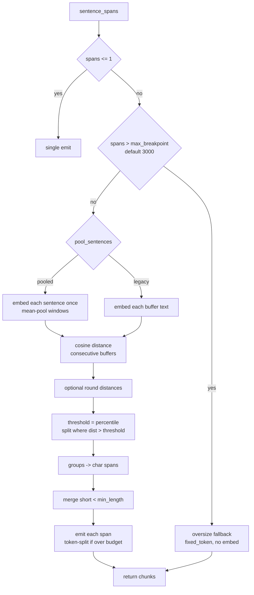
```mermaid
flowchart TD
  A[sentence_spans] --> B{spans <= 1}
  B -- yes --> Z1[single emit]
  B -- no --> C{spans > max_breakpoint<br/>default 3000}
  C -- yes --> F[oversize fallback<br/>fixed_token, no embed]
  C -- no --> D{pool_sentences}
  D -- pooled --> E1[embed each sentence once<br/>mean-pool windows]
  D -- legacy --> E2[embed each buffer text]
  E1 --> G[cosine distance<br/>consecutive buffers]
  E2 --> G
  G --> H[optional round distances]
  H --> I[threshold = percentile<br/>split where dist > threshold]
  I --> J[groups -> char spans]
  J --> K[merge short < min_length]
  K --> L[emit each span<br/>token-split if over budget]
  L --> Z[return chunks]
  F --> Z
```

### Token-budget splitting (`split_text_to_token_budget`) + TokenCounter strategies
**What it is:** A lossless routine that splits one text into substrings each `<=max_tokens`, plus the `TokenCounter` abstraction with three backends (hf / estimate / endpoint) used everywhere chunkers size or cap by tokens (`chunkers.py:177-210`, `tokenization.py`).
**Algorithm / workflow:**
1. `split_text_to_token_budget`: empty/`max_tokens<=0` guard (`chunkers.py:195-196`).
2. If the counter exposes an HF fast tokenizer (`_hf_offset_tokenizer`, `chunkers.py:69-83`), use `_split_by_offsets`: tokenize once with `return_offsets_mapping`, if `n<=max_tokens` return whole text, else carve at `budget=max(1,max_tokens-1)` tokens (one token of headroom so an isolated re-count still fits), each piece spanning contiguous char offsets, gapless — O(n) single pass (`chunkers.py:86-131,202-206`).
3. Else fall back: if `count(text) <= max_tokens` return whole, else `_split_by_estimate` — estimate chars-per-token from one full count, seek to the estimated boundary, then bounded local grow/shrink `count` calls (never re-tokenizes growing prefixes), 1-char floor for progress (`chunkers.py:134-174,208-210`).
4. `TokenCounter` backends: `HFTokenCounter` (lazy `AutoTokenizer.from_pretrained`, `encode(add_special_tokens=False)`, **the default**, exact/offline, `tokenization.py:73-98`); `EndpointTokenCounter` (sync `httpx.Client`, POST `/tokenize` to vLLM, double-checked-locked lazy client, `tokenization.py:101-148`); `EstimatingTokenCounter` (`ceil(len/2.5)`, zero-dep conservative fallback, `tokenization.py:49-70`).
5. `make_token_counter`: `hf` forces the lazy load, falling back to `endpoint` (if `base_url`) then `estimate` on failure (`tokenization.py:181-200`). `resolve_max_tokens` GETs `/v1/models` for `max_model_len`, subtracts a 16-token reserve, defaults 4096 on any failure (`tokenization.py:210-255`).
**Tools & models:** HF `transformers` AutoTokenizer; vLLM `/tokenize` and `/v1/models` HTTP endpoints; `httpx`.
**Inputs -> Outputs:** `(text, max_tokens, TokenCounter) -> list[str]` that concatenates back to `text` exactly. `TokenCounter.count(str) -> int`.
**Scalability & parallelization:** HF offset path is O(n) single pass — a multi-million-char blob splits in seconds (the docstring notes this replaced an O(n²) prefix-rescan). Estimate path is bounded-local, not O(n²). No internal parallelism; `EndpointTokenCounter` reuses one lock-guarded `httpx.Client` and is safe under `ThreadPoolExecutor` (multiple chunk threads share it). Bottleneck: the one whole-text tokenization (HF) or repeated network `/tokenize` round-trips (endpoint — the slowest backend).
**Single vs bulk:** One function, no bulk variant; called per span/window across all chunkers.
**Diagram:**
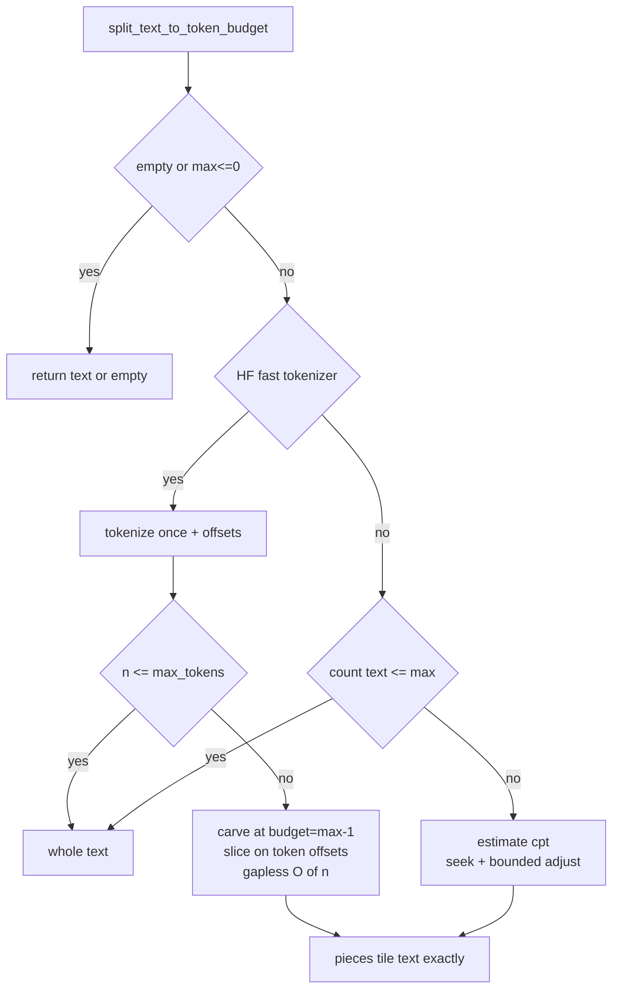
```mermaid
flowchart TD
  A[split_text_to_token_budget] --> B{empty or max<=0}
  B -- yes --> Z1[return text or empty]
  B -- no --> C{HF fast tokenizer}
  C -- yes --> D[tokenize once + offsets]
  D --> E{n <= max_tokens}
  E -- yes --> Z2[whole text]
  E -- no --> F[carve at budget=max-1<br/>slice on token offsets<br/>gapless O of n]
  C -- no --> G{count text <= max}
  G -- yes --> Z2
  G -- no --> H[estimate cpt<br/>seek + bounded adjust]
  F --> Z[pieces tile text exactly]
  H --> Z
```

### SyncEmbedBridge (sub-batch fan-out)
**What it is:** A synchronous bridge that lets the sync SemanticChunker call the async `Embedder`: it owns a dedicated background event loop and, for a whole document's buffers, fans them out into fixed-size sub-batches dispatched concurrently so a pooled embedder spreads them across all vLLM endpoints (`embed_bridge.py`).
**Algorithm / workflow:**
1. `__call__(texts)` -> `_ensure_loop` lazily starts one daemon thread running `loop.run_forever` (guarded by a lock) (`embed_bridge.py:70-86,113-116`).
2. Submit `_embed(list(texts))` via `run_coroutine_threadsafe`, block on `fut.result()` — safe because it runs on a *different* loop/thread than the caller's main loop (`embed_bridge.py:114-116`).
3. `_embed`: lazily build a dedicated `httpx.AsyncClient` + embedder on the bridge loop (avoids cross-loop client binding `RuntimeError`) (`embed_bridge.py:88-93`).
4. If `batch_size<=0` or `n<=batch_size` -> single `embedder.embed(texts)` (identical to pre-fan-out) (`embed_bridge.py:96-98`).
5. Else split into `ceil(n/batch_size)` sub-batches, `asyncio.gather` them concurrently, then re-concatenate **in input order** so vectors/distances/chunk ids stay byte-identical to a single call (`embed_bridge.py:99-111`).
6. `close()` shuts the client down on its own loop, stops the loop, joins the thread (`embed_bridge.py:118-137`).
**Tools & models:** `asyncio`, `httpx.AsyncClient`, the injected `Embedder` (typically `PooledEmbedder` over N vLLM replicas). Default `batch_size=64`.
**Inputs -> Outputs:** `Sequence[str]` -> `list[list[float]]`, order-preserving.
**Scalability & parallelization:** This is the fan-out mechanism. A single `embedder.embed(buffers)` would land on ONE endpoint (idling N-1 GPUs); the sub-batch `asyncio.gather` lets the pool route each batch least-loaded across the whole fleet. Total in-flight is still bounded by the pool's own `max_concurrency` semaphore. Bottleneck: with one endpoint configured only request count changes, not throughput; the single background loop/thread serializes only the coroutine scheduling, not the concurrent HTTP.
**Single vs bulk:** Inherently bulk — one call carries a whole doc's buffers; single-buffer or tiny docs (`n<=batch_size`) take the single-call fast path. One bridge instance is shared across docs.
**Diagram:**
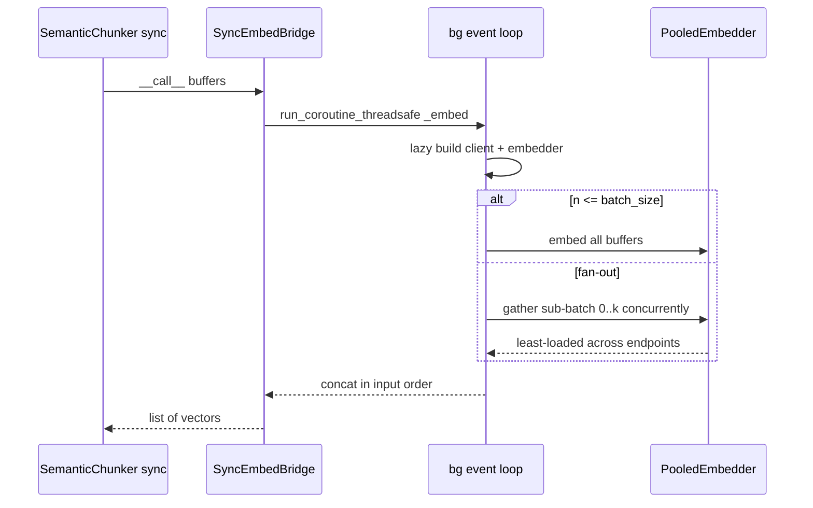
```mermaid
sequenceDiagram
  participant CH as SemanticChunker sync
  participant BR as SyncEmbedBridge
  participant LP as bg event loop
  participant PL as PooledEmbedder
  CH->>BR: __call__ buffers
  BR->>LP: run_coroutine_threadsafe _embed
  LP->>LP: lazy build client + embedder
  alt n <= batch_size
    LP->>PL: embed all buffers
  else fan-out
    LP->>PL: gather sub-batch 0..k concurrently
    PL-->>LP: least-loaded across endpoints
  end
  LP-->>BR: concat in input order
  BR-->>CH: list of vectors
```

### SegmentationCache
**What it is:** A content-addressed, append-only JSONL cache of per-document chunk *spans* that makes semantic segmentation reproducible despite embedding jitter and skips the expensive breakpoint embed on any re-run of already-segmented content (`segmentation_cache.py`).
**Algorithm / workflow:**
1. `config_fingerprint(**parts)` -> stable JSON string of the segmentation config (chunk method, buffer/percentile/min-length, token budgets, breakpoint model); any change yields a new cache key (`segmentation_cache.py:33-39`).
2. `__init__` loads the whole JSONL into `_spans` (dict: sha1 key -> list of int pairs), skipping corrupt lines, then opens an append handle (`segmentation_cache.py:53-77`).
3. `_key(content)` = `sha1(fingerprint + \x00 + content)` (`segmentation_cache.py:79-84`).
4. `get_or_compute(doc, chunk_fn)`: under lock, look up key; **hit** -> rebuild chunks via `_make_chunk(doc, s, e)` from cached spans (identical `uuid5` ids, no embed) (`segmentation_cache.py:95-101`). **Miss** -> run `chunk_fn` OUTSIDE the lock (so concurrent misses on distinct docs segment in parallel), then under lock append `{"k":key,"s":spans}` and flush (`segmentation_cache.py:102-112`).
**Tools & models:** `hashlib.sha1`, `json`, `threading.Lock`, filesystem JSONL. No models.
**Inputs -> Outputs:** `(Document, chunk_fn) -> list[Chunk]`; persists only `(start,end)` int pairs (never corpus text).
**Scalability & parallelization:** Thread-safe under `--chunk-concurrency`; the expensive `chunk_fn` runs outside the lock so distinct docs segment concurrently — only the dict/file/counter mutation is serialized. Loaded fully into memory (one small entry per doc). Bottleneck: memory grows with corpus doc count; the flush-per-miss serializes writes. Biggest win is on re-ingest — a hit does zero embedding.
**Single vs bulk:** One `get_or_compute` per doc; concurrency comes from the caller running it on many threads. No separate bulk API.
**Diagram:**
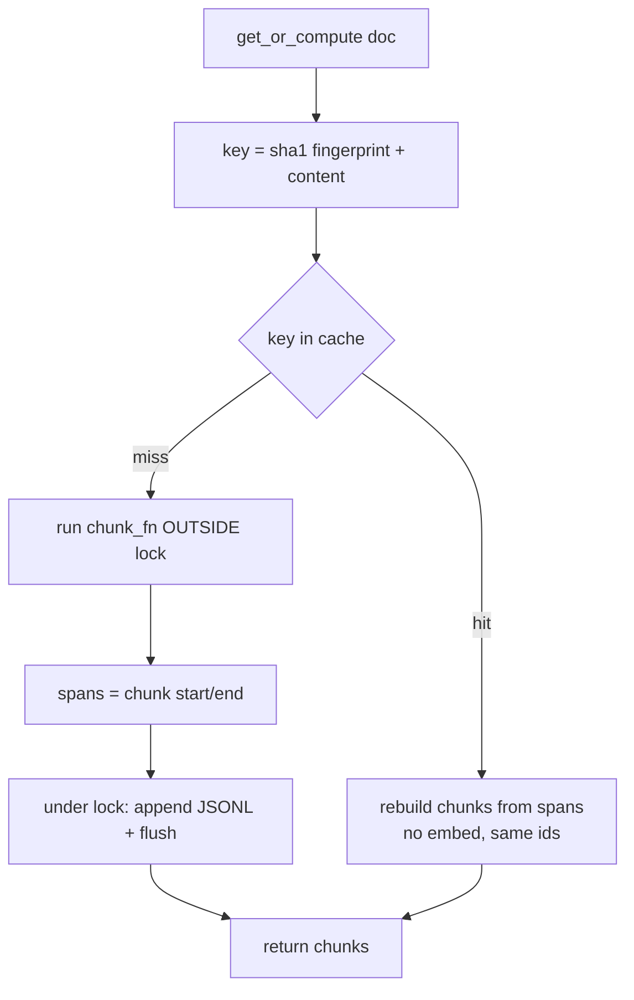
```mermaid
flowchart TD
  A[get_or_compute doc] --> B[key = sha1 fingerprint + content]
  B --> C{key in cache}
  C -- hit --> D[rebuild chunks from spans<br/>no embed, same ids]
  C -- miss --> E[run chunk_fn OUTSIDE lock]
  E --> F[spans = chunk start/end]
  F --> G[under lock: append JSONL + flush]
  G --> H[return chunks]
  D --> H
```

### link_neighbors_by_document
**What it is:** Stamps sibling-navigation metadata (`chunk_index`, `prev_chunk_id`, `next_chunk_id`) on an ordered chunk list, grouping by `doc_id` first so a mixed multi-document batch never cross-links one doc's tail to the next doc's head (`chunkers.py:804-847`).
**Algorithm / workflow:**
1. `link_neighbors_by_document(chunks)` groups chunks into `dict[doc_id, list[Chunk]]` preserving order (`chunkers.py:842-844`).
2. Per group, `link_neighbors` sets on each chunk's metadata: `chunk_index=i`, `prev_chunk_id = chunks[i-1].id` (or None), `next_chunk_id = chunks[i+1].id` (or None), using the doc-level `uuid5` id (not the tenant-prefixed store id) so links are stable across tenants and idempotent re-ingest (`chunkers.py:804-826`).
3. Returns the grouping for reuse (e.g. per-document metrics) (`chunkers.py:845-847`).
**Tools & models:** none; pure dict/list.
**Inputs -> Outputs:** `list[Chunk]` (mutated in place) -> `dict[str, list[Chunk]]`.
**Scalability & parallelization:** O(total chunks) single pass, trivial. Must be called on the FINAL stored list (after embedding drops unembeddable chunks) so a survivor's neighbour links never dangle to a quarantined chunk (`chunkers.py:829-841`). No parallelism needed.
**Single vs bulk:** Explicitly bulk-aware — `link_neighbors_by_document` handles a flattened multi-doc batch; `link_neighbors` is the per-document primitive it calls.
**Diagram:**
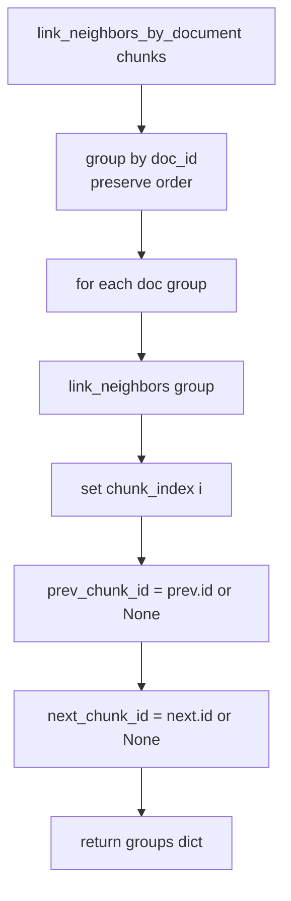
```mermaid
flowchart TD
  A[link_neighbors_by_document chunks] --> B[group by doc_id<br/>preserve order]
  B --> C[for each doc group]
  C --> D[link_neighbors group]
  D --> E[set chunk_index i]
  E --> F[prev_chunk_id = prev.id or None]
  F --> G[next_chunk_id = next.id or None]
  G --> H[return groups dict]
```

Files analyzed:
- `/Users/me/Development/dxkb/ragstack/python/ragstack/ingestion/chunkers.py`
- `/Users/me/Development/dxkb/ragstack/python/ragstack/ingestion/tokenization.py`
- `/Users/me/Development/dxkb/ragstack/python/ragstack/ingestion/segmentation_cache.py`
- `/Users/me/Development/dxkb/ragstack/python/ragstack/ingestion/embed_bridge.py`

---

## 3. Embedding & Embedder Pool

### SidecarEmbedder & OpenAIEmbedder (HTTP embedder clients)
**What it is:** Two async HTTP clients exposing a uniform `embed(texts) -> vectors` interface: `SidecarEmbedder` targets the RAGStack embedding sidecar (`POST /embed`), `OpenAIEmbedder` targets any OpenAI-compatible embeddings API (`POST /v1/embeddings`, e.g. vLLM `--runner pooling`). `make_embedder()` (embedders.py:188) selects between them by name.

**Algorithm / workflow:**
1. Construct with a shared `httpx.AsyncClient` and a `SidecarClient` wrapper (embedders.py:34, 65).
2. `SidecarEmbedder.embed`: POST `{"texts": texts}` to `embed`, return `body["embeddings"]` verbatim — order is trusted (embedders.py:44-46).
3. `OpenAIEmbedder.embed`: build headers, add `Authorization: Bearer <key>` if `api_key` set (embedders.py:78-80); POST `{"model": ..., "input": texts}` to `v1/embeddings` (embedders.py:81-85).
4. **Index reordering:** the OpenAI response `data` array is re-sorted by each item's `index` field before extracting embeddings, because some OpenAI-compatible servers (notably some vLLM builds) do not preserve input order; a silent reorder would bind vectors to the wrong chunks (embedders.py:86-90).
5. `make_embedder`: `api="sidecar"` → `SidecarEmbedder`; `api="openai"` → requires `model` else `ValueError`; unknown → `ValueError` (embedders.py:197-206).

**Tools & models:** `httpx.AsyncClient`; `ragstack.sidecar_http.SidecarClient` / `DEFAULT_TIMEOUT` (embedders.py:19). External services: RAGStack embedding sidecar; any OpenAI-embeddings server (vLLM pooling, OpenAI, Together). Model is caller-supplied (e.g. `Salesforce/SFR-Embedding-Mistral`, embedders.py:203); the sidecar path carries no model name.

**Inputs -> Outputs:** `list[str]` -> `list[list[float]]`.

**Scalability & parallelization:** No internal parallelism — one HTTP request per `embed` call, `await`ed. Both are pure async so many concurrent `embed` calls can run on one event loop, but batching/fan-out is delegated upward to `BatchingEmbedder`/`PooledEmbedder`. Bottleneck: a single unbounded request sends **all** texts at once (embedders.py:45, 83), which overflows backend max-batch/context on large inputs — the exact problem `BatchingEmbedder` exists to fix.

**Single vs bulk:** No distinction — the signature is always a list; a "single" text is a one-element list. Same code path regardless of count.

**Diagram:**
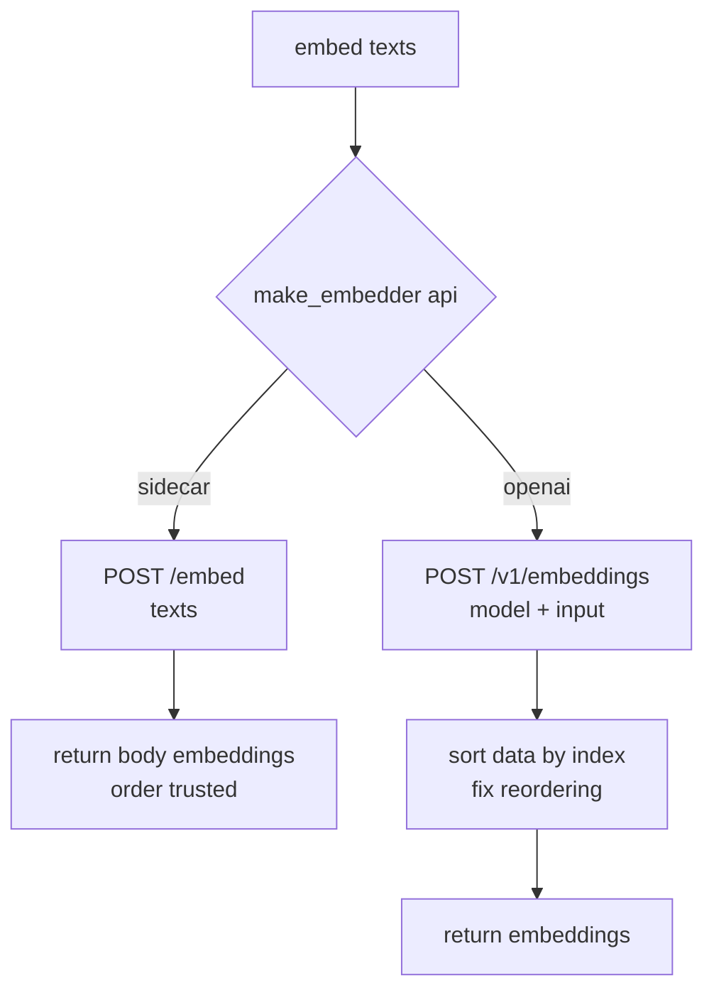
```mermaid
flowchart TD
  A[embed texts] --> B{make_embedder api}
  B -->|sidecar| C[POST /embed<br/>texts]
  B -->|openai| D[POST /v1/embeddings<br/>model + input]
  C --> E[return body embeddings<br/>order trusted]
  D --> F[sort data by index<br/>fix reordering]
  F --> G[return embeddings]
```

### BatchingEmbedder — bounded batching + poison-isolation bisection
**What it is:** A decorator over any embedder that splits a large text list into item- and token-bounded batches, and — via `embed_isolated` — bisects a failing batch to quarantine a single unembeddable input rather than losing the whole document. Infra failures (5xx/network) are always re-raised, never quarantined (embedders.py:93-106).

**Algorithm / workflow:**
1. `_batches` (embedders.py:124-138): greedily walk indices, estimating tokens as `len(text)//chars_per_token + 1` (embedders.py:121-122, default 4 chars/token). Start a new group when the current group hits `max_batch_items` (default 64) **or** adding the next text would exceed `max_batch_tokens` (default 8192). Returns lists of input indices, preserving order.
2. `embed` (embedders.py:140-145): for each group, call `self._base.embed([...])` sequentially and `extend` output. All-or-nothing — any exception propagates.
3. `embed_isolated` (embedders.py:147-160): pre-fill `out` with `None` sized to `texts`; for each group call `_embed_group`, accumulating a `quarantined` count. Returns `(vectors_with_None_holes, quarantined)`.
4. `_embed_group` (embedders.py:162-185): try `base.embed(group)`; on success scatter vectors into `out` at original indices via `zip(..., strict=True)`.
5. **Bisection on failure:** catch `httpx.HTTPStatusError`; read status. If status is `None` or **not** 4xx (i.e. 5xx/other) → **re-raise** (embedders.py:172-173). If it's a 4xx (bad input) and the group is a **single** index → log and quarantine, return 1 (embedders.py:174-178). Otherwise split at `mid = len//2` and recurse on both halves, summing quarantine counts (embedders.py:179-182). This binary-searches the poison input in O(log n) failing calls per bad item.

**Tools & models:** Pure Python + `httpx.HTTPStatusError` for status classification (embedders.py:167-168). No models; wraps an inner embedder.

**Inputs -> Outputs:** `embed`: `list[str] -> list[list[float]]`. `embed_isolated`: `list[str] -> tuple[list[list[float] | None], int]` (vectors aligned to input with `None` for quarantined slots; count of quarantined).

**Scalability & parallelization:** **Not parallelized** — batches run in a sequential `for` loop (embedders.py:143-144, 158-159); bisection recursion is also sequential (embedders.py:180-182). Scalability win is *request shaping*, not concurrency: it bounds each request so the backend isn't overwhelmed and one bad input can't fail a whole document. Bottleneck: per-batch latency is serialized; throughput = sum of batch round-trips. Fan-out/concurrency is deferred entirely to `PooledEmbedder` underneath. Token estimation is deliberately crude — it only bounds request size (embedders.py:105-106).

**Single vs bulk:** One class, two entry points: `embed` (strict, all-or-nothing — normal path) vs `embed_isolated` (fault-tolerant, used by the ingest backstop). A single text still flows through `_batches` (one group of one).

**Diagram:**
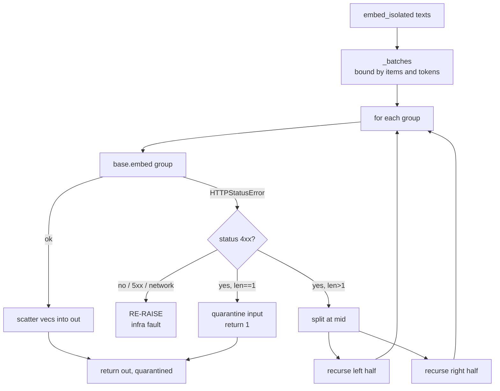
```mermaid
flowchart TD
  A[embed_isolated texts] --> B[_batches<br/>bound by items and tokens]
  B --> C[for each group]
  C --> D[base.embed group]
  D -->|ok| E[scatter vecs into out]
  D -->|HTTPStatusError| F{status 4xx?}
  F -->|no / 5xx / network| G[RE-RAISE<br/>infra fault]
  F -->|yes, len==1| H[quarantine input<br/>return 1]
  F -->|yes, len>1| I[split at mid]
  I --> J[recurse left half]
  I --> K[recurse right half]
  J --> C
  K --> C
  E --> L[return out, quarantined]
  H --> L
```

### PooledEmbedder — multi-endpoint routing, backpressure & failover
**What it is:** Fans embedding requests across multiple backend endpoints (e.g. vLLM replicas on H200s) with least-loaded selection, a global concurrency cap for backpressure, per-endpoint health tracking, and failover. It satisfies the same `Embedder` protocol so it drops in behind `BatchingEmbedder` exactly like a single embedder (embed_pool.py:1-9, 41-56).

**Algorithm / workflow:**
1. **Construct** (embed_pool.py:58-75): require ≥1 endpoint; build an `asyncio.Semaphore(max_concurrency)` (default 8), record `health_interval` (default 30s), seed `_last_health = now` so the first probe waits a full interval rather than firing immediately, and create a `_health_lock`. Each `Endpoint` (embed_pool.py:29-38) is `__slots__` with `embedder`, `health_url`, optimistic `healthy=True`, and live `active=0` counter.
2. **`embed`** (embed_pool.py:77-120): first `await _maybe_refresh_health()` **outside** the semaphore, so a slow probe round never holds a backpressure permit hostage (embed_pool.py:78-80).
3. Acquire the semaphore (`async with self._sem`) — this is the global in-flight cap / backpressure (embed_pool.py:81).
4. **Failover loop**, up to `len(endpoints)` attempts (embed_pool.py:84): `_select(tried)` picks an endpoint; if `None`, break.
5. **Least-loaded selection** (`_select`, embed_pool.py:172-179): filter to healthy, not-yet-tried endpoints; if none healthy, fall back to any not-yet-tried endpoint (a stale health flag shouldn't strand a request); return `min` by `active` count.
6. Increment `ep.active` (embed_pool.py:88), then `await ep.embedder.embed(texts)`; on success return immediately (embed_pool.py:90). `finally` decrements `active` (embed_pool.py:118-119).
7. **Error classification** on `httpx.HTTPError | OSError` (embed_pool.py:91-96): extract status if `HTTPStatusError`.
   - **Non-retriable 4xx** (4xx not in `{408,425,429}`, embed_pool.py:26) → `raise` immediately: it's a bad input, fails the same on every endpoint, so propagate for `BatchingEmbedder` to quarantine (embed_pool.py:97-103).
   - **5xx / network** (`status is None or >= 500`) → set `ep.healthy = False` (**demote**) (embed_pool.py:108-109).
   - **Retriable 4xx** (429/408/425) → do **not** demote (busy ≠ down), just fail over (embed_pool.py:104-110).
   - Record `last_exc`, add `id(ep)` to `tried`, log, continue loop (embed_pool.py:110-117).
8. If loop exhausts all endpoints → `raise RuntimeError("all embedding endpoints failed") from last_exc` (embed_pool.py:120).
9. **`embed_isolated`** (embed_pool.py:122-170): mirrors `BatchingEmbedder.embed_isolated` for the pooled path. Calls `self.embed`; only a genuine bad-input 4xx surfaces as `HTTPStatusError` (pool routes non-retriable 4xx straight through), which it bisects to quarantine; `RuntimeError`/retriable errors are **not** caught and propagate so `--resume`/`--batch-retries` re-feed with no data loss (embed_pool.py:147-170).
10. **Lazy health re-probe** (`_maybe_refresh_health`, embed_pool.py:181-188): double-checked locking — if `now - _last_health < health_interval` return early; else acquire `_health_lock`, re-check the condition inside the lock, run `check_health()`, update `_last_health`. Ensures only one probe round per interval even under concurrent `embed` calls.
11. **`check_health`** (embed_pool.py:190-200): `asyncio.gather` a `probe` coroutine per endpoint — GET `health_url` with 5s timeout, set `healthy = (status==200)`; on `HTTPError/OSError` set `healthy=False`. This is where a recovered endpoint rejoins the rotation.

**Tools & models:** `asyncio` (Semaphore, Lock, gather), `time.monotonic` for the interval clock, `httpx.AsyncClient` (shared, for both embedding calls and health GETs). `make_pooled_embedder` (embed_pool.py:203-227) reuses `make_embedder` per endpoint and builds each `health_url` by appending `health_path` (default `/health`, suits sidecar and vLLM) to the base URL. External: the vLLM/sidecar replica fleet.

**Inputs -> Outputs:** `embed`: `list[str] -> list[list[float]]`. `embed_isolated`: `list[str] -> tuple[list[list[float] | None], int]`. `check_health`: side-effect on endpoint `healthy` flags.

**Scalability & parallelization:** This is the scaling layer. **Fan-out:** concurrent `embed` calls (issued from above) are spread across endpoints by least-loaded routing, and the `active` counter makes routing load-aware in real time. **Backpressure:** the global `Semaphore(max_concurrency=8)` caps total in-flight embedding requests fleet-wide, so a large ingest can't open unbounded concurrent calls (embed_pool.py:81) — this is the primary throughput governor. **Health probes** are themselves fully parallel via `asyncio.gather` (embed_pool.py:200). Health refresh runs **outside** the semaphore to avoid stealing a permit (embed_pool.py:78-80). Bottleneck / limits: `max_concurrency` caps aggregate throughput regardless of fleet size; a single `embed` call is still one request to one endpoint (no intra-request sharding — that's `BatchingEmbedder`'s job); the failover loop is sequential per request (tries endpoints one at a time, not racing them). `active` mutation is unguarded but safe under a single-threaded event loop.

**Single vs bulk:** No single-vs-bulk fork inside the class — every `embed`/`embed_isolated` takes a list. The single-vs-pool decision is made *above*: per the module docstring, "with one endpoint configured the plain single-endpoint embedder is used instead" (embed_pool.py:6-8). Two entry points as with the batcher: `embed` (strict, failover) vs `embed_isolated` (fault-tolerant bisection over the fan-out).

**Diagram (routing + failover):**
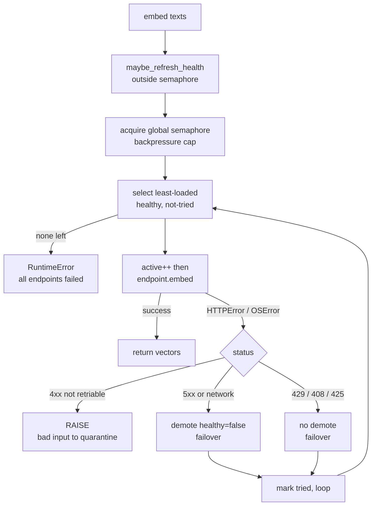
```mermaid
flowchart TD
  A[embed texts] --> B[maybe_refresh_health<br/>outside semaphore]
  B --> C[acquire global semaphore<br/>backpressure cap]
  C --> D[select least-loaded<br/>healthy, not-tried]
  D -->|none left| Z[RuntimeError<br/>all endpoints failed]
  D --> E[active++ then<br/>endpoint.embed]
  E -->|success| R[return vectors]
  E -->|HTTPError / OSError| F{status}
  F -->|4xx not retriable| G[RAISE<br/>bad input to quarantine]
  F -->|5xx or network| H[demote healthy=false<br/>failover]
  F -->|429 / 408 / 425| I[no demote<br/>failover]
  H --> J[mark tried, loop]
  I --> J
  J --> D
```

**Diagram (lazy health re-probe):**
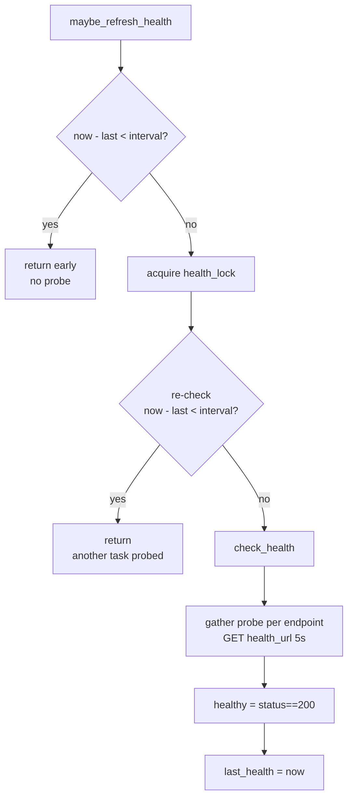
```mermaid
flowchart TD
  A[maybe_refresh_health] --> B{now - last < interval?}
  B -->|yes| C[return early<br/>no probe]
  B -->|no| D[acquire health_lock]
  D --> E{re-check<br/>now - last < interval?}
  E -->|yes| F[return<br/>another task probed]
  E -->|no| G[check_health]
  G --> H[gather probe per endpoint<br/>GET health_url 5s]
  H --> I[healthy = status==200]
  I --> J[last_health = now]
```

Source files: `/Users/me/Development/dxkb/ragstack/python/ragstack/embedders.py`, `/Users/me/Development/dxkb/ragstack/python/ragstack/embed_pool.py`.

---

## 4. Single-document Ingestion Pipeline

### Document Ingestion Pipeline (single-doc atomic unit)
**What it is:** `IngestionPipeline.ingest` (`ingestion/pipeline.py:55`) is the end-to-end atomic unit that turns one source string into stored, retrievable chunks across the vector store, text index, and (optionally) the knowledge graph. It is the reused building block: bulk ingestion (`ShardedIngestor`) calls this exact method once per document (`ingestion/sharded.py:91`), so a 1-doc request and a 500k-doc manifest share one code path.

**Algorithm / workflow:**
1. **Load.** `self.loader.load(source)` returns `list[Document]` (`pipeline.py:62`). A single source may expand to multiple `Document`s.
2. **Chunk (in a worker thread).** For each doc, `await asyncio.to_thread(self.chunker.chunk, doc)` (`pipeline.py:68`). Chunkers are synchronous and `SemanticChunker` blocks on a bridged embed round-trip, so `to_thread` keeps the event loop responsive. Every chunk gets a deterministic `id = uuid5(NAMESPACE_URL, "{doc.id}:{start_char}:{end_char}")` (`chunkers.py:39-40`) — the linchpin of idempotent re-ingest.
3. **Stamp tenant.** `chunk.metadata["tenant_id"] = tenant_id` on every chunk (`pipeline.py:69-70`); `produced` records the pre-embed count (`pipeline.py:71`).
4. **Embed (poison-isolated).** Build `texts` from chunk content; if the embedder exposes `embed_isolated` (duck-typed via `getattr`, `pipeline.py:77`), call `await embed_isolated(texts)` → `(vectors, quarantined)` where a poison input is `None` rather than failing the doc (`pipeline.py:79`). Otherwise fall back to plain `embed` with `quarantined=0` (`pipeline.py:81`).
5. **Drop quarantined.** Zip chunks with vectors (`strict=True`); skip `None` vectors, set `chunk.embedding` on survivors into `kept` (`pipeline.py:83-88`); log a warning if any were quarantined (`pipeline.py:89-92`); `all_chunks = kept`.
6. **Link neighbors on survivors.** `link_neighbors_by_document(all_chunks)` (`pipeline.py:98`) groups by `doc_id` and stamps `chunk_index`/`prev_chunk_id`/`next_chunk_id` (`chunkers.py:804-847`) — done *after* the embed drop so a survivor's neighbor chain never dangles to a quarantined chunk, and grouping prevents cross-document links in a mixed batch.
7. **EmptyIngest guard.** If `not all_chunks`, raise `EmptyIngestError` *before* any delete (`pipeline.py:105-109`). This is the "never delete prior data without a replacement" invariant — an empty/all-quarantined re-ingest must not silently wipe the previously-stored version.
8. **Replace-old (delete-by-doc).** For each doc: `vector_store.delete(doc.id, tenant_id=...)`, `text_index.delete(doc.id, ...)`, and if configured `graph_store.delete_by_doc(doc.id, ...)` (`pipeline.py:118-122`). Deterministic ids make a byte-identical re-ingest overwrite in place, but an *edited* doc yields shifted spans → new ids, so old chunks must be deleted or they orphan. This runs only after a successful embed (a transient embed failure raises at step 4).
9. **Index (upsert-then... actually delete-then-upsert here).** `vector_store.upsert(all_chunks)` then `text_index.index(all_chunks)` (`pipeline.py:125-126`). Qdrant upsert scopes each point id by tenant via `_point_id = uuid5(NAMESPACE_URL, "{tenant}:{chunk_id}")` (`stores/qdrant.py:135,250-253`) and raises if any chunk lacks an embedding (`qdrant.py:120-121`).
10. **Optional KG extraction hook.** If both `kg_extractor` and `graph_store` are set: `triples = await kg_extractor.extract(all_chunks)`, stamp `triple.tenant_id` on each (`pipeline.py:129-134`), then `graph_store.add_triples(triples)` (`pipeline.py:135`).
11. **Return** `[c.id for c in all_chunks]` — the surviving chunk ids (`pipeline.py:137`).

**Ordering nuance (upsert-then-prune vs. delete-then-upsert):** the *pipeline* itself uses **delete-old-then-upsert-new** (steps 8→9), safe because the delete only runs after a successful embed. The complementary **upsert-then-prune** ordering the protocols document (`delete_except` called *after* upsert so a failure can't lose data — `protocols.py:45-50, 74-79`) is a store-level primitive; `ingest` does not call `delete_except` (it deletes the whole doc up front), but the same "replacement must exist before old data is destroyed" principle governs both.

**Tools & models:** stdlib `asyncio` (`to_thread`), `logging`; `uuid.uuid5` for deterministic chunk + point ids. Injected collaborators (protocol-typed, `pipeline.py:37-53`): `DocumentLoader`, `Chunker`, `Embedder` (concretely `BatchingEmbedder`/`PooledEmbedder` wrapping `SidecarEmbedder` BGE or `OpenAIEmbedder`/vLLM, e.g. SFR-Embedding-Mistral), `VectorStore` (`QdrantVectorStore`), `TextIndex` (Elasticsearch/BM25), optional `GraphStore` (Neo4j) + `KGExtractor`. External services: embedding sidecar/vLLM over HTTP, Qdrant, ES, Neo4j.

**Inputs → Outputs:** In: `source: str`, `tenant_id: str` (default `DEFAULT_TENANT`). Out: `list[str]` of surviving chunk ids. Side effects: points in Qdrant, docs in ES, triples in Neo4j. Raises `EmptyIngestError` on no embeddable chunks; re-raises infra (5xx/network) errors from the embedder.

**Scalability & parallelization:** Within a single `ingest` call the work is **largely sequential** — the per-document chunk loop `await`s each doc in turn (`pipeline.py:64-68`, one `to_thread` at a time, no `gather`), and load/embed/delete/upsert/index run in strict sequence. Parallelism lives *below and above* this method: the `Embedder` batches (`BatchingEmbedder._batches`, item- and token-bounded, `embedders.py:124-138`) and, when a `PooledEmbedder` is used, fans batches across a fleet; poison isolation bisects failing 4xx batches recursively (`embedders.py:162-185`). Above, `ShardedIngestor` runs whole documents concurrently (`sharded.py:64-67`, `backend.run_shards`) with a per-tenant concurrency slot (`self._quota.slot`, `sharded.py:90`) so one tenant can't monopolize the embedding fleet. **Bottleneck:** the embedding round-trip (network + GPU) dominates; the sequential per-doc chunk loop and the single-request Qdrant `upsert`/ES `index` (one call for all of a doc's chunks, `qdrant.py:140`) are secondary. Throughput is limited by embedding fleet capacity, per-tenant quota slots, and shard concurrency — not by this method's own structure.

**Single vs bulk:** The algorithm is **identical**; only the entry point differs. Single-doc: `IngestionPipeline.ingest` called directly (or as a 1-item manifest). Bulk: `ShardedIngestor.ingest_manifest` (`sharded.py:39`) → `partition` into shards → `_run_shard` → `_ingest_item` (`sharded.py:86`) which wraps the *same* `pipeline.ingest` in a quota slot and try/except so one bad doc yields a `FAILED` `ItemResult` instead of aborting the shard (`sharded.py:92-99`). The API background worker `_run_ingest` (`api/routers/documents.py:42`) treats a single file as a 1-item manifest (`documents.py:52`), and job status is `failed` only if the run errors or *every* item fails (`_final_status`, `documents.py:38-39`) — so an `EmptyIngestError` from one doc records a failed item while leaving the prior corpus intact.

**Diagram:**

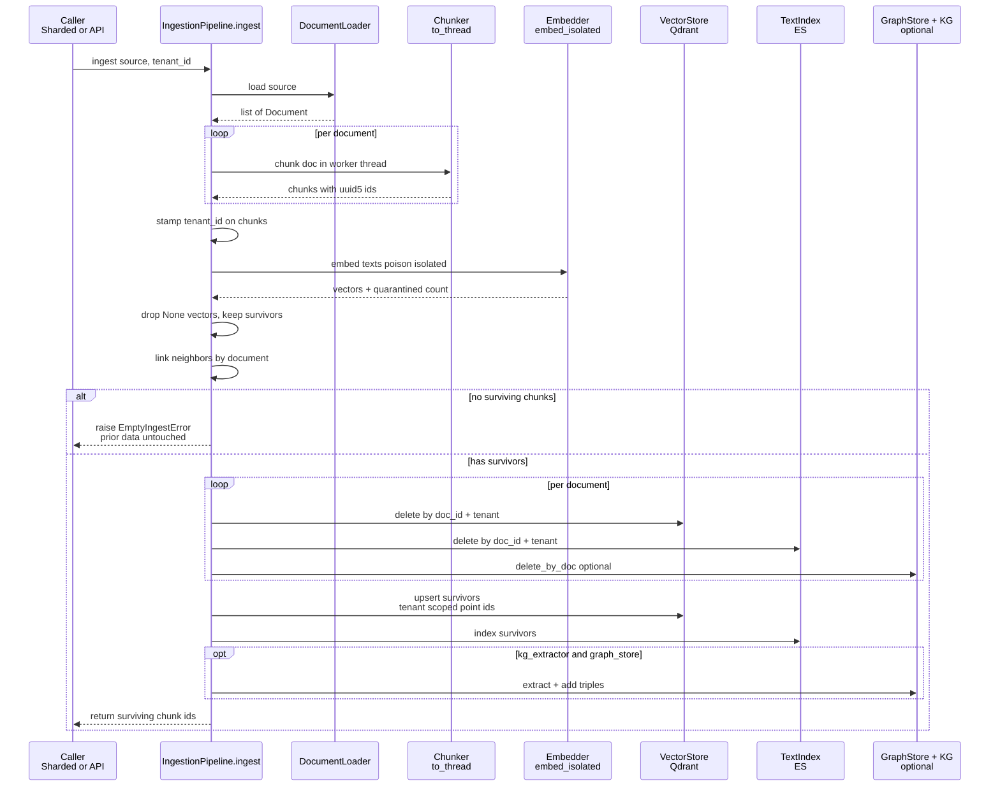
```mermaid
sequenceDiagram
    participant C as Caller<br/>Sharded or API
    participant P as IngestionPipeline.ingest
    participant L as DocumentLoader
    participant K as Chunker<br/>to_thread
    participant E as Embedder<br/>embed_isolated
    participant V as VectorStore<br/>Qdrant
    participant T as TextIndex<br/>ES
    participant G as GraphStore + KG<br/>optional

    C->>P: ingest source, tenant_id
    P->>L: load source
    L-->>P: list of Document
    loop per document
        P->>K: chunk doc in worker thread
        K-->>P: chunks with uuid5 ids
    end
    P->>P: stamp tenant_id on chunks
    P->>E: embed texts poison isolated
    E-->>P: vectors + quarantined count
    P->>P: drop None vectors, keep survivors
    P->>P: link neighbors by document
    alt no surviving chunks
        P-->>C: raise EmptyIngestError<br/>prior data untouched
    else has survivors
        loop per document
            P->>V: delete by doc_id + tenant
            P->>T: delete by doc_id + tenant
            P->>G: delete_by_doc optional
        end
        P->>V: upsert survivors<br/>tenant scoped point ids
        P->>T: index survivors
        opt kg_extractor and graph_store
            P->>G: extract + add triples
        end
        P-->>C: return surviving chunk ids
    end
```

Key file references: `/Users/me/Development/dxkb/ragstack/python/ragstack/ingestion/pipeline.py`, `/Users/me/Development/dxkb/ragstack/python/ragstack/ingestion/sharded.py`, `/Users/me/Development/dxkb/ragstack/python/ragstack/ingestion/chunkers.py`, `/Users/me/Development/dxkb/ragstack/python/ragstack/embedders.py`, `/Users/me/Development/dxkb/ragstack/python/ragstack/stores/qdrant.py`, `/Users/me/Development/dxkb/ragstack/python/ragstack/api/routers/documents.py`.

---

## 5. Bulk / Sharded Ingestion

### Sharded manifest ingestion (`ShardedIngestor` + `LocalAsyncIORunner` + `JobStore` resume)

**What it is:** The library-level bulk path that turns a file-or-directory source into an immutable manifest of work items and runs each item through the full single-document `IngestionPipeline` under bounded concurrency, with per-item resume via a `JobStore`. This is what the API's `/v1/ingest` endpoint drives; a single file is just a 1-item manifest, so the single-doc and 500k-doc cases share one code path (`sharded.py:6-7`).

**Algorithm / workflow:**
1. **Build manifest** — `build_manifest(source, suffixes, ingest_root)` (`manifest.py:52`). A directory is walked with `rglob("*")`, sorted for determinism, and filtered by suffix set (`manifest.py:68-72`). Each file is re-confined to `ingest_root` (LFI guard, because `rglob` follows symlinks) and its `item_id` is derived from the confined resolved path via `deterministic_doc_id` so manifest ids equal stored document ids (`manifest.py:83-88`). Escaping symlinks are skipped, not enumerated (`manifest.py:85-87`).
2. **Resume filter (optional)** — if a `job_store` and `job_id` are set, `ingest_manifest` registers all items as pending via `add_items` (idempotent), reads `completed_item_ids`, and drops already-completed items from the work list (`sharded.py:53-62`).
3. **Partition** — `partition(items, shard_size)` slices the remaining items into shards of at most `shard_size` (default 64) (`backends.py:22-26`, `sharded.py:64`).
4. **Run shards** — the `IngestBackend` (`LocalAsyncIORunner`) runs shards via `asyncio.gather`, each shard wrapped in `async with sem` on an `asyncio.Semaphore(max_concurrency)` (default 4) so total in-flight shards are bounded (`backends.py:53-61`). `return_exceptions=True` means a shard whose processor raises wholesale is not fatal: every item in it is recorded `FAILED` and the run continues (`backends.py:64-73`).
5. **Per-shard sequential processing** — `_run_shard` iterates items *sequentially* within a shard; after each item it calls `mark_item` to checkpoint the outcome (`sharded.py:69-84`).
6. **Per-item ingest** — `_ingest_item` acquires a `TenantQuota.slot(tenant_id)` (per-tenant concurrency cap so one tenant can't monopolize the shared embedding fleet, `quota.py:28`), then calls `self._pipeline.ingest(item.source, tenant_id=...)` which runs load→chunk→embed→link→replace→index (`pipeline.py:55-137`). Per-item exceptions are caught and returned as a `FAILED` `ItemResult` with only the exception class name as the error label (`sharded.py:86-105`).

**Tools & models:** `asyncio` (semaphore + gather); Pydantic models (`WorkItem`, `Manifest`, `ItemResult`); `JobStore` backends — `InMemoryJobStore`, `SqliteJobStore` (stdlib sqlite3 in WAL, run under `asyncio.to_thread`), `PostgresJobStore` (asyncpg pool, the multi-writer "500k checkpoint of record") (`jobstore.py:231-517`); `TenantQuota` (per-tenant `asyncio.Semaphore`). The actual embedding/store work lives in the injected `IngestionPipeline` (embedder, `QdrantVectorStore`, text index, optional graph/KG).

**Inputs → Outputs:** In: `source: str` (path), optional `suffixes`, `ingest_root`, `job_id`, `tenant_id`. Out: `list[ItemResult]` (one per *processed* item — resumed-skipped items are excluded), each carrying `item_id/source/status/chunk_ids/error`. Side effect: per-item rows durably marked in the `JobStore`.

**Scalability & parallelization:** Parallelized across shards via `asyncio.gather` under a semaphore (`backends.py:53-61`); default breadth is only 4 shards × 64 items. Note items *within* a shard run serially (`sharded.py:73`), so intra-shard latency is not hidden — parallelism is shard-granular, not item-granular. Bottleneck is the shared embedding fleet; the `TenantQuota` semaphore is the throttle that keeps one tenant from saturating it. The `IngestBackend` protocol is an explicit seam so a Parsl/k8s runner (one task = one shard) can replace `LocalAsyncIORunner` for cluster scale-out without touching the pipeline (`backends.py:1-8`, `29-35`).

**Single vs bulk:** *One code path, size-parameterized* — a single file becomes a 1-item manifest and flows through the identical partition→run_shards machinery (`sharded.py:6-7`, `documents.py:51-52`). The only single-vs-bulk branch is cosmetic: `_run_ingest` surfaces `chunk_ids` on the response only when `len(results) == 1` (back-compat), otherwise callers poll `item_counts` (`documents.py:79-80`). Entry point: `ShardedIngestor.ingest_manifest`; API wrapper: `_run_ingest` → `background_tasks.add_task` (`documents.py:42-81`, `134`).

**Diagram:**
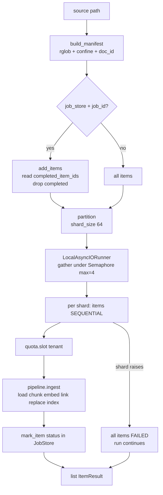
```mermaid
flowchart TD
  A[source path] --> B[build_manifest<br/>rglob + confine + doc_id]
  B --> C{job_store + job_id?}
  C -->|yes| D[add_items<br/>read completed_item_ids<br/>drop completed]
  C -->|no| E[all items]
  D --> F[partition<br/>shard_size 64]
  E --> F
  F --> G[LocalAsyncIORunner<br/>gather under Semaphore max=4]
  G --> H[per shard: items SEQUENTIAL]
  H --> I[quota.slot tenant]
  I --> J[pipeline.ingest<br/>load chunk embed link replace index]
  J --> K[mark_item status in JobStore]
  H -->|shard raises| L[all items FAILED<br/>run continues]
  K --> M[list ItemResult]
  L --> M
```

---

### Bulk JSONL ingestion (`ingest_jsonl.py`): bounded producer→worker→coordinator pipeline with crash-safe frontier + out-of-order resume

**What it is:** The operator CLI for large pre-extracted JSONL dumps (hundreds of MB) that exceed the API's per-file size guard. It *streams* the file at constant memory, enriches scholarly metadata, chunks, embeds in batches, and upserts to Qdrant (+ optional Elasticsearch), with a crash-safe line-number checkpoint that survives out-of-order batch completion (`ingest_jsonl.py:2-8`, `531`). This is the true bulk engine — it does **not** go through `ShardedIngestor`/`IngestionPipeline`; it reimplements the load→chunk→embed→upsert loop with a hand-rolled concurrent pipeline.

**Algorithm / workflow (the `--index` path, `run()` at `ingest_jsonl.py:531`):**
1. **Setup** — resolve doc-type filter, publisher profile, chunker (`make_chunker`), token counter/budget (auto-detected from the endpoint's `max_model_len`), optional semantic breakpoint embedder via `SyncEmbedBridge`, optional segmentation cache (`ingest_jsonl.py:532-661`).
2. **Read checkpoint** — `_open_checkpoint_paths` loads `{line, doc_types, done_ranges}`; a resume under a *different* `--doc-types` is rejected fail-closed (`ingest_jsonl.py:227-235`). Index vs catalog-only passes use separate default checkpoints so a cheap `--no-index` run can't advance the expensive run's frontier (`ingest_jsonl.py:209-219`).
3. **Probe + ensure stores** — one-text embed probe sizes the vector dim; `QdrantVectorStore.ensure_collection`, optional `ElasticsearchTextIndex.ensure_index` (`ingest_jsonl.py:702-713`).
4. **Spawn workers** — `concurrency` (`--concurrency`, default 1) `worker()` tasks read from a bounded `asyncio.Queue(maxsize=concurrency*2)` (`ingest_jsonl.py:723-895`).
5. **Producer loop** (`ingest_jsonl.py:976-1031`) streams `_iter_records`; per record it skips lines `<= start_line`, enriches, then classifies:
   - **filtered** → `("skip", …)` appended to `inflight` (`ingest_jsonl.py:983-993`)
   - **#65 resume fast-path** — `_line_covered(line_no, start_line, resume_done_ranges)` true → `("resume", …)`: skip chunk+embed+upsert entirely, buffer only the cheap catalog row (`ingest_jsonl.py:994-1009`)
   - **chunk** → `asyncio.create_task(_chunk_task(doc))` and `("chunk", …)` appended (`ingest_jsonl.py:1010-1024`).
   The window `inflight` deque is drained oldest-first via `_fold` whenever it exceeds `window = chunk_concurrency + 1` (`ingest_jsonl.py:1026-1027`).
6. **Chunk fan-out** — `_chunk_task` runs `chunker.chunk` (or `seg_cache.get_or_compute`) under `asyncio.to_thread` gated by `chunk_sem = Semaphore(chunk_concurrency)` so up to `--chunk-concurrency` docs chunk at once (`ingest_jsonl.py:915-922`).
7. **Coordinator `_fold`** (`ingest_jsonl.py:924-966`) is the single file-order serializer: called oldest-first, it awaits each chunk task, folds chunks into `buf`, and assigns `seq`/`buf_start_line`/`buf_end_line` — *only ever inside `_fold`* — so seq is strictly monotonic in file order regardless of which chunk task finished first (`ingest_jsonl.py:906-910`). When `buf` reaches `--batch-size`, it `queue.put`s `(seq, start, end, buf, cat_rows, doc_info)` and resets buffers (`ingest_jsonl.py:958-966`).
8. **Worker `_store_batch`** (`ingest_jsonl.py:749-781`): `_embed_drop_bad` (quarantines over-context chunks via `embed_isolated`), `link_neighbors_by_document`, **upsert-first** (deterministic uuid5 ids → idempotent, no delete-before-upsert), optional `--replace` prune-by-id after upsert under `delete_sem`.
9. **Retry** — on a transient error (`ragstack.ingestion.retry.is_transient_error` walks `__cause__`/`__context__` for timeouts/5xx/pool-fail phrases) the batch retries up to `--batch-retries` with jittered exponential backoff `retry_delay` (1s,2s,4s… cap 30s, ±25% so co-failing workers don't retry in lockstep); a 4xx/bad-input is non-transient and surfaces immediately.
10. **Frontier advance under lock** (`ingest_jsonl.py:849-891`): worker records `completed[seq] = (end_line, cat_rows)`, then drains the *contiguous* prefix `while next_seq in completed`, writing catalog rows in seq order, advancing `frontier_line`. `_trim_below` drops now-subsumed `done_ranges`. If this batch finished *above* a still-open gap, `_union_range` records its `[start_ln,end_line]` interval in `done_ranges` (the #65 out-of-order record). `_write_checkpoint` atomically persists `{frontier_line, doc_types, done_ranges}` (tmp+rename).
11. **Failure handling** — a batch that exhausts retries is appended to `failed` and *left out of `completed`*, so the frontier stalls at the gap and its lines enter neither the frontier nor `done_ranges` — guaranteeing `--resume` re-feeds them (no data loss) (`ingest_jsonl.py:829-848`). At end, a non-empty `failed` list forces `SystemExit(1)` (`ingest_jsonl.py:1084-1090`).
12. **Shutdown** — producer sends one `None` sentinel per worker and `asyncio.gather`s them; a producer exception cancels pending chunk tasks first (`ingest_jsonl.py:1039-1051`). On a clean finish (`next_seq == seq`) the checkpoint advances over trailing skipped lines (`ingest_jsonl.py:1060-1061`).

**Tools & models:** `asyncio` (bounded `Queue`, two `Semaphore`s, `Lock`, `to_thread`, `create_task`, `gather`); `httpx.AsyncClient`; `make_embedder`/`make_pooled_embedder` (single vs multi-endpoint fan-out, `ingest_jsonl.py:296-303`); `QdrantVectorStore`, `ElasticsearchTextIndex`; `make_chunker` incl. semantic methods via `SyncEmbedBridge`; `make_token_counter` (HF AutoTokenizer / endpoint `/tokenize` / estimate) + `resolve_max_tokens`; `enrich`/`index_metadata`/`resolve_profile`; `SegmentationCache`. Atomic checkpoint via `tmp.write_text` + `tmp.replace` (`ingest_jsonl.py:186-194`).

**Inputs → Outputs:** In: a JSONL file (one `{text, path, metadata}` per line) plus a large CLI arg surface. Out (side effects): Qdrant upserts (+ ES); `<input>.ckpt` JSON checkpoint; optional `--catalog-out` JSONL (full enriched metadata, written in strict seq/frontier lockstep so it never gets ahead of the resume point, `ingest_jsonl.py:860-861`); optional `--doc-metrics-out` per-doc JSONL and `--run-metrics-out` per-file summary. Process exit code 0/1.

**Scalability & parallelization:** Genuinely concurrent on three axes: `--concurrency` embed+upsert workers, `--chunk-concurrency` concurrent `chunk()` calls (each fanning breakpoint embeds across the pool), and multi-URL embedder fan-out (`PooledEmbedder` least-loaded + failover). Memory is bounded on arbitrarily large inputs by (a) streaming `_iter_records`, (b) `queue maxsize = concurrency*2`, and (c) the `window = chunk_concurrency + 1` cap on pending chunk tasks/results (`ingest_jsonl.py:727`, `968-969`). Bottleneck is the embedding fleet throughput; the checkpoint's single `lock` serializes only the fast frontier bookkeeping, not the embed/upsert. A persistently-stuck early batch caps `done_ranges` growth via `_trim_below` but stalls the frontier by design.

**Single vs bulk — this is the crux.** The API `/v1/ingest` **single/small path** (`documents.py` → `ShardedIngestor` → `IngestionPipeline.ingest`) processes *whole documents* as the unit: load→chunk→embed→delete-then-upsert per doc, resume keyed on `item_id` (= doc id) in a `JobStore` table, item-granular parallelism, and it *deletes prior chunks before upsert* inside a per-doc replace (`pipeline.py:118-126`). The **bulk JSONL path** is a different engine with three distinct roles:
- **Producer** (single, the `for line_no, record` loop): streams + enriches + classifies + dispatches chunk tasks, never blocks on embedding (`ingest_jsonl.py:976-1031`).
- **Coordinator `_fold`** (single, file-order serializer): the *only* place `seq`/batch-line bounds are assigned, guaranteeing monotonic file order despite out-of-order chunk completion (`ingest_jsonl.py:906-910`, `924-966`).
- **Workers** (`--concurrency` of them): embed+upsert *batches of chunks spanning multiple docs* in parallel, with in-process transient retry and the crash-safe frontier (`ingest_jsonl.py:783-893`).

Key differences from the single path: (1) unit of work is a **cross-document chunk batch**, not a document; (2) resume keys on **line number + `done_ranges`**, not per-doc job rows; (3) **upsert-first, no delete-before-upsert** (deterministic ids overwrite; `--replace` prunes by id *after*, avoiding the data-loss window the pipeline's delete-then-upsert has if a delete lands but upsert times out, `ingest_jsonl.py:762-781`); (4) constant-memory streaming vs loading a doc's chunks in one shot. Entry points differ entirely: `ingest_jsonl.run()` (CLI, `asyncio.run`) vs `ShardedIngestor.ingest_manifest` (library/API).

**Diagram — producer→worker + checkpoint frontier:**
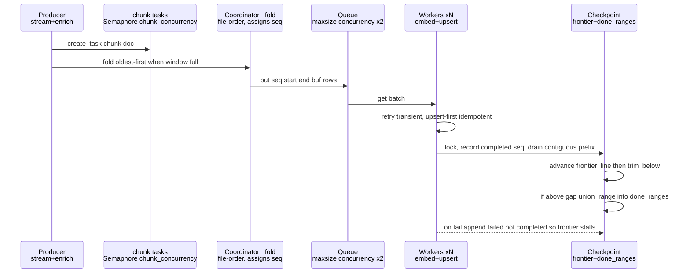
```mermaid
sequenceDiagram
  participant P as Producer<br/>stream+enrich
  participant CT as chunk tasks<br/>Semaphore chunk_concurrency
  participant F as Coordinator _fold<br/>file-order, assigns seq
  participant Q as Queue<br/>maxsize concurrency x2
  participant W as Workers xN<br/>embed+upsert
  participant CK as Checkpoint<br/>frontier+done_ranges
  P->>CT: create_task chunk doc
  P->>F: fold oldest-first when window full
  F->>Q: put seq start end buf rows
  Q->>W: get batch
  W->>W: retry transient, upsert-first idempotent
  W->>CK: lock, record completed seq, drain contiguous prefix
  CK->>CK: advance frontier_line then trim_below
  CK->>CK: if above gap union_range into done_ranges
  W-->>CK: on fail append failed not completed so frontier stalls
```

**Diagram — #65 done_ranges resume-skip:**
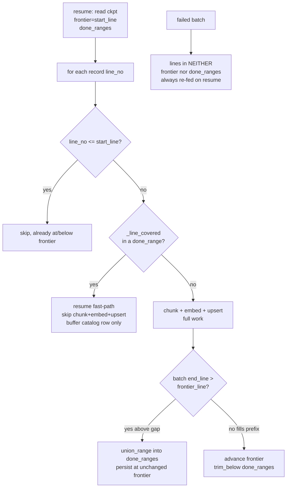
```mermaid
flowchart TD
  A[resume: read ckpt<br/>frontier=start_line<br/>done_ranges] --> B[for each record line_no]
  B --> C{line_no <= start_line?}
  C -->|yes| D[skip, already at/below frontier]
  C -->|no| E{_line_covered<br/>in a done_range?}
  E -->|yes| F[resume fast-path<br/>skip chunk+embed+upsert<br/>buffer catalog row only]
  E -->|no| G[chunk + embed + upsert<br/>full work]
  G --> H{batch end_line ><br/>frontier_line?}
  H -->|yes above gap| I[union_range into done_ranges<br/>persist at unchanged frontier]
  H -->|no fills prefix| J[advance frontier<br/>trim_below done_ranges]
  K[failed batch] --> L[lines in NEITHER<br/>frontier nor done_ranges<br/>always re-fed on resume]
```

Relevant files (all absolute):
- `/Users/me/Development/dxkb/ragstack/python/ragstack/ingestion/manifest.py`
- `/Users/me/Development/dxkb/ragstack/python/ragstack/ingestion/backends.py`
- `/Users/me/Development/dxkb/ragstack/python/ragstack/ingestion/sharded.py`
- `/Users/me/Development/dxkb/ragstack/python/ragstack/ingestion/pipeline.py` (single-doc pipeline the sharded path calls)
- `/Users/me/Development/dxkb/ragstack/python/ragstack/jobstore.py` (resume backends)
- `/Users/me/Development/dxkb/ragstack/python/ragstack/quota.py` (per-tenant slot)
- `/Users/me/Development/dxkb/ragstack/python/scripts/ingest_jsonl.py`
- `/Users/me/Development/dxkb/ragstack/python/ragstack/api/routers/documents.py` (`/v1/ingest` single wrapper)

---

## 6. Retrieval & RRF Fusion

### Hybrid Retrieval
**What it is:** `HybridRetriever` fans a query out across three independent retrieval legs — dense vector search, BM25 sparse text search, and optional graph-neighborhood expansion — all tenant-scoped, then fuses them into one ranked list via RRF (`retriever.py:11-57`).

**Algorithm / workflow:**
1. Embed the query into a single vector: `query_vectors = await self.embedder.embed([query])`, taking `query_vectors[0]` (`retriever.py:40`). Note the embedder receives a one-element batch even for a single query.
2. Dense leg: `await self.vector_store.search(query_vectors[0], top_k=top_k*2, filters=filters)` — fetches **2× top_k** candidates (`retriever.py:41-43`).
3. Sparse/BM25 leg: `await self.text_index.search(query, top_k=top_k*2, filters=filters)` — also **2× top_k** (`retriever.py:46`).
4. Assemble `ranked_lists = [vector_results, bm25_results]` (`retriever.py:48`).
5. If `use_graph` and a `graph_store` is configured, call `_graph_context(query, top_k, tenant_id)` and append its chunks as a third ranked list only if non-empty (`retriever.py:51-54`).
6. Fuse: `fused = self.rrf.fuse(ranked_lists)` (`retriever.py:56`).
7. Truncate to `top_k` and return: `return fused[:top_k]` (`retriever.py:57`). The 2× over-fetch per leg widens the candidate pool before the final cut.

**Tools & models:** Protocol-typed collaborators, not concrete classes (`retriever.py:7`, injected via `__init__` at `retriever.py:17-29`): `VectorStore` (e.g. Qdrant), `TextIndex` (e.g. Elasticsearch/BM25), `GraphStore` (e.g. Neo4j), an `embedder` (typed loosely as `object`, `retriever.py:21`; concretely `SidecarEmbedder`/`OpenAIEmbedder` per CLAUDE.md), and `RRFScorer` for fusion. No models are loaded in this file — all model work happens behind the injected protocols/sidecars.

**Inputs -> Outputs:** In: `query: str`, `top_k: int=5`, `filters: dict|None`, `use_graph: bool=True`, `tenant_id: str|None` (`retriever.py:31-38`). Out: `list[ScoredChunk]` of length ≤ `top_k`, each with `retrieval_method="hybrid"` (score set by RRF at `scorers.py:43`).

**Scalability & parallelization:** **Not parallelized today.** Although `retrieve` is `async`, the three legs are `await`ed sequentially (`retriever.py:40-52`) — the embed→vector call, then BM25, then graph each block the next. There is **no `asyncio.gather`, no semaphore, no thread-pool, no fan-out** anywhere in the file. Wall-clock latency is the *sum* of the legs, so the slowest backend (often the graph neighborhood query, or the embed round-trip) dominates. Because it's I/O-bound async, many *concurrent queries* still interleave fine on one event loop; the missed win is intra-query concurrency — wrapping the three independent awaits in `asyncio.gather` would collapse latency to the max of the legs. The `top_k*2` over-fetch (`retriever.py:42,46`) is a constant-factor cost on each backend, not a scaling limit. Throughput ceiling is set by the injected backends (Qdrant/ES/graph) and the embedder sidecar, not by this orchestration code.

**Single vs bulk:** **Single-query only.** There is exactly one entry point, `retrieve()`, and it takes a scalar `query: str` — no batch/bulk variant exists in this class. Even so, it calls `embedder.embed([query])` with a list of one (`retriever.py:40`), so the batch-capable embedder API is used at batch size 1. Bulk retrieval would require the caller to loop or `gather` over multiple `retrieve()` calls; the class itself offers no fan-in over many queries.

**Diagram:**
```mermaid
flowchart TD
    Q[query, top_k, filters<br/>use_graph, tenant_id] --> E[embedder.embed<br/>batch of 1]
    E --> V[vector_store.search<br/>top_k times 2]
    Q --> B[text_index.search<br/>BM25 top_k times 2]
    Q --> G{use_graph<br/>and graph_store?}
    G -->|yes| GC[_graph_context<br/>depth 1, tenant scoped]
    G -->|no| SKIP[skip graph leg]
    V --> L[ranked_lists]
    B --> L
    GC -->|if non-empty| L
    SKIP --> L
    L --> F[rrf.fuse]
    F --> C[slice to top_k]
    C --> OUT[list of ScoredChunk<br/>method hybrid]
```
Note: arrows show data dependencies, not concurrency — legs execute sequentially in source order (`retriever.py:40-52`).

### RRF Fusion (RRFScorer.fuse)
**What it is:** Reciprocal Rank Fusion merges multiple ranked lists into one without needing score normalization, by summing a rank-based reciprocal weight per chunk across all lists (`scorers.py:15-46`).

**Algorithm / workflow:**
1. Init two dicts keyed by chunk id: `scores: dict[str,float]` and `chunks: dict[str,Chunk]` (`scorers.py:35-36`).
2. Outer loop over each ranked list; inner loop over `(rank, scored)` via `enumerate` so `rank` is 0-based (`scorers.py:37-38`).
3. For each chunk, accumulate: `scores[cid] = scores.get(cid, 0.0) + 1.0/(self.k + rank + 1)` (`scorers.py:40`). **The exact formula is `1 / (k + rank + 1)`** with `k = 60` by default (`scorers.py:23`); the `+1` converts the 0-based `rank` to a 1-based rank, so this is the standard RRF `1/(k + rank_1based)`. A chunk appearing in multiple legs has its contributions **summed**, which is what rewards cross-leg agreement.
4. Store the chunk object under its id for later reconstruction (`scorers.py:41`); last write wins if the same id appears in multiple lists (content assumed identical per id).
5. Sort chunk ids by accumulated score descending: `sorted(scores.items(), key=lambda x: x[1], reverse=True)` (`scorers.py:44`).
6. Emit `ScoredChunk(chunk, score, retrieval_method="hybrid")` in that order (`scorers.py:42-45`). Note: `fuse` returns the **full** fused list — the caller (`retriever.py:57`) does the `top_k` cut, not `fuse`.

The constant `k=60` dampens the influence of exact rank position (a large `k` flattens the reciprocal curve so top ranks aren't wildly dominant); it's set once in `__init__` (`scorers.py:23`) and is the only tunable.

**Tools & models:** Pure Python — no libraries, no models, no I/O. Just dict accumulation and a `sorted()` call (`scorers.py:33-46`). (The separate `score()` method at `scorers.py:26-31` is a trivial fallback that assigns `1/(k+i+1)` by input order and is not used by the hybrid path.)

**Inputs -> Outputs:** In: `ranked_lists: list[list[ScoredChunk]]` (`scorers.py:33`) — the incoming `ScoredChunk.score` values are **ignored**; only list position matters. Out: `list[ScoredChunk]` sorted by fused RRF score descending, each tagged `retrieval_method="hybrid"`.

**Scalability & parallelization:** Synchronous, single-threaded, in-memory. Cost is O(N log N) where N is the total number of chunks across all lists (linear accumulation + one `sorted`). Not parallelized and doesn't need to be — the input lists are tiny (`top_k*2` each, so ~2×top_k per leg, a few dozen items). It's never the bottleneck; the upstream backend calls dominate. No streaming or chunking of the fusion itself.

**Single vs bulk:** One code path. `fuse` handles any number of input lists uniformly (2 lists without graph, 3 with) — there's no separate single vs bulk fusion variant. It fuses one query's leg-results per call; there is no batched multi-query fusion.

**Diagram:**
```mermaid
flowchart TD
    IN[ranked_lists] --> LoopL[for each ranked list]
    LoopL --> LoopR[for rank, chunk<br/>via enumerate]
    LoopR --> W[weight = 1 / k + rank + 1<br/>k = 60]
    W --> ACC[scores of cid<br/>plus equals weight]
    ACC --> STORE[chunks of cid = chunk]
    STORE --> LoopR
    LoopR --> LoopL
    LoopL --> SORT[sort by score desc]
    SORT --> OUT[list of ScoredChunk<br/>method hybrid]
```

### Graph-Context Expansion (_graph_context)
**What it is:** An optional retrieval leg that pulls the 1-hop entity neighborhood for the query out of the knowledge graph and turns each returned triple into a synthetic, fixed-score chunk (`retriever.py:59-87`).

**Algorithm / workflow:**
1. Call `await self.graph_store.query_neighborhood(query, depth=1, tenant_id=tenant_id)` — a **depth-1** (single-hop) neighborhood query, tenant-scoped (`retriever.py:70-72`).
2. Take the first `top_k` triples: `for triple in triples[:top_k]` (`retriever.py:74`). Note it slices by `top_k`, not `top_k*2` like the other two legs.
3. For each triple, synthesize content by concatenating the SPO: `content = f"{triple.subject} {triple.predicate} {triple.object}"` (`retriever.py:75`).
4. Wrap it in a `ScoredChunk` with a deterministic synthetic id `graph-{subject}-{predicate}-{object}`, `doc_id=triple.doc_id`, a **hard-coded `score=0.5`**, and `retrieval_method="graph"` (`retriever.py:76-86`). The 0.5 is inert — RRF ignores incoming scores and uses only rank position (`scorers.py:40`), so the triples' *order* from the graph store is what matters.
5. Return the list; the caller appends it as a third RRF leg only if it's non-empty (`retriever.py:53-54,87`).

**Tools & models:** The injected `GraphStore` protocol (`retriever.py:7`, e.g. Neo4j) via `query_neighborhood`; `Chunk`/`ScoredChunk` models (`Chunk` imported lazily inside the method, `retriever.py:68`). No embeddings or model inference in this leg — it's a pure graph lookup + string formatting.

**Inputs -> Outputs:** In: `query: str`, `top_k: int`, `tenant_id: str|None` (`retriever.py:59-61`). The `tenant_id` scopes the graph read to the caller's triples plus the shared `public` corpus; `None` reads unscoped for dev/tests/unauthenticated, matching the other legs (`retriever.py:62-67`). Out: `list[ScoredChunk]` (length ≤ `top_k`) of synthetic SPO chunks tagged `retrieval_method="graph"`, all with `score=0.5`.

**Scalability & parallelization:** One `await` to the graph store, then a tight in-memory loop over ≤`top_k` triples — trivial CPU. Not parallelized; as part of the hybrid path it runs sequentially after the vector and BM25 legs (`retriever.py:52`), so it *adds* to end-to-end latency rather than overlapping. The cost/limit lives entirely in `graph_store.query_neighborhood` (graph traversal at depth 1); a deeper traversal or a hot entity with a large neighborhood would be the scaling risk, but this code caps output at `top_k` after the fact (so it fetches potentially many triples then slices).

**Single vs bulk:** Single-query only — one `query` string, one neighborhood call. No batch entry point; bulk would mean repeated calls by the orchestrator.

**Diagram:**
```mermaid
flowchart TD
    IN[query, top_k, tenant_id] --> QN[graph_store.query_neighborhood<br/>depth 1, tenant scoped]
    QN --> SL[take first top_k triples]
    SL --> LOOP[for each triple]
    LOOP --> C[content = subject predicate object]
    C --> SC[ScoredChunk<br/>synthetic id, score 0.5<br/>method graph]
    SC --> LOOP
    LOOP --> OUT[list of ScoredChunk]
    OUT --> APP[appended as 3rd RRF leg<br/>only if non-empty]
```

**Key cross-cutting note:** The single most impactful observation across all three: the three retrieval legs at `retriever.py:40-52` are independent but executed **sequentially** — no `asyncio.gather`. This is the clearest latency win available and the main scalability gap in `HybridRetriever`.

Relevant files:
- `/Users/me/Development/dxkb/ragstack/python/ragstack/retrieval/retriever.py`
- `/Users/me/Development/dxkb/ragstack/python/ragstack/scoring/scorers.py`

---

## 7. Rewriting, Reranking, Answer Generation

### Multi-strategy query expansion + concurrent retrieve + RRF fuse
**What it is:** The `/v1/query` (and single-variant `/v1/retrieve`) path expands a user query into retrieval variants via pluggable rewriters (passthrough / multiquery / HyDE), retrieves each variant concurrently, and fuses the ranked lists with Reciprocal Rank Fusion before optional reranking. Improves recall by casting a wider net per query.

**Algorithm / workflow:**
1. `query()` scopes filters to the tenant and calls `_expand_query(query, rewrite_strategies, rewriters)` (`query.py:257`).
2. `_expand_query` seeds `variants=[query]` and iterates requested strategy names (`query.py:43-45`); unknown/unavailable strategies are skipped via `rewriters.get(name) is None` (`query.py:47-48`) — e.g. `multiquery`/`hyde` are absent from the registry when no LLM is configured (`deps.py:254-257`).
3. Each rewriter's `rewrite(query)` is awaited; `asyncio.CancelledError` re-raised, any other exception logged and skipped so retrieval degrades to the plain query (`query.py:49-54`).
4. `PassthroughRewriter` returns `[query]` (`rewriters.py:8-9`); `MultiQueryRewriter` prompts the LLM for N paraphrases, splits on lines, returns `[query] + alternatives[:n]` (`rewriters.py:24-32`); `HyDERewriter` asks the LLM for a hypothetical answer and returns `[query, hypothetical]` (`rewriters.py:46-53`).
5. Variants are de-duplicated (original first, empties stripped) into a `seen` set (`query.py:56-60`).
6. `_retrieve_fused` computes retrieval `depth`: `max(top_k, rerank_candidates)` when a reranker is active, else `top_k` (`query.py:155-160`).
7. If one variant: single `retriever.retrieve` (`query.py:161-165`). If multiple: `asyncio.gather` fans out one `retriever.retrieve` per variant concurrently, then `_RRF.fuse(list(ranked))` (`query.py:166-177`).
8. `RRFScorer.fuse` sums `1/(k + rank + 1)` per chunk id across all lists (default `k=60`), sorts descending, tags `retrieval_method="hybrid"` (`scorers.py:33-46`).
9. Optional rerank via `_maybe_rerank`, then `scored[:top_k]` (`query.py:178-179`).

**Tools & models:** `asyncio.gather` for fan-out; module-level singleton `_RRF = RRFScorer()` (`query.py:30`); LLM-backed rewriters use `OpenAILLM.complete_text` against the configured chat endpoint (default `llm_model="gpt-4o-mini"`, `config.py:15`; any OpenAI-compatible/vLLM server via `llm_endpoint`). No rewriter LLM calls unless `llm_endpoint` is set.

**Inputs -> Outputs:** In: `QueryRequest` (`query: str`, `rewrite_strategies: list[str]` default `["passthrough"]`, `top_k`, `filters`, `rerank`, `rerank_candidates`). Out: `QueryResponse(answer, sources: list[Source], rewritten_queries: list[str])`. Internally `_expand_query` returns `list[str]`; `_retrieve_fused` returns `list[ScoredChunk]`.

**Scalability & parallelization:** Per-variant retrievals are parallelized with `asyncio.gather` so wall-clock latency is ~one retrieve regardless of variant count (`query.py:168`). Rewriter calls themselves are sequential in `_expand_query` (a `for` loop of awaits, `query.py:45-55`) — for HyDE/multiquery this means one blocking LLM round-trip each before any retrieval starts, a serial bottleneck when combining strategies. Tenant admission control (`tenant_slot` → `quota.slot`, `query.py:195-203`) caps concurrent requests per tenant against the shared embedding fleet, which bounds fan-out amplification. Throughput is limited by LLM rewriter latency (serial) and the retriever/embedding backend.

**Single vs bulk:** Two entry points share `_retrieve_fused`. `/retrieve` (`query.py:206`) always passes a single-element `[request.query]` variant list with no rewriting → takes the `len(variants)==1` fast path (no gather, no fuse). `/query` (`query.py:242`) runs full `_expand_query` and may hit the multi-variant gather+fuse path. There is no batch-of-queries endpoint; "bulk" here means multiple variants of one query, not multiple queries.

**Diagram:**
```mermaid
flowchart TD
    A[POST /query] --> B[_expand_query]
    B --> C{strategy in registry}
    C -->|passthrough| D[return query]
    C -->|multiquery| E[LLM N paraphrases]
    C -->|hyde| F[LLM hypothetical answer]
    C -->|unknown or raises| G[skip]
    D --> H[dedup variants<br/>original first]
    E --> H
    F --> H
    G --> H
    H --> I{one variant}
    I -->|yes| J[single retrieve]
    I -->|no| K[asyncio.gather<br/>retrieve per variant]
    K --> L[RRF fuse<br/>sum 1 over k+rank+1]
    J --> M[maybe rerank]
    L --> M
    M --> N[cut to top_k]
```

### Cross-encoder reranking via sidecar
**What it is:** After RRF fusion, an optional cross-encoder rescores the candidate pool for relevance, keeping only the top_k. Backed by an HTTP sidecar (`SidecarReranker`) so the heavy model stays out of the API process; an in-process `CrossEncoderScorer` variant also exists.

**Algorithm / workflow:**
1. `_retrieve_fused` sets `active = reranker if rerank is not False else None`; when active it deepens the retrieval pool to `max(top_k, rerank_candidates)` so the cross-encoder has real recall to rerank (`query.py:155-158`).
2. After fusion, `_maybe_rerank(active, query, scored, top_k)` runs (`query.py:178`). It short-circuits to the fused order if `reranker is None or not scored` (`query.py:112-113`).
3. `SidecarReranker.score` POSTs `/rerank` with `{query, documents: [c.content...], top_k: len(candidates) if top_k is None else min(top_k, len(candidates))}` (`scorers.py:134-141`).
4. Sidecar returns parallel `scores`/`indices` arrays sorted descending; indices point back into the sent documents (`scorers.py:142-144`).
5. **Index validation** before use: raises `ValueError` if `len(scores) != len(indices)` (`scorers.py:151-152`), if any index is non-int or out of `[0,n)` (`scorers.py:153-154`), or if indices contain duplicates (`scorers.py:155-156`) — preventing `IndexError` / silent chunk duplication.
6. Builds `ScoredChunk(chunk=candidates[i], score, retrieval_method="reranked")` in sidecar order (`scorers.py:157-162`).
7. **Graceful degrade:** `_maybe_rerank` re-raises `CancelledError`; logs `KeyError`/`ValueError` at ERROR (contract bug) and returns fused order; logs any other exception at WARNING and returns fused order (`query.py:116-126`). So a reranker outage degrades quality, not availability.
8. Final `scored[:top_k]` cut happens in `_retrieve_fused` after reranking (`query.py:179`).

**Tools & models:** `SidecarReranker` uses `SidecarClient` over `httpx.AsyncClient` (`scorers.py:119`, `DEFAULT_TIMEOUT`). Model is `BAAI/bge-reranker-v2-m3` (`config.py:205`, `reranker_model`), served by the crossencoder sidecar at `crossencoder_sidecar_url`. Opt-in via `rerank_enabled` (`deps.py:267`); default pool `rerank_candidates=50` (`config.py:213`). The alternative in-process `CrossEncoderScorer` loads `sentence_transformers.CrossEncoder` lazily and calls `.predict(pairs)` (`scorers.py:67-94`), raising a clear `RuntimeError` if sentence-transformers isn't installed (`scorers.py:74-78`).

**Inputs -> Outputs:** In: `query: str`, `candidates: list[Chunk]`, `top_k: int | None`. Out: `list[ScoredChunk]` in reranked descending order (empty list for empty candidates, `scorers.py:132-133`). Over HTTP: JSON `{query, documents, top_k}` -> `{scores: list[float], indices: list[int]}`.

**Scalability & parallelization:** The sidecar decouples model scaling from the API — it can scale/swap independently (docstring `scorers.py:100-104`). The API-side call is a single awaited HTTP round-trip per request (no fan-out); batching happens inside the sidecar (whole pool scored at once). Bottleneck is the cross-encoder forward pass over `pool` query-document pairs (O(rerank_candidates) per query) and the serialization of all document contents into one request body. `min(top_k, len)` on the payload shrinks the response, not the compute. In-process `CrossEncoderScorer` blocks the event loop on `.predict` (no `await`/thread offload), so the sidecar path is the scalable one.

**Single vs bulk:** Same `score` entry point for one or many candidates; there is no per-request batching across queries. Two interchangeable `Scorer` implementations: `SidecarReranker` (HTTP, production, `scorers.py:97`) vs `CrossEncoderScorer` (in-process sentence-transformers, `scorers.py:49`) — both honor `top_k=None` → full ranked pool for drop-in interchangeability (`scorers.py:92-94`).

**Diagram:**
```mermaid
flowchart TD
    A[fused ScoredChunks] --> B{reranker wired<br/>and rerank not False}
    B -->|no| C[return fused order]
    B -->|yes| D[SidecarReranker.score]
    D --> E[POST /rerank<br/>query + documents + top_k]
    E --> F[sidecar bge-reranker-v2-m3<br/>scores + indices]
    F --> G{validate indices<br/>len match, in range, unique}
    G -->|invalid| H[ValueError -> log ERROR<br/>fall back to fused]
    G -->|valid| I[map indices to chunks<br/>reranked order]
    I --> J[cut to top_k]
    D -->|outage/exception| K[log WARN<br/>fall back to fused]
```

### RagGenerator answer synthesis with context packing
**What it is:** `RagGenerator` turns the retrieved `Source`s plus the question into a grounded, citation-bearing answer via an OpenAI-compatible chat completion, with a char-budgeted context packer and graceful fallback when no LLM (or a failed LLM) is present.

**Algorithm / workflow:**
1. `query()` maps scored chunks to `Source`s (`_to_sources`, `query.py:271`, `182-192`). If `generator is None`, returns `_fallback_answer("[LLM not configured]", ...)` surfacing chunk count + top score (`query.py:272-273`, `231-239`).
2. Otherwise `generator.generate(query, sources)` (`query.py:276`).
3. `generate` builds context via `_format_context` (or `"(no relevant passages found)"` when empty, `llm.py:109`).
4. **Context packing bound** (`_format_context`, `llm.py:94-106`): iterate sources 1-indexed, format each block as `[{i}] {content}`; account for the 2-char `\n\n` separator (`sep = 2 if parts else 0`); **stop** adding once `used + sep + len(block) > max_context_chars` (default 8000, `llm.py:90`); a lone oversized first passage is hard-truncated to the budget (`llm.py:102-103`); join with `\n\n`.
5. Build messages: system prompt instructing answer-from-context-only, say "I don't know" if absent, and **cite passages as `[n]`** (`_SYSTEM_PROMPT`, `llm.py:19-23`); user message `Context:\n{context}\n\nQuestion: {query}` (`llm.py:110-113`).
6. `OpenAILLM.complete` POSTs `<base>/v1/chat/completions` with `model`, `messages`, `max_tokens=512`, `temperature=0.0`, optional `Bearer` auth, 120s timeout (`llm.py:41-60`).
7. **Response hardening:** raises `ValueError` on no `choices` (content filter) or empty `content` (finish_reason length / tool_calls) rather than `IndexError`/`None` (`llm.py:66-72`).
8. **Graceful degrade at the router:** any generation exception is logged WARNING and replaced with `_fallback_answer("[answer generation failed]", ...)` — retrieval already succeeded, so sources are still returned (`query.py:277-281`).

**Tools & models:** `OpenAILLM` over `httpx.AsyncClient` against `llm_endpoint` (OpenAI, vLLM, or any `/v1/chat/completions`-compatible server). Model = `llm_model` (default `gpt-4o-mini`, `config.py:15`; must match the served model for vLLM). `RagGenerator(llm, max_context_chars=8000)` built only when an LLM is configured (`deps.py:510`). Deterministic decoding (`temperature=0.0`).

**Inputs -> Outputs:** In: `query: str`, `sources: list[Source]`. Out: `str` answer (with `[n]` inline citations). `OpenAILLM.complete` takes `list[dict[str,str]]` messages -> `str`; `complete_text` wraps a single prompt as one user message (`llm.py:75-84`, used by rewriters).

**Scalability & parallelization:** Single awaited HTTP call per query — no internal parallelism, and generation runs after retrieval/fuse/rerank complete (strictly serial tail of the pipeline). The 120s timeout (`llm.py:59`) and `max_tokens=512` bound worst-case latency/cost. The context bound (`max_context_chars=8000`) caps the prompt size, preventing unbounded token growth from a large candidate pool — but the same `max_tokens`/timeout apply regardless of load, so throughput is gated by the shared LLM endpoint's concurrency. No streaming despite a `stream` field on `QueryRequest` (`query.py:70`) — `generate` returns a full string.

**Single vs bulk:** One `generate` per request; no batch synthesis. The only branch is presence/absence (or failure) of the generator, both handled by `_fallback_answer` (`query.py:231-239`) — no distinct bulk class. `complete` (chat, answer synthesis) vs `complete_text` (single-prompt, rewriters) are the two distinct call shapes on `OpenAILLM`.

**Diagram:**
```mermaid
flowchart TD
    A[sources + query] --> B{generator wired}
    B -->|no| C[fallback answer<br/>chunk count + top score]
    B -->|yes| D[_format_context]
    D --> E[loop sources as bracket-n block]
    E --> F{used + sep + len<br/>over max_context_chars}
    F -->|yes| G[stop packing]
    F -->|no| E
    G --> H[system prompt<br/>cite as bracket-n]
    H --> I[POST /v1/chat/completions<br/>temp 0 max_tokens 512]
    I --> J{choices empty<br/>or content empty}
    J -->|yes| K[ValueError -> log WARN<br/>fallback answer]
    J -->|no| L[grounded answer]
```

Relevant files: `/Users/me/Development/dxkb/ragstack/python/ragstack/rewriting/rewriters.py`, `/Users/me/Development/dxkb/ragstack/python/ragstack/scoring/scorers.py`, `/Users/me/Development/dxkb/ragstack/python/ragstack/llm.py`, `/Users/me/Development/dxkb/ragstack/python/ragstack/api/routers/query.py`, `/Users/me/Development/dxkb/ragstack/python/ragstack/api/deps.py`, `/Users/me/Development/dxkb/ragstack/python/ragstack/config.py`.

---

## 8. Storage Adapters & Knowledge Graph

### QdrantVectorStore

**What it is:** A `VectorStore`-protocol adapter over Qdrant (`AsyncQdrantClient`) that stores chunk embeddings in a `(model, dim)`-scoped collection with tenant-isolated, deterministic point IDs (`python/ragstack/stores/qdrant.py:65-73`).

**Algorithm / workflow:**
1. **Collection naming** — `collection_name(base, model, dim)` slugifies the model name (regex-cleaned, lowercased, truncated to 40 chars) and appends `dim` plus an 8-char SHA1 digest of the full model string, e.g. `ragstack_bge_m3_1024_1a2b3c4d` (`qdrant.py:31-42`). Different dims/models route to physically separate collections.
2. **`ensure_collection`** — lists collections; if the target exists, extracts its existing vector size via the fully-defensive `_existing_vector_size` (walks `config.params.vectors`, tolerates named-vector dict maps, returns `None` on any unexpected shape rather than raising — `qdrant.py:45-62`) and raises `VectorDimMismatch` if it disagrees with the configured dim (`qdrant.py:101-106`); otherwise creates it with `VectorParams(size, distance)` (`qdrant.py:108-113`).
3. **`upsert`** — for each chunk, requires a non-null embedding (`qdrant.py:120-121`), builds a payload of reserved fields (`chunk_id, doc_id, content, start_char, end_char`) plus non-reserved metadata (`_PAYLOAD_RESERVED` guards collisions — `qdrant.py:28,123-130`), computes the point id via `_point_id(chunk_id, tenant)` = `uuid5(NAMESPACE_URL, "{tenant}:{chunk_id}")` (`qdrant.py:135,250-253`), and issues one batched `client.upsert` (`qdrant.py:140`).
4. **`search`** — builds a filter with `_build_filter` (list→`MatchAny`, scalar→`MatchValue`, empty list dropped as "no constraint" — `qdrant.py:256-273`), calls `query_points` (the ≥1.10 replacement for `search`, `qdrant.py:150-156`), and rehydrates each hit's payload back into a `Chunk`/`ScoredChunk` with `retrieval_method="vector"` (`qdrant.py:158-170`).
5. **`count_tenants`** — fail-closed on empty tenant list (`qdrant.py:184-185`), then an exact filtered `client.count` scoped to the tenants — deliberately not `points_count`, which would leak the whole-collection total (`qdrant.py:173-191`).
6. **`delete_except`** (orphan sweep) — computes kept point ids, scrolls the doc's points in 1024-page batches (`qdrant.py:231-241`), collects stale ids, and deletes **by id** — O(stale) not O(collection), to dodge the filtered-delete-at-scale timeout (`qdrant.py:215-247`).

**Tools & models:** `qdrant-client` (`AsyncQdrantClient`), Python `hashlib.sha1` / `uuid.uuid5`. No embedding model here — vectors arrive pre-computed on `Chunk.embedding`. External service: Qdrant at `url` (default `http://localhost:6333`).

**Inputs -> Outputs:** `upsert(list[Chunk])` -> `None`; `search(query_vector: list[float], top_k, filters: dict) -> list[ScoredChunk]`; `count_tenants(list[str]) -> int`; `delete`/`delete_except` -> `None`.

**Scalability & parallelization:** All methods are `async` over a single shared `AsyncQdrantClient`; there is **no in-process fan-out** (no `asyncio.gather`, no semaphore) — `upsert` sends all points in one batched request, and Qdrant itself does the heavy lifting/sharding. Concurrency comes only from the event loop interleaving awaits across requests. Bottlenecks: single upsert batch is unbounded (a huge chunk list becomes one large payload); `delete_except` serializes scroll pages (each page round-trips before the next). `timeout` is configurable to fail fast on heavy filtered ops. Scales horizontally at the Qdrant layer, not in this client.

**Single vs bulk:** One class, one code path — `upsert` always takes a list and batches. There is no separate single-document entry point; a single chunk is a one-element list. `delete` (whole doc) vs `delete_except` (keep-set orphan prune) are the two distinct deletion entry points.

**Diagram:**
```mermaid
flowchart TD
    subgraph Write
        A[upsert chunks] --> B{embedding present}
        B -->|no| E1[raise ValueError]
        B -->|yes| C[build payload<br/>reserved + metadata]
        C --> D[point id<br/>uuid5 tenant:chunk_id]
        D --> F[batched client.upsert]
    end
    subgraph Read
        G[search query_vector] --> H[_build_filter]
        H --> I{value type}
        I -->|list| J[MatchAny tenant own+public]
        I -->|scalar| K[MatchValue]
        I -->|empty list| L[drop no constraint]
        J --> M[query_points top_k]
        K --> M
        L --> M
        M --> N[rehydrate Chunk<br/>method vector]
    end
```

---

### ElasticsearchTextIndex

**What it is:** A `TextIndex`-protocol adapter over Elasticsearch providing BM25 lexical retrieval, tenant-scoped by a `tenant:chunk_id` document id and mandatory tenant filtering (`python/ragstack/stores/elasticsearch.py:73-74`).

**Algorithm / workflow:**
1. **Mapping** — `content` is the only analyzed (`text`/BM25) field; `doc_id`/`chunk_id` are `keyword`; `metadata` is a nested object with a dynamic template mapping every `metadata.*` string to `keyword` for exact term matching (`elasticsearch.py:21-39`).
2. **`ensure_index`** — creates idempotently, swallowing `resource_already_exists_exception` to survive two workers racing on create; re-raises any other `ApiError` (`elasticsearch.py:82-93`).
3. **`index`** — for each chunk, stamps `tenant_id` into metadata (default `DEFAULT_TENANT`), builds the bulk `index` op with `_id = _es_id(tenant, chunk_id)` = `"{tenant}:{chunk_id}"` (`elasticsearch.py:42-43,106`), persisting **full** metadata so BM25 hits round-trip the same metadata as the vector store for RRF fusion (`elasticsearch.py:100-116`). One `client.bulk(refresh=True)` call (`elasticsearch.py:118`).
4. **Bulk partial-failure surfacing** — ES returns HTTP 200 with `errors:true` on partial failure instead of raising; the code inspects `resp["items"]` and raises `RuntimeError` on the **first** item carrying an `error`, so a silently-dropped doc becomes a hard failure (`elasticsearch.py:122-129`).
5. **`search` / `_build_query`** — **fail-closed**: raises `ValueError` if `tenant_id` filter is empty/absent, since an unscoped BM25 search would leak across all tenants (`elasticsearch.py:54-59`). Builds a `bool` query: `must` = `match` on `content` (BM25), `filter` = per-key `term`/`terms` clauses against `metadata.<key>` (list→`terms`, empty list dropped — `elasticsearch.py:60-70`). Hits rehydrate to `ScoredChunk` with `retrieval_method="bm25"` (`elasticsearch.py:141-155`).
6. **`count_tenants`** — fail-closed 0 on empty list, else a `terms`-filtered `_count` on `metadata.tenant_id` (`elasticsearch.py:158-169`).
7. **`delete_except`** — orphan prune via a single `delete_by_query` scoped to one `doc_id` with `must_not: terms(chunk_id in keep)`, `conflicts="proceed"` — O(chunks-per-doc), avoiding the whole-index filtered-delete timeout the Qdrant side scrolls to dodge (`elasticsearch.py:189-211`).

**Tools & models:** `elasticsearch` client (`AsyncElasticsearch`, lazily imported so the `text` extra is optional — `elasticsearch.py:77`), Elasticsearch BM25 scoring. External service: Elasticsearch at `url`.

**Inputs -> Outputs:** `index(list[Chunk]) -> None`; `search(query: str, top_k, filters) -> list[ScoredChunk]`; `count_tenants(list[str]) -> int`; `delete`/`delete_except` -> `None`.

**Scalability & parallelization:** `async` over a single `AsyncElasticsearch`; **no client-side fan-out** — indexing is one `bulk` op per call, search/count/delete are single requests. `refresh=True` on every write forces an index refresh, which trades ingest throughput for immediate searchability — a real throughput cost at high write volume. Bottleneck: the one unbounded `bulk` payload per `index()` call and the forced refresh. Scales at the ES cluster layer (sharding/replicas), not in this adapter.

**Single vs bulk:** One class, one path — `index` always batches a list into a single `bulk` request; no separate single-doc entry point. `delete` (whole doc) and `delete_except` (orphan prune) are the distinct deletion entry points, both via `delete_by_query`.

---

### Neo4jGraphStore

**What it is:** A `GraphStore`-protocol adapter over Neo4j 5 storing triples as `(:Entity)-[:REL]->(:Entity)`, with entities keyed by `(name, tenant_id)` so a surface form is a distinct node per tenant, and depth-capped, tenant-scoped neighborhood traversal (`python/ragstack/stores/neo4j.py:35-42`).

**Algorithm / workflow:**
1. **`ensure_schema`** — idempotent uniqueness constraint on `(e.name, e.tenant_id)`, enforcing tenant-scoped entity identity at the DB and keeping MERGE fast (`neo4j.py:56-63`).
2. **`add_triples`** — maps each `Triple` to a row (stamping `tenant_id` via `_tenant_or_default`), then one `UNWIND $rows` Cypher that `MERGE`s both endpoint entities on `(name, tenant_id)` and `MERGE`s the `REL` edge keyed by `(predicate, doc_id, tenant_id)` — idempotent re-ingest, no duplicate edges (`neo4j.py:70-97`).
3. **`query_neighborhood`** — clamps `depth` to `[1, _MAX_DEPTH=5]` (`neo4j.py:24-25,110`); lowercases the entity; if scoped, sets `params["tenants"] = readable_tenants(tenant_id)` (own + `public`). Builds a variable-length pattern `(start)-[rels:REL*1..{depth}]-(:Entity)` where `start.name CONTAINS $entity`, plus a **path_clause** `WHERE all(rel IN rels WHERE rel.tenant_id IN $tenants)` that scopes **every hop** — so a multi-hop query cannot tunnel through another tenant's edge to reach an otherwise-invisible node (connectivity leak at depth>1) (`neo4j.py:114-136`). Unwinds `rels`, dedups to distinct edges, re-matches directed `(s)-[r]->(o)` to reconstruct triples.
4. **`stats`** — tenant-scoped `(entities, relationships)`; uses `count(e)` (single-row even at zero) plus an `OPTIONAL MATCH` for relationships so an entities-but-no-edges graph reports correctly instead of `(0,0)`; fails closed because Cypher `x IN []` is false (`neo4j.py:159-189`).
5. **`delete_by_doc`** (tenant-scoped orphan sweep) — matches this doc's `REL` edges (optionally `AND r.tenant_id = $tenant_id`), collects their endpoint entities, `DELETE`s the edges, then sweeps **only those endpoints** if now edgeless (`WHERE NOT (e)--()`) — never full-scans the graph, never crosses tenants (`neo4j.py:191-213`).

**Tools & models:** `neo4j` async driver (`AsyncGraphDatabase`, lazily imported — optional `graph` extra), Cypher. External service: Neo4j 5 (note: rejects literal password `neo4j`; deployed stack uses `ragstack`). No LLM here — extraction is a separate component.

**Inputs -> Outputs:** `add_triples(list[Triple]) -> None`; `query_neighborhood(entity: str, depth, tenant_id) -> list[Triple]`; `list_entities(...) -> list[tuple[str,int]]`; `stats(...) -> tuple[int,int]`; `delete_by_doc(...) -> None`.

**Scalability & parallelization:** `async` over a single shared `AsyncDriver`; each method opens its own session and runs **one** Cypher statement — no client-side fan-out or gather. Query planning/execution is delegated to Neo4j. The traversal bottleneck is intrinsic: a variable-length `*1..depth` pattern is combinatorial in the branching factor, which is exactly why `_MAX_DEPTH=5` caps it (an unbounded depth would let Neo4j enumerate exponentially many paths — a DoS, `neo4j.py:22-25`). `CONTAINS` on `start.name` is a substring scan (not index-backed), a scalability weak point on large graphs.

**Single vs bulk:** One class. `add_triples` always batches via `UNWIND` — no single-triple path. Writes (`add_triples`) vs reads (`query_neighborhood`/`list_entities`/`stats`) vs delete (`delete_by_doc`) are the distinct entry points.

**Diagram:**
```mermaid
flowchart TD
    A[query_neighborhood entity depth] --> B[clamp depth 1..5]
    B --> C{tenant_id set}
    C -->|yes| D[tenants = readable own+public]
    C -->|no| E[unscoped dev/tests]
    D --> F[MATCH start CONTAINS entity]
    E --> F
    F --> G[var-length rels REL*1..depth]
    G --> H{path_clause}
    H -->|scoped| I[all rel in rels<br/>tenant readable<br/>every hop scoped]
    H -->|unscoped| J[no hop filter]
    I --> K[UNWIND rels DISTINCT r]
    J --> K
    K --> L[re-match s -r-> o]
    L --> M[return triples]
```

---

### LLMKGExtractor

**What it is:** A `KGExtractor`-protocol component (M4 Phase 2) that prompts an OpenAI-compatible LLM for strict-JSON `(subject, predicate, object)` triples per chunk, parses defensively, and returns deduplicated `Triple`s with `doc_id` set and `tenant_id` left for the pipeline to stamp (`python/ragstack/graph/extractor.py:55-71`).

**Algorithm / workflow:**
1. **`extract`** — early-returns `[]` on empty input; selects at most `max_chunks` chunks (0 = all) (`extractor.py:80-82`). Iterates chunks, accumulating triples into a global `seen` set keyed on `(subject, predicate, object, doc_id)` for cross-chunk dedup (`extractor.py:84-95`).
2. **`_extract_chunk`** — skips blank chunks; calls `llm.complete_text(_PROMPT.format(text=...))` wrapped in `try/except Exception` → on **any** LLM error, logs a warning and returns `[]` (per-chunk graceful degrade so one failure never fails the ingest) (`extractor.py:97-112`).
3. **Prompt** — instructs STRICT JSON in an exact `{"triples":[...]}` shape with `temperature`-implied determinism; explicitly forbids inventing facts and gives an empty-list escape hatch (`extractor.py:32-41`).
4. **`_parse`** (defensive) — `_extract_json_object` regex-matches the first `{...}` span greedily to the last brace, tolerating code fences / surrounding prose (`extractor.py:45-52,117`); returns `[]` if no JSON span, on `JSONDecodeError`/`ValueError`, or if `data["triples"]` is absent/not a list (`extractor.py:118-130`). Per item: skips non-dicts and any triple missing subject/predicate/object after `str().strip()`; builds a `Triple(doc_id=...)`; honors `max_triples_per_chunk` as an early break (`extractor.py:132-146`).

**Tools & models:** An injected `llm` object exposing `async complete_text(prompt) -> str` (e.g. `ragstack.llm.OpenAILLM`) — any OpenAI-compatible endpoint incl. vLLM. Std-lib `json` + `re`. Determinism via `temperature=0.0` (documented design goal, set on the LLM). Only constructed when `kg_extraction_enabled` and an LLM is configured (`deps._build_kg_extractor`).

**Inputs -> Outputs:** `extract(list[Chunk]) -> list[Triple]` (deduplicated, `tenant_id` empty).

**Scalability & parallelization:** **Sequentially processes chunks in a plain `for` loop** — one `await self._llm.complete_text(...)` at a time, no `asyncio.gather`, no semaphore, no batching (`extractor.py:88-89`). This is the dominant bottleneck: N chunks = N serialized LLM round-trips, so cost/latency is linear in chunk count. `max_chunks` and `max_triples_per_chunk` are the only throttles (bounding cost, not parallelizing). This is the least-scalable component of the four covered — an obvious candidate for bounded-concurrency fan-out.

**Single vs bulk:** One class, one path. `extract` is the only public entry; a single chunk is a one-element list. `_extract_chunk` (one chunk → one LLM call) is the per-item unit but is not a separate public entry point.

**Diagram:**
```mermaid
flowchart TD
    A[extract chunks] --> B[select max_chunks]
    B --> C[for each chunk]
    C --> D{content blank}
    D -->|yes| C
    D -->|no| E[await llm.complete_text]
    E --> F{LLM error}
    F -->|yes| G[log warn return empty]
    G --> C
    F -->|no| H[_extract_json_object<br/>regex first brace span]
    H --> I{JSON parses}
    I -->|no| J[return empty]
    J --> C
    I -->|yes| K{triples is list}
    K -->|no| J
    K -->|yes| L[per item strip s/p/o]
    L --> M{all present}
    M -->|no| L
    M -->|yes| N{seen s p o doc_id}
    N -->|dup| L
    N -->|new| O[append Triple]
    O --> C
    C --> P[return triples]
```

---

**Note on `memory.py`** (in-scope by file, not in your enumerated capability list): `InMemoryVectorStore`/`InMemoryTextIndex`/`InMemoryGraphStore` are dev/test fakes for the same three protocols. Their tenancy semantics are the reference the real stores mirror: identity keyed on `(tenant_of(c), c.id)` so two tenants' copies coexist (`memory.py:44-45,106-110`), `_matches` drops empty-list filters identically to the Qdrant `_build_filter` (`memory.py:11-23`), graph dedup keys on `(s,p,o,tenant_id)` matching Neo4j's per-tenant MERGE (`memory.py:176-181`), and `count_tenants` fails closed on empty (`memory.py:89-94,158-163`). `InMemoryGraphStore.query_neighborhood` expands via recursion rather than a single traversal query and, unlike Neo4j, dedups on `(s,p,o)` **without** re-scoping each hop — the multi-hop path filter is a Neo4j-only guarantee (`memory.py:191-215`).

Relevant files:
- `/Users/me/Development/dxkb/ragstack/python/ragstack/stores/qdrant.py`
- `/Users/me/Development/dxkb/ragstack/python/ragstack/stores/elasticsearch.py`
- `/Users/me/Development/dxkb/ragstack/python/ragstack/stores/neo4j.py`
- `/Users/me/Development/dxkb/ragstack/python/ragstack/stores/memory.py`
- `/Users/me/Development/dxkb/ragstack/python/ragstack/graph/extractor.py`

---

## 9. Tenancy, RBAC, Quota, Jobs

### Multi-Tenant Data Isolation
**What it is:** Every stored chunk carries a server-derived `tenant_id`; a caller reads its own tenant plus the shared `public` corpus, but writes/deletes only within its own tenant. The tenant is never trusted from the request body (`tenancy.py:1-6`).
**Algorithm / workflow:**
1. A request arrives with an `X-API-Key` header; the tenant is resolved server-side by `resolve_tenant` (`security.py:94-104`), never from the body.
2. On a read (query/retrieve), `readable_tenants(tenant)` returns `[tenant, PUBLIC_TENANT]` — or just `[PUBLIC_TENANT]` if the caller *is* the public tenant (`tenancy.py:21-25`).
3. `scope_filters(filters, tenant)` merges the caller's filters with `{"tenant_id": readable_tenants(tenant)}`, setting `tenant_id` **last** so a client-supplied `--filter` can't widen the scope (`tenancy.py:34-37`). Called in `query.py:222` before hitting the retriever.
4. On a write (ingest), the pipeline is called as `pipeline.ingest(item.source, tenant_id=tenant_id)` (`sharded.py:91`), stamping the chunk. Ownership of a stored chunk is read back via `tenant_of(chunk)` → `chunk.metadata["tenant_id"]` with a `DEFAULT_TENANT` fallback for unstamped chunks (`tenancy.py:28-31`).
**Tools & models:** No external services — pure filter-derivation constants (`PUBLIC_TENANT="public"`, `DEFAULT_TENANT="default"`, `tenancy.py:16-18`). Enforcement rides on the downstream store's `tenant_id` filter.
**Inputs -> Outputs:** `readable_tenants(str) -> list[str]`; `scope_filters(dict, str) -> dict`; `tenant_of(Chunk) -> str`.
**Scalability & parallelization:** Stateless, allocation-only functions — trivially parallel, no bottleneck of their own. Isolation strength is only as strong as the store honoring the injected `tenant_id` filter list.
**Single vs bulk:** Same primitives for both. Reads use `scope_filters` per query (`query.py:222`); writes stamp `tenant_id` per item in the bulk ingest loop (`sharded.py:91`). No separate bulk entry point — isolation is enforced per-item/per-query uniformly.
**Diagram:**
```mermaid
flowchart TD
  A[X-API-Key header] --> B[resolve_tenant<br/>server-side]
  B --> C{operation?}
  C -->|read| D[readable_tenants<br/>own + public]
  D --> E[scope_filters<br/>tenant_id set last]
  E --> F[store query<br/>filtered]
  C -->|write| G[pipeline.ingest<br/>tenant_id stamped]
  G --> H[chunk.metadata<br/>tenant_id]
```

### API-Key Authentication + RBAC
**What it is:** Two server-side layers keyed off `X-API-Key`: a **tenant** (data isolation) and a **role** (`admin`|`engineer`|`manager`|`researcher`) gating admin/dashboard surfaces (`security.py:1-11`). `admin` is a superuser passing every `require_role` check.
**Algorithm / workflow:**
1. `_principal_from_key(api_key)` is the single verifier (`security.py:44-65`). If no `api_keys` are configured, it's the open dev/test path: returns `Principal(tenant=DEFAULT_TENANT, role=settings.default_role)` (`security.py:52-54`) — production's startup check forbids keyless.
2. Otherwise it authenticates in **constant time**: `sum(secrets.compare_digest(api_key, k) for k in keys) > 0` — `sum()` over the generator runs *every* `compare_digest` with no short-circuit, so total time doesn't reveal which key matched or its position (`security.py:56-57`).
3. On match, tenant/role come from `settings.api_key_tenants.get(api_key, DEFAULT_TENANT)` and `settings.api_key_roles.get(api_key, settings.default_role)` — a valid-but-unmapped key falls back to defaults (`security.py:58-61`). No match → 401 (`security.py:62-65`).
4. `resolve_principal` / `resolve_tenant` are FastAPI dependencies wrapping the verifier; FastAPI caches per request so it runs once (`security.py:68-70, 94-104`).
5. `require_role(*roles)` is a dependency **factory**: it validates `roles` against `VALID_ROLES` at *build time* so a typo (`require_role("admn")`) fails loudly at import, not as a silent permanent 403 (`security.py:118-123`). The returned `_dependency` passes if `principal.role == ROLE_ADMIN or principal.role in allowed`, else 403 (`security.py:126-134`).
6. **Fail-fast at startup:** `validate_role_settings()` (`security.py:73-91`) rejects an unknown `default_role` or any `api_key_roles` value outside `VALID_ROLES`, logging only the offending role values (never keys). Called in `lifespan` (`deps.py:388-390`), alongside `_validate_production_settings` which forces every configured key to have a tenant mapping (`deps.py:375-379`).
**Tools & models:** `secrets.compare_digest` (constant-time), `fastapi.security.APIKeyHeader` (`auto_error=False`, `security.py:26`), `fastapi.Depends`/`Security`. No external auth service.
**Inputs -> Outputs:** `_principal_from_key(str|None) -> Principal` (frozen dataclass `{tenant, role}`, `security.py:36-41`) or raises 401/403; `resolve_tenant -> str`; `require_role -> dependency -> Principal`.
**Scalability & parallelization:** O(number of configured keys) per request — the `sum()` scans every key deliberately, so cost scales with the keylist size (fine for a small operator keyset). Purely CPU-local, no I/O, no lock; caching in FastAPI dedupes within a request.
**Single vs bulk:** One code path — every request (single query or the POST that launches a bulk ingest) resolves the same way. There is no batch auth; the bulk ingest authenticates once at admission, then reuses the resolved tenant across all items.
**Diagram:**
```mermaid
flowchart TD
  A[X-API-Key] --> B{api_keys<br/>configured?}
  B -->|no| C[Principal<br/>default tenant + default_role]
  B -->|yes| D[sum compare_digest<br/>over all keys]
  D --> E{any match?}
  E -->|no| F[401]
  E -->|yes| G[lookup tenant + role<br/>fallback to defaults]
  G --> H{require_role?}
  C --> H
  H -->|admin or in allowed| I[Principal returned]
  H -->|else| J[403]
```

### Per-Tenant Concurrency Quota
**What it is:** A per-tenant admission-control semaphore bounding how many in-flight embed-bearing operations a *single* tenant may hold, so one tenant's 500k-doc ingest can't starve another's queries on the shared embedding GPUs (`quota.py:1-9`). Enforced at the admission layer (queries + ingest items), keeping the embedder tenant-agnostic.
**Algorithm / workflow:**
1. `TenantQuota(limit)` — `limit <= 0` disables it entirely (unlimited; the opt-in default `tenant_max_concurrency=0`, `config.py:143`). Constructed in `lifespan` (`deps.py:477`).
2. `slot(tenant)` async context manager: if disabled, `yield` immediately (`quota.py:30-32`).
3. Otherwise get-or-create a lazy `asyncio.Semaphore(limit)` per tenant. Get-or-create is atomic under asyncio because there's **no `await` between lookup and insert**, so no lock is needed (`quota.py:33-38`).
4. `async with sem: yield` — the caller holds one slot for the whole operation (`quota.py:39-40`).
5. Two call sites: query/retrieve via `tenant_slot` holding a slot for the whole request (`query.py:195-203`), and ingest via `_ingest_item` wrapping the per-item pipeline call (`sharded.py:88-91`).
6. Startup guard: if `tenant_max_concurrency >= embedding_max_concurrency`, `lifespan` warns the quota won't actually isolate tenants on the shared pool (`deps.py:478-485`).
**Tools & models:** `asyncio.Semaphore`, `contextlib.asynccontextmanager`. No external service.
**Inputs -> Outputs:** `slot(tenant: str) -> async context manager yielding None`.
**Scalability & parallelization:** This *is* the fairness/parallelization control. It caps concurrency **per tenant**; the embedder pool (`embedding_max_concurrency`, `config.py:54`) caps the fleet total — the quota only isolates if set strictly below it. The semaphore dict grows one entry per tenant and is never evicted, which is bounded because tenants come from the finite `api_key_tenants` map (`quota.py:20-25`); the comment flags eviction is needed only if tenants ever derive from untrusted input. Bottleneck: a tenant exceeding its limit blocks (awaits) on its own semaphore, applying backpressure without affecting other tenants' semaphores.
**Single vs bulk:** The unit differs. A single query holds **one** slot for the request (`query.py:202`). A bulk ingest acquires a slot **per item** inside the fan-out (`sharded.py:90`), so a large manifest holds at most `limit` slots concurrently regardless of shard/backend concurrency (`LocalAsyncIORunner` fans shards out via `asyncio.gather` under its own `Semaphore(max_concurrency)`, `backends.py:50-63`) — the tenant quota is the tighter, tenant-scoped gate layered under it.
**Diagram:**
```mermaid
flowchart TD
  A[slot tenant] --> B{limit <= 0?}
  B -->|yes| C[yield now<br/>unlimited]
  B -->|no| D[get-or-create<br/>Semaphore per tenant]
  D --> E{slot free?}
  E -->|no| F[await<br/>backpressure]
  E -->|yes| G[acquire + yield<br/>run operation]
  F --> G
  G --> H[release on exit]
```

### Resumable Job Store
**What it is:** Persistence for the async `/v1/ingest` flow — POST creates a job and returns immediately, the pipeline runs as an in-process background task, and `GET /v1/ingest/{job_id}` reports real progress (`jobstore.py:1-8`). Three backends behind one `JobStore` Protocol, with per-item checkpointing for crash-resumable manifest runs and startup reaping of interrupted jobs.
**Algorithm / workflow:**
1. **Backend selection:** `make_job_store(backend, path, dsn)` returns `SqliteJobStore` | `PostgresJobStore` | `InMemoryJobStore` (`jobstore.py:519-525`; config `job_store_backend`, `config.py:148`). All satisfy the `@runtime_checkable JobStore` Protocol (`jobstore.py:114-149`).
2. **Job lifecycle:** `create(source)` inserts an `IngestJob` in status `accepted` (`jobstore.py:30-40`). Status vocabulary: `accepted|running|completed|failed|unknown`, plus per-item `pending` (`jobstore.py:21-28`).
3. **Per-item resumable state:** `ingest_manifest` with a `job_store`+`job_id` registers all items via `add_items` (idempotent — `INSERT OR IGNORE`/`ON CONFLICT DO NOTHING`, `jobstore.py:317-321, 473-476`), then fetches `completed_item_ids` and processes only the remainder, so re-invoking after a crash skips finished work (`sharded.py:53-62`).
4. Each item's outcome is checkpointed as it finishes via `mark_item` (upsert: `ON CONFLICT ... DO UPDATE`, `jobstore.py:326-333, 488-494`), called per item in `_run_shard` (`sharded.py:75-82`). `item_counts` folds a `GROUP BY status` into a zero-seeded `{pending, completed, failed}` dict (`jobstore.py:105-111, 343-349`).
5. **Interrupted-job reaping:** At startup `lifespan` calls `fail_interrupted()` (`deps.py:471`). Since ingestion runs as in-process background tasks, any job left non-terminal in a durable store belongs to a worker that died with the previous process; it's flipped to `failed` with error label `interrupted` (`jobstore.py:54-59, 177-186, 304-313`). **Postgres deliberately no-ops this** — an unscoped sweep would reap sibling workers' live jobs; it needs a per-owner lease/heartbeat (issue #7) (`jobstore.py:460-465`).
6. **Error hygiene:** `IngestJob.error` / `JobItem.error` hold only a caller-safe label (e.g. exception class name), never raw paths or upstream messages, so the poll endpoint can't leak internals (`jobstore.py:37-39`; `_ingest_item` stores `type(e).__name__`, `sharded.py:98`).
**Tools & models:** stdlib `sqlite3` (WAL mode, connection-per-op run under `asyncio.to_thread` so blocking sqlite never stalls the loop, `jobstore.py:231-252, 295-302`); `asyncpg` connection pool for Postgres, created lazily on first use under a double-checked lock (`jobstore.py:399-417`); Pydantic models; shared DDL string for both SQL dialects (`jobstore.py:63-82`). `_normalize_dsn` strips SQLAlchemy `+driver` suffixes asyncpg rejects (`jobstore.py:376-380`).
**Inputs -> Outputs:** `create(str) -> IngestJob`; `get(str) -> IngestJob|None`; `update(job_id, **fields) -> None` (filtered to `_JOB_UPDATE_COLUMNS`, chunk_ids JSON-encoded, `jobstore.py:95-102`); `add_items(job_id, list[(item_id, source)]) -> None`; `mark_item(...) -> None`; `completed_item_ids(job_id) -> set[str]`; `item_counts(job_id) -> dict[str,int]`; `fail_interrupted() -> int`.
**Scalability & parallelization:** In-memory guards all mutations with a single `asyncio.Lock` (`jobstore.py:158`) — process-local, lost on restart. Sqlite opens a connection per op offloaded to a thread; WAL lets the single background writer coexist with status reads — but it's a **single-writer** store, so it doesn't parallelize writers. Postgres is the multi-process checkpoint of record for the 500k path: its pool (`min/max` size 1/5, `jobstore.py:392`) lets multiple workers update item state concurrently via per-item upserts. Bottleneck: sqlite single-writer serialization; Postgres pool size and the currently-missing lease mechanism for safe cross-worker reaping.
**Single vs bulk:** Distinct paths. A single ingest tracks only the top-level `IngestJob` (`create`/`update`/`get`). A **bulk/manifest** run additionally uses the per-item table (`add_items` → `completed_item_ids` → `mark_item` → `item_counts`) driven by `ShardedIngestor.ingest_manifest` (`sharded.py:39-84`) for skip-completed resumability. The distinct classes are `InMemoryJobStore` (dev/tests) vs `SqliteJobStore` (single-node durable) vs `PostgresJobStore` (multi-process bulk), all behind the `JobStore` Protocol.
**Diagram:**
```mermaid
stateDiagram-v2
  [*] --> accepted: create
  accepted --> running: worker starts
  running --> completed: all items done
  running --> failed: worker error
  running --> failed: fail_interrupted<br/>at startup
  state item_state {
    [*] --> pending: add_items<br/>idempotent
    pending --> completed_i: mark_item ok
    pending --> failed_i: mark_item err
    completed_i --> skipped: resume<br/>skip completed
  }
  completed --> [*]
  failed --> [*]
```

Key files: `/Users/me/Development/dxkb/ragstack/python/ragstack/tenancy.py`, `/Users/me/Development/dxkb/ragstack/python/ragstack/quota.py`, `/Users/me/Development/dxkb/ragstack/python/ragstack/jobstore.py`, `/Users/me/Development/dxkb/ragstack/python/ragstack/api/security.py`, `/Users/me/Development/dxkb/ragstack/python/ragstack/api/deps.py` (lifespan L382-511), `/Users/me/Development/dxkb/ragstack/python/ragstack/ingestion/sharded.py` (per-item quota + resumability), `/Users/me/Development/dxkb/ragstack/python/ragstack/ingestion/backends.py` (LocalAsyncIORunner fan-out), `/Users/me/Development/dxkb/ragstack/python/ragstack/api/routers/query.py` (L195-203 tenant_slot).

---

## 10. Shared functionality & code duplication

This section audits the codebase for repeated logic across components. Findings were
produced by three focused lenses (HTTP/LLM plumbing, store tenant-scoping, ingest-vs-library
overlap) and then **adversarially re-verified** against the source — false positives were
rejected, severities corrected, and several missed duplications added. The verified,
per-lens tables follow the executive summary.

### Executive summary — the debt that will actually rot

Ranked by drift risk (verified severity, most valuable to fix first):

| Rank | Duplication | Where | Sev | Fix |
|---|---|---|---|---|
| 1 | **Bisect-to-quarantine poison isolation** copied verbatim — same control flow, same `zip(strict=True)`, the log string `"quarantining unembeddable input #%d (HTTP %d)"` is byte-identical in both | `embedders.py:162-185` ↔ `embed_pool.py:147-170` | high | Extract `bisect_isolate(embed_fn, texts, indices, out)` |
| 2 | **Record → Document recipe** (`enrich` → `index_metadata` → `deterministic_doc_id`) + the doc-id key derivation are reproduced inline in the bulk CLI instead of reusing the loader — the [#25](https://github.com/wilke/ragstack/issues/25) overlap; risks the "re-ingest overwrites in place" invariant silently diverging | `scripts/ingest_jsonl.py:1010-1017`, `:84-86` ↔ `ingestion/loaders.py:177-191` | high | Export `record_to_document()` + `doc_id_key_for_record()` from `loaders.py` |
| 3 | **Embed-then-drop-quarantined loop** duplicated between the CLI and the pipeline | `scripts/ingest_jsonl.py:337-370` ↔ `ingestion/pipeline.py:76-93` | high | Shared `embed_and_keep(embedder, chunks)` |
| 4 | **OpenAI-compatible transport** (Bearer header + POST + `raise_for_status` + `.json()`) hand-rolled in `OpenAILLM` instead of routing through the shared `SidecarClient` that the three other HTTP callers use | `llm.py:47-66` ↔ `embedders.py:78-85` / `sidecar_http.py` | high | Give `OpenAILLM` a `SidecarClient`; folds in the `rstrip`/header copies |
| 5 | **In-memory stores**: `delete` / `delete_except` / `count_tenants` are byte-for-byte identical across `InMemoryVectorStore` and `InMemoryTextIndex` | `memory.py:68-94` ↔ `memory.py:137-163` | med | Extract a `_ChunkListStore` base |
| 6 | **Config defaults duplicated** as argparse literals vs `Settings` fields (512 / 64 / 3 / 80.0 / 500 / 8 / "sidecar" / `:50053`) — tuning a `Settings` default silently won't move the CLI | `scripts/ingest_jsonl.py:1140-1201` ↔ `config.py:42-125` | med | Seed argparse `default=` from `Settings.model_fields[...]` |
| 7 | **Chunk reconstruction** unpack with identical `int(… or 0)` / `str(…)` coercions on the search read-path | `qdrant.py:160-167` ↔ `elasticsearch.py:145-152` | med | `Chunk.from_storage_fields(**raw)` classmethod |
| 8 | **`{tenant}:{chunk_id}` scoped-id convention** independently encoded in two stores | `qdrant.py:253` ↔ `elasticsearch.py:42-43` | med | `tenancy.scoped_id(tenant, chunk_id)` primitive |
| 9 | **Embedder builder** (`len(urls)>1 → pooled else single`) duplicated CLI vs deps (deps also wraps in `BatchingEmbedder`; CLI intentionally does not) | `scripts/ingest_jsonl.py:296-303` ↔ `deps.py:99-119` | med | `build_embedder_base()` returning the **unwrapped** base |
| 10 | **`120.0` timeout literal** re-typed in three places instead of importing `DEFAULT_TIMEOUT` | `llm.py:59`, `deps.py:391`, `embed_bridge.py:92` | med | Import `sidecar_http.DEFAULT_TIMEOUT` |

**Correctly *not* duplication (verified, left alone):** the per-store tenant-scope
*filter builders* (Qdrant `Condition` vs ES DSL vs Python predicate) and the
`delete_except` *mechanisms* (scroll-by-id vs `delete_by_query`) are deliberately
divergent per backend dialect — consolidating them would force one backend's strategy
on another. The `delete`-vs-`upsert` ordering difference between path A and path C is a
documented, intentional inversion, not drift. The Neo4j per-method Cypher `tenant_clause`
fragments are already factored down to the shared `readable_tenants()` call. And the
LLM chat-envelope guard vs the KG JSON-object extractor solve unrelated problems.

**Lower-severity spread (verified low):** the optional-Bearer header idiom (4 copies),
`base_url.rstrip("/")` (5 copies), and three distinct spellings of the `DEFAULT_TENANT`
fallback (`tenant_of` dict-get, ES inline, Neo4j `_tenant_or_default` string-`or`) — all
real but near-zero drift risk; worth a one-line helper each when convenient.

### Verified per-lens findings

### HTTP client & LLM/JSON plumbing

| # | What is duplicated | Location A | Location B | Severity | Verdict | Consolidation suggestion |
|---|---|---|---|---|---|---|
| 1 | OpenAI-compatible transport: Bearer-header build + POST JSON to `<base>/v1/…` + `raise_for_status()` + `r.json()`, reimplemented inline instead of via `SidecarClient.post_json` | `llm.py:47-66` (`OpenAILLM.complete`) | `embedders.py:78-85` (`OpenAIEmbedder.embed`) | **high** | **CONFIRMED** | Route `OpenAILLM` through a `SidecarClient` and call `post_json("v1/chat/completions", body, headers=…)`. It is the one OpenAI-shaped caller that bypasses the shared client. |
| 2 | `OpenAILLM` hand-rolls `base_url.rstrip("/")` + owns raw `http` + inline POST, instead of holding a `SidecarClient` like the three other clients | `sidecar_http.py:36-58` | `llm.py:36-61` | high → **med** | **DOWNGRADED** | Same underlying defect as #1 (the transport bypass). Split out only because it names the `rstrip`/POST scaffolding rather than the header/JSON block. Fixing #1 fixes this; not an independent third issue. Merge-worthy with #1. |
| 3 | Optional-Bearer idiom `{"Authorization": f"Bearer {api_key}"}` when `api_key` set | `llm.py:47-49`, `embedders.py:78-80` | `tokenization.py:141`, `tokenization.py:236` | med → **low** | **DOWNGRADED** | Real: four copies (two async, two sync). But it is a one-line, behaviorally-stable idiom — near-zero drift risk. A `bearer_headers(api_key)` helper in `sidecar_http.py` is warranted and also serves #1, but severity is low, not med. Note the two `tokenization.py` copies build `… else None` while the embedder copies build `… else {"Content-Type": …}` — not textually identical. |
| 4 | Chat-envelope guard (`choices[0].message.content`) vs. code-fence-tolerant JSON-object extraction | `llm.py:66-73` | `extractor.py:45-52,114-131` | low | **REJECTED** | Not duplication. A validates the OpenAI *transport envelope*; B regex-extracts a `{…}` object from the model's *content string* and validates a `triples` list. No shared code path or failure mode. There is exactly one JSON-object extractor (`_extract_json_object`), so nothing to dedupe. Correctly self-flagged as "leave separate" — should not have been tabled as a finding at all. |
| 5 | `120.0` HTTP-budget literal re-typed instead of importing `DEFAULT_TIMEOUT` | `llm.py:59`, `deps.py:391`, `embed_bridge.py:92` | `sidecar_http.py:18` (`DEFAULT_TIMEOUT`) | **med** | **CONFIRMED** | All three re-literal the same 120.0 (grep-confirmed: those are the only `timeout=120` sites). Import `DEFAULT_TIMEOUT`. Caveat: `sidecar_http` applies it **per-request**; `deps.py`/`embed_bridge.py` set it as an **`AsyncClient`-wide default** — same value, different axis, so a mechanical swap to a shared constant is right but they don't collapse into one call. |
| 6 | Recursive bisect-to-quarantine isolation over `HTTPStatusError` (4xx→quarantine / else→re-raise), incl. verbatim log string | `embedders.py:162-185` (`BatchingEmbedder._embed_group`) | `embed_pool.py:147-170` (`PooledEmbedder._embed_isolated_range`) | **high** | **CONFIRMED** | Sharpest copy in scope. Identical control flow, identical `zip(strict=True)` fill, and the log string `"quarantining unembeddable input #%d (HTTP %d)"` is verbatim in both (`embedders.py:175-177` = `embed_pool.py:160-162`). `embed_pool.py:127` self-documents the mirroring. Will drift. Extract a shared `bisect_isolate(embed_fn, texts, indices, out)`. |
| 7 | `HTTPStatusError` → `status\|None` → 4xx range-check idiom | `embedders.py:167-172` | `embed_pool.py:91-108`, `embed_pool.py:152-157` | med → **low** | **DOWNGRADED** | Present in three spots, but the three are **not** the same predicate: `embedders.py:172` and `embed_pool.py:157` test bare `400 <= status < 500`, while `embed_pool.py:97-101` additionally excludes `_RETRIABLE_STATUS` (408/425/429) and its `status is not None` extraction also guards `isinstance(e, httpx.HTTPStatusError)`. A `client_error_status(exc) -> int \| None` helper removes the `e.response is not None` guard, but the divergent range logic can't fully collapse. Real but low; folds naturally into #6's extraction. |

### Added findings (missed by the original)

| # | What is duplicated | Location A | Location B | Severity | Verdict | Notes |
|---|---|---|---|---|---|---|
| A1 | `base_url.rstrip("/")` normalization | `sidecar_http.py:36`, `llm.py:36`, `tokenization.py:122` | `tokenization.py:238`, `embed_pool.py:223` | low | **ADDED** | Five copies of the base-URL normalization. Three (`sidecar_http`, `llm`, `EndpointTokenCounter.__init__`) store it; two (`resolve_max_tokens`, `make_pooled_embedder` health-URL build) inline `url.rstrip('/')` at use. The sync `tokenization.py` sites can't hold a `SidecarClient`, but a trivial `normalize_base_url(url)` in `sidecar_http.py` would give one definition. Very low drift risk; noting for completeness alongside #2. |
| A2 | Bearer-auth'd GET/POST to a vLLM control endpoint (`/tokenize`, `/v1/models`) with sync `httpx.Client(timeout=30.0)` + `raise_for_status()` + `.json()` | `tokenization.py:138-148` (`EndpointTokenCounter.count`) | `tokenization.py:235-243` (`resolve_max_tokens`) | low | **ADDED** | Same sync-client shape as #1/#3 but on the *synchronous* chunker path, so it can't share the async `SidecarClient`. Two independent `httpx.Client` construction sites with the same 30.0 timeout, Bearer header, and `raise_for_status()`/`.json()` unwrap. A small sync `_get_json`/`_post_json(base, path, api_key, timeout=30.0)` helper would cover both and pairs with the #3 `bearer_headers` helper. Note the 30.0 here is a distinct budget from the 120.0 in #5 — do not unify the values. |

### Summary of changes to the original audit
- **#4 REJECTED** — not duplication; two unrelated layers.
- **#2 DOWNGRADED to med** and folded into #1 (same transport-bypass defect, not a separate high).
- **#3, #7 DOWNGRADED to low** — real but low drift risk; #7's three sites are not one predicate (retriable-4xx exclusion diverges).
- **#1, #5, #6 CONFIRMED** at their stated severities. #6 is the strongest (verbatim log string + self-documented mirror).
- **Added A1** (5-copy `base_url.rstrip("/")`) and **A2** (duplicate sync vLLM-control HTTP plumbing in `tokenization.py`), both missed by the original, both low.

### Store tenant-scoping & delete/id patterns

| # | What is duplicated | Location A | Location B | Severity | Verdict | Notes |
|---|---|---|---|---|---|---|
| 1 | Tenant-scoped composite id convention `{tenant}:{chunk_id}` | qdrant.py:253 `_point_id` (wraps in `uuid5`) | elasticsearch.py:42-43 `_es_id` (raw) | **med** | **CONFIRMED** | Real duplication of a *convention*, not a string coincidence. Both independently encode "same source, two tenants → distinct storage id" via the exact `{tenant}:{chunk_id}` join order/separator. A `tenancy.scoped_id(tenant, chunk_id)` primitive would make the join load-bearing in one place; Qdrant keeps the `uuid5` wrap, ES uses it raw. The join is documented as the shared contract in elasticsearch.py:2-3 ("Mirrors the Qdrant store's tenancy"). |
| 2 | `metadata.get("tenant_id", DEFAULT_TENANT)` fallback re-implemented instead of `tenant_of` | elasticsearch.py:104 (write, on a dict) | tenancy.py:28-31 `tenant_of` (self-described "single source"); used at qdrant.py:122, memory.py:44,106 | **low** (was med) | **DOWNGRADED** | Real divergence from a stated single-source, but narrower than claimed. Only :104 is a true miss — and it's trivially fixable (`tenant = tenant_of(c)`, since `c` is a `Chunk` and `metadata` is its copy). The cited :144 `setdefault` operates on an ES `_source` hit dict (not a `Chunk`), so `tenant_of` does **not** apply there — that half of the finding is a false pair. One genuine drift site, mechanical fix → low. |
| 3 | `delete_except` orphan-prune contract (upsert-then-prune, tenant+doc scoped) | qdrant.py:215-247 (scroll-by-id) | elasticsearch.py:189-211 (`delete_by_query`), memory.py:75-87 / 144-156 (list comp) | **low** | **CONFIRMED** | Shared *contract*, deliberately divergent *mechanism* — the qdrant.py:218-223 and elasticsearch.py:193-197 docstrings explicitly explain the scroll-by-id vs `delete_by_query` split to dodge the at-scale filtered-delete timeout. Consolidating bodies would force one backend's strategy on the other. The only shareable piece is the protocol docstring. Correctly low; not true logic duplication. |
| 4 | Identical `delete`, `delete_except`, `count_tenants` bodies across the two in-memory stores | memory.py:68-73, 75-87, 89-94 (`InMemoryVectorStore`) | memory.py:137-142, 144-156, 158-163 (`InMemoryTextIndex`) | **med** | **CONFIRMED** | The clearest real copy-paste. All three method bodies are byte-for-byte identical because both classes are thin `list[Chunk]` wrappers with zero backend-dialect reason to diverge. A `_ChunkListStore` base carrying these three methods is pure win and will drift the moment one copy is patched. Highest-value, lowest-risk fix. |
| 5 | Tenant-scope filter builders (scalar→exact, list→any-of, empty-list→skip) | qdrant.py:256-273 `_build_filter` | elasticsearch.py:46-70 `_build_query`, memory.py:11-23 `_matches` | **low** | **CONFIRMED** | Shared *semantic* spec across three incompatible dialects (Qdrant `Condition`, ES DSL, Python predicate) — emitters can't merge. ES additionally rewrites keys to `metadata.<key>` (:62) and, unlike the other two, hard-*requires* a non-empty `tenant_id` (:55-59) instead of failing open, so it is not even a clean sibling. The empty-list-skip invariant is held by a hand-maintained comment (qdrant.py:259-260 "Keep … in sync with `_matches`"). Correctly low; the comment is the fragile part. |
| 6 | `if not tenants: return 0` fail-closed count guard | qdrant.py:184-185, elasticsearch.py:163-164 | memory.py:92-93 & 161-162 | **low** (was med) | **DOWNGRADED** | Real repeated security invariant, but three of the four sites are *forced apart* — the guard must live before each backend's filter build (qdrant.py:184 documents exactly why: `_build_filter` would fail-open on an empty list). It can't move to a shared helper without also moving the filter call. The two memory.py copies are already covered by #4's base-class extraction. Risk is omission-in-next-store, not drift of existing copies → low, plus a documented protocol precondition. |
| 7 | `Chunk` reconstruction (unpack) with identical `int(… or 0)` / `str(…)` coercions and id-fallback | qdrant.py:160-167 (search) | elasticsearch.py:145-152 (search) | **med** | **CONFIRMED** | Pack sides legitimately differ (Qdrant flattens metadata into payload and strips `_PAYLOAD_RESERVED`; ES nests under `metadata`) — not duplication. But the *unpack* `Chunk(id=str(pop/get … or storage_id), doc_id=…, start_char=int(… or 0), …)` block is near-identical in both. A `Chunk.from_storage_fields(**raw)` classmethod on models.py removes the copy and gives one place to evolve coercion. Real. |
| 8 | Per-method Cypher `tenant_clause` assembly from `readable_tenants` | neo4j.py:114-116, 146-148, 170-173, 194-198 | (four methods, one file) | **low** | **CONFIRMED** | Superficial four-way repetition; the only reusable piece — `readable_tenants(tenant_id)` — is already centralized in tenancy.py and called at all four sites. What remains is positionally-sensitive Cypher fragment assembly (`AND r.tenant_id IN`, `WHERE e.tenant_id IN`, `= $tenant_id`), each different; a generic helper risks miswiring WHERE/AND for little gain. Correctly factored already. |
| 9 | **Third** `DEFAULT_TENANT` fallback variant `tenant_id or DEFAULT_TENANT` | neo4j.py:31-32 `_tenant_or_default` (used at :82) | tenancy.py:28-31 `tenant_of`, plus ES :104 (#2) | **low** | **ADDED** | Original missed this. It's a *different* fallback shape (`X or DEFAULT` on an empty-string field, vs `dict.get(key, DEFAULT)`) — so it can't call `tenant_of` (operates on a `Triple.tenant_id` string, not a chunk's metadata). It reinforces #2's thesis: the DEFAULT_TENANT fallback semantics now live in three spellings across three files. If `tenancy.py` grows a `tenant_or_default(str)` primitive, both this and ES :104 could route through the tenancy module even though the input types differ. Low, but worth noting alongside #2 as the real cross-store gap. |
| 10 | **Identity-dedup on `(tenant_of(c), c.id)`** in the two in-memory writers | memory.py:44-46 (`InMemoryVectorStore.upsert`) | memory.py:106-111 (`InMemoryTextIndex.index`) | **low** | **ADDED** | Original missed this. Both writers build an incoming/existing set keyed on `(tenant_of(c), c.id)` and drop collisions — same tenant-scoped identity rule, two spellings (upsert rewrites the list; index appends-if-absent). `InMemoryGraphStore.add_triples` (memory.py:176-181) is a third variant keyed on `(s,p,o,tenant_id)`. Not byte-identical like #4 (the loop shapes differ), so lower priority — but if #4's `_ChunkListStore` base is created, a shared `_dedup_key` naturally belongs with it. |

### Summary of changes to the original audit

- **Downgraded #2 (med→low):** the `:144` half is a false pair (`tenant_of` takes a `Chunk`, not an ES hit dict); only `:104` is a genuine, one-line-fix miss.
- **Downgraded #6 (med→low):** three of four sites are structurally pinned before each backend's filter build (documented at qdrant.py:184); it is an omission risk, not a drift risk, and the memory copies fold into #4.
- **Confirmed as-is:** #1, #3, #4, #5, #7, #8 — severities accurate. #4 remains the highest-value fix (in-file base class); #1 the highest-value cross-store fix (`scoped_id` primitive).
- **Added #9** (`_tenant_or_default` — a third DEFAULT_TENANT fallback spelling in neo4j.py:31) and **#10** (duplicated `(tenant_of(c), c.id)` identity-dedup across the two in-memory writers) — both missed by the original and both in the same tenant-scoping area.
- **No REJECTED findings** — every original item points at real, verifiable shared code or a real shared contract; the corrections are to severity and to one false sub-pair in #2.

Relevant files (all absolute): `/Users/me/Development/dxkb/ragstack/python/ragstack/stores/qdrant.py`, `/Users/me/Development/dxkb/ragstack/python/ragstack/stores/elasticsearch.py`, `/Users/me/Development/dxkb/ragstack/python/ragstack/stores/memory.py`, `/Users/me/Development/dxkb/ragstack/python/ragstack/stores/neo4j.py`, `/Users/me/Development/dxkb/ragstack/python/ragstack/tenancy.py`.

### Ingest-script vs pipeline overlap + config/model dup

Verified against `python/scripts/ingest_jsonl.py` and `python/ragstack/{ingestion/{loaders,pipeline,chunkers}.py, api/deps.py, config.py}`. The script legitimately re-implements a streaming, checkpoint-aware ingest, but re-derives several library primitives inline. Note the script *does* correctly import `deterministic_doc_id` and `collection_name` from the package — so the duplication is narrower than "the whole pipeline," concentrated in the record→Document recipe, the embed-drop loop, the embedder builder, and config default values.

| # | What is duplicated | Location A (file:line) | Location B (file:line) | Severity | Verdict | Notes |
|---|---|---|---|---|---|---|
| 1 | Per-record JSONL → `Document` recipe: `enrich(record, profile)` → doc_type filter → `deterministic_doc_id(key)` + `index_metadata(enriched)` + `record["path"]` as source | `scripts/ingest_jsonl.py:1010-1017` (+ id re-derived at `:990-992`, `:1005-1007`) | `ragstack/ingestion/loaders.py:177-191` (`JsonlLoader._document`) | high | **CONFIRMED** | The three-call recipe (`enrich`→`index_metadata`→`deterministic_doc_id`) is reproduced inline, and the id is re-derived twice more for skip/resume metrics rows. This is the "re-ingest overwrites in place" correctness invariant duplicated across two ingest paths. The script can't call `JsonlLoader.load()` wholesale (it streams for checkpointing and needs the raw `enriched` for its catalog), but a factored `record_to_document(record, profile)` would collapse all four sites. |
| 2 | Doc-id key derivation: `str(Path(rec_path).resolve()) if rec_path else text` | `scripts/ingest_jsonl.py:84-86` (`_doc_id_key`) | `ragstack/ingestion/loaders.py:182-185` (inline in `_document`) | high | **CONFIRMED** | Byte-for-byte identical. Loaders keeps this inline (not exported), so the script re-typed it even though it *does* import `deterministic_doc_id` from the same module. If either side ever normalizes paths differently (symlinks/casing), the two paths mint different point ids for the same PDF and re-ingests silently duplicate. Export one `doc_id_key_for_record()` from `loaders.py` and call it from both. |
| 3 | Embed-then-drop-quarantined loop: `embed_isolated(texts)` → `zip(strict=True)` → drop `None` vectors → warn on quarantined count | `scripts/ingest_jsonl.py:337-370` (`_embed_drop_bad`) | `ragstack/ingestion/pipeline.py:76-93` | high | **CONFIRMED** | Same poison-isolation contract, twice. Differences are cosmetic (stderr `print` vs `log.warning`; the script's empty-list guard for catalog-only batches). This *will* rot if the quarantine policy changes (e.g. a cap on quarantined fraction) on one side only. Factor a shared `embed_and_keep(embedder, chunks) -> kept`. |
| 4 | Embedder construction by endpoint count: `len(urls) > 1` → `make_pooled_embedder(...)` else `make_embedder(...)`, over a shared `{api, http, model, api_key}` kwargs dict | `scripts/ingest_jsonl.py:296-303` (`_make_endpoint_embedder`) | `ragstack/api/deps.py:99-119` (`_build_embedder`) | med | **CONFIRMED** | Same branch, same common-kwargs pattern. The only real difference is that `deps` wraps the result in `BatchingEmbedder` (deps.py:120-125) and the script does not. Promote `build_embedder_base(http, *, api, urls, model, api_key, max_concurrency, health_path=None)` returning the **unwrapped** base; each caller keeps its own wrapping decision. |
| 5 | Neighbor-link + index sequence: `link_neighbors_by_document(kept)` then per-doc replace/index | `scripts/ingest_jsonl.py:749-781` (`_store_batch`) | `ragstack/ingestion/pipeline.py:98-126` | ~~med~~ **low** | **DOWNGRADED** | The delete/upsert ordering is *deliberately inverted* and documented on both sides (pipeline: delete-then-upsert with `EmptyIngestError` guard, pipeline.py:105-120; script: upsert-then-prune-by-id because a filtered delete on a large collection once timed out mid-batch, script:759-762). They even use `link_neighbors_by_document` differently — pipeline for its side effect, script for its return value (chunkers.py:829 returns `dict[str, list[Chunk]]`). This is a structural parallel with divergent, well-justified bodies, not drift-prone copy-paste. Real severity is low; consolidation is optional and must keep both orderings selectable. |
| 6 | Chunker construction: `make_chunker(method, chunk_size, chunk_overlap, ...)` + `SyncEmbedBridge` for the semantic method | `scripts/ingest_jsonl.py:543-552, 624-640` | `ragstack/api/deps.py:283-292, 305+` (`_build_chunker`) | ~~med~~ **low** | **DOWNGRADED** | The genuinely shared surface is one `make_chunker` call and "build a `SyncEmbedBridge` when method is semantic." Everything else diverges substantially: the script carries fixed_token/breakpoint-embedder/token-counter/segmentation-cache/`max_breakpoint_sentences` machinery deps lacks; deps guards a *different* method set (`fixed|sentence|words|semantic`) and gates token sizing on `chunk_max_tokens`, while the script accepts `semantic_pooled`/`fixed_token`. Too little co-varying logic to rank as med; the bridge lifecycle is the only piece worth sharing. |
| 7 | Chunker/embedder default *values* duplicated as argparse literals vs `Settings` fields: `chunk_size=512`, `chunk_overlap=64`, `buffer_size=3`, `breakpoint_percentile=80.0`, `min_length=500`, `max_concurrency=8`, `embedding_api="sidecar"`, sidecar URL `http://localhost:50053`, chunk-method choices | `scripts/ingest_jsonl.py:1140-1201` (argparse `default=`) | `ragstack/config.py:42-96,123-125` (`Settings` defaults) | med | **CONFIRMED** | Every value verified equal across both sites today (512 / 64 / 3 / 80.0 / 500 / 8 / "sidecar" / `:50053`) — which is exactly why silent drift is the risk: tuning a `Settings` default won't move the script. Seed argparse defaults from `Settings.model_fields[...].default` (or a `Settings()` instance) for one source of truth. |
| 8 | `BatchingEmbedder` wrapping present in deps, absent in script | `scripts/ingest_jsonl.py:306-313, 352` | `ragstack/api/deps.py:120-125` | low | **REJECTED (as a finding)** | This is a *divergence*, not duplication — by the original's own reasoning the script intentionally forgoes `BatchingEmbedder` and does producer-side batching via `--batch-size`, leaning on `PooledEmbedder.embed_isolated`. There's no copied logic here to drift. Keep it only as a **caveat on #4**: the shared base-builder must return the unwrapped base so consolidating #4 doesn't force `BatchingEmbedder` onto the script's path (which would double-batch). |
| 9 | `enrich(record, profile)` → `index_metadata(enriched)` metadata mapping applied identically at both ingest entry points | `scripts/ingest_jsonl.py:982, 1015` | `ragstack/ingestion/loaders.py:178, 189` | — | **ADDED (folded into #1)** | The original framed #1 around the doc-id; the metadata half (`index_metadata(enrich(...))`) is the same co-varying recipe and belongs in the same `record_to_document()` extraction. Not a separate fix — noted so the consolidation target covers metadata, not just the id. |

### Summary of changes to the original audit
- **Confirmed (5):** #1, #2, #3, #4, #7 — genuine duplication of logic or values that will drift.
- **Downgraded (2):** #5 med→low and #6 med→low — both are structural parallels whose bodies diverge by design, with far less shared logic than a med rating implies.
- **Rejected (1):** #8 is a deliberate divergence, not a duplication finding; retained only as a constraint on the #4 fix.
- **Added (1):** #9 — the `enrich→index_metadata` metadata recipe is a third element co-varying with the doc-id at both sites; fold it into the #1 `record_to_document()` extraction.

**Net priority (consolidation order):** (1) factor `record_to_document(record, profile)` + `doc_id_key_for_record(record)` out of `loaders.py:177-191`, killing #1/#2/#9; (2) shared `embed_and_keep()` for #3; (3) `build_embedder_base()` returning the unwrapped base for #4 (respecting #8's caveat); (4) seed argparse defaults from `Settings` for #7. #5 and #6 are optional low-value cleanups.

Relevant files (absolute paths):
- `/Users/me/Development/dxkb/ragstack/python/scripts/ingest_jsonl.py`
- `/Users/me/Development/dxkb/ragstack/python/ragstack/ingestion/loaders.py`
- `/Users/me/Development/dxkb/ragstack/python/ragstack/ingestion/pipeline.py`
- `/Users/me/Development/dxkb/ragstack/python/ragstack/ingestion/chunkers.py`
- `/Users/me/Development/dxkb/ragstack/python/ragstack/api/deps.py`
- `/Users/me/Development/dxkb/ragstack/python/ragstack/config.py`

---

*Companion to [ARCHITECTURE.md](ARCHITECTURE.md), [SPEC.md](../SPEC.md), and [STATUS.md](../STATUS.md). Duplication findings were adversarially re-verified against the source before inclusion.*
