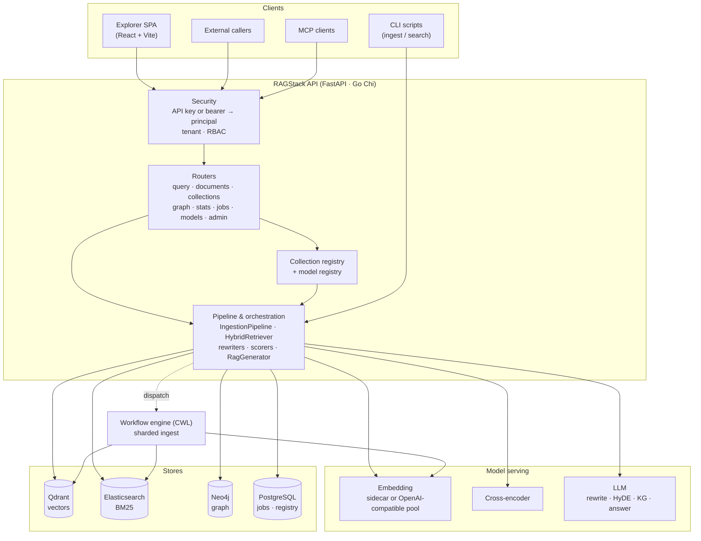
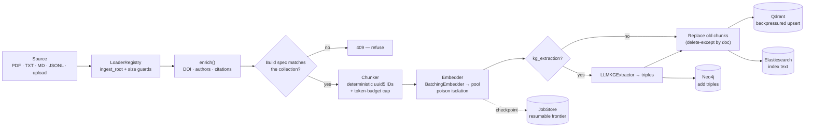
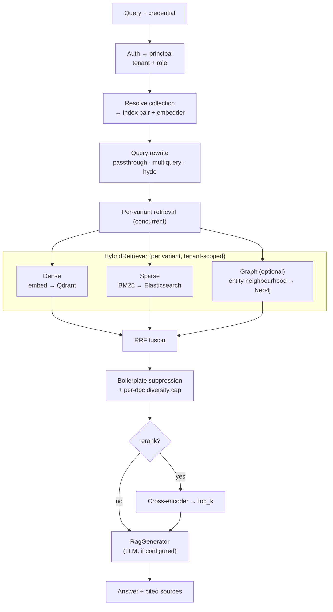

# RAGStack — Architecture & Design

A map of what RAGStack does, how the codebase is organised, how data flows through it, and
where the extension points are.

> **Scope.** This document describes the **design** — components, contracts, and the
> decisions behind them. It deliberately contains **no ports, hostnames, credentials, or
> deployment topology**, because those differ per environment and go stale far faster than
> the design does. For a specific deployment, see [DEPLOYMENT.md](DEPLOYMENT.md) and that
> environment's own operations page.
>
> Reflects `main` as of 2026-08-04. The **Python** implementation is the one in service;
> the **Go** implementation is a Phase-1 scaffold whose handlers largely return stubs.
> Where they differ, this document describes Python and flags Go explicitly.

---

## 1. What it is

RAGStack is a **multi-tenant Retrieval-Augmented Generation platform** exposed as a single
HTTP API, with two implementations (Python/FastAPI, Go/Chi) conforming to one OpenAPI 3.1
contract.

| Capability | What it does | Status |
|---|---|---|
| **Scholarly ingestion** | Load PDF / text / Markdown / JSONL, chunk, embed, index — single file, directory, upload, or multi-hundred-MB corpus | ✅ Python |
| **Metadata enrichment** | Recover DOI / title / authors / year / citations / doc-type from sparse extraction dumps, via pluggable publisher profiles; optional DOI lookup against Crossref / DataCite | ✅ Python |
| **Configurable chunking** | 6 strategies — `fixed`, `fixed_token`, `sentence`, `words`, `semantic`, `semantic_pooled` — all with deterministic IDs and token-budget safety | ✅ Python |
| **Hybrid retrieval** | Dense vectors (Qdrant) **+** BM25 (Elasticsearch) **+** optional graph context, fused via Reciprocal Rank Fusion | ✅ Python |
| **Query rewriting** | Expand a query into retrieval variants (`passthrough`, `multiquery`, `hyde`), retrieve each concurrently, RRF-fuse | ✅ Python |
| **Cross-encoder reranking** | Re-score the fused pool with a cross-encoder, cut to `top_k`; boilerplate suppression and per-document diversity caps | ✅ Python |
| **Grounded answer generation** | Synthesise a cited answer from retrieved sources via an OpenAI-compatible LLM | ✅ Python |
| **Collections** | Named, registered bindings of `(model, dim, chunker)` → physical stores, with an immutable build spec and provenance — see [§3](#3-the-collection-model) | ✅ Python |
| **Knowledge graph** | LLM triple extraction → Neo4j; entity/neighbour queries scoped by tenant *and* collection | ✅ Python (opt-in) |
| **Multi-tenancy** | Access is asserted at the collection (`resolve_access`, [ADR-0003](adr/0003-access-control.md)); the per-chunk `tenant_id`/owner stamp is writer provenance, kept enforced as defence in depth (reads scope to `own + public`, resolved server-side); tenant-as-instance is ADR-0005 | ✅ Python |
| **Identity & RBAC** | API keys, or verified bearer credentials (BV-BRC, OIDC) behind a flag; two roles — `admin`, `user` (`researcher` accepted as a deprecated alias; see [ADR-0003](adr/0003-access-control.md)) | ✅ Python |
| **Runtime model registry** | Register models and hot-swap task assignments (embedding / LLM / reranker) without a restart; per-request overrides | ✅ Python |
| **Resumable bulk ingest** | Checkpointed, crash-safe, out-of-order-aware ingestion that scales 1 → 500k docs and resumes without re-embedding completed work | ✅ Python |
| **Workflow-engine ingest** | Submit sharded ingest to a CWL workflow engine (GoWe) instead of running in-process — see [ADR-0001](adr/0001-execution-topology.md) | ✅ Python |
| **Scale & resilience** | Multi-endpoint embedder pool (least-loaded routing, failover, health re-probe), upsert backpressure, per-tenant concurrency quota, poison-input isolation, graceful degradation | ✅ Python |
| **MCP server** | Exposes retrieval to MCP clients (Claude Desktop / Code) | ✅ Python · ✅ Go |
| **Dashboard / Explorer** | React + Vite SPA — query console, collection admin, ops panels | 🚧 MVP |

**Design principles that recur throughout:** composability via `Protocol` interfaces (every
stage is swappable), deterministic `uuid5` IDs (re-ingest overwrites in place, never
duplicates), tenancy as a first-class store concern, and graceful degradation (a failed
stage returns partial results, never a 500).

---

## 2. Repository shape

A polyglot monorepo with two implementations of one API, a shared contract, and a
black-box conformance suite that neither implementation can import from.

| Directory | Contents |
|---|---|
| `contracts/` | `openapi.yaml` + JSON schemas (`additionalProperties: false`) + fixtures. **Source of truth for the API surface.** |
| `python/` | Python / FastAPI implementation — the complete one |
| `go/` | Go / Chi implementation — Phase-1 scaffold |
| `conformance/` | pytest + httpx, over HTTP, against a running server; selected by env var, no imports from either implementation |
| `sidecars/` | Independent FastAPI model services (embedding, cross-encoder, legacy FAISS) |
| `cwl/` | CWL tool + workflow definitions for the workflow-engine ingest path |
| `frontend/` | React + Vite SPA |
| `deploy/`, `apptainer/` | Container and rootless-HPC deployment definitions |

**Changing the API means:** update `contracts/openapi.yaml` and the relevant schema first,
then implement in both languages, then verify with conformance against each. Where the two
implementations disagree on a field name, the schema is authoritative and the diverging
side is the bug.

---

## 3. The collection model

The distinction below is normative; the terms are used precisely throughout the codebase.
Full definitions, including the failure modes each one exists to name, are in the
**[Glossary](GLOSSARY.md)**.

| Term | Meaning |
|---|---|
| **store** | The *physical* data: one Qdrant collection **plus** one Elasticsearch index (plus Neo4j triples, scoped but not yet purged). The two legs may have **different names** and may live on **different servers**, so tooling keys a store by `(backend_url, name)`, never by name alone. (Earlier docs called this an "index" — retired, because Elasticsearch already owns that word.) |
| **collection** | A *registry entry*: an id, its immutable build spec, and its ACL rows. What users create, name in a request, own and share. Holds no data. Qdrant also calls its own containers "collections" — an unqualified "collection" here always means the RAGStack entry. **Shipped.** |
| **library** | Not a separate entity. [ADR-0003](adr/0003-access-control.md) makes it one-to-one with a collection; the word survives only as the `lib` marker in a named collection's derived store name. |
| **tenant** | A *physical deployment*: one API plus its own Qdrant, its own Elasticsearch, its own ACL/registry database, and optionally a UI ([ADR-0005](adr/0005-tenant-anatomy.md)). The boundary is data at rest, not a name — two APIs over one Qdrant are two front doors on one tenant's data, not two tenants. |
| **owner_id / `tenant_id` (payload key)** | The per-chunk stamp recording who ingested it. Provenance + defence in depth, not the authorization mechanism ([ADR-0003](adr/0003-access-control.md) decision 1: renamed `owner_id` and demoted to provenance). The rename is a code-level alias only (#246): the physical key stays `tenant_id` because renaming storage would rewrite every point. |

**A physical index has exactly one registry entry** ([ADR-0002](adr/0002-collection-identity.md)
decision 5) — not two (which would be two independent ACLs over one dataset) and not
zero (data no ACL governs). Collection and store are 1:1 in the healthy state; they are
separate words because every access-control bug found in August 2026 was that mapping
breaking in one direction or the other.

A collection's physical name is derived deterministically from its build spec. Corpora are
content-addressed over `(model, dim, chunk_descriptor)` so that re-ingesting an identical
spec is idempotent; user-named collections additionally fold the *name* into the identity
so two users choosing the same model and chunker cannot land in one store.

The **build spec is immutable**. Ingesting into an existing collection with a different
model, dimension, or chunker returns **409** rather than writing incoherent vectors.
Changing any of them means a new collection and a full re-ingest.

A durable registry (`collection_store.py`, backends: `memory` / `json` / `sqlite` /
`postgres`) persists each spec, keyed by collection id, alongside a denormalised
`spec_hash` the ingest guard compares against. *Provenance* is separate — a per-collection
manifest written by `provenance.py`, distinguishing `source: ingest` (verified — observed
during a real ingest) from `source: config` (declared — asserted by an operator). Deletion
unregisters the binding; `?purge=true` also destroys the data.

> Rationale, the failure modes that forced it, and the alternatives weighed:
> **[ADR-0002 — Collection identity](adr/0002-collection-identity.md)**.

---

## 4. System components

### 4.1 API layer (`python/ragstack/api/`)
`main.py` assembles routers behind CORS + security. `deps.py` is the composition root — its
`lifespan()` builds every backend from config at startup and exposes them via `Depends()`
providers. `security.py` implements constant-time API-key auth, server-side tenant
resolution, and `require_role()` RBAC gating. `collections.py` resolves a request's
collection to a concrete store pair; `model_registry.py` holds the runtime model registry.
Access control lives in one seam: `ragstack/authz.py` (`resolve_access` — a sterile,
store-only decision function, the future ACL-sidecar API), `ragstack/acl_store.py` (the
per-tenant shares/ownership store beside the user store), and `api/access.py` (the HTTP
mapping — 404 for read-deny, 403 for write-deny-when-readable, 503 fail-closed, plus
`filter_readable` for listings and the startup ownership backfill).
Routers: `query`, `documents`, `collections`, `graph`, `stats`, `jobs`, `models`,
`models_registry`, `admin`, `health`, `health_deep`.

### 4.2 Identity (`python/ragstack/identity/`)
A pluggable `IdentityProvider` that verifies a bearer credential and returns a principal.
`bvbrc.py` verifies BV-BRC tokens offline against the issuer's published public key;
`oidc.py` handles standard OIDC discovery + JWKS. `cache.py` bounds verification cost with
a TTL. Off by default — API keys remain the baseline. This is the foundation the *library*
ownership model will sit on.

### 4.3 Ingestion (`python/ragstack/ingestion/`)
- **loaders.py** — `LoaderRegistry` dispatches by extension to `PdfLoader` (PyMuPDF),
  `TextFileLoader`, `JsonlLoader`; enforces `ingest_root` (LFI guard) + `max_bytes` (DoS guard).
- **chunkers.py** — the six strategies behind one `Chunker` protocol, with a single
  `CHUNK_METHODS` registry so no caller can invent a method the others don't know.
  `chunker_config.py` is the shared construction helper for the *bulk* ingesters; the API
  builds chunkers from `chunkers.make_chunker` directly.
- **enrich.py / doi_metadata.py** — scholarly metadata recovery; `PublisherProfile` drives
  DOI derivation, citation parsing, classification. Optional DOI lookup fills gaps at ingest.
- **boilerplate.py** — detects licence footers, copyright lines, and reference-list runs so
  they don't monopolise a top-k.
- **tokenization.py** — `HFTokenCounter` / `EstimatingTokenCounter` / `EndpointTokenCounter`
  keep chunks under the embedder's context window.
- **pipeline.py** — `IngestionPipeline`, split into `embed_source` and `index_chunks` so the
  two stages can run in separate processes or workflow steps.
- **manifest.py / backends.py / sharded.py / receipts.py** — the resumable batch layer:
  enumerate work units, partition into shards, run with per-item failure isolation and
  checkpointing, emit receipts.
- **gowe_client.py / gowe_backend.py** — submit shards to a CWL workflow engine instead of
  executing locally; selected by config ([ADR-0001](adr/0001-execution-topology.md)).
- **embed_shard.py / load_embeddings.py / embedding_file.py** — the decoupled
  embed-then-load path the CWL tools invoke.
- **segmentation_cache.py / embed_bridge.py** — reuse sentence segmentation across runs;
  let synchronous chunkers call the async embedder on a dedicated loop.

### 4.4 Retrieval, rewriting, scoring
- **retrieval/retriever.py** — `HybridRetriever` runs dense + BM25 (+ optional graph) legs
  and fuses them with RRF. `retrieval_mode` selects `hybrid` | `vector` | `bm25`.
  The graph leg extracts entities from the query first (#349): the query is tokenised
  (word split, lower-cased, punctuation stripped; a 1-gram in `GRAPH_QUERY_STOPWORDS` — articles,
  prepositions, pronouns, auxiliaries — is skipped, longer n-grams keep them), its
  1–`graph_query_ngram_max`-grams are
  matched **exactly** against the entity names in the caller's `(tenant, collection)` scope in
  one indexed `GraphStore.match_entities` call (Neo4j: `toLower(e.name) IN $candidates` plus
  the scope predicates — never `CONTAINS` over the sentence), and the longest matches
  (ties by query position), up to `graph_query_entity_max`, each get one `query_neighborhood`;
  the neighbourhoods are unioned, then the tenant/collection re-checks and the
  `graph_min_confidence` floor apply. No matched entity → empty leg, no neighbourhood call, no
  model call. Settings: `graph_context_depth` (hops), `graph_context_score`,
  `graph_min_confidence` (#347), `graph_query_entity_max` (5), `graph_query_ngram_max` (3).
- **rewriting/rewriters.py** — `PassthroughRewriter`, `MultiQueryRewriter`, `HyDERewriter`.
- **scoring/scorers.py** — `RRFScorer`, `CrossEncoderScorer` (in-process), `SidecarReranker` (HTTP).

### 4.5 Storage adapters (`python/ragstack/stores/`)
- **qdrant.py** — `QdrantVectorStore`; build-spec-scoped collections, deterministic point
  ids, tenant-filtered search.
- **elasticsearch.py** — `ElasticsearchTextIndex` (BM25); doc id `tenant:chunk_id`;
  fail-closed on unscoped reads.
- **neo4j.py** — `Neo4jGraphStore`; entities keyed by `(name, tenant_id, collection)`;
  depth-capped traversal.
- **backpressure.py** — `BackpressuredVectorStore` gates upserts on optimiser health so a
  bulk load cannot outrun indexing.
- **memory.py** — in-memory stores for dev + tests.

### 4.6 Embedding, LLM, and the model registry
- **embedders.py** — `SidecarEmbedder`, `OpenAIEmbedder`, `BatchingEmbedder` (bounded +
  poison-isolating). `make_embedder(api=…)` picks the transport, so a sidecar and an
  OpenAI-compatible server (vLLM, hosted) are one flag apart.
- **embed_pool.py** — `PooledEmbedder`: least-loaded routing across endpoints, failover,
  lazy health re-probe. Adding embedding capacity is adding endpoints to the pool.
- **api/model_registry.py** — register models at runtime; assign them to tasks
  (embedding / llm / reranker) and hot-swap without a restart; per-request overrides.
  Design and phased plan: [model-registry.md](model-registry.md).
- **llm.py** — `OpenAILLM` + `RagGenerator` (cited answer synthesis).
- **graph/extractor.py** — `LLMKGExtractor` (strict-JSON triple extraction, per-chunk degrade).

### 4.7 Cross-cutting
- **config.py** — Pydantic `Settings`; env-driven backend selection throughout.
- **collection_store.py** — the durable collection registry ([§3](#3-the-collection-model)).
- **tenancy.py / quota.py** — readable-tenant scoping; per-tenant concurrency semaphore.
- **jobstore.py** — `InMemory` / `Sqlite` / `Postgres` job stores for async + resumable ingest.
- **provenance.py** — build manifests recording how a collection was produced.
- **sidecar_http.py** — shared `SidecarClient` JSON-over-HTTP plumbing.
- **mcp/** — an MCP server exposing retrieval to MCP clients. Go ships an equivalent
  under `go/cmd/mcp/` — the one place the Go side is not a stub.

### 4.8 Model sidecars (`sidecars/`)
Independent FastAPI services the API calls over HTTP, each resolved by URL from config:
**embedding** (`POST /embed`), **crossencoder** (`POST /rerank`), and a legacy **faiss**
(`POST /search`). All expose `GET /health`. The embedding sidecar is one of two
interchangeable embedding transports — see §4.6.

### 4.9 Infrastructure dependencies
**Qdrant** (vectors), **Elasticsearch** (BM25), **Neo4j** (graph — opt-in), **PostgreSQL**
(durable job + collection store). Each is selected by config and has an in-memory or
file-backed alternative for dev, so the full set is a production choice rather than a hard
requirement.

`redis_url` exists in `config.py` and Redis appears in the deployment definitions, but
**nothing in either implementation reads it** — there is no client, no call site, and no
backend that selects it. Treat it as reserved, not as a dependency.

---

## 5. System diagram

---

## 6. Data flow

### 6.1 Ingest (`POST /v1/ingest`, `POST /v1/ingest/upload`, bulk CLI, or workflow)

Key properties: deterministic IDs make re-ingest idempotent (overwrite in place);
upsert-before-prune means a prune timeout leaves harmless duplicates, never data loss; the
checkpoint frontier (+ out-of-order `done_ranges`) lets a crashed bulk run resume without
re-embedding completed work; and the build-spec check fails the run *before* any vector is
written rather than after.

### 6.2 Query (`POST /v1/query`)

Every stage degrades gracefully: an unknown rewrite strategy falls back to the plain query,
a rerank failure falls back to the fused order, and an LLM failure returns sources with a
note — the call still returns 200.

---

## 7. API surface

Auth: `X-API-Key`, or a bearer credential when an identity provider is enabled. Both
resolve server-side to a principal (tenant + role); the tenant is never read from the
request body. `/health` is open; all `/v1/*` require a credential when auth is configured.
The authoritative definition is `contracts/openapi.yaml`; per-field reference is
[docs/API.md](API.md).

The **Auth** column reads: `principal` = any authenticated caller; `read-owner` =
the caller must additionally be able to *read* the resolved collection (owner, an
active read grant, or `public`) — a listing endpoint filters to what it may read;
`owner-or-admin` = it must *own* the collection (or be admin) — ingest into a
named non-default collection, and collection delete. Document-level ops on the
**default** collection (ingest without a `collection`, `DELETE /v1/documents`)
are `read-owner`: it is the shared pre-ownership surface where the per-chunk
tenant stamp isolates writers. Every collection decision runs through the one
seam (`ragstack.authz.resolve_access`, reached via `ragstack.api.access`);
`admin` bypasses it as a named branch logged on every bypass (ADR-0003 §5). A
read denial is a 404 (existence not leaked); a write/owner denial is a 403 only
when the caller can read the collection, and the same 404 otherwise (no
existence oracle via the write endpoints); an ACL-store outage is a 503 (fail
closed). Underneath, the per-chunk `tenant_id` filter and the
`TENANT_COLLECTIONS` allowlist stay in force — defence in depth (ADR-0003 §3).

| Method | Path | Purpose | Auth | Python | Go |
|---|---|---|---|---|---|
| GET | `/health` | Liveness probe | none | ✅ | ✅ |
| POST | `/v1/query` | Full RAG: rewrite → retrieve → rerank → generate | principal · read-owner | ✅ | ⚠️ stub |
| POST | `/v1/retrieve` | Hybrid retrieval, no generation | principal · read-owner | ✅ | ⚠️ stub |
| GET | `/v1/chunks` | Fetch chunks by id (context expansion) | principal · read-owner | ✅ | ⚠️ stub |
| GET | `/v1/collections` | List collections + counts + provenance (owner-filtered) | principal · read-owner | ✅ | ⚠️ stub |
| POST | `/v1/collections` | Create a collection (private to creator; supplying `embedding`/`chunk` is admin-only) | principal | ✅ | ⚠️ stub |
| DELETE | `/v1/collections/{id}` | Unregister; `?purge=true` destroys data | owner-or-admin | ✅ | ⚠️ stub |
| POST | `/v1/ingest` | Async ingest of a server-side path → `job_id` | read-owner (default) · owner-or-admin (named) | ✅ | ⚠️ stub |
| POST | `/v1/ingest/upload` | Multipart upload → stage → ingest | read-owner (default) · owner-or-admin (named) | ✅ | ⚠️ stub |
| GET | `/v1/ingest/{job_id}` | Poll job status + per-item progress | principal | ✅ | ⚠️ stub |
| GET | `/v1/jobs` | List ingest jobs | admin | ✅ | ❌ |
| GET | `/v1/documents` | List indexed documents | principal · read-owner | ✅ | ⚠️ stub |
| DELETE | `/v1/documents/{doc_id}` | Delete a doc from vector + text legs (own tenant only) | principal · read-owner | ✅ | ⚠️ stub |
| GET | `/v1/graph/entities` | List graph entities (own + public) | principal | ✅ | ⚠️ stub |
| GET | `/v1/graph/neighbors/{entity}` | Neighbourhood triples (depth 1–5) | principal | ✅ | ⚠️ stub |
| GET | `/v1/graph/stats` | Entity / relationship counts | principal | ✅ | ❌ |
| GET | `/v1/stats/stores` | Per-store counts (vector/text/graph) | principal | ✅ | ❌ |
| GET | `/v1/stats/tenants` | Tenant × collection breakdown (owner-filtered) | principal · read-owner | ✅ | ❌ |
| GET | `/v1/stats/models` | Per-endpoint liveness, latency, in-flight | admin | ✅ | ❌ |
| POST | `/v1/stats/models/benchmark` | On-demand throughput probe | admin | ✅ | ❌ |
| GET | `/v1/models/available` | Models assignable per-request | principal | ✅ | ⚠️ stub |
| GET,POST | `/v1/admin/models/registry` | List / register models | admin | ✅ | ⚠️ GET stub |
| PUT,DELETE | `/v1/admin/models/registry/{id}` | Update / remove a model | admin | ✅ | ❌ |
| PATCH | `/v1/admin/config/assignments` | Hot-swap llm / reranker assignment | admin | ✅ | ❌ |
| GET | `/v1/config` | Allowlisted config, secrets redacted | admin | ✅ | ❌ |
| GET | `/v1/health/deep` | Deep dependency probe + latencies | admin | ✅ | ❌ |

**RBAC roles:** `admin` (superuser) · `user` (everything not admin-gated). `researcher` is a
deprecated alias for `user`, normalized at startup with a warning; `engineer`/`manager` were
removed ([ADR-0003](adr/0003-access-control.md)) and are rejected at startup.

> The `stream` field exists on the query request model but there is **no** separate
> streaming endpoint yet. Go request models still lack `rerank` / `rerank_candidates` (#27).

---

## 8. Service scripts (`python/scripts/`)

### 8.1 Ingestion & search CLIs
| Script | Purpose | Key flags |
|---|---|---|
| `ingest_jsonl.py` | Bulk-ingest a JSONL corpus → Qdrant (+ optional ES); streaming, enriching, resumable, concurrent | `--tenant`, `--doc-types`, `--publisher-profile`, `--chunk-method`, `--chunk-size`, `--embedding-api {sidecar,openai}`, `--embedding-url` (multi), `--concurrency`, `--resume`, `--checkpoint`, `--catalog-out`, `--text-backend` |
| `ingest_chunks.py` | Ingest pre-extracted JSON chunks → Qdrant (no enrichment/chunking) | `--collection`, `--tenant`, `--embedding-api`, `--embedding-url` (multi), `--embedding-model`, `--batch-size` |
| `search.py` | Embed a query, vector-search Qdrant, optional payload filter; tenant-scoped | `--collection`, `--tenant`, `--top-k`, `--filter KEY=VALUE`, `--json` |
| `verify_doi_pubmed.py` | Data-QA: validate sampled catalog DOIs/titles against PubMed E-utilities | `--sample`, `--email`, `--min-ratio`, `--report` |

### 8.2 Eval / benchmark harnesses (`python/scripts/eval/`)
| Script | Purpose |
|---|---|
| `chunking_compare_7way.py` | Ingest one deterministic subset **7 ways**; report structure, overflow, cost, and known-item retrieval quality (recall/MRR/nDCG, hybrid + rerank) |
| `chunking_compare.py` | 3-way (fixed/sentence/semantic) variant of the above |
| `scifact_chunk_eval.py` | SciFact (BEIR) passage-level benchmark with graded qrels — nDCG@10 / recall@{10,20,100} / MAP + bootstrap CIs |
| `g1_library_sweep.py` | G1 retrieval sweep over a built library (see [`g1-retrieval-protocol.md`](g1-retrieval-protocol.md)) |
| `chunk_one.py` | Chunk a single document one way and emit its structure stats |
| `aggregate_stats.py` | Fold per-arm stats files into one comparison table |
| `_stats.py` | Shared stats layer (paired-bootstrap CIs, pairwise diff CIs, Wilcoxon + Holm), no scipy |

The four one-off **performance** benchmarks that answered the semantic-ingest cost
question — `bge_gpu_bench.py`, `embed_speed.py`, `breakpoint_model_compare.py`,
`profile_semantic_cpu.py` — are not part of this harness and now live beside their
write-up, in
[`reports/semantic-chunking-experiments/`](../reports/semantic-chunking-experiments/README.md).
Nothing imports them and no workflow runs them; they are kept as reproducers because a
conclusion is only as durable as the hardware it was measured on.

---

## 9. Extension points

Every stage is a `Protocol`, so extending the system means implementing an interface and
selecting it by config — not editing the pipeline. Most live in
`python/ragstack/protocols.py`; the three that ship with their subsystem are noted.

| To add… | Implement | Defined in | Selected by |
|---|---|---|---|
| A file type | `DocumentLoader` | `protocols.py` | extension, via `LoaderRegistry` |
| A chunking strategy | `Chunker` | `protocols.py` | `CHUNK_METHODS` registry + `chunk_method` |
| An embedding backend | `Embedder` | `protocols.py` | `make_embedder(api=…)`, or add an endpoint to the pool |
| A vector / text / graph store | `VectorStore` / `TextIndex` / `GraphStore` | `protocols.py` | config backend selection |
| A reranking strategy | `Scorer` | `protocols.py` | reranker assignment |
| A query rewriter | `QueryRewriter` | `protocols.py` | `rewrite_strategies` |
| An identity source | `IdentityProvider` | `identity/base.py` | `identity/factory.py` |
| A collection registry backend | `CollectionStore` | `collection_store.py` | `COLLECTION_STORE_BACKEND` |
| An ingest execution mode | `IngestBackend` | `ingestion/backends.py` | `INGEST_BACKEND` |

---

## 10. Where to look next

| For | Read |
|---|---|
| Per-capability internals, algorithms, 33 diagrams | [ARCHITECTURE-DEEP-DIVE.md](ARCHITECTURE-DEEP-DIVE.md) |
| Why a decision was made | [ADR index](adr/README.md) |
| Design intent and milestones | [SPEC.md](../SPEC.md) |
| Current state, TODOs, checkpoints | [STATUS.md](../STATUS.md) |
| HTTP reference | [API.md](API.md) |
| Ingest paths and when to use each | [ingest-paths.md](ingest-paths.md) |
| Model registry design | [model-registry.md](model-registry.md) |
| User-owned libraries (deferred design, superseded by ADR-0003) | [libraries-spec.md](libraries-spec.md) |
| Running it somewhere | [DEPLOYMENT.md](DEPLOYMENT.md) |
