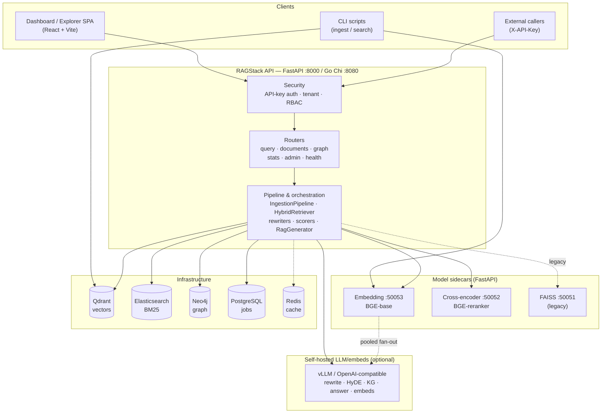
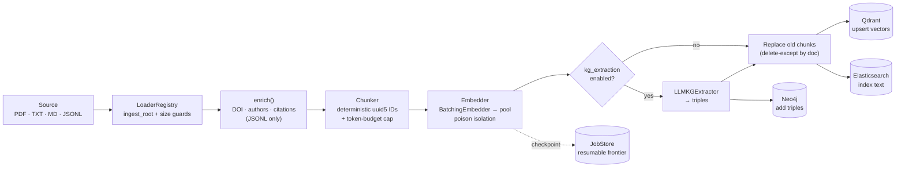
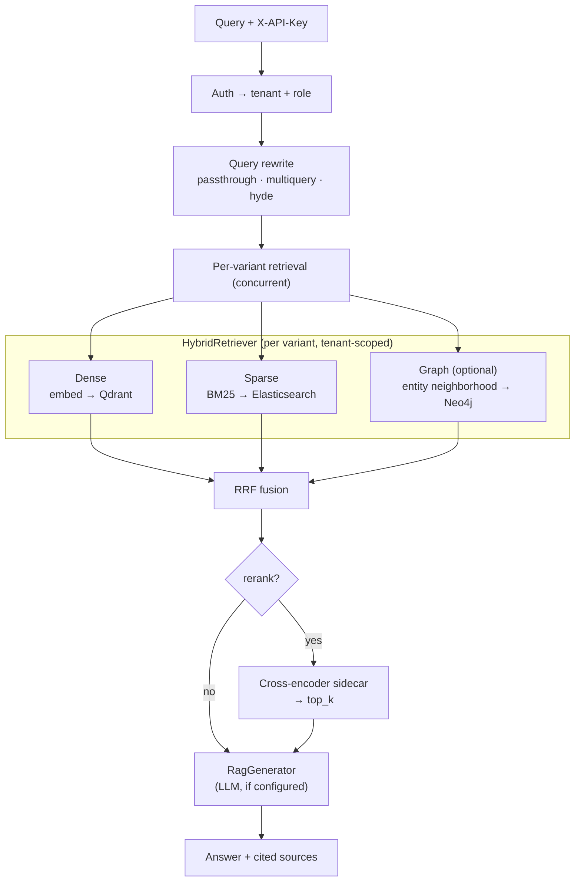

# RAGStack — Architecture & Capabilities Overview

A high-level map of what RAGStack does, the components that make it work, how data
flows through the system, and the complete API + service-script surface.

> Scope note: this reflects the code on `main` as of 2026-07-02. The **Python**
> implementation is feature-complete; the **Go** implementation is a Phase-1
> scaffold whose handlers largely return stubs. Where they differ, this document
> describes Python and flags Go status explicitly.

---

## 1. Capabilities overview

RAGStack is a **multi-tenant Retrieval-Augmented Generation (RAG) platform** exposed
as a single HTTP API, with two parallel implementations (Python/FastAPI, Go/Chi)
conforming to one OpenAPI 3.1 contract.

| Capability | What it does | Status |
|---|---|---|
| **Scholarly ingestion** | Load PDF / text / Markdown / JSONL, chunk, embed, and index — single file, directory, or multi-hundred-MB JSONL corpus | ✅ Python |
| **Metadata enrichment** | Recover DOI / title / authors / year / citations / doc-type from sparse extraction dumps, via pluggable publisher profiles | ✅ Python |
| **Configurable chunking** | 6 strategies — `fixed`, `fixed_token`, `sentence`, `words`, `semantic`, `semantic_pooled` — all with deterministic IDs and token-budget safety | ✅ Python |
| **Hybrid retrieval** | Dense vectors (Qdrant) **+** BM25 (Elasticsearch) **+** optional graph context, fused via Reciprocal Rank Fusion | ✅ Python |
| **Query rewriting** | Expand a query into retrieval variants (`passthrough`, `multiquery`, `hyde`), retrieve each concurrently, RRF-fuse | ✅ Python |
| **Cross-encoder reranking** | Re-score the fused candidate pool with a cross-encoder sidecar, cut to `top_k` | ✅ Python |
| **Grounded answer generation** | Synthesize a cited answer from retrieved sources via an OpenAI-compatible LLM | ✅ Python |
| **Knowledge graph** | LLM triple extraction → Neo4j; tenant-scoped entity/neighbor queries; graph-augmented retrieval leg | ✅ Python (opt-in) |
| **Multi-tenancy** | Every chunk carries a `tenant_id`; reads are scoped to `own + public`; tenant is derived server-side from the API key and cannot be spoofed | ✅ Python |
| **RBAC** | Four roles (`admin`, `engineer`, `manager`, `researcher`); admin-gated config/health surfaces | ✅ Python |
| **Resumable bulk ingest** | Checkpointed, crash-safe, out-of-order-aware ingestion that scales 1 → 500k docs and resumes without re-embedding completed work | ✅ Python |
| **Scale & resilience** | Multi-endpoint embedder pool (least-loaded routing, failover, health re-probe), per-tenant concurrency quota, poison-input isolation, graceful degradation | ✅ Python |
| **Two deployment paths** | Docker Compose (layered) and Apptainer rootless (HPC / no-Docker hosts) with persistent host binds | ✅ |
| **Dashboard / Explorer** | React + Vite SPA (sources-first query console) over new read-only stats/health endpoints | 🚧 MVP |

**Design principles that recur throughout:** composability via `Protocol` interfaces
(every stage is swappable), deterministic `uuid5` IDs (re-ingest overwrites in place,
never duplicates), tenancy as a first-class store concern, and graceful degradation
(a failed stage returns partial results, never a 500).

---

## 2. System components

### 2.1 API layer (`python/ragstack/api/`)
The FastAPI surface. `main.py` assembles routers behind CORS + security; `deps.py`
is the composition root — its `lifespan()` builds every backend from config at
startup and exposes them via `Depends()` providers. `security.py` implements
constant-time API-key auth, server-side tenant resolution, and `require_role()`
RBAC gating. Routers: `query`, `documents`, `graph`, `stats`, `admin`, `health`,
`health_deep`.

### 2.2 Ingestion subsystem (`python/ragstack/ingestion/`)
- **loaders.py** — `LoaderRegistry` dispatches by extension to `PdfLoader` (PyMuPDF),
  `TextFileLoader`, `JsonlLoader`; enforces `ingest_root` (LFI guard) + `max_bytes` (DoS guard).
- **chunkers.py** — `RecursiveCharacterChunker`, `SentenceChunker`, `WordChunker`,
  `FixedTokenWindowChunker`, `SemanticChunker` (embedding-driven boundaries + oversize fallback).
- **enrich.py** — scholarly metadata recovery; `PublisherProfile` (ASM default) drives
  DOI derivation, citation parsing, classification. Pure functions, reused by API + scripts.
- **tokenization.py** — `HFTokenCounter` / `EstimatingTokenCounter` / `EndpointTokenCounter`
  keep chunks under the embedder's context window.
- **pipeline.py** — `IngestionPipeline`: load → chunk → embed → replace-old → index (vector/text/graph).
- **manifest.py / backends.py / sharded.py** — resumable batch layer: enumerate work
  units, partition into shards, run concurrently with per-item failure isolation + checkpointing.
- **embed_bridge.py** — `SyncEmbedBridge` lets synchronous chunkers call the async embedder on a dedicated loop.

### 2.3 Retrieval, rewriting, scoring
- **retrieval/retriever.py** — `HybridRetriever` runs dense + BM25 (+ optional graph)
  legs and fuses them with RRF.
- **rewriting/rewriters.py** — `PassthroughRewriter`, `MultiQueryRewriter`, `HyDERewriter`.
- **scoring/scorers.py** — `RRFScorer` (rank fusion), `CrossEncoderScorer` (in-process),
  `SidecarReranker` (HTTP cross-encoder).

### 2.4 Storage adapters (`python/ragstack/stores/`)
- **qdrant.py** — `QdrantVectorStore`; `(model, dim)`-scoped collections; tenant-filtered search.
- **elasticsearch.py** — `ElasticsearchTextIndex` (BM25); doc id `tenant:chunk_id`; fail-closed on unscoped reads.
- **neo4j.py** — `Neo4jGraphStore`; entities keyed by `(name, tenant_id)`; depth-capped traversal.
- **memory.py** — in-memory vector/text/graph stores for dev + tests.

### 2.5 Embedding & LLM
- **embedders.py** — `SidecarEmbedder`, `OpenAIEmbedder`, `BatchingEmbedder` (bounded + poison-isolating).
- **embed_pool.py** — `PooledEmbedder`: least-loaded routing across endpoints, failover, lazy health re-probe.
- **graph/extractor.py** — `LLMKGExtractor` (strict-JSON triple extraction, per-chunk graceful degrade).
- **llm.py** — `OpenAILLM` + `RagGenerator` (cited answer synthesis).

### 2.6 Cross-cutting
- **config.py** — Pydantic `Settings`; env-driven backend selection.
- **tenancy.py / quota.py** — readable-tenant scoping; per-tenant concurrency semaphore.
- **jobstore.py** — `InMemory` / `Sqlite` / `Postgres` job stores for async + resumable ingest.
- **sidecar_http.py** — shared `SidecarClient` JSON-over-HTTP plumbing.

### 2.7 Model sidecars (`sidecars/`) — independent FastAPI services
| Sidecar | Port | Model (default) | Endpoints |
|---|---|---|---|
| **embedding** | 50053 | `BAAI/bge-base-en-v1.5` (768-d) | `POST /embed`, `GET /health` |
| **crossencoder** | 50052 | `BAAI/bge-reranker-v2-m3` | `POST /rerank`, `GET /health` |
| **faiss** (legacy/optional) | 50051 | FAISS flat index | `POST /search`, `GET /indices`, `GET /health` |

### 2.8 Infrastructure services
| Service | Port | Role in RAGStack |
|---|---|---|
| **Qdrant** | 6333 | Primary vector store |
| **Elasticsearch** | 9200 | BM25 text index (hybrid leg) |
| **Neo4j** | 7687 | Knowledge-graph store (opt-in) |
| **PostgreSQL** | 5432 | Durable job store / resumable checkpoints |
| **Redis** | 6379 | Cache / rate-limit / Celery broker |

---

## 3. System diagram

---

## 4. Data flow diagrams

### 4.1 Ingest path (`POST /v1/ingest` / bulk `ingest_jsonl.py`)

Key properties: deterministic IDs make re-ingest idempotent (overwrite in place);
upsert-before-prune means a prune timeout leaves harmless duplicates, never data loss;
the checkpoint frontier (+ out-of-order `done_ranges`) lets a crashed bulk run resume
without re-embedding completed work.

### 4.2 Query path (`POST /v1/query`)

Every stage degrades gracefully: an unknown rewrite strategy falls back to the plain
query, a rerank failure falls back to the fused order, and an LLM failure returns
sources with a note — the call still returns 200.

---

## 5. API endpoints

Base URL: Python `:8000`, Go `:8080`. Auth header: `X-API-Key` (maps server-side to
tenant + role). `/health` is open; all `/v1/*` require a key when keys are configured.

| Method | Path | Purpose | Auth | Python | Go |
|---|---|---|---|---|---|
| GET | `/health` | Liveness probe | none | ✅ | ✅ |
| POST | `/v1/query` | Full RAG: rewrite → retrieve → rerank → generate | key (tenant) | ✅ | ⚠️ stub |
| POST | `/v1/retrieve` | Hybrid retrieval, no answer generation | key (tenant) | ✅ | ⚠️ stub |
| POST | `/v1/ingest` | Async ingest of a file or directory → `job_id` | key (tenant) | ✅ | ⚠️ stub |
| GET | `/v1/ingest/{job_id}` | Poll job status + per-item progress | key (tenant) | ✅ | ⚠️ stub |
| GET | `/v1/documents` | List indexed documents | key (tenant) | ⚠️ stub `[]` | ⚠️ stub `[]` |
| DELETE | `/v1/documents/{doc_id}` | Delete a doc from vector + text legs | key (tenant) | ✅ | ⚠️ stub |
| GET | `/v1/graph/entities` | List graph entities (own + public) | key (tenant) | ✅ | ⚠️ stub |
| GET | `/v1/graph/neighbors/{entity}` | Neighborhood triples (depth 1–5) | key (tenant) | ✅ | ⚠️ stub |
| GET | `/v1/graph/stats` | Entity / relationship counts | key (tenant) | ✅ | ❌ |
| GET | `/v1/stats/stores` | Per-store counts (vector/text/graph) | key (principal) | ✅ | ❌ |
| GET | `/v1/config` | Allowlisted config, secrets redacted | key (**admin**) | ✅ | ❌ |
| GET | `/v1/health/deep` | Deep dependency probe + latencies | key (**admin**) | ✅ | ❌ |

**RBAC roles:** `admin` (superuser) · `engineer` (data ops) · `manager` (dashboard reads)
· `researcher` (read-only). **Tenancy:** every data endpoint auto-scopes to the caller's
tenant + the shared `public` corpus; the tenant is never read from the request body.

> The `stream` field exists on the query request model but there is **no** separate
> streaming endpoint yet. Go request models still lack `rerank` / `rerank_candidates`
> (issue #27).

---

## 6. Service scripts (`python/scripts/`)

### 6.1 Ingestion & search CLIs
| Script | Purpose | Key flags |
|---|---|---|
| `ingest_jsonl.py` | Bulk-ingest a JSONL corpus → Qdrant (+ optional ES); streaming, enriching, resumable, concurrent | `--tenant`, `--doc-types`, `--publisher-profile`, `--chunk-method`, `--chunk-size`, `--embedding-api {sidecar,openai}`, `--embedding-url` (multi), `--concurrency`, `--chunk-concurrency`, `--batch-retries`, `--resume`, `--checkpoint`, `--catalog-out`, `--text-backend` |
| `ingest_chunks.py` | Ingest pre-extracted JSON chunks → Qdrant (no enrichment/chunking) | `--collection`, `--tenant`, `--embedding-api`, `--embedding-url` (multi), `--embedding-model`, `--batch-size` |
| `search.py` | Embed a query, vector-search Qdrant, optional payload filter; tenant-scoped | `--collection`, `--tenant`, `--top-k`, `--filter KEY=VALUE`, `--embedding-api`, `--json` |
| `verify_doi_pubmed.py` | Data-QA: validate sampled catalog DOIs/titles against PubMed E-utilities | `--sample`, `--email`, `--api-key`, `--min-ratio`, `--report` |

### 6.2 Eval / benchmark harnesses (`python/scripts/eval/`)
| Script | Purpose |
|---|---|
| `chunking_compare_7way.py` | Ingest one deterministic subset **7 ways**; report structure, overflow, cost, and known-item retrieval quality (recall/MRR/nDCG, hybrid + rerank) |
| `chunking_compare.py` | 3-way (fixed/sentence/semantic) variant of the above |
| `scifact_chunk_eval.py` | SciFact (BEIR) passage-level benchmark with graded qrels — nDCG@10 / recall@{10,20,100} / MAP + bootstrap CIs |
| `bge_gpu_bench.py` | BGE-base GPU throughput benchmark (no HTTP) |
| `embed_speed.py` | Embedding throughput of breakpoint-model candidates over real buffers |
| `breakpoint_model_compare.py` | Cheap vs expensive breakpoint model — chunk-span Jaccard, boundary F1, Spearman |
| `profile_semantic_cpu.py` | Isolate semantic-chunker CPU cost with a mock embedder |
| `_stats.py` | Shared stats layer (paired-bootstrap CIs, pairwise diff CIs, Wilcoxon + Holm), no scipy |

---

## 7. Deployment topology

**Docker Compose** — layered files stacked with multiple `-f` flags:
- `docker-compose.infra.yml` — Qdrant · Elasticsearch · Neo4j · Postgres · Redis
- `docker-compose.sidecars.yml` — embedding · crossencoder · faiss
- `docker-compose.python.yml` / `docker-compose.go.yml` — the API (+ Celery worker on Python)

**Apptainer (rootless)** — preferred on no-Docker / HPC hosts (`apptainer/up.sh`,
`apptainer/sidecars-up.sh`); every writable container path is bind-mounted to a
persistent host dir under `apptainer/data/<service>/`. The canonical deployed stack
lives under `/rag/` on host `coconut` (see [STATUS.md](../STATUS.md#production-layout-rag)).

---

*Generated from a source sweep of the repo. For design intent see [SPEC.md](../SPEC.md);
for current state and TODOs see [STATUS.md](../STATUS.md); for the HTTP reference see
[docs/API.md](API.md).*
