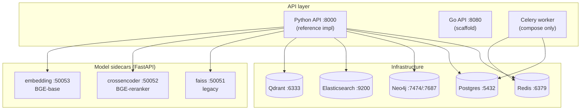

# RAGStack — Deployment & Infrastructure

How RAGStack is deployed **today**: a single-node dev/test stack via **Docker Compose**
or **Apptainer (rootless)**. This documents the infrastructure that actually exists and
how to bring it up — it consolidates setup knowledge previously scattered across
[CLAUDE.md](../CLAUDE.md), [STATUS.md](../STATUS.md), the `Makefile`, and the scripts.

> **Scope.** This is a **single-node dev/test** deployment. Production HA infrastructure
> (Kubernetes/Helm, IaC, multi-AZ replicas, autoscaling, monitoring stack, automated
> backup/restore) is **not built yet** — it is tracked as SPEC milestones **M7**
> (observability) and **M8** (production). See [the dev→prod boundary](#devprod-boundary)
> at the end, and the [HA reference design](design/ha-rag-reference-design.md) for the
> target topology (whose deployment section is explicitly aspirational).

---

## Topology (single node)



---

## Two deployment paths

| Path | When | Entry |
|---|---|---|
| **Docker Compose** | Laptop / any host with Docker | `make up-python` or `make up-go` |
| **Apptainer (rootless)** | Hosts without Docker; HPC; the `coconut` dev host | `make infra-up-apptainer` + `make sidecars-up-apptainer` |

Port convention (do not swap — hardcoded in `.env.example` and the conformance targets):
**Python API = 8000, Go API = 8080.**

---

## Docker Compose

Compose is split into **layered files stacked with multiple `-f` flags** (not used standalone):

| File | Brings up |
|---|---|
| `deploy/docker-compose.infra.yml` | Qdrant · Elasticsearch · Neo4j · Postgres · Redis |
| `deploy/docker-compose.sidecars.yml` | embedding · crossencoder · faiss sidecars |
| `deploy/docker-compose.python.yml` | Python `api` (:8000) + Celery `worker` |
| `deploy/docker-compose.yml` | Go `api` (:8080) — this is the **base/Go** file |

The `make` targets do the stacking for you:

```bash
make infra-up        # infra only (5 stores)
make up-python       # infra + sidecars + Python API   (docker compose -f infra -f sidecars -f python up)
make up-go           # infra + sidecars + Go API
make down            # stop everything (all -f files combined)
```

For non-Docker dev of the API alone (stores/sidecars still needed):

```bash
make run-python      # uvicorn ragstack.api.main:app --reload --port 8000
make run-go          # build + run the Go binary on :8080
```

### Infrastructure services

| Service | Image | Port(s) | Role | Persistent volume |
|---|---|---|---|---|
| Qdrant | `qdrant/qdrant:latest` | 6333 | Vector store | `qdrant_data` |
| Elasticsearch | `elasticsearch:8.13.4` | 9200 | BM25 text index | `es_data` |
| Neo4j | `neo4j:5` | 7474 (UI), 7687 (bolt) | Knowledge graph | `neo4j_data` |
| Postgres | `postgres:16` | 5432 | Job store / metadata | `pg_data` |
| Redis | `redis:7-alpine` | 6379 | Cache / broker | — (ephemeral) |

ES runs single-node with security disabled and a 512 MB heap (`ES_JAVA_OPTS=-Xms512m -Xmx512m`) — dev sizing.

### Model sidecars

| Sidecar | Port | Default model | Device knob | Volume |
|---|---|---|---|---|
| embedding | 50053 | `BAAI/bge-base-en-v1.5` (768-d) | `SIDECAR_DEVICE` (`cpu`/`cuda`) | — |
| crossencoder | 50052 | `BAAI/bge-reranker-v2-m3` | `SIDECAR_DEVICE` + `CROSSENCODER_MAX_LENGTH` | — |
| faiss (legacy) | 50051 | FAISS flat index | — | `faiss_data` |

> ⚠️ The cross-encoder default (`bge-reranker-v2-m3` at `MAX_LENGTH=4096`) is **impractically slow on CPU** — query-path reranks will time out. For real use set `SIDECAR_DEVICE=cuda` **and** uncomment the GPU reservation in `docker-compose.sidecars.yml` (needs the nvidia-container-toolkit), or set `CROSSENCODER_MAX_LENGTH=512` to make CPU merely slow rather than unusable.

---

## Apptainer (rootless) — preferred on no-Docker / HPC hosts

Each container's writable directories are **bind-mounted to explicit host paths** under
`apptainer/data/<service>/<purpose>/`, so state persists across restarts and is
observable from the host. **Do not use `--writable-tmpfs` or opaque overlays** — enumerate
writable paths (see [CLAUDE.md](../CLAUDE.md) and [MEMORY.md](../MEMORY.md) for the rootless
quirks catalog).

```bash
sudo sysctl -w vm.max_map_count=262144   # one-time per host, required by Elasticsearch
make infra-pull-apptainer                # pull infra images as SIFs (~1 GB, one-time)
make sidecars-pull-apptainer             # base python SIF (one-time)
make infra-up-apptainer                  # start the 5 infra services
make sidecars-up-apptainer               # start embedding + crossencoder (~5 GB deps on first run)
make infra-down-apptainer && make sidecars-down-apptainer
```

The scripts honour `RAG_DATA` and `RAG_IMAGES` (default to in-repo `apptainer/data` and
`apptainer/images`), so a checkout under `~/Development/` and one under `/rag/repos/` can
coexist without clobbering each other's state.

### Production layout (`/rag/` on `coconut`)

The canonical deployed stack runs out of `/rag/` (see [STATUS.md § Production layout](../STATUS.md#production-layout-rag) for the full tree):

```
/rag/
├── repos/ragstack/      # git checkout (code = source of truth)
├── apptainer/images/    # SIFs
├── data/                # all service persistence
│   └── tenants/         # per-tenant stores + manifest.tsv (ADR-0005, see below)
├── documents/           # input corpus
├── config/rag.env       # RAG_DATA, RAG_IMAGES, RAG_REPO, NEO4J_PASSWORD
├── envs/ragstack/       # shared conda env (Python 3.12)
├── backups/             # DB snapshots (manual today)
└── bin/{rag,activate}   # operator wrapper + sourceable env
```

Operators use `/rag/bin/rag <make-target>` (sources `rag.env`, forwards to `make`).

---

## Tenants (ADR-0005)

Per [ADR-0005](adr/0005-tenant-anatomy.md), a tenant is **one API endpoint bound to a
dedicated set of stateful stores, sharing only stateless compute and the host**:

| Inside the tenant (dedicated) | Shared plumbing |
|---|---|
| API server process + its env (identity config, role maps) | embedding fleet |
| Qdrant instance | reranker sidecar |
| Elasticsearch instance | LLM endpoint |
| collection registry + job store + ACL database | frontend (backend switcher) |
| ingest staging directories | the host, GPUs |

Index-name separation inside a shared ES is **not** isolation; every tenant gets its own
single-node ES exactly as it gets its own Qdrant. The ES JVM heap is the dominant
per-tenant cost — size it with `--es-heap` below.

### Provisioning a tenant

Tenant creation is a **script, not an API** (ADR-0005 decision 4):

```bash
# preview the full plan (dirs, ports, files, commands) — touches nothing
./apptainer/new-tenant.sh acme --dry-run

# provision (sqlite ACL/registry/job stores under the tenant dir — the default)
make new-tenant-apptainer NAME=acme            # or /rag/bin/rag new-tenant-apptainer NAME=acme

# provision with a per-tenant DATABASE in an existing Postgres server instead
./apptainer/new-tenant.sh acme --postgres postgresql://ragstack:PW@localhost:5432/postgres

# size the ES heap for a large tenant (default 512m; persisted in the tenant's
# config/provision.env so later flagless re-runs keep it)
./apptainer/new-tenant.sh acme --es-heap 8g
```

Port allocation is tunable via `TENANT_PORT_BASE` (default `24000`, must be
≥ 10000) and `TENANT_PORT_STRIDE` (default `20`, must be ≥ 6) — set them only
before the first tenant; existing manifest rows are reused verbatim.

What the script stamps out, following the persistence conventions (every writable path
enumerated and bind-mounted; no tmpfs overlays):

- `$RAG_DATA/tenants/<name>/` — `qdrant/{storage,snapshots}`, `elasticsearch/{data,logs,config}`,
  `state/` (sqlite ACL/registry/jobs), `manifests/`, `ingest/`, `config/`, `bin/`
- a deterministic **port block** recorded in `$RAG_DATA/tenants/manifest.tsv`
  (one row per tenant: `name<TAB>index<TAB>base_port`; base `24000 + index*20`;
  offsets: +0 API, +1/+2 Qdrant http/grpc, +3/+4 ES http/transport, +5 reserved) —
  existing rows are reused verbatim, so re-runs and restarts never move a tenant's
  ports; concurrent runs are serialized with a flock on `manifest.tsv.lock`
- `config/tenant.env` — generated API keys/role maps, `DEFAULT_ROLE=user`,
  `MAX_COLLECTIONS=100`, per-tenant store URLs, shared `EMBEDDING_ENDPOINTS`,
  `REQUIRE_DURABLE_BACKENDS=true`, `INGEST_ROOT` confined to the tenant dir
- `bin/up.sh` / `bin/down.sh` — per-tenant start/stop wrappers in `up.sh`/`down.sh`
  style (instances `qdrant-<name>`, `elasticsearch-<name>`; shared SIFs reused —
  run `./apptainer/pull.sh` first)

The script is **idempotent**: re-running completes missing pieces. What is preserved
vs. regenerated:

- `config/tenant.env` — the one operator-editable file; an edited copy is **kept**
  (diff printed) unless `--force`
- `config/secrets.env` — generated once, never rotated by a re-run
- `config/provision.env` — persists `--es-heap` and the store kind, so a flagless
  re-run keeps them
- `bin/up.sh` / `bin/down.sh` — **derived artifacts, regenerated deterministically
  on every run**; hand edits to them do not survive (they say "do not edit")

If the tenant's `manifest.tsv` row was lost and a re-run would allocate a different
port block than the kept `tenant.env` uses, the script **dies** with restore
instructions instead of splitting the tenant across two blocks. It does not start
services unless `--start`.

Start the API against the stamped env:

```bash
set -a; . $RAG_DATA/tenants/acme/config/tenant.env; set +a
uvicorn ragstack.api.main:app --host 0.0.0.0 --port <api port from the plan>
```

> The two pre-ADR production tenants stay untouched until their migration (#246); the
> **ops architecture reference artifact still shows the shared ES** and is updated at
> migration time, not now.

---

## Configuration

Copy `.env.example` → `.env` (compose loads it via `env_file`). Key variables:

| Group | Vars |
|---|---|
| Server | `PORT` (8000/8080), `LOG_LEVEL` |
| Stores | `QDRANT_URL`, `ELASTICSEARCH_URL`, `NEO4J_URI`, `NEO4J_PASSWORD`, `POSTGRES_URL`, `REDIS_URL` |
| Models | `EMBEDDING_MODEL`, `CROSSENCODER_MODEL`, `LLM_MODEL` |
| Sidecars | `EMBEDDING_SIDECAR_URL`, `CROSSENCODER_SIDECAR_URL`, `FAISS_SIDECAR_URL`, `SIDECAR_DEVICE` |
| Retrieval | `BM25_ENGINE`, `DENSE_WEIGHT`, `SPARSE_WEIGHT`, `RRF_K`, `MIN_RELEVANCE_THRESHOLD` |

Secrets today live in `.env` / `config/rag.env` (never committed). A real secrets manager
(Vault/cloud) is part of the M8 production work.

---

## Known gotchas

- **`.env.example` ships `NEO4J_PASSWORD=neo4j`, which is invalid for Neo4j 5** (it rejects the default password). The Apptainer `up.sh` defaults to `ragstack` instead; Docker-Compose users must override it.
- **`vm.max_map_count=262144` needs `sudo` on each new host** for Elasticsearch (not automatable in user space).
- **Embedding sidecar pulls CUDA libs even on CPU-only hosts** (sentence-transformers → torch + cuda), ~5 GB on disk; first-run install is slow.
- **Collection naming is scoped to `(model, dim)`** — data ingested under a different embedding model lands in a different Qdrant collection. Re-ingest or pin `QDRANT_COLLECTION` after a model change.
- **HTTPS push:** `origin` is HTTPS via `gh auth setup-git`; SSH pushes need `ssh-add` first.

---

## dev→prod boundary

What this deployment intentionally does **not** provide (all tracked, none built):

| Missing | Milestone |
|---|---|
| Kubernetes manifests / Helm chart | M8 |
| IaC (Terraform) for provisioning | M8 |
| Multi-AZ replicas, read replicas, failover | M8 |
| Horizontal autoscaling (HPA/KEDA) | M8 |
| Load / soak / chaos testing | M8 |
| Automated backup/restore + runbook | M8 (`backups/` is manual today) |
| Prometheus metrics / OpenTelemetry / Grafana | M7 |
| TLS termination, secrets manager, mTLS between services | M8 |

For the target production topology see the [HA reference design](design/ha-rag-reference-design.md)
(its §6.5 is explicitly aspirational) and the milestone-mapped gap issues filed from the
[design review & contrast](design/ha-rag-review-and-contrast.md).
