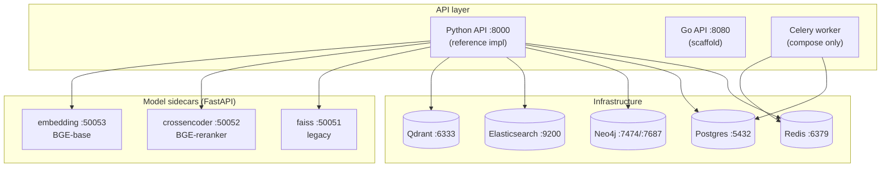

# RAGStack — Deployment & Infrastructure

How RAGStack is deployed **today**: a single-node dev/test stack via **Docker Compose**
or **Apptainer (rootless)**. This documents the infrastructure that actually exists and
how to bring it up — it consolidates setup knowledge previously scattered across
[CLAUDE.md](../CLAUDE.md), [STATUS.md](../STATUS.md), the `Makefile`, and the scripts.

> **Scope.** This is a **single-node dev/test** deployment. Production HA infrastructure
> (Kubernetes/Helm, IaC, multi-AZ replicas, autoscaling, monitoring stack, automated
> backup/restore) is **not built yet** — it is tracked as SPEC milestones **M7**
> (observability) and **M8** (production). See [the dev→prod boundary](#devprod-boundary)
> at the end, and the [HA reference design](design/ha-rag-reference-design.md) for the
> target topology (whose deployment section is explicitly aspirational).

---

## Topology (single node)



---

## Two deployment paths

| Path | When | Entry |
|---|---|---|
| **Docker Compose** | Laptop / any host with Docker | `make up-python` or `make up-go` |
| **Apptainer (rootless)** | Hosts without Docker; HPC; the `coconut` dev host | `make infra-up-apptainer` + `make sidecars-up-apptainer` |

Port convention (do not swap — hardcoded in `.env.example` and the conformance targets):
**Python API = 8000, Go API = 8080.**

---

## Gateway body cap for uploads (required)

`POST /v1/ingest/upload` is bounded inside the API (#202) — but FastAPI parses
a multipart body **before** any handler check runs, spooling every part to the
process's temp directory. The API refuses a request from its headers alone
(`Content-Length` over `MAX_UPLOAD_BYTES_PER_REQUEST` plus framing → `413`,
no `Content-Length` → `411`, before a byte is read), and everything else it
enforces — the allowlist, the per-file and per-request caps, the one-job-per-
user and hourly `429`s — decides only after the full body has been received.
So a client that **lies** about `Content-Length` (declares a small body and
sends a large one, or declares a huge one and idles) is stopped only by the
gateway in front of the API.

Every deployment must therefore put the API behind a reverse proxy that:

- caps the request body at about `MAX_UPLOAD_BYTES_PER_REQUEST` (default
  500 MB) — nginx `client_max_body_size 512m;`, Caddy `request_body { max_size 512MB }`,
  Traefik `buffering.maxRequestBodyBytes` — on the upload route at least;
- applies a client body read timeout (nginx `client_body_timeout`) so a
  socket that sends a few KB and idles does not hold a worker;
- forwards `Content-Length` unchanged (do not re-chunk the upstream request).

The API's temp directory (where the multipart parser spools) must have room
for `MAX_UPLOAD_BYTES_PER_REQUEST` × the number of concurrent uploads you
allow; `TMPDIR` on the API process selects it.

---

## Docker Compose

Compose is split into **layered files stacked with multiple `-f` flags** (not used standalone):

| File | Brings up |
|---|---|
| `deploy/docker-compose.infra.yml` | Qdrant · Elasticsearch · Neo4j · Postgres · Redis |
| `deploy/docker-compose.sidecars.yml` | embedding · crossencoder · faiss sidecars |
| `deploy/docker-compose.python.yml` | Python `api` (:8000) + Celery `worker` |
| `deploy/docker-compose.yml` | Go `api` (:8080) — this is the **base/Go** file |

The `make` targets do the stacking for you:

```bash
make infra-up        # infra only (5 stores)
make up-python       # infra + sidecars + Python API   (docker compose -f infra -f sidecars -f python up)
make up-go           # infra + sidecars + Go API
make down            # stop everything (all -f files combined)
```

For non-Docker dev of the API alone (stores/sidecars still needed):

```bash
make run-python      # uvicorn ragstack.api.main:app --reload --port 8000
make run-go          # build + run the Go binary on :8080
```

### Infrastructure services

| Service | Image | Port(s) | Role | Persistent volume |
|---|---|---|---|---|
| Qdrant | `qdrant/qdrant:latest` | 6333 | Vector store | `qdrant_data` |
| Elasticsearch | `elasticsearch:8.13.4` | 9200 | BM25 text index | `es_data` |
| Neo4j | `neo4j:5` | 7474 (UI), 7687 (bolt) | Knowledge graph | `neo4j_data` |
| Postgres | `postgres:16` | 5432 | Job store / metadata | `pg_data` |
| Redis | `redis:7-alpine` | 6379 | Cache / broker | — (ephemeral) |

ES runs single-node with security disabled and a 512 MB heap (`ES_JAVA_OPTS=-Xms512m -Xmx512m`) — dev sizing.

### Model sidecars

| Sidecar | Port | Default model | Device knob | Volume |
|---|---|---|---|---|
| embedding | 50053 | `BAAI/bge-base-en-v1.5` (768-d) | `SIDECAR_DEVICE` (`cpu`/`cuda`) | — |
| crossencoder | 50052 | `BAAI/bge-reranker-v2-m3` | `SIDECAR_DEVICE` + `CROSSENCODER_MAX_LENGTH` | — |
| faiss (legacy) | 50051 | FAISS flat index | — | `faiss_data` |

> ⚠️ The cross-encoder default (`bge-reranker-v2-m3` at `MAX_LENGTH=4096`) is **impractically slow on CPU** — query-path reranks will time out. For real use set `SIDECAR_DEVICE=cuda` **and** uncomment the GPU reservation in `docker-compose.sidecars.yml` (needs the nvidia-container-toolkit), or set `CROSSENCODER_MAX_LENGTH=512` to make CPU merely slow rather than unusable.

---

## Apptainer (rootless) — preferred on no-Docker / HPC hosts

Each container's writable directories are **bind-mounted to explicit host paths** under
`apptainer/data/<service>/<purpose>/`, so state persists across restarts and is
observable from the host. **Do not use `--writable-tmpfs` or opaque overlays** — enumerate
writable paths (see [CLAUDE.md](../CLAUDE.md) and [MEMORY.md](../MEMORY.md) for the rootless
quirks catalog).

```bash
sudo sysctl -w vm.max_map_count=262144   # one-time per host, required by Elasticsearch
make infra-pull-apptainer                # pull infra images as SIFs (~1 GB, one-time)
make sidecars-pull-apptainer             # base python SIF (one-time)
make infra-up-apptainer                  # start the 5 infra services
make sidecars-up-apptainer               # start embedding + crossencoder (~5 GB deps on first run)
make infra-down-apptainer && make sidecars-down-apptainer
```

The scripts honour `RAG_DATA` and `RAG_IMAGES` (default to in-repo `apptainer/data` and
`apptainer/images`), so a checkout under `~/Development/` and one under `/rag/repos/` can
coexist without clobbering each other's state.

### Production layout (`/rag/` on `coconut`)

The canonical deployed stack runs out of `/rag/` (see [STATUS.md § Production layout](../STATUS.md#production-layout-rag) for the full tree):

```
/rag/
├── repos/ragstack/      # git checkout (code = source of truth)
├── apptainer/images/    # SIFs
├── data/                # all service persistence
│   └── tenants/         # per-tenant stores + manifest.tsv (ADR-0005, see below)
├── documents/           # input corpus
├── config/rag.env       # RAG_DATA, RAG_IMAGES, RAG_REPO, NEO4J_PASSWORD
├── envs/ragstack/       # shared conda env (Python 3.12)
├── backups/             # DB snapshots (manual today)
└── bin/{rag,activate}   # operator wrapper + sourceable env
```

Operators use `/rag/bin/rag <make-target>` (sources `rag.env`, forwards to `make`).

---

## Tenants (ADR-0005)

Per [ADR-0005](adr/0005-tenant-anatomy.md), a tenant is **one API endpoint bound to a
dedicated set of stateful stores, sharing only stateless compute and the host**:

| Inside the tenant (dedicated) | Shared plumbing |
|---|---|
| API server process + its env (identity config, role maps) | embedding fleet |
| Qdrant instance | reranker sidecar |
| Elasticsearch instance | LLM endpoint |
| collection registry + job store + ACL database | frontend (backend switcher) |
| ingest staging directories | the host, GPUs |

Index-name separation inside a shared ES is **not** isolation; every tenant gets its own
single-node ES exactly as it gets its own Qdrant. The ES JVM heap is the dominant
per-tenant cost — size it with `--es-heap` below.

### Provisioning a tenant

Tenant creation is a **script, not an API** (ADR-0005 decision 4):

```bash
# preview the full plan (dirs, ports, files, commands) — touches nothing
./apptainer/new-tenant.sh acme --dry-run

# provision (sqlite ACL/registry/job stores under the tenant dir — the default)
make new-tenant-apptainer NAME=acme            # or /rag/bin/rag new-tenant-apptainer NAME=acme

# provision with a per-tenant DATABASE in an existing Postgres server instead
./apptainer/new-tenant.sh acme --postgres postgresql://ragstack:PW@localhost:5432/postgres

# size the ES heap for a large tenant (default 512m; persisted in the tenant's
# config/provision.env so later flagless re-runs keep it)
./apptainer/new-tenant.sh acme --es-heap 8g
```

Port allocation is tunable via `TENANT_PORT_BASE` (default `24000`, must be
≥ 10000) and `TENANT_PORT_STRIDE` (default `20`, must be ≥ 6) — set them only
before the first tenant; existing manifest rows are reused verbatim.

What the script stamps out, following the persistence conventions (every writable path
enumerated and bind-mounted; no tmpfs overlays):

- `$RAG_DATA/tenants/<name>/` — `qdrant/{storage,snapshots}`, `elasticsearch/{data,logs,config}`,
  `state/` (sqlite ACL/registry/jobs), `manifests/`, `ingest/`, `config/`, `bin/`
- a deterministic **port block** recorded in `$RAG_DATA/tenants/manifest.tsv`
  (one row per tenant: `name<TAB>index<TAB>base_port`; base `24000 + index*20`;
  offsets: +0 API, +1/+2 Qdrant http/grpc, +3/+4 ES http/transport, +5 reserved) —
  existing rows are reused verbatim, so re-runs and restarts never move a tenant's
  ports; concurrent runs are serialized with a flock on `manifest.tsv.lock`
- `config/tenant.env` — generated API keys/role maps, `DEFAULT_ROLE=user`,
  `MAX_COLLECTIONS=100`, per-tenant store URLs, shared `EMBEDDING_ENDPOINTS`,
  `REQUIRE_DURABLE_BACKENDS=true`, `INGEST_ROOT` confined to the tenant dir
- `bin/up.sh` / `bin/down.sh` — per-tenant start/stop wrappers in `up.sh`/`down.sh`
  style (instances `qdrant-<name>`, `elasticsearch-<name>`; shared SIFs reused —
  run `./apptainer/pull.sh` first)

The script is **idempotent**: re-running completes missing pieces. What is preserved
vs. regenerated:

- `config/tenant.env` — the one operator-editable file; an edited copy is **kept**
  (diff printed) unless `--force`
- `config/secrets.env` — generated once, never rotated by a re-run
- `config/provision.env` — persists `--es-heap` and the store kind, so a flagless
  re-run keeps them
- `bin/up.sh` / `bin/down.sh` — **derived artifacts, regenerated deterministically
  on every run**; hand edits to them do not survive (they say "do not edit")

If the tenant's `manifest.tsv` row was lost and a re-run would allocate a different
port block than the kept `tenant.env` uses, the script **dies** with restore
instructions instead of splitting the tenant across two blocks. It does not start
services unless `--start`.

Start the API against the stamped env:

```bash
set -a; . $RAG_DATA/tenants/acme/config/tenant.env; set +a
uvicorn ragstack.api.main:app --host 0.0.0.0 --port <api port from the plan>
```

> The two pre-ADR production tenants stay untouched until their migration (#246); the
> **ops architecture reference artifact still shows the shared ES** and is updated at
> migration time, not now.

### Auditing physical stores against the registries

ADR-0002 decision 5 says a physical index has exactly one registry entry. Nothing
enforces that for stores created outside the API, so the fleet accumulates
Qdrant collections and ES indices that no registry names. `store_inventory.py`
measures the gap. It is **report-only and never deletes anything**:

```bash
cd python
python scripts/store_inventory.py \
    --config-dir /rag/config --tenants-dir /rag/data/tenants --exclude rag
```

Statuses are deliberately not "orphan":

| status | meaning |
|---|---|
| `claimed` | a registry passed to this run names it, on this instance |
| `claimed-name-only` | matched by a registry whose backend could not be determined — the name agrees, the instance is unverified |
| `unclaimed-by-known-registries` | no registry passed to this run names it |
| `claimed-but-absent` | a registry entry whose store is missing from a probed backend |

**Pass every registry that shares the backends.** A registry left out — or one
the tool could not read, which it reports in a block above the store list —
turns each of its live stores into an `unclaimed` row. Two thirds of the residue
measured for [#293](https://github.com/wilke/ragstack/issues/293) was production
corpora whose API was merely stopped, so `unclaimed` is the start of an
investigation, not a delete list.

Two flags worth knowing:

- `--qdrant-storage URL=PATH` — Qdrant's API exposes no on-disk size, so sizes
  are blank unless you point at that instance's storage directory. ES sizes come
  from `_cat/indices` and are always present.
- `--exclude NAME` — drops a config by stem, for a shared layout env
  (`/rag/config/rag.env`) that sits beside the deployment configs but configures
  no API of its own.

Under [ADR-0005 decision 6](adr/0005-tenant-anatomy.md) a tenant exclusively owns
its stores, so **this report going empty for a tenant is that tenant's migration
completion signal**. Auto-reclaim stays out of scope until the bulk CLI stops
minting stores the registry never sees ([#263](https://github.com/wilke/ragstack/issues/263)).

---

## Service accounts

A **service account** is a machine identity authenticated by an `X-API-Key` secret
*we* mint, as opposed to a human identity authenticated by a token an external
issuer signed. Its `subject` **is** the `API_KEY_TENANTS` value for its key **and**
its authorization subject, so it can own collections, receive shares and join
groups under that one identifier — named on those surfaces with the explicit
**`@service:<subject>`** grantee/member form, which is what keeps the subject
colon-free (a bare value is qualified to `bvbrc:<value>`, a federated identity the
account never authenticates as). See
[API.md § Service accounts](API.md#service-accounts) for the two-namespace model
and the endpoint contracts.

Two rules that shape every runbook below:

- **The API never mints or stores key material.** `API_KEYS`, `API_KEY_TENANTS`
  and `API_KEY_ROLES` are environment settings with no writer in the server, so
  **credential changes are an env edit plus a restart**. The key and its tenant
  mapping must land in the **same** edit — with `REQUIRE_DURABLE_BACKENDS=true`
  startup fails if `API_KEY_TENANTS` is set and a configured key is unmapped.
- **`.../disable` is the only lever that works without a restart**, and it takes
  effect within `SERVICE_ACCOUNT_DISABLED_CACHE_TTL_SECONDS` (default `30`, hard
  capped at `300` — startup fails above it) per worker process, failing open if
  the user store is unreachable.
- **Disable somebody else's account, never your own.** The disabled check runs on
  the API-key path, so disabling the subject your own key maps to would 401 you
  out of the `/enable` that undoes it; the API refuses it with a **409**. For the
  same reason the reserved `default` / `public` tenants cannot be registered as
  service accounts at all — every unmapped key resolves to `default`.

### Provisioning a service account (`svc-askclark`) on the ASM tenant

Copy-pasteable with placeholders. Substitute your own values for every
`UPPERCASE` token; nothing below contains real hostnames, ports or key material.

| Placeholder | Meaning |
|---|---|
| `API_BASE` | base URL of the ASM tenant's API endpoint (scheme + host + port) |
| `TENANT_ENV` | path to that tenant's `config/tenant.env` |
| `ADMIN_KEY` | an existing key mapped to role `admin` on that tenant |
| `SVC_KEY` | the newly generated service-account key |
| `ASM_COLLECTION` | the collection id `svc-askclark` must read |

```bash
export API_BASE=https://API_HOST:API_PORT
export TENANT_ENV=/PATH/TO/TENANTS/ASM/config/tenant.env
export ADMIN_KEY=ADMIN_KEY_VALUE
```

#### 1. Generate the key and put it in the tenant env (restart required)

```bash
# Generate a key. Print it once, hand it to the consumer over a secure channel,
# and do not commit it or paste it into a ticket.
python3 -c 'import secrets; print("svc-askclark-" + secrets.token_urlsafe(32))'
```

Edit `$TENANT_ENV` and extend **all three** maps in the **same** edit — the key
must appear in `API_KEYS` *and* be mapped in `API_KEY_TENANTS`, or the API refuses
to start. These are **JSON values in a shell-sourced file** — keep the single
quotes and do not pipe them through `xargs` (the tenant-env header says the same):

```dotenv
# append SVC_KEY to the existing list
API_KEYS='["EXISTING_KEY_USER","EXISTING_KEY_ADMIN","SVC_KEY"]'
# the tenant string IS the authz subject; it must be colon-free
API_KEY_TENANTS='{"EXISTING_KEY_USER":"ASM_TENANT","EXISTING_KEY_ADMIN":"ASM_TENANT","SVC_KEY":"svc-askclark"}'
# role `user`, NEVER `admin` — admin bypasses every ownership and share check
API_KEY_ROLES='{"EXISTING_KEY_USER":"user","EXISTING_KEY_ADMIN":"admin","SVC_KEY":"user"}'
```

Restart the tenant's **API process** so the new settings are read (the stores keep
running; only the API reads these):

```bash
# stop the running API for this tenant, then start it against the stamped env
set -a; . "$TENANT_ENV"; set +a
uvicorn ragstack.api.main:app --host BIND_ADDR --port TENANT_API_PORT
```

Startup is the check: under `REQUIRE_DURABLE_BACKENDS=true` (what
`new-tenant.sh` stamps), a key present in `API_KEYS` but missing from
`API_KEY_TENANTS` makes the process refuse to boot, rather than silently landing
that caller in the shared `default` tenant.

> `svc-askclark` has no colon **by design**: `:` is reserved for federated
> `issuer:sub` subjects, and the #243 startup guard rejects a coloned
> `API_KEY_TENANTS` value whenever an identity provider is enabled, so a service
> account can never collide with a federated identity.

#### 2. Register the account

```bash
curl -sS -X POST "$API_BASE/v1/admin/service-accounts" \
  -H "X-API-Key: $ADMIN_KEY" -H 'Content-Type: application/json' \
  -d '{"subject": "svc-askclark",
       "purpose": "AskClark retrieval backend — read-only ASM query traffic"}'
# -> 201 {"subject":"svc-askclark", ..., "active":true}
```

Re-running returns the stored row unchanged (safe in a provisioning script). This
records the **account**, not the credential — step 1 is what makes the key work.

#### 3. Grant it `read` on the ASM collection(s) — not owner, not write

Use the **`@service:`** grantee form. It is required, not decorative:

```bash
curl -sS -X POST "$API_BASE/v1/collections/ASM_COLLECTION/shares" \
  -H "X-API-Key: $ADMIN_KEY" -H 'Content-Type: application/json' \
  -d '{"grantee": "@service:svc-askclark", "permission": "read"}'
```

**Check the echoed `grantee_id` before you trust the grant.** The response echoes
the *resolved* subject precisely so an unclaimable grant is visible:

- `"grantee_id": "svc-askclark"` — correct, the account can read the collection.
- `"grantee_id": "bvbrc:svc-askclark"` — **the grant is inert; you dropped the
  `@service:` prefix.** A bare, colon-free grantee is qualified with the default
  issuer, so that grant belongs to a *federated* subject that will never
  authenticate. Revoke it (`DELETE .../shares/<share_id>`), re-issue it with
  `@service:`, and do **not** work around it by passing a coloned value: a
  coloned subject is a different namespace and is not this service account.

Verify with a read as the service key (step 4a) before dropping the backfilled
`public` grant described under *Interaction with the ownership migration* below —
that grant is what keeps the collection readable in the meantime, which is why
dropping it is sequenced **after** this step verifies clean.

Repeat per collection. **Do not** transfer ownership to `svc-askclark` and **do
not** grant `write`: a read share is exactly what a query consumer needs, and it
leaves ingest and deletion impossible for that key by construction.

#### 4. Verify — it can read, and it cannot write or delete

```bash
export SVC_KEY=SVC_KEY_VALUE

# (a) queries the collection            -> 200
curl -sS -o /dev/null -w '%{http_code}\n' -X POST "$API_BASE/v1/query" \
  -H "X-API-Key: $SVC_KEY" -H 'Content-Type: application/json' \
  -d '{"query": "smoke test", "collection": "ASM_COLLECTION", "top_k": 1}'

# (b) cannot ingest into it             -> 403 (readable but not writable)
curl -sS -o /dev/null -w '%{http_code}\n' -X POST "$API_BASE/v1/ingest" \
  -H "X-API-Key: $SVC_KEY" -H 'Content-Type: application/json' \
  -d '{"source": "SOME_PATH", "collection": "ASM_COLLECTION"}'

# (c) cannot delete it                  -> 403
curl -sS -o /dev/null -w '%{http_code}\n' -X DELETE \
  "$API_BASE/v1/collections/ASM_COLLECTION" -H "X-API-Key: $SVC_KEY"

# (d) is not an admin                   -> 403
curl -sS -o /dev/null -w '%{http_code}\n' \
  "$API_BASE/v1/admin/service-accounts" -H "X-API-Key: $SVC_KEY"
```

If (b), (c) or (d) returns `2xx`, the key is over-privileged — almost certainly
`API_KEY_ROLES` says `admin`, or the account was made owner instead of a grantee.
Fix and restart before handing the key over.

#### 5. Rotation (planned)

Rotation is an **env edit + restart**, so overlap the two keys and the consumer
never sees an outage:

```bash
# 1. generate NEW_SVC_KEY
python3 -c 'import secrets; print("svc-askclark-" + secrets.token_urlsafe(32))'

# 2. add it alongside the old one — both map to the SAME subject and role
#    API_KEYS='[...,"OLD_SVC_KEY","NEW_SVC_KEY"]'
#    API_KEY_TENANTS='{...,"OLD_SVC_KEY":"svc-askclark","NEW_SVC_KEY":"svc-askclark"}'
#    API_KEY_ROLES='{...,"OLD_SVC_KEY":"user","NEW_SVC_KEY":"user"}'
# 3. restart  -> both keys now valid; no share or account change is needed
#    (the subject is unchanged, so every grant carries over untouched)
# 4. swap the consumer to NEW_SVC_KEY and confirm traffic on it
# 5. remove OLD_SVC_KEY from all three maps
# 6. restart  -> old key is now rejected
```

#### 6. Emergency revoke (leaked key)

```bash
# Stops the key WITHOUT a restart; effective within
# SERVICE_ACCOUNT_DISABLED_CACHE_TTL_SECONDS per worker process.
curl -sS -X POST "$API_BASE/v1/admin/service-accounts/svc-askclark/disable" \
  -H "X-API-Key: $ADMIN_KEY"      # -> 204

# Use an ADMIN_KEY that is NOT this account's own key: disabling the subject you
# authenticated as is refused (409), because it would 401 you out of /enable.
#
# Then make it authoritative: remove the leaked key from API_KEYS /
# API_KEY_TENANTS / API_KEY_ROLES, restart, and re-enable the account once the
# replacement key is in place. The re-enable records enabled_by/enabled_at and
# KEEPS disabled_by/disabled_at, so the incident stays on the record.
curl -sS -X POST "$API_BASE/v1/admin/service-accounts/svc-askclark/enable" \
  -H "X-API-Key: $ADMIN_KEY"      # -> 204
```

Disable is **soft and best-effort**: the check fails open when the user store is
unreachable, so it buys you the window to do the env edit — it does not replace it.

### The attribution consequence

Every request behind `svc-askclark` authenticates as **one subject**. The API sees
the service account, never the person who asked the question, so for that consumer:

- **per-user attribution is impossible** — logs, audit rows and `created_by`
  fields all read `svc-askclark`;
- **per-user authorization is impossible** — every end user of that consumer gets
  exactly the union of what `svc-askclark` can read, which is why the grant must
  be the narrowest read set that works, and why `admin` is never the right role.

This is accepted deliberately for a backend that has no way to pass end-user
identity through. It stops being true only when the consumer **propagates end-user
identity** — i.e. calls with the end user's own bearer token (or an on-behalf-of
exchange), at which point authorization is evaluated per user again and the
service account is no longer the subject.

### Interaction with the ownership migration (#246)

The #243 startup backfill gives **pre-existing** collections `owner=ACL_BACKFILL_OWNER`
(default `legacy:admin`) **plus a `read` grant to `public`** — deliberately
behaviour-preserving, so collections that were world-readable before ownership
existed stay world-readable.

That means a freshly backfilled ASM collection is already readable by everyone,
and step 3's grant is **belt-and-braces, not the thing that opens it**. Tightening
ASM to *a real owner + a grant to `svc-askclark` only*, dropping the `public`
grant, is a **deliberate follow-on decision under [#246](https://github.com/wilke/ragstack/issues/246)** —
it is a visible access change for every current reader and the backfill does not
and will not do it for you. Sequence it explicitly: register + grant
(steps 1–3) → verify the service account reads the collection **on its own grant**
→ only then `DELETE` the `public` share. If step 3's echo showed
`bvbrc:svc-askclark` (the `@service:` prefix was omitted), the service account has
**no grant of its own** and dropping `public` would cut it off — revoke that row
and re-grant with `@service:` first.

---

## Configuration

Copy `.env.example` → `.env` (compose loads it via `env_file`). Key variables:

| Group | Vars |
|---|---|
| Server | `PORT` (8000/8080), `LOG_LEVEL` |
| Stores | `QDRANT_URL`, `ELASTICSEARCH_URL`, `NEO4J_URI`, `NEO4J_PASSWORD`, `POSTGRES_URL`, `REDIS_URL` |
| Models | `EMBEDDING_MODEL`, `CROSSENCODER_MODEL`, `LLM_MODEL` |
| Sidecars | `EMBEDDING_SIDECAR_URL`, `CROSSENCODER_SIDECAR_URL`, `FAISS_SIDECAR_URL`, `SIDECAR_DEVICE` |
| Retrieval | `BM25_ENGINE`, `DENSE_WEIGHT`, `SPARSE_WEIGHT`, `RRF_K`, `MIN_RELEVANCE_THRESHOLD` |

Secrets today live in `.env` / `config/rag.env` (never committed). A real secrets manager
(Vault/cloud) is part of the M8 production work.

---

## Known gotchas

- **`.env.example` ships `NEO4J_PASSWORD=neo4j`, which is invalid for Neo4j 5** (it rejects the default password). The Apptainer `up.sh` defaults to `ragstack` instead; Docker-Compose users must override it.
- **`vm.max_map_count=262144` needs `sudo` on each new host** for Elasticsearch (not automatable in user space).
- **Embedding sidecar pulls CUDA libs even on CPU-only hosts** (sentence-transformers → torch + cuda), ~5 GB on disk; first-run install is slow.
- **Collection naming is scoped to `(model, dim)`** — data ingested under a different embedding model lands in a different Qdrant collection. Re-ingest or pin `QDRANT_COLLECTION` after a model change.
- **HTTPS push:** `origin` is HTTPS via `gh auth setup-git`; SSH pushes need `ssh-add` first.

---

## dev→prod boundary

What this deployment intentionally does **not** provide (all tracked, none built):

| Missing | Milestone |
|---|---|
| Kubernetes manifests / Helm chart | M8 |
| IaC (Terraform) for provisioning | M8 |
| Multi-AZ replicas, read replicas, failover | M8 |
| Horizontal autoscaling (HPA/KEDA) | M8 |
| Load / soak / chaos testing | M8 |
| Automated backup/restore + runbook | M8 (`backups/` is manual today) |
| Prometheus metrics / OpenTelemetry / Grafana | M7 |
| TLS termination, secrets manager, mTLS between services | M8 |

For the target production topology see the [HA reference design](design/ha-rag-reference-design.md)
(its §6.5 is explicitly aspirational) and the milestone-mapped gap issues filed from the
[design review & contrast](design/ha-rag-review-and-contrast.md).
