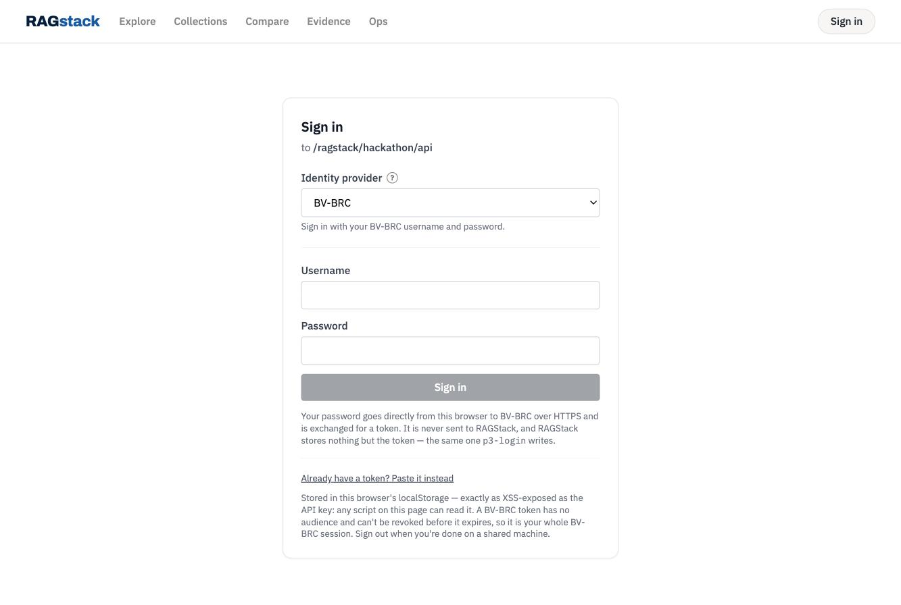
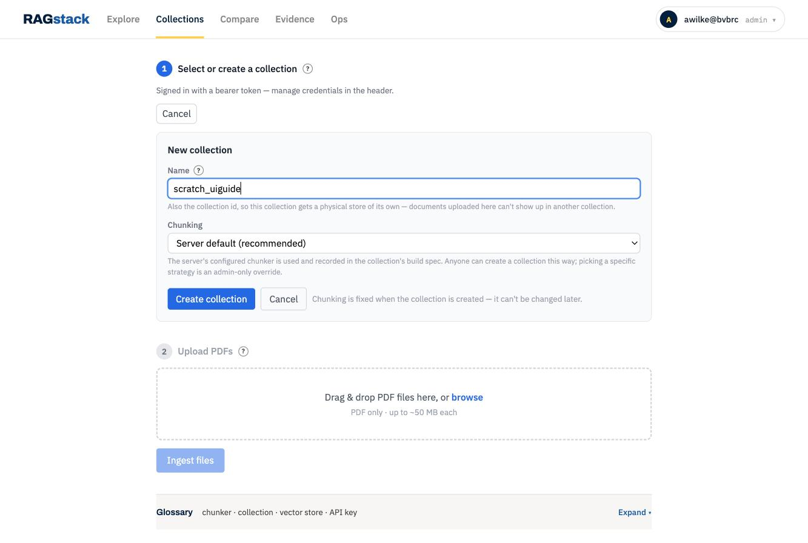
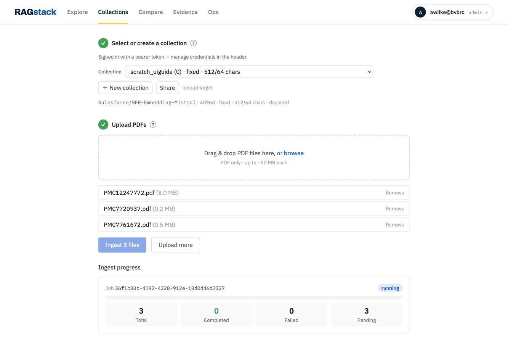
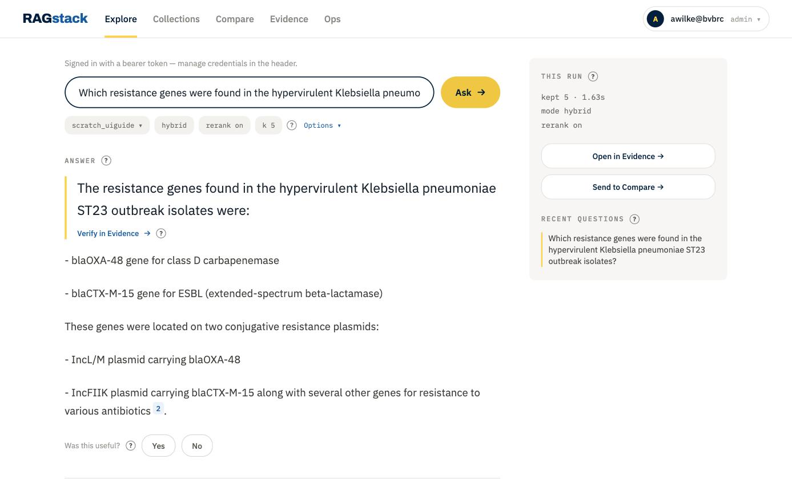
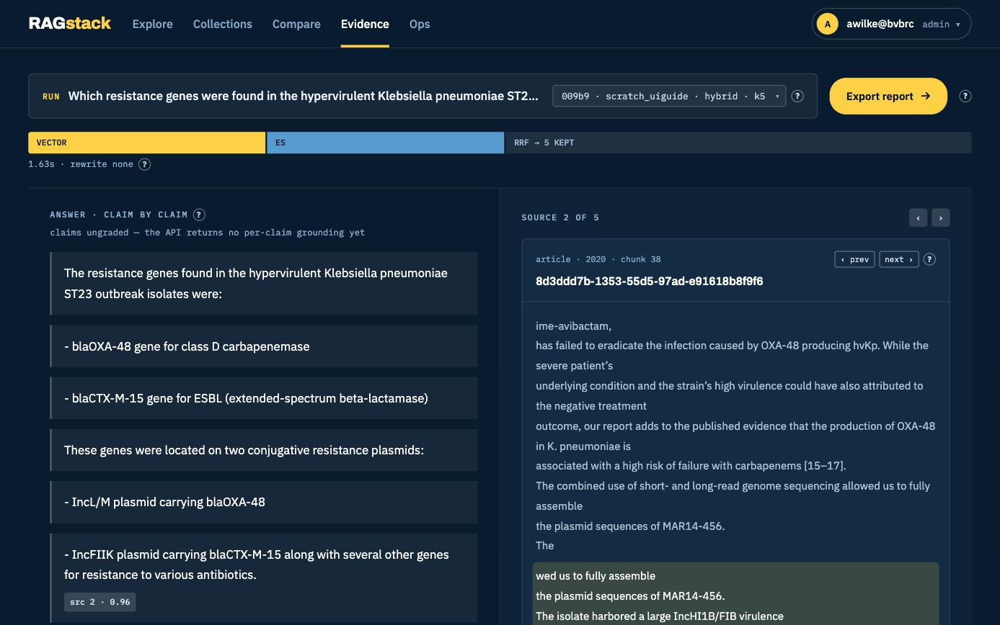
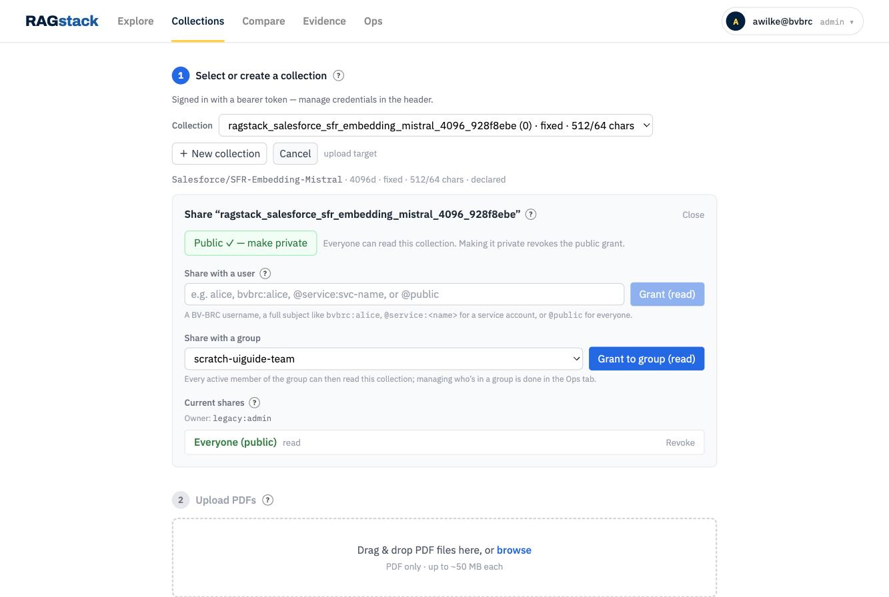
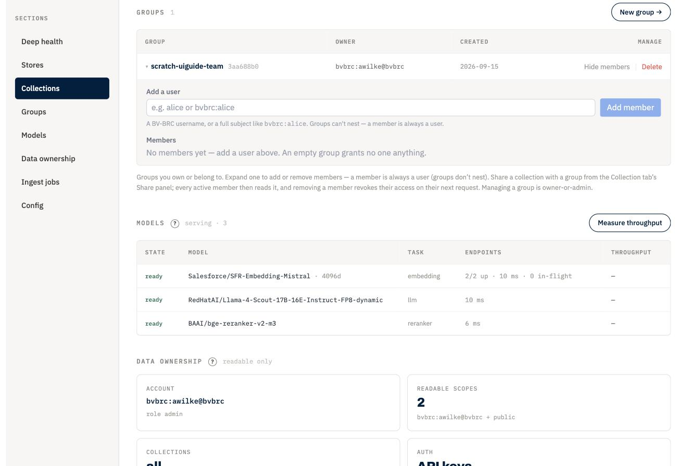

# Using the RAGStack app in your browser

A click-by-click walkthrough of the tenant web app: sign in, make a collection,
put documents in it, ask questions, share it. Everything here is doable without a
terminal.

For the hackathon deployment's URLs and limits, see [HACKATHON.md](HACKATHON.md).
For the same ground as copy-paste API calls, see [cookbook-users.md](cookbook-users.md).

> Screenshots are of the hackathon tenant.

## What you are looking at

Open your tenant's UI URL — for the hackathon deployment,
<https://www.bv-brc.org/ragstack/hackathon/ui/>. The app has a row of tabs:

| Tab | What it is for |
|---|---|
| **Explore** | Ask a question, read a cited answer. Where you will spend most of your time. |
| **Collections** | Create a collection, upload documents into it, share it. |
| **Compare** | Run one question through several retrieval settings side by side. |
| **Evidence** | The claim-by-claim view of one run, with a reader for the surrounding text. |
| **Ops** | Mostly operator telemetry — but **Groups** lives here, and Groups works for everyone. |

You may also see a **Grading** tab. It only appears when the server has grading
batches loaded, so on most deployments you will not see it, and nothing in this
guide needs it.

The tenant is fixed by the URL you opened. There is no tenant picker.

## Signing in

The sign-in control is in the **header**, on the right. There are three ways in:

- **BV-BRC username and password** — the ordinary path. Your password goes from
  your browser directly to BV-BRC; RAGStack only ever receives the token that
  comes back.
- **Paste a token** — the same value `p3-login` writes to `~/.patric_token`.
- **API key** — if an operator issued you one.

*Signing in: BV-BRC is the identity provider, and the panel says outright that your
password goes directly to BV-BRC. “Already have a token? Paste it instead” is the
second route.*

Two things that catch people out:

- **On a plain-HTTP deployment the password form does not render at all.** The
  app refuses to show a password field on an insecure page. Use the HTTPS URL, or
  paste a token instead.
- **If the app is served through a proxy whose hostname it does not recognise,
  every request fails before it is routed.** That is a deployment setting
  (`VITE_ALLOWED_HOSTS`), not something you can fix from the browser — tell an
  operator.

Your credential is remembered in the browser, per deployment, and is bound to the
API it was confirmed against. Point the app at a different backend and it will not
send your token there.

## Creating a collection

Go to **Collections** and click **＋ New collection**.

*Chunking stays on “Server default (recommended)”. Note the form tells you chunking is
fixed when the collection is created — like the name, it is not editable later.*

- **Name.** This is both the id and the display label, so it must be unique on the
  whole deployment, and **it cannot be changed later** — there is no rename
  anywhere in the product. Pick something you can live with.
- **Chunk strategy.** Leave it on **Server default (recommended)**. The other
  option, **Choose a strategy (admin only)**, is exactly what it says; picking it
  without an admin credential returns a refusal.

The collection is **private to you** the moment it exists. Nobody else can read it,
or even tell that it exists, until you share it.

**If you are at your collection limit,** the app tells you so directly — how many
you own, what the limit is, and what to do about it. The remedies are to delete a
collection you own, or to transfer one to another owner. Renaming does not help:
the limit counts collections you own, not names.

## Uploading documents

Same tab, with your collection selected: drop files into the upload area.

*A real job mid-flight: the job id, a `running` badge, and the counts — 3 total, 0
completed, 0 failed, 3 pending. This is what you watch; it is not instant.*

- **PDFs only, in the browser.** The picker offers nothing else. The API also
  accepts plain text, Markdown and XML (JATS) — which is how the open-access
  corpora were built — so for those use `POST /v1/ingest/upload` directly.
- **Three separate limits:** up to 50 files per upload, 50 MB per document, and
  500 MB total per upload. A single oversized file and an oversized batch are
  refused for different reasons.
- **One ingest job at a time**, per person. Start a second while one is running
  and you get a refusal with a retry hint — wait. (Admin principals are exempt,
  so an operator demoing may not see this.)

Progress appears as the job runs, per document. Ingest is not instant: the files
are uploaded, then chunked and embedded in the background.

**If it ends in `failed`,** the app cannot tell you why — the reason is only
visible to an operator. Note the time and ask one.

**Retrying with the same file needs a new name.** A filename already present in the
collection's sources is refused rather than replaced — *"'X.pdf' already exists in
the collection's sources … it was left untouched"* — and the message names the API
remedy. Rename the file, or use a fresh collection, when retrying a failed upload.

On deployments that run ingest through BV-BRC (including the hackathon tenant),
your uploads are written into **your own BV-BRC Workspace**, not onto the RAGStack
server, and processed by a workflow running as you. This is also why upload needs
a BV-BRC token specifically — an API key alone is refused.

## Asking a question

Go to **Explore**. Before you ask, **pick your collection in the chip row just
below the question box** — that is the collection picker, and it is easy to miss.

*The chip row — collection, `hybrid`, `rerank on`, `k 5`, Options — sits directly under
the question box. The answer carries a `[2]` citation chip, and THIS RUN reports what
the query actually did: kept 5, 1.63s.*

Type your question and submit. You get an answer with **numbered citation chips**
— `[1]`, `[2]` — each pointing at the source chunk it came from. Click one to see
the passage it is claiming.

The answer is built from several retrieval legs at once: vector similarity,
keyword matching, and on some deployments a knowledge-graph leg, fused together
and optionally re-ranked.

> On a collection **shared to you by someone else**, the text legs return the
> owner's documents but the graph leg contributes nothing. You still get answers;
> they just will not include graph-derived context.

## Reading around a hit

A single chunk is often not enough context. Open **Evidence** for a claim-by-claim
view of one run, with previous/next controls that walk you through the
surrounding text of the document a citation came from.

Evidence paints itself in dark chrome by design — coming from the light Explore
screen, that is the app working as intended, not a theme glitch.

**Compare** is the other direction: the same question, several retrieval
configurations, side by side. Useful when you are trying to work out whether a
disappointing answer is the corpus's fault or the settings'.

*Claim-by-claim on the left; on the right, SOURCE 2 OF 5 with the ‹ prev / next ›
reader. The bar across the top shows which retrieval legs contributed — VECTOR, ES,
then RRF fusing them to 5 kept.*

## Sharing a collection

**Collections → Share** on the collection you want to share.

*An owner row, a public read grant with its Revoke control, the share-with-a-user
field and the group dropdown. “Public ✓ — make private” toggles the one `@public` row.*

You can grant:

- **A person** — their BV-BRC username is enough.
- **A group** — see below.
- **Everyone**, with **Make public**.

All shares are **read-only**. There is no way to grant someone write access to
your collection; a share never lets the recipient upload into it. Revoking a
share takes effect immediately.

The Share button appears on every collection in the list, because the listing
deliberately does not reveal who owns what. If you try to share something that is
not yours, you get a refusal the dialog explains.

**Transferring ownership is API-only** — there is no control for it in the app.
See [cookbook-users.md](cookbook-users.md).

> **Transfer moves ownership, not searchability.** Documents are stamped with the
> owner's identity when they are ingested, and nothing re-stamps them on transfer,
> so the new owner receives a collection they cannot search. Sharing does not have
> this problem — a share widens the recipient's view correctly; it is ownership
> transfer specifically that breaks. Tracked as
> [#558](https://github.com/wilke/ragstack/issues/558). Prefer sharing until it is
> fixed.

### Groups

Groups live under the **Ops** tab, which is a slightly odd home for them but is
where they are. Any signed-in user can create a group, becomes its owner, and can
add and remove members. Then share a collection with the whole group at once
instead of person by person.

*Groups under Ops: owner, created date, the add-a-user form, and the reminder that an
empty group grants no one anything. Captured on an admin account, so every Ops section
is live here; on an ordinary account about half show a dim admin-only note instead.*

## About the Ops tab

It is visible to everyone, but most of it is operator telemetry. On an ordinary
account roughly half the panels — deep health, model status, configuration, jobs —
show a dim **admin-only** note instead of data, and the section list marks them.
That is expected, not a fault.

The parts that work for any signed-in user: **Groups**, collection listing, and
store statistics.

## What is not in this app

- **Document listing and deletion** — API only.
- **Ownership transfer** — API only.
- **Collection rename** — does not exist anywhere.
- **Prompt templates** — used by the literature console, not this app.
- **The operator control plane** at `/ragstack/admin/ui/` is a different
  application for running the deployment. It is not for attendees.
- **The literature console** at `/ragstack/litdemo/` is a separate BV-BRC app for
  structured extraction from papers. It does not read your collections, and it is
  changing during the event — treat anything you learn there as provisional.
