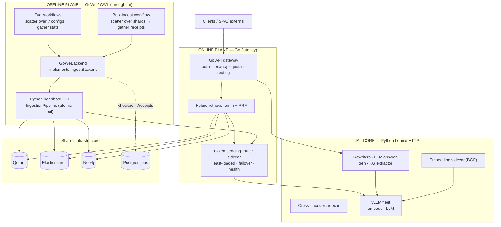

# ADR 0001 — Execution topology: workflow engine, Go, and Python ownership

- **Status:** Proposed
- **Date:** 2026-07-02
- **Deciders:** @wilke
- **Supersedes:** —
- **Related:** [#25](https://github.com/wilke/ragstack/issues/25) (ingest-script re-implements the pipeline), [#41](https://github.com/wilke/ragstack/issues/41) (Go parity for KG extraction), [#71](https://github.com/wilke/ragstack/issues/71) (ingest resume hardening), [ARCHITECTURE-DEEP-DIVE.md](../ARCHITECTURE-DEEP-DIVE.md)

## Context

RAGStack is a polyglot monorepo (Python/FastAPI + Go/Chi) behind one OpenAPI contract, with ML model work isolated in FastAPI **sidecars**. Two extension seams already anticipate this decision:

- `IngestBackend` ([`python/ragstack/ingestion/backends.py:30`](../../python/ragstack/ingestion/backends.py)) decouples *what* runs (a shard of work) from *where* it runs. Its own docstring names the intended future runners: *"A Parsl / GoWe / k8s runner can [slot in]."*
- The OpenAPI + `conformance/` suite (selected by `RAGSTACK_IMPL`) lets the HTTP surface be re-implemented in another language without breaking clients.

Two forces make the "which language / which engine" question live now:

1. **The offline plane hand-rolls orchestration.** `scripts/ingest_jsonl.py` re-implements a bounded producer→worker pipeline, a checkpoint frontier, out-of-order `done_ranges`, in-process retries, and resume (#65/#68/#70/#71) — and duplicates correctness-critical library logic (#25). The eval harnesses are monolithic scripts that are, structurally, scatter-gather.
2. **The online plane wants lower tail latency and cheaper concurrency** than an asyncio + GIL runtime gives, especially for pure network orchestration (the multi-endpoint embedder pool, the retrieval fan-in, the auth/tenancy gateway).

## Decision drivers

- **Don't fork logic** — #25 already shows the cost of two ingest implementations drifting. One owner per responsibility.
- **Keep ML in Python behind HTTP** — torch / transformers / PyMuPDF / nltk have no viable Go path; the sidecar boundary already isolates them.
- **Spend engineering where it moves the needle** — the semantic bulk-ingest path is GPU-bound (~1 doc/s across 8 GPUs; ~374 breakpoint embeds/doc), so orchestration language is nearly irrelevant *there*; the payoff of Go/workflow work is conditional and must be stated honestly.
- **Leverage the seams that already exist** (`IngestBackend`, the conformance contract) so each move is low-risk and independently shippable.

## Decision

Organize the system into **two planes with three owners**, along the seams that already exist.

### 1. Offline / throughput plane → **CWL workflows executed by GoWe**
Bulk ingestion, the eval/benchmark harnesses, and maintenance/migration jobs are expressed as CWL DAGs and run by GoWe via a new `GoWeBackend` implementing `IngestBackend`. The workflow engine owns scatter, retry, checkpoint, and resume — **subsuming** the bespoke machinery in `ingest_jsonl.py` (#71) and removing the reason for the #25 duplication. The **atomic per-shard tool stays the Python CLI** (reusing `IngestionPipeline` and its ML deps); GoWe only orchestrates it.

### 2. Online / latency plane → **Go for network orchestration**
The API gateway (routing, API-key auth, tenancy scoping, per-tenant quota), the hybrid-retrieval fan-in + RRF, and — highest value — the **multi-endpoint embedder pool**, extracted as a standalone **Go embedding-router sidecar** in front of the vLLM fleet. Gated by the conformance suite.

### 3. ML / scientific core → **stays Python, behind HTTP**
Model sidecars (embedding BGE, cross-encoder), semantic chunking's embedding, the HF tokenizer, PDF loading, enrichment, and (near-term) the LLM answer-gen / rewriters / KG extractor. Never ported to Go; reached over HTTP from either plane.

### Component ownership

| Component | Owner | Rationale |
|---|---|---|
| Eval/benchmark harnesses | **GoWe/CWL** | Pure scatter-gather over configs; file outputs; reproducible. Lowest-risk entry point. |
| Bulk corpus ingestion | **GoWe/CWL** | `manifest→shard→pipeline` is scatter-gather; engine replaces #71 resume machinery via `GoWeBackend`. |
| Maintenance / re-index / DOI-verify / backups | **GoWe/CWL** | Periodic, batch, DAG-shaped. |
| Embedder pool (`embed_pool.py`) | **Go** (router sidecar) | Pure I/O orchestration; goroutines/channels beat asyncio+GIL for fan-out/health/failover. Wins regardless of model. |
| API gateway (auth, tenancy, quota, routing) | **Go** | `security.py`/`tenancy.py`/`quota.py` are pure logic; Chi scaffold exists; conformance gates it. |
| Hybrid retriever fan-in + RRF | **Go** | Concurrent legs + trivial CPU; latency-critical query path. |
| Store/job clients (Qdrant, ES, Neo4j, Postgres) | **Go** (with gateway) | HTTP/bolt/SQL; port alongside the API. |
| Per-shard ingest tool (`IngestionPipeline`) | **Python CLI** | Reused unchanged as GoWe's atomic step; avoids #25 fork. |
| LLM answer-gen / rewriters / KG extraction | **Python → Go later** | Just HTTP + prompts + JSON; port only for Go-API parity (#41). |
| Model sidecars (embedding, cross-encoder) | **Python (never Go)** | torch / sentence-transformers; already HTTP-isolated. |
| Semantic chunker / HF tokenizer / PDF / enrichment | **Python** | Model/tokenizer/PyMuPDF/nltk bound. *Exception:* fixed/token chunkers become Go-able via the existing `EndpointTokenCounter` (vLLM `/tokenize`). |

## Target architecture



## Consequences

**Positive**
- Retires the bespoke resume/checkpoint machinery (#71) and removes the #25 duplication by making the workflow engine — not a reimplemented in-process loop — own bulk orchestration.
- Evals gain reproducibility (the DAG + inputs are captured) and free cross-GPU parallelism.
- The embedder pool and gateway get a runtime (Go) suited to their I/O-orchestration shape; better p99 and concurrency density on the query path.
- ML stays where the ecosystem is; the HTTP sidecar boundary is unchanged.

**Negative / costs**
- A second execution substrate (GoWe/CWL) to operate, plus CWL's file-in/file-out model vs. DB-side-effect steps (mitigated by emitting **receipt files** as step outputs — see Appendix B).
- A Go embedding-router is a new deployable; the Go gateway is a real re-implementation effort (conformance-gated but non-trivial).
- Two languages on the online plane during migration.

**Risks & mitigations**
- *Logic fork (the #25 trap).* → **One owner per responsibility**; the per-shard tool stays the single Python `IngestionPipeline`; Go and Python never both own ingestion logic.
- *Over-investing where the GPU is the ceiling.* → Sequence Go/workflow work to the **query path + embedder pool first** (model-independent wins); expect little bulk-ingest throughput gain until the build moves off the semantic path toward `fixed_tok512` + faster embedders.

## Rollout (lowest risk → highest)

1. **CWL for the eval harnesses** — pure batch, file outputs, zero service risk. (Appendix B.)
2. **`GoWeBackend` for bulk ingest** via `IngestBackend`, Python CLI as the atomic step. Retires #71 machinery; dissolves #25. (Appendix A.)
3. **Go embedding-router sidecar** in front of vLLM — highest-value Go win, minimal blast radius.
4. **Go API gateway** (auth/tenancy/quota/routing + retrieval fan-in), conformance-gated. Python keeps ingestion-library, rewriters, LLM, KG until #41.
5. **Model sidecars stay Python** permanently.

---

## Appendix A — `GoWeBackend` sketch (implements the existing seam)

```python
# python/ragstack/ingestion/backends.py already defines:
#
#   @runtime_checkable
#   class IngestBackend(Protocol):
#       async def run_shards(self, shards, shard_fn): ...
#
# A GoWe runner slots in without touching ShardedIngestor:

class GoWeBackend:
    """Submit each shard as a GoWe workflow step instead of an in-process task.

    Each shard_fn call is materialized as a CWL CommandLineTool invocation of the
    per-shard Python CLI; GoWe owns scatter, retry, checkpoint, and resume — so the
    #65/#70/#71 done_ranges/frontier logic is no longer this process's concern.
    The step's CWL output is a *receipt* (chunk ids + catalog rows); the Qdrant/ES
    upsert is the step's side effect.
    """
    def __init__(self, client: "GoWeClient", *, per_shard_tool: str) -> None:
        self._client = client
        self._tool = per_shard_tool  # e.g. "python -m ragstack.scripts.ingest_shard"

    async def run_shards(self, shards, shard_fn):
        # shard_fn is ignored on this backend: the *tool*, not an in-proc callable,
        # is the unit of work. Submit a scatter over shards and await receipts.
        run = await self._client.submit_scatter(tool=self._tool, items=list(shards))
        return await self._client.await_receipts(run)  # -> list[ItemResult]
```

## Appendix B — CWL scatter template for the 7-way chunking eval

A runnable-shaped template (CWL v1.2) that scatters the eval over the 7 configs and
gathers the stats. See [`examples/eval-7way.cwl`](examples/eval-7way.cwl).

```yaml
cwlVersion: v1.2
class: Workflow
requirements:
  ScatterFeatureRequirement: {}
inputs:
  configs: { type: string[] }      # e.g. [fixed_char512, fixed_tok512, ...]
  corpus:  { type: File }
steps:
  ingest_and_score:
    scatter: config                # one independent run per config, across GPUs
    in: { config: config, corpus: corpus }
    out: [metrics]
    run:
      class: CommandLineTool
      baseCommand: [python, -m, ragstack.scripts.eval.chunk_one]
      inputs:
        config: { type: string, inputBinding: { prefix: --config } }
        corpus: { type: File,   inputBinding: { prefix: --corpus } }
      outputs:
        metrics: { type: File, outputBinding: { glob: metrics.json } }
  aggregate:                        # gather: paired-bootstrap CIs + Wilcoxon/Holm
    in: { metrics: ingest_and_score/metrics }
    out: [report]
    run:
      class: CommandLineTool
      baseCommand: [python, -m, ragstack.scripts.eval.aggregate_stats]
      inputs:
        metrics: { type: File[], inputBinding: { prefix: --metrics } }
      outputs:
        report: { type: File, outputBinding: { glob: report.md } }
outputs:
  report: { type: File, outputSource: aggregate/report }
```
