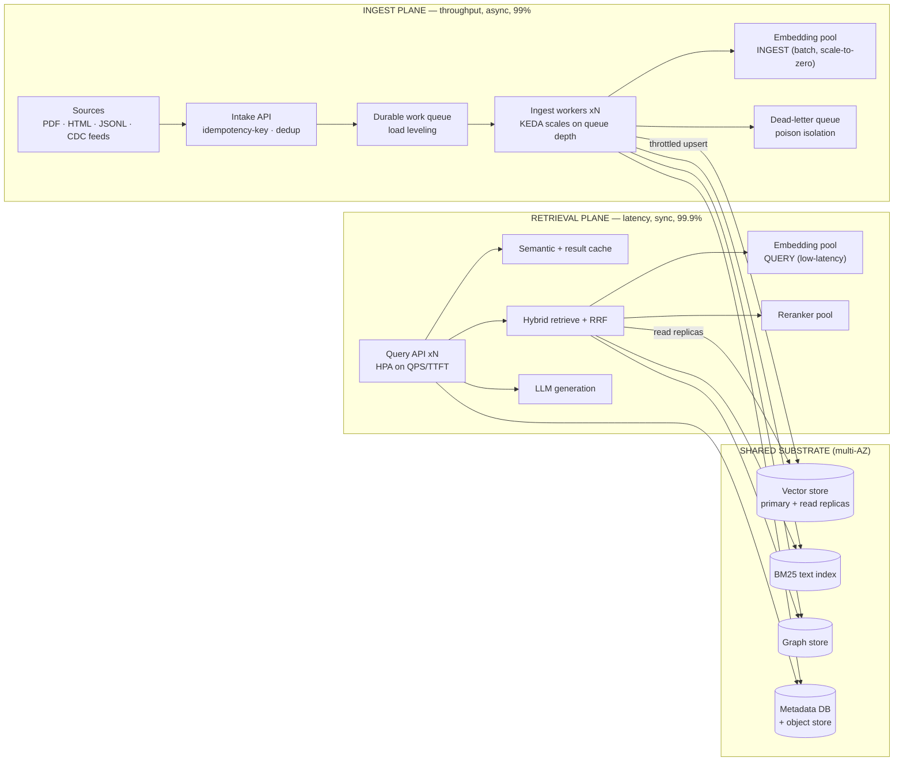
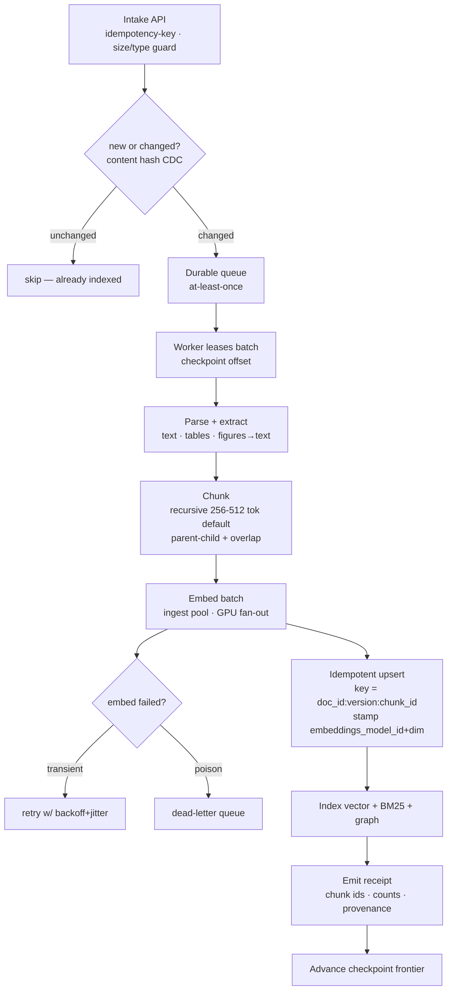
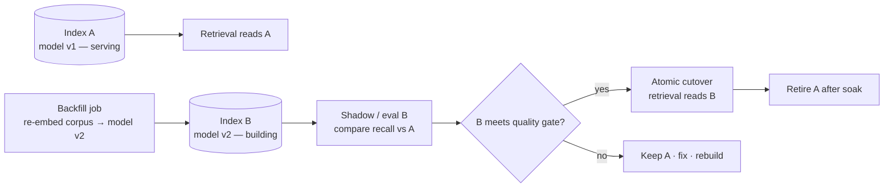
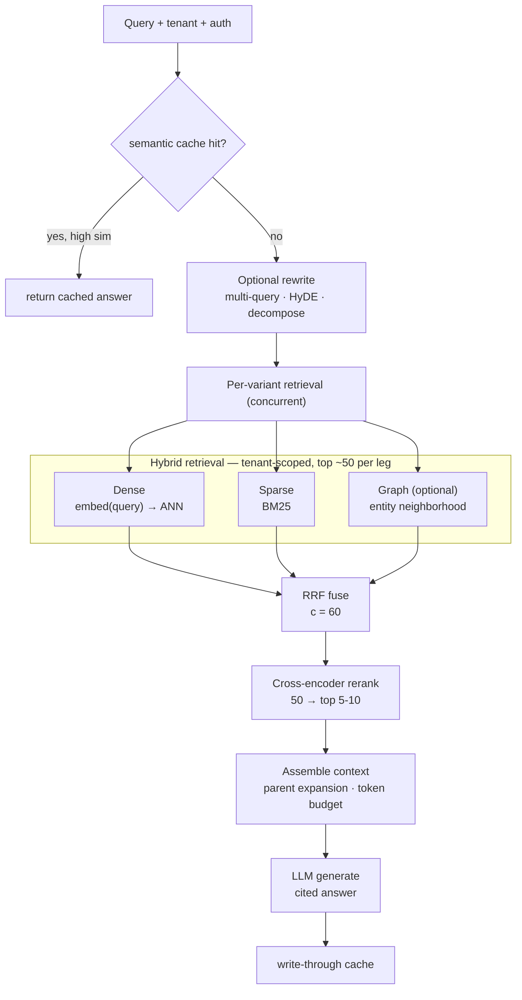

# A High-Availability, Horizontally Scalable RAG — Independent Reference Design

**Status:** Design study (clean-room; deliberately independent of RAGStack's current code, to be contrasted afterward)
**Date:** 2026-07-02
**Author:** research-grounded synthesis (sources at end)

This document designs a production-grade Retrieval-Augmented Generation system from
first principles, optimized for **high availability** and **horizontal scalability**.
Its organizing decision is the **physical separation of the ingest plane from the
retrieval plane** — the two have orthogonal objectives, scaling shapes, and SLAs, and
must be able to scale and fail independently.

---

## 1. Goals, non-goals, principles

**Goals.** Serve low-latency retrieval at high QPS with 99.9%+ availability; ingest and
re-index large corpora at high throughput without degrading live retrieval; multi-tenant
isolation; safe embedding-model migration; full observability; graceful degradation under
partial failure.

**Non-goals.** Prescribing one vendor; training embedding/LLM models; sub-100ms
end-to-end when an LLM is in the loop (generation dominates and is budgeted separately).

**Principles.**
1. **Two planes, not one.** Ingest is throughput-oriented and may run offline/async; retrieval is latency-oriented and must be HA. Separate them physically. *(Redis "RAG at Scale"; Azure RAG guide; Vertex AI bills these stages separately.)*
2. **The vector store is the one shared organ** both planes touch — protect it: reads from replicas, writes throttled, never let a re-index starve live queries.
3. **Everything on the write path is idempotent** (stable composite keys, upserts) so retries and replays are safe. *(Stripe idempotency; Flink/Kafka delivery semantics.)*
4. **Degrade, don't fail.** Every retrieval stage has a cheaper fallback; a partial answer beats an error. *(Google SRE; graceful-degradation pattern.)*
5. **Stateless services, state in backing stores** — the prerequisite for horizontal scaling and autoscaling. *(12-factor VI.)*
6. **Contract-first API** with conformance tests as the compatibility gate.

---

## 2. The two-plane split (the core decision)

| Dimension | **Ingest plane** | **Retrieval plane** |
|---|---|---|
| Objective | Throughput (docs & tokens/s) | Latency (p99) |
| Mode | Async / batch / scheduled | Real-time, synchronous |
| Latency tolerance | High (hours OK) | Low (sub-second retrieval) |
| Availability SLO | 99% (backlog degrades *freshness*) | 99.9%+ (outage = downtime) |
| Scale trigger | Corpus size, change rate, re-embed events | Query QPS, concurrency |
| Scale shape | Bursty; scale-to-zero between jobs | Steady + peaks |
| Autoscale signal | **Queue depth (KEDA)** | **QPS / TTFT (HPA)** |
| Dominant cost | Embedding GPU compute | Vector search + reranker + LLM tokens |
| Key HA tactic | Retry/DLQ, resumable jobs, throttled writes | Replication, read replicas, failover, caching |
| Failure impact | Stale/missing content | Wrong/no answer, downtime |

**Consequence:** the two planes get **separate deployables, separate autoscalers, and
separate embedding pools** (see §5.4), so a bulk re-embed can't contend for the GPUs or
vector-store CPU serving live queries — a bulkhead at the system level.

---

## 3. Ingest plane

### 3.1 Flow
`intake → queue → chunk → embed → index (vector + text + graph) → receipt`, per shard.

### 3.2 Scaling & availability
- **Queue-based load leveling.** A durable queue (Kafka/SQS/Redis Streams) decouples intake from processing so the pipeline consumes at its own steady rate and is provisioned for *average*, not peak. *(Azure queue-based-load-leveling.)*
- **KEDA queue-depth autoscaling**, scale-to-zero between jobs — the true load signal for embedding work is backlog, not CPU. *(KEDA.)*
- **Embedding throughput** is the bottleneck; saturate GPUs with continuous batching (vLLM/TEI), disaggregated tokenization/inference, and multiple replicas per GPU — Snowflake reports up to **16× (short) / 4.2× (long) over baseline vLLM**. *(Snowflake engineering.)*
- **Availability is lower by design** (99%): a worker outage grows a backlog (freshness lag), not user-facing downtime. Workers are stateless; the queue is the durable state.

### 3.3 Correctness: idempotency, resumability, poison isolation
- **At-least-once + idempotent sink.** Composite key `doc_id:version:chunk_id`, deterministic; re-processing overwrites in place — no duplicates. Most pipelines are correct with at-least-once + idempotent upsert; reserve exactly-once for ledgers. *(Kafka/Flink semantics.)*
- **Checkpointing frontier** persists input offsets so a restart resumes from the last committed point, not from scratch. *(Flink checkpointing.)*
- **DLQ / poison isolation.** A malformed/repeatedly-failing item is routed to a dead-letter queue (with alerting on depth) instead of blocking or infinitely recycling the batch. Transient failures retry with backoff + jitter.

### 3.4 Incremental re-index (CDC) and cost control
- **Content-addressable hashing per chunk**: on re-ingest, re-embed only changed chunks (~10–15%), not 100% — a major cost lever. *(Airbyte; CDC-for-unstructured.)*
- Sources with transaction logs use CDC (Debezium) for near-real-time updates; file/VCS sources diff on timestamp/commit.

### 3.5 Embedding-model migration (the hardest lifecycle event)
Stamp **`embeddings_model_id` + dimension per chunk**; run a **blue-green index**:

Old and new embeddings coexist during migration; retrieval never stops; rollback is a
pointer flip. *(Reindex-on-model-change best practice.)*

---

## 4. Retrieval plane

### 4.1 Flow — two-stage funnel with degradation

### 4.2 Latency budget (p99, retrieval + generation)
| Stage | p99 target | Notes |
|---|---|---|
| Cache lookup | ~5 ms | short-circuits everything below on hit |
| Query embed | ~30 ms | query embedding pool, warm |
| Vector ANN | ~30–50 ms | HNSW, recall ≥ 0.95; single-digit ms achievable on well-tuned indexes |
| BM25 | ~30 ms | parallel with dense |
| RRF fuse | ~1 ms | rank-only, negligible |
| Rerank | ~150–250 ms | budgeted; first thing dropped under load |
| Generation | ~1.3–4 s | dominates; TTFT/ITL budgeted separately |
| **Retrieval-only p99** | **< 800 ms** | |
| **End-to-end p99** | **< 6 s** | LLM-bound |

### 4.3 High availability
- **Stateless query API**, N replicas behind an L7 load balancer with **least-request** routing; **HPA on QPS and TTFT** (e.g. scale out if TTFT p90 > 2 s).
- **Vector reads from replicas**, isolated from ingest writes.
- **Timeouts + circuit breakers + bulkheads** around every model-sidecar call (embedding, reranker, LLM) — a slow model endpoint is the classic cascading-failure trigger; separate connection/thread pools per dependency. *(SRE cascading-failure; bulkhead pattern.)*
- **Load shedding** at the edge under saturation; **rate limiting** per tenant/key with `429` + retry hints.

### 4.4 Graceful degradation ladder
On dependency failure or budget pressure, degrade in this order — each step still returns
a useful 200:
1. **LLM down** → return ranked sources with a "generation unavailable" note.
2. **Reranker down / over budget** → skip rerank, return RRF-fused order.
3. **Query-embedding pool down** → **BM25-only** retrieval (lexical still works).
4. **Vector store degraded** → serve from result cache; mark results stale.
5. **Everything cold** → cache-only / "temporarily degraded" with retry-after.

### 4.5 Caching
- **Semantic cache** (query→answer, cosine-similarity match) can cut LLM cost up to ~68% and slash tail latency; guard the similarity threshold to avoid serving near-but-wrong answers. *(Semantic-cache studies; banking false-positive case.)*
- **Embedding cache** for repeated/near-identical query text.
- **Result cache** (write-through) for exact-repeat queries; keyed with `tenant_id` to prevent cross-tenant leakage.

---

## 5. Shared substrate

### 5.1 Vector store
Billion-scale-capable store (Milvus/Qdrant class) with **sharding + replication**;
**read replicas serve retrieval**, **writes throttled** from ingest. HNSW default
(`m`, `efConstruction`, `efSearch` tuned per corpus); **quantization** (e.g. binary ~32×)
to make HA affordable at scale; **filtered search** that folds the tenant filter into
graph traversal (ACORN-style) so multi-tenant queries don't collapse on high-selectivity
filters. *(Qdrant/Milvus; Azure HNSW knobs.)*

### 5.2 Text index & graph
BM25 (Elasticsearch/OpenSearch-class), sharded/replicated. Optional knowledge graph for
multi-hop; **use LazyGraphRAG-style indexing** (~vector-RAG cost, >700× cheaper global
queries) rather than full GraphRAG extraction unless justified. *(MS GraphRAG / LazyGraphRAG / DRIFT.)*

### 5.3 Metadata DB & object store
Postgres (multi-AZ, **PgBouncer** connection pooling) for the document/chunk registry,
job state, and tenant/RBAC config; object store for raw docs, receipts, and index
snapshots (enables backfills and index rebuilds).

### 5.4 Model serving — separate ingest vs query embedding pools
Two **independent embedding pools** (a bulkhead): the **ingest pool** is batch-optimized
and scale-to-zero (KEDA on queue depth); the **query pool** is low-latency and warm (HPA
on QPS). A shared reranker pool serves retrieval. This guarantees a bulk re-embed can
never starve live query embedding. Serving via vLLM/TEI with continuous batching.

---

## 6. Cross-cutting concerns

### 6.1 Multi-tenancy & isolation
Server-derived `tenant_id` (never from request body); **payload-partitioned** shared
collections with a tenant payload index, **tiered** to dedicated shards for large tenants;
reads **fail closed** on a missing tenant filter; every cache key and index doc-id is
tenant-scoped. *(Qdrant multitenancy; tiered multitenancy.)*

### 6.2 Security (summary; expanded by the security review)
Auth (API-key or OIDC) → principal → RBAC; per-tenant data isolation enforced at the
store layer; secrets in a manager (Vault/cloud) with rotation; TLS everywhere; PII-aware
logging (no raw content/PII in high-cardinality telemetry); idempotency keys on writes;
rate limits and quotas per tenant; audit log of every query and admin action.

### 6.3 Observability
OpenTelemetry traces spanning rewrite→retrieve→rerank→generate (and intake→embed→index),
correlated with logs by trace id; **RED** on the query API, **USE** on stores and GPUs;
**SLO burn-rate alerts** (multi-window, multi-burn-rate) rather than static thresholds;
per-stage latency and per-tenant cost attribution. *(OTel; Google SRE alerting.)*

### 6.4 API & contracts
Contract-first OpenAPI; `/v1` path versioning; **`Idempotency-Key` on ingest POSTs**;
cursor pagination for document listings; rate-limit headers; conformance tests as the
compatibility gate across implementations. *(Stripe; contract-first.)*

### 6.5 Deployment
Kubernetes; **blue-green for queue/DB workers** (traffic managers can't shape work they
don't "understand") and **canary with automated analysis for the query API**; IaC
(Terraform); multi-AZ for all stateful stores, multi-region only if the availability
target demands it; 12-factor config, secrets injected.

---

## 7. SLOs

| Plane | SLI | SLO |
|---|---|---|
| Retrieval | Query API availability | 99.9% (rolling 28-day) |
| Retrieval | Retrieval-only latency | p99 < 800 ms |
| Retrieval | End-to-end (with generation) | p99 < 6 s |
| Retrieval | Vector search recall | ≥ 0.95 @ p99 < 50 ms |
| Ingest | Pipeline availability | 99% |
| Ingest | Freshness (streaming) | new/changed doc searchable < 5 min p95 |
| Ingest | Bulk throughput | ≥ target docs/s per GPU, reported per hardware |
| Both | Error-budget policy | freeze features when budget for the window is spent |

---

## 8. Failure-mode matrix

| Failure | Blast radius | Mitigation | Degrades to |
|---|---|---|---|
| Query API replica dies | none | LB readiness eviction + HPA | full service |
| Reranker pool down | quality | circuit breaker | RRF-fused order (no rerank) |
| Query embedding pool down | dense leg | circuit breaker + bulkhead | BM25-only retrieval |
| LLM endpoint down | answers | timeout + fallback | ranked sources, no prose |
| Vector primary AZ loss | reads/writes | multi-AZ replica failover | read replicas; writes queue |
| Ingest workers down | freshness | queue buffers; KEDA restarts | stale corpus, no downtime |
| Poison document | one item | DLQ isolation | item quarantined, run continues |
| Bulk re-embed storm | GPU/store contention | separate ingest pool + throttled writes | live queries unaffected |
| Embedding-model swap | index rebuild | blue-green index + rollback | old index serves throughout |
| Cache poisoning / stale | correctness | tenant-scoped keys + TTL + threshold guard | bypass cache |

---

## 9. Sources
Google SRE Book & Workbook (SLOs, error budgets, cascading failures, handling overload) ·
AWS Well-Architected Reliability Pillar (multi-AZ, failover) · Azure Architecture Center
(RAG guide; queue-based load leveling; HNSW knobs) · 12-Factor App · Stripe idempotency ·
Kafka/Flink delivery & checkpointing · Debezium/Airbyte CDC · KEDA/HPA · OpenTelemetry;
RED/USE · Snowflake "Scaling vLLM for Embeddings (16×)" · Qdrant multitenancy & tiered
multitenancy · Milvus/VectorDBBench · Microsoft Research GraphRAG / LazyGraphRAG / DRIFT ·
RRF (c≈60) via Azure AI Search & hybrid-search references · semantic-cache studies (≈68%
cost cut; banking false-positive case) · BEIR/MTEB/MS MARCO; RAGAS/TruLens/ARES/DeepEval ·
Chroma & NVIDIA chunking evaluations. (Full URLs in the research appendix that produced this design.)
