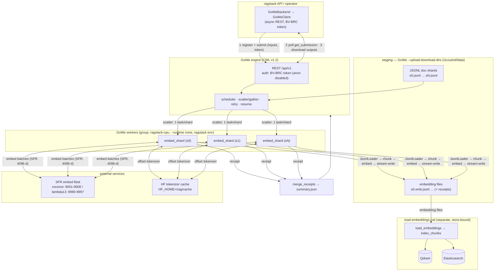

# GoWe embedding workflow — system diagram

The offline **embed** plane (ADR-0001 / #141): `embed-bulk.cwl` scattered over
document shards by the [GoWe](../../../GoWe) CWL engine, each shard embedded on a
worker and written to an **embedding file**; a separate load stage
(`load-embeddings.cwl`) upserts those files into Qdrant/ES. Embed and load are
decoupled through files, so the embedding fleet is never blocked by the DB.

## System diagram (Mermaid)



## ASCII (fallback)

```
  ragstack API / operator
  ┌──────────────────────────────┐   1. register_workflow(embed-bulk.cwl)
  │ GoWeBackend → GoWeClient      │   2. submit(inputs, BV-BRC token)
  │ (async REST)                  │   3. poll get_submission → download
  └───────────────┬──────────────┘
                  │  REST /api/v1  (Authorization: BV-BRC token; anon disabled)
                  ▼
  ┌──────────────────────────────────────────────────────────────┐
  │  GoWe engine          scatter/gather · retry · resume          │
  └───────┬───────────────────────────────────────────┬──────────┘
   scatter │ 1 task per shard                    gather │
          ▼                 ▼                 ▼          ▼
     ┌──────────┐      ┌──────────┐      ┌──────────┐  ┌────────────────┐
     │ worker   │      │ worker   │ ...   │ worker   │  │ merge_receipts │
     │embed_shard      │embed_shard      │embed_shard  │  → summary.json │
     └────┬─────┘      └────┬─────┘      └────┬─────┘  └────────────────┘
          │  per shard:  JsonlLoader → chunk(fixed_token) → embed → stream-write
          │      │                    │(HF_HOME=/rag/cache)      │
          │      ▼ read               ▼ SFR 4096-d               ▼ write
   /scout/wf/data/s*.jsonl     SFR fleet :9001-9008 /      /scout/wf/data/s*.emb.jsonl
   (doc shards, staged)        lambda13 :9990-9997          (embedding files + receipts)
                                                                     │
                                                                     ▼
                                         ── load-embeddings.cwl (separate stage) ──
                                         load_embeddings → index_chunks
                                             ├─► Qdrant (upsert, batched)
                                             └─► Elasticsearch (BM25)
```

## Data flow (numbered)

1. **Submit.** `GoWeBackend` (impl. of `IngestBackend`) uses `GoWeClient` to
   `register_workflow(embed-bulk.cwl)` then `submit()` with the shard file list +
   static inputs (chunk config, SFR endpoints, key). Auth is a **BV-BRC token**
   sent verbatim (`Authorization`); anonymous submission is disabled. Route to a
   worker group via a submission `worker_group` label (e.g. `ragstack-cpu`).
2. **Scatter.** The engine fans the workflow out — **one `embed_shard` task per
   shard** — and hands each to a worker in the target group. The engine owns
   retry and resume; each task is stateless + idempotent (deterministic uuid5
   ids), so a retry is safe.
3. **Embed (per worker).** `embed_shard` runs `iter_embed_source`: `JsonlLoader`
   reads the shard → chunk in document groups (`fixed_token`, HF offset tokenizer
   from **`HF_HOME=/rag/cache`**) → embed each group on the **SFR fleet** (4096-d)
   → **stream-write** survivors to `<shard>.emb.jsonl` (bounded memory) + a
   receipt. **No Qdrant/ES contact** — the embed plane only touches the embedder.
4. **Gather.** `merge_receipts` folds the per-shard receipts into `summary.json`
   (totals + failed-shard ids). The client polls `get_submission` to `COMPLETED`,
   then `download`s the embedding files + summary.
5. **Load (separate stage).** `load-embeddings.cwl` / `load_embeddings.py` reads
   the embedding files and upserts via `index_chunks` — **batched** upserts +
   parallel delete-prior, backpressure optional (off by default) — into **Qdrant**
   (+ **Elasticsearch** for BM25).

## Key properties

- **Decoupled by files.** Embed writes files; load reads them. A busy/capped
  Qdrant can never back-pressure onto the GPU embedding fleet.
- **Worker runtime.** `--runtime none` workers run `embed_shard` directly in the
  ragstack conda env (deps from the env, ragstack code CWL-staged on `PYTHONPATH`).
  `HF_HOME=/rag/cache` must be in the **worker's** env — `--runtime none` resets
  `HOME` per task, so the tokenizer would otherwise re-download each task.
- **Staging.** All shard inputs / embedding outputs live under the engine's
  `--upload-download-dirs` (`/scout/wf/data`), not `/tmp` or `/home`.
- **Streaming.** Each shard is embedded in document groups and written
  incrementally, so peak memory is bounded — a 500k-doc shard does not OOM.
- **Embedding fleet.** SFR-Embedding-Mistral (4096-d) on coconut `:9001-9008`
  (keyless) or lambda13 `:9990-9997` (BV-BRC `BRCMistral` key).

## References

- `cwl/embed-bulk.cwl`, `cwl/load-embeddings.cwl`, `cwl/README.md`
- `python/ragstack/ingestion/gowe_client.py`, `gowe_backend.py`, `embed_shard.py`
- `docs/gowe-integration.md`, `docs/benchmarks/embed-load-ab.md`
