# RAGStack ingest paths

**Which ingest path do I use, and what happens to a document on it?** This page is
the map. It is for operators and power users, and it links to the deeper docs
rather than repeating them. For the internals of each path read
[`ARCHITECTURE-DEEP-DIVE.md` §0](ARCHITECTURE-DEEP-DIVE.md#0-single-vs-bulk--the-ingest-paths-and-one-query-path)
(the overview), [§4](ARCHITECTURE-DEEP-DIVE.md#4-single-document-ingestion-pipeline)
(the shared pipeline) and [§5](ARCHITECTURE-DEEP-DIVE.md#5-bulk--sharded-ingestion)
(the paths one by one). For choosing a chunk method read
[`CHUNKING.md`](CHUNKING.md).

There is **one** pipeline, `IngestionPipeline`
(`python/ragstack/ingestion/pipeline.py`: `prepare_documents` → `_embed_and_link` →
`index_chunks`), and **four** paths that drive it. They differ in who runs the
pipeline and where it runs. The legacy CLI (path D) is the exception: it is still a
fork with its own chunk/embed/upsert loop.

Two things pick the path:

1. **The API path is a per-tenant deployment setting.** `INGEST_BACKEND` is `local`
   (the code default) or `gowe` (`python/ragstack/config.py` `ingest_backend`, normalised by
   `python/ragstack/ingestion/backends.py` `ingest_backend_name`). Any other value gets
   **501** from both ingest routes (`_refuse_unknown_backend`,
   `python/ragstack/api/routers/documents.py:461`).
2. **The operator paths are whichever tool you run.** The operator paths (C and D)
   write to Qdrant/Elasticsearch directly and never go through the API.

---

## Comparison

| | **A. API, local (in-process)** | **B. API → GoWe/CWL** | **C. Operator bulk CWL** | **D. Legacy `ingest_jsonl.py`** |
|---|---|---|---|---|
| **Entrypoint** | `POST /v1/ingest` (server path) · `POST /v1/ingest/upload` (multipart), with `INGEST_BACKEND=local` | The same two routes, with `INGEST_BACKEND=gowe` → `_run_gowe_ingest` → `GoWeBackend.run_submission` (`python/ragstack/ingestion/gowe_backend.py`) → `GOWE_WORKFLOW_CWL` = `cwl/pdf-ingest-scatter.cwl` | An operator submits a workflow: `python/scripts/gowe_batch_ingest.py` over `cwl/jats-ingest.cwl`, or `cwl/ingest-bulk.cwl`, `cwl/embed-bulk.cwl` + `cwl/load-embeddings.cwl`, `cwl/pdf-ingest.cwl` (GoWe or `cwltool`) | `python/scripts/ingest_jsonl.py` (operator CLI) |
| **Input** | A path or directory under `INGEST_ROOT` (`.pdf`/`.txt`/`.md`), **or** uploaded files staged at `{INGEST_ROOT}/uploads/{tenant}/{job_id}/` | **PDFs** from the caller's BV-BRC Workspace. `/v1/ingest` takes a `ws:///<user>/home/…` reference (a server path is a 400). `/v1/ingest/upload` first writes the files into `<collection folder>/sources/` in the caller's Workspace (`_gowe_upload_sources`) | JSONL shards (`plan_shards.py` output, `{text, path, metadata}` per line), JATS XML (`jats-ingest.cwl`), or PDFs (`pdf-ingest.cwl`) | One pre-extracted JSONL file (`{text, path, metadata}` per line) |
| **Where chunking happens** | In the API process, with the collection's own chunker (`api/deps.py` `build_ingestor_for`) | **On the GoWe worker** (`ingest_shard.py` inside the scatter). The API never loads or chunks: both routes return from the GoWe branch (`api/routers/documents.py:997`, `:1428`) before `_resolve_ingest_target` (`:1060`, `:1490`) | On the worker (`ingest_shard.py` or `embed_shard.py`) | In the CLI process (its own chunker) |
| **Execution** | `ShardedIngestor` + `LocalAsyncIORunner` (`ingestion/backends.py`), bounded asyncio, no broker | GoWe engine, worker group `GOWE_WORKER_GROUP`. A **batch** of PDFs per task (`batch_size`, default 20): `pdf_extract.py` → `ingest_shard.py`, then one `archive_version.py` pack | GoWe engine or `cwltool`. Scatter over shards, then one un-scattered load. `gowe_batch_ingest.py` pipelines batches | One process: producer → N workers |
| **Identity / tenant** | Any authenticated principal (API key or bearer). `resolve_tenant` sets the chunk `tenant_id`. `_authorize_ingest_target` checks the allowlist, ownership and the build spec (409) | **Submits as the caller.** `_gowe_caller` requires a BV-BRC bearer token, so an API key or a non-BV-BRC identity gets **401**. The same `_authorize_ingest_target` gates apply. The target must be a **registered** collection (`_registry_row`, 400 otherwise). The engine stages inputs and outputs with the caller's token. No task ever sees it | The operator's own engine identity. The workflow's `tenant` input **defaults to `public`**. The target is a registry entry (`--collection-id`, plus the `registry` name, ADR-0009) | `--tenant`, **default `public` = world-readable**. Target via `--collection-id` |
| **Job tracking** | RAGStack `job_id` in `JobStore` (`python/ragstack/jobstore.py`), polled at `GET /v1/ingest/{job_id}` | The same RAGStack `job_id`. It is **not** a GoWe id ([below](#the-job_id-distinction-common-confusion)). Per-document status comes from the per-batch receipts | GoWe submission ids. `gowe_batch_ingest.py` keeps a resumable ledger. Receipts are merged by `merge_receipts.py` | `<input>.ckpt` frontier + `done_ranges` |
| **Archive** | **None.** Only the provenance manifest is written | **Yes.** `versions/<n>/` in the owner's Workspace, recorded on the registry row once delivered. [Restore](#restore-replaying-an-archive-358) replays it | `pdf-ingest.cwl` emits an archive `Directory`, but nothing records it on the registry (only `_run_gowe_ingest` calls `append_version`). The other workflows write no archive | None |
| **When to use** | Dev/test, a local demo, and the tenants that still run `local` ([table below](#which-path-each-tenant-uses)) | **The user path** on a GoWe tenant: browser upload, or a PDF already in your Workspace | Operator corpus builds that are too big for the API (e.g. the open-access harvest) | Only to re-run an existing build that depends on it. New builds use C |
| **Status** | Works. ADR-0006 §2 (Proposed) calls it "dev/test only". `demo`, `asm` and `lucid` still run it | Works. Live on `dev` and `hackathon` | Works. ADR-0006 §1: "the reference shape for every future bulk job" | ADR-0006 §2 (Proposed) **retires** it: "deprecated now with a pointer to the CWL path, deleted after the next tagged release". **The code has no deprecation notice or warning.** Its docstring still calls it "the operator tool for the large extraction dumps" |

**A minor fifth writer.** `python/scripts/ingest_chunks.py` loads caller-supplied
chunks (a JSON array of documents, each with its `chunks`) into **Qdrant only**. It
resolves its target through the registry (`ingest_target.resolve_or_exit`) and runs
`validate_chunks`. It does not do DOI enrichment, boilerplate handling, the chunk cap,
or Elasticsearch. Like D, its `--qdrant-url` still defaults to `http://localhost:6333`
(#454).

---

## Which path each tenant uses

Read from `/rag/data/tenants/*/config/tenant.env` on `coconut` on 2026-10-06. An
unset `INGEST_BACKEND` means the code default, `local`.

| Tenant | `INGEST_BACKEND` | `GOWE_WORKER_GROUP` | `INGEST_WORKER_UNSUPPORTED_METHODS` | API path |
|---|---|---|---|---|
| `dev` | `gowe` | `ragstack-dev` | empty (semantic allowed) | **B**, `GOWE_WORKFLOW_CWL=/rag/repos/tenants/dev/cwl/pdf-ingest-scatter.cwl` |
| `hackathon` | `gowe` | `ragstack-hackathon` | empty (semantic allowed) | **B**, `GOWE_WORKFLOW_CWL=/rag/repos/tenants/hackathon/cwl/pdf-ingest-scatter.cwl` |
| `demo` | unset → `local` | — | — | **A** (also sets `CHUNK_METHOD=fixed_token`) |
| `asm` | unset → `local` | — | — | **A** |
| `lucid` | unset → `local` | — | — | **A**. Its `tenant.env` says to keep ingest frozen (a rollback copy of its index exists) |

The table says which path the tenant's **API** uses. An operator can still load any
tenant's registered collections with path C or D.

---

## Which do I use?

- **I am a user on a GoWe tenant (dev, hackathon).** Upload in the UI, or call
  `POST /v1/ingest/upload` or `POST /v1/ingest` with a `ws://` source. That is path B.
  You need a BV-BRC bearer token and a collection you own. See
  [`UI-GUIDE.md`](UI-GUIDE.md), [`cookbook-users.md`](cookbook-users.md) and
  [`contracts/openapi.yaml`](../contracts/openapi.yaml).
- **I am trying RAGStack locally, or I am on a `local` tenant.** Use the same routes.
  That is path A: the server needs `INGEST_ROOT` (503 without it). See
  [`demo-quickstart.md`](demo-quickstart.md) and [`LOCAL-DEMO.md`](LOCAL-DEMO.md).
- **I am an operator building a large corpus.** Use path C. Register the collection
  first (through the API, or `--create-via-api`). Plan the shards with
  `plan_shards.py` and drive them with `gowe_batch_ingest.py`, or submit
  `ingest-bulk.cwl` / `embed-bulk.cwl` + `load-embeddings.cwl`. See
  [`cookbook-new-org-ingest.md`](cookbook-new-org-ingest.md),
  [`cwl/README.md`](../cwl/README.md) and
  [`runbooks/bulk-load-throughput.md`](runbooks/bulk-load-throughput.md).
- **I am configuring a tenant for path B.** Set `INGEST_BACKEND=gowe`, an absolute
  `GOWE_WORKFLOW_CWL`, `GOWE_URL` and `GOWE_WORKER_GROUP`. Do **not** put `qdrant_url`
  or `es_url` in `GOWE_WORKFLOW_INPUTS_JSON`: the boot refuses it
  ([below](#where-a-workflow-run-writes-the-api-seeds-the-store-urls-407)). See
  [`gowe-integration.md`](gowe-integration.md) and
  [`runbooks/tenant-admin.md`](runbooks/tenant-admin.md).
- **I am driving the JSONL plane (`ingest-bulk.cwl`) through the API backend.** Set
  `GOWE_SHARDS_INPUT_KEY=shards`. The default `pdfs` matches `pdf-ingest-scatter.cwl`.
- **I have a script that calls `ingest_jsonl.py`.** Move it to path C. ADR-0006
  retires the script, even though the script itself does not say so yet.

> **Ran a large ingest?** The production open-access build is written up in
> [`reports/oa-ingest-run.md`](../reports/oa-ingest-run.md): reproduce commands,
> measured rates, and the incidents worth knowing before the next one.

---

## What happens to a document

The steps run in the order the code runs them. `IngestionPipeline.prepare_documents`
does **DOI → chunk → boilerplate**, because boilerplate is classified per *chunk*, so
it runs after chunking. `index_chunks` does **contract validation → delete-prior →
upsert**, so validation comes after embedding, immediately before the write.

```mermaid
flowchart TD
    subgraph PA["A. API local: every step in the API process"]
        A1["1 load"] --> A2["2 DOI enrich"] --> A3["3 chunk"] --> A4["4 boilerplate: per settings"]
        A4 --> A5["5 embed"] --> A6["6 validate contract"] --> A7["7 write Qdrant + ES"]
    end
    subgraph PB["B. API to GoWe: the API only gates and submits"]
        B0["API: authorize, chunk-method guard, reserve version, sources to Workspace, submit as caller"]
        B0 --> B1["worker: 1 pdf_extract"]
        B1 --> B2["worker ingest_shard: 2 DOI, 3 chunk, 4 boilerplate always flag, 5 embed, 6 validate, 7 write"]
        B2 --> B3["worker pack: 8 archive versions/n"]
        B3 --> B4["engine post-stages to Workspace as caller; API records the version"]
    end
    subgraph PC["C. Operator bulk CWL"]
        C1["worker: 1 extract, or a pre-extracted shard"] --> C2["worker: 2 DOI only if doi_enrichment, 3 chunk, 4 flag, 5 embed"]
        C2 --> C3["ingest_shard or load_embeddings: 6 validate, 7 write"]
        C3 --> C4["pdf-ingest.cwl only: 8 archive, not recorded"]
    end
    subgraph PD["D. ingest_jsonl.py"]
        D1["CLI: 1 read JSONL, no DOI lookup, 3 chunk, 4 boilerplate per flag, 5 embed, 6 validate, 7 write"]
    end
```



Where each step runs, path by path:

| Step | A. API local | B. API → GoWe | C. Operator bulk CWL | D. `ingest_jsonl.py` |
|---|---|---|---|---|
| **1. Load** | API process: `LoaderRegistry` (PDF/text/Markdown; `.xml` uploads fail as `no loader for .xml`) | Worker: `pdf_extract.py` → a JSONL batch. A scanned PDF gets the row `NO_TEXT_ERROR` | Worker: `jats_extract.py` / `pdf_extract.py`, or a pre-extracted shard | The JSONL file. Offline metadata recovery via `ingestion/enrich.py` (`--publisher-profile`) |
| **2. DOI enrichment** (#596, ON by default since #634) | API process (`app.state.doi_enricher`), when `DOI_ENRICHMENT_ENABLED` (default `true`) | Worker: `ingest_shard --doi-enrichment`. `_gowe_inputs` sends `doi_enrichment` (+ `doi_mailto`, `doi_cache_dir`) whenever the API setting is on | **Off** unless the operator sets `doi_enrichment: true`. Only `pdf-ingest.cwl` and `pdf-ingest-scatter.cwl` declare that input. The worker tools default it off (`doi_metadata.add_doi_enrichment_args`) | **Never.** No Crossref lookup |
| **3. Chunk** | The collection entry's method/size/overlap | `chunk_method`/`chunk_size`/`chunk_overlap` travel on the submission, **only if the entry records them**. Otherwise the CWL defaults apply (`fixed_token`/256/32). Semantic tunables come from the registry entry's `chunk_params` (`ingest_shard.py` `_semantic_params`), never from CWL inputs | CLI arguments, checked against the registry entry (`IngestTarget.check_build`) | `--chunk-method` etc., checked against the registry entry |
| **4. Boilerplate** | `BOILERPLATE_DETECTION_ENABLED` (default on, **flag**), `BOILERPLATE_DROP` (default off), `BOILERPLATE_CONFIG_JSON` | **Always `flag`.** No boilerplate setting reaches the worker. `_gowe_inputs` sends none, the CWL declares none, and `ingest_shard --boilerplate` defaults to `flag` (**#635, open**). `BOILERPLATE_DROP=true` has no effect here | `flag` (each tool's default). No CWL exposes `--boilerplate` | `--boilerplate off\|flag\|drop`, default `flag` |
| **5. Embed** | API process → the entry's embedding endpoints | Worker → the endpoints on the submission (`embedding_url`) | Worker (`embed_shard.py` / `ingest_shard.py`) | CLI → `--embedding-url` |
| **6. Contract check** (#603/#604) | `index_chunks` → `validate_chunks` | Same, in the worker's `index_chunks` | Same: `ingest_shard.py` and `load_embeddings.py` both write through `index_chunks` | Its own call: `validate_chunks(kept, where="ingest_jsonl")` |
| **7. Write** | The entry's stores, as resolved by the API | The URLs the API seeds per run (#407) | The registry-resolved stores. `load_embeddings.py` **requires** a URL per leg (#636) | A registry route, else `--qdrant-url` / `--es-url`, which **default to localhost** (#454). ES only with `--text-backend elasticsearch` (default `none`) |
| **8. Archive** | none | `versions/<n>/`, recorded on the registry | `pdf-ingest.cwl` only, not recorded | none |
| **Chunk cap** (#291) | Yes, once per job | Yes, per task (`--max-chunks`) | `load_embeddings.py`: yes. `ingest_shard.py`: only if `max_chunks` is passed (default 0 = off) | **No** |

What each step means:

- **DOI metadata** (`python/ragstack/ingestion/doi_metadata.py`) resolves each
  *distinct* DOI against Crossref (DataCite as fallback) and the NCBI ID Converter. It
  fills only **absent** fields: title, authors, journal, year, publisher, pmid,
  pmcid. A network failure degrades to "no title", never a failed job. Turn it off
  (`DOI_ENRICHMENT_ENABLED=false`) only on an air-gapped deployment. On path B every
  worker image a tenant's group runs **must** accept `--doi-enrichment`. An image
  whose `ingest_shard.py` predates the flag fails every task with argparse exit 2 (see the
  `config.py` comment on `doi_enrichment_enabled`). Depth:
  [deep-dive §1.4](ARCHITECTURE-DEEP-DIVE.md#14-scholarly-metadata-resolution-at-upload-doi_metadatapy-596--602).
  Repair an older collection with `scripts/backfill_collection_metadata.py`.
- **Chunk method.** The default for **new** collections is `fixed_token`: a token
  window sized by `CHUNK_SIZE` / `CHUNK_OVERLAP`, using the embedding model's
  tokenizer. Deployments before that change defaulted to the character-based `fixed`
  512/64. Existing collections keep the method they were built with: the method is
  part of collection identity (ADR-0002), and `POST /v1/collections` persists the
  *resolved* method on the entry. Each workflow declares `chunk_method` as an
  **enum** (#643), and the symbols differ:
  `pdf-ingest-scatter.cwl` and `ingest-bulk.cwl` accept
  `fixed, fixed_token, sentence, words, semantic, semantic_pooled`;
  `pdf-ingest.cwl`, `jats-ingest.cwl` and `embed-bulk.cwl` accept only
  `fixed, fixed_token, sentence, words`. A value outside the enum is a CWL
  validation error at submission, not a silent default. See
  [`CHUNKING.md`](CHUNKING.md) for choosing one.
- **Semantic chunking on GoWe** (#615). `ingest_shard.py` builds its own embedding
  bridge for `semantic` / `semantic_pooled`, so path B can run them. Whether a tenant
  *admits* them depends on `INGEST_WORKER_UNSUPPORTED_METHODS`, because it depends on
  which image the tenant's worker group runs. The code default is
  `semantic,semantic_pooled` (refused). `dev` and `hackathon` set it empty (allowed).
  On a `gowe` tenant a listed method is refused with **422** in two places: at
  `POST /v1/collections` (`python/ragstack/api/routers/collections.py`, via `shard_refusal`) and at submit, for
  collections that already exist (`api/routers/documents.py` `_refuse_unrunnable_chunk_method`).
  The submit check runs before a version is reserved or a file is written. A
  misspelt method name in the setting raises rather than guarding nothing
  (`chunker_config.parse_unsupported_methods`).
- **Boilerplate** (`python/ragstack/ingestion/boilerplate.py`). In **flag** mode
  non-body chunks get `metadata.section` and `metadata.is_boilerplate`, and nothing is
  removed. **Drop** also removes them. A document that is entirely boilerplate is
  never emptied. Flag mode pairs with the query-time `RETRIEVAL_DEMOTE_BOILERPLATE`,
  which needs no re-ingest. Depth:
  [deep-dive §1.5](ARCHITECTURE-DEEP-DIVE.md#15-chunk-level-boilerplate-classification-boilerplatepy).
- **Chunk-metadata contract** (`python/ragstack/metadata_schema.py`
  `validate_chunks`). Every chunk's metadata is checked against the declared field
  types (e.g. `year` must be an integer) and the required fields, before anything is
  written. The first bad chunk raises `ChunkMetadataTypeError` and fails the write.
  Undeclared keys are allowed. Depth:
  [deep-dive §1.6](ARCHITECTURE-DEEP-DIVE.md#16-the-declared-chunk-metadata-contract-603).
- **Write.** The write is a delete-prior per document, then an upsert into Qdrant and
  Elasticsearch with deterministic ids, so a re-ingest replaces chunks rather than
  duplicating them. A document with no embeddable chunk keeps its prior version.
- **Provenance** (#668, ADR-0010 decision 8). Path B archives record what built them:
  `manifest.provenance` and each per-batch receipt carry `workflow_id`, `tool_image`,
  `tool_image_digest`, `image_version`, `image_commit` and `image_build`. The API
  seeds the first three (`GoWeBackend` → `tool_image.provenance_inputs`) **only when
  the CWL names a stamped image** (`ragstack-tools-<version>-b<N>.sif`). Until a release
  is stamped, every field is `null`. On 2026-10-06 the `dev` and `hackathon` workflow
  checkouts still name the unstamped `ragstack-worker.sif`, so their provenance is
  null today. See [Archive format](#archive-format) below.

---

## Every path targets a registry entry (#263, ADR-0009)

The bulk tools write straight to Qdrant/ES. That is why they exist, and it does not
change. What changed is **how they learn where to write**:
`python/ragstack/ops/ingest_target.py` resolves a `--collection-id` through the
collection registry, and every physical name comes from that entry.

```bash
# the store name comes from the registry entry, not from you
python scripts/ingest_shard.py shard.jsonl --collection-id asm-tok256 \
    --qdrant-url "$QDRANT_URL" --es-url "$ES_URL"   # REQUIRED, no defaults (#454)

# create it through the API first, so the cap, the owner row and the build
# spec all come from the normal path. $API is YOUR api — never a bare
# localhost:8000, which is a production API on the deployment host.
python scripts/ingest_shard.py shard.jsonl \
    --collection-id new-corpus --create-via-api "$API" \
    --qdrant-url "$QDRANT_URL" --es-url "$ES_URL"
```

- **One registry entry supplies every physical name.** `--collection-id` resolves
  through `COLLECTION_STORE_BACKEND` and supplies the Qdrant collection, its instance
  (a routed collection lives on its own) and the ES index. An id that is not in the
  registry is refused. The deprecated `--collection` still takes a *physical* store
  name, but only when a registry entry already claims it.
- **The tool's own build parameters are checked, not used.** `IngestTarget.check_build`
  refuses a write whose build spec differs from the entry's. Each bulk writer also
  writes the provenance manifest, so ADR-0002's 409 build-spec guard stays armed for
  later API ingests (`check_ingest_build_spec` early-returns when there is no
  manifest).
- **The `registry` name selects which registry (ADR-0009, #563).** A GoWe worker
  serves many tenants. It learns which tenant's registry to use from the `registry`
  workflow input (`--registry hackathon`), resolved against per-registry environment
  variables (`ingest_target.registry_settings`). It is a **name, never a DSN**,
  because `submitted_inputs` is an immutable plaintext snapshot. An unconfigured name
  is fatal: it never falls back to another tenant's registry. The API sends it when
  `COLLECTION_REGISTRY_NAME` is set.
- **Store URLs must be explicit (#636).** `load_embeddings.py` calls
  `ingest_target.require_store_urls`. Each leg's URL must come from a registry route,
  the flag, or an *explicitly configured* `QDRANT_URL` / `ELASTICSEARCH_URL`. It is
  never the code default, because localhost is production on `coconut`.
  `ingest_shard.py` makes `--qdrant-url` / `--es-url` required arguments.
  `ingest_jsonl.py` and `ingest_chunks.py` **do not** check. They still default to
  `localhost` (#454, open).

Wired to the registry: `ingest_jsonl.py`, `ingest_shard.py`, `ingest_chunks.py`,
`load_embeddings.py`, `load_graph.py`. Depth:
[deep-dive §5.4](ARCHITECTURE-DEEP-DIVE.md#54-target-resolution-for-workers--ingesttarget-and-registry-selection).
The eval harnesses under `scripts/eval/` still name their own throwaway stores (see
[Known gaps](#known-gaps)).

---

## Where a workflow run writes: the API seeds the store URLs (#407)

**Read this before configuring the GoWe path — one of the keys below now refuses
the boot.**

The store targets a CWL ingest/restore run writes to are **owned by the API and
seeded per run**. They are not workflow defaults and they are not operator
config:

- **The API seeds them.** `api/routers/documents.py` puts `qdrant_url` and
  `es_url` into every submission's inputs, taking each from the routing function
  for its own leg — `store_routing.qdrant_url_for(collection, settings)` (keyed
  by the physical collection, so `QDRANT_COLLECTION_ROUTES` is honoured) and
  `store_routing.es_url_for(es_index, settings)` (keyed by the physical index,
  so `ES_COLLECTION_ROUTES` is honoured). One implementation per leg, because a
  second copy that forgot a routing table is exactly how a write lands on the
  wrong instance. **The restore path does NOT route** — its gate is built once
  at startup, before any record exists, so it seeds the bare `QDRANT_URL` /
  `ELASTICSEARCH_URL` for both legs; `COLLECTION_RESTORE_INPUTS_JSON` is the
  override until both are resolved per record.
- **The CWL inputs are REQUIRED, with no default.** `cwl/pdf-ingest-scatter.cwl`,
  `cwl/restore-collection.cwl` and `cwl/load-embeddings.cwl` all declare
  `qdrant_url` / `es_url` as `type: string` with the default deliberately
  removed. The old default was `localhost:6333`, which **is production on the
  deployment host** — a dev-tenant ingest built its collection on the production
  instance. A hand-run (`cwltool`) must now name both explicitly; an omission is
  a loud CWL error instead of a silent production write.
- **Setting them in `GOWE_WORKFLOW_INPUTS_JSON` is a BOOT FAILURE.** Since the
  per-run value wins the merge, a `qdrant_url` or `es_url` in that blob would be
  silently **inert** — config an operator believes is steering their writes but
  isn't. `ingestion/backends.py` therefore refuses the key at startup rather
  than ignore it:

  ```
  gowe_workflow_inputs_json may not set qdrant_url, es_url: ingest store
  targets are seeded per run from the QDRANT_URL / ELASTICSEARCH_URL settings
  (and QDRANT_COLLECTION_ROUTES / ES_COLLECTION_ROUTES) and would override
  these keys silently.
  ```

  The blob remains for genuine per-deployment extras. If your API will not start
  with that message, the fix is to remove the two keys and set `QDRANT_URL` /
  `ELASTICSEARCH_URL` instead — the step-by-step is
  [`docs/runbooks/upgrade-407-remove-gowe-store-urls.md`](runbooks/upgrade-407-remove-gowe-store-urls.md).

The same reasoning applies to `collection_restore_inputs_json` in the restore
table below, with one difference: that setting is **override-only, not required**
(the API already seeds both keys), so it is not refused — it is merged *over* the
seeded values, for the case where the worker reaches the stores at a different
address than the API does.

---

## The `job_id` distinction (common confusion)

A local ingest `job_id` lives in **RAGStack's own `JobStore`**
(`python/ragstack/jobstore.py` — `InMemoryJobStore` for dev, `SqliteJobStore` or
`PostgresJobStore` for durable/multi-worker), polled at `GET /v1/ingest/{job_id}`.
It is **not** a GoWe submission id, even when `INGEST_BACKEND=gowe`. GoWe has its
own submission ids internally; you do not poll GoWe with a RAGStack `job_id`.
The operator paths (C, D) mint no RAGStack job at all: path C is tracked by its GoWe
submission ids and the `gowe_batch_ingest.py` ledger, path D by its checkpoint file.

---

## Batch semantics on the GoWe path (#203 2b)

`cwl/pdf-ingest-scatter.cwl` ingests a **batch** of PDFs per task: a `batch`
ExpressionTool groups the submitted `pdfs: File[]` into `File[][]` by
`batch_size` (default 20; `1` = one task per PDF, the Option-A shape for a small
upload), and every batch runs extract → `ingest_shard` → one receipt. Per-task
fixed overhead (dispatch, container start, interpreter, tokenizer load: ~2–4 s)
is thereby paid once per 20 PDFs instead of once per PDF.

**Per-document status.** A batch's `ShardReceipt` carries a `docs` row per
document — `error: ""` means its chunks were upserted, otherwise the row names
why not; `chunk_ids` are that document's. `GoWeBackend` maps each work item to
its row by **source basename** (the engine pre-stages a `ws://` input under its
basename; the extract tool records that path), so the job's per-item status,
chunk ids and error are exact per document regardless of how many receipts the
archive holds. An Option-A archive (one receipt per item, no rows to match)
still maps positionally.

**Failure rules.**

| what happened | where it is recorded | task exit |
|---|---|---|
| a scanned / image-only PDF (no text) | the extract report skips it; `ingest_shard --extract-report` writes its row with the constant `NO_TEXT_ERROR` (`ragstack.ingestion.loaders`) — the same string the local path records, so `GROUP BY error` counts it on both paths | 0 (batch continues) |
| a loaded document with no embeddable chunk (empty, or every chunk quarantined) | its row: `NO_CHUNKS_ERROR` (`ragstack.ingestion.receipts`) | 0 |
| **every** document of the batch failed | every row with its own error; the receipt is still `completed` (`n_docs_failed == n_docs`), the embedding file header-only | **0** — a processed batch, not a failed task |
| the batch itself failed (shard unreadable, embedder/store down) | the receipt is `failed`; every row without a more specific error carries the batch error | non-zero (the engine retries the task) |

Why an all-failed batch exits 0: GoWe treats any non-zero exit as a task
failure (it honours no `successCodes`), retries it, then fails the step, its
dependants and the submission — but the sibling batches have already upserted
(ingest is coupled embed+load), so `pack` would never run, no `versions/<n>/`
would exist, the stores and the archive would diverge, and a later restore
would silently omit those documents. Per-document failure is therefore data
in the receipt, never a task failure. Known residual (a #357 format decision):
if **every** batch of a run is all-failed there are zero rows to pack, the
archive tool refuses a zero-row version and the run fails with the per-item
detail lost.

The embedding file — hence the archive version — holds only the successful
documents' chunks. A non-zero task fails the submission before any archive
exists; the API then reports the submission state on every item (no receipts to
read). Only receipts that name **none** of the documents are a
`GoWeContractError` (a workflow that cannot report), never "every document
failed". Two work items sharing a source basename are refused at submission
(`GoWeContractError`): rows are matched by basename, and the engine would stage
them onto one file anyway.

**Poll interval** is per submission: ≤ 50 items poll every 0.5 s, larger runs at
`GOWE_POLL_INTERVAL` (never slower than the setting). **Tokenizer cache:** the
worker image reads the HF tokenizer from `HF_HOME` (`/rag/cache`), which the
GoWe worker must bind into the container (`--extra-bind`); see `cwl/README.md`.

---

<a id="archive-format"></a>

## Archive format (`ragstack-archive/1`)

> Phase 2 of #353 (issue #357). The archive is the **last step of the ingest
> workflows** (`cwl/pdf-ingest.cwl`, `cwl/pdf-ingest-scatter.cwl`; standalone
> tool `cwl/archive-collection.cwl`, delete form `cwl/archive-tombstone.cwl`).
> Writer/reader: `python/ragstack/ingestion/archive.py`; CLI
> `python/scripts/archive_version.py`.

A collection's archive is an ordered sequence of **versions** — one per
completed ingest job (a *batch*: that job's chunks + vectors, not the whole
collection) or per delete (a *tombstone*). The registry row orders them;
restore replays them in order. Each version is one directory whose **basename
is the version number**; the workflow emits it as a CWL `Directory` output and
GoWe uploads it under that basename, so it lands at
`…/collections/<id>/versions/<N>/` with no Workspace call and no token inside
any task.

```
<N>/
  manifest.json      identity + counts + sha256/bytes per file (below)
  chunks.jsonl.gz    one record per chunk = the ragstack.embedding_file/v1
                     record minus `embedding` (Chunk.model_dump(), UTF-8, sorted
                     keys). gzip, mtime=0, no filename
  vectors.f32        64-byte header + float32 rows, little-endian, row i is
                     chunk line i of chunks.jsonl.gz
  receipt.json       the load stage's receipt, copied verbatim (pdf-ingest: the
                     load summary) — or a JSON ARRAY of the per-BATCH receipts in
                     batch order (pdf-ingest-scatter: one ShardReceipt per task,
                     each with a `docs` row per document: its `error` and its
                     `chunk_ids`)
  tombstone.json     DELETE versions only: {"format", "count", "doc_ids": [...]}
  triples.jsonl.gz   the GRAPH leg (#350), present only after the extract-graph
                     workflow ran over this version: one Triple record per line
                     (Triple.model_dump(): subject/predicate/object, doc_id,
                     tenant_id, and the #347 evidence fields — evidence,
                     chunk_id, derived_by, confidence, subject_id, object_id;
                     `collection` is empty, the loader stamps it). gzip, mtime=0
```

A tombstone version holds **only** `manifest.json` + `tombstone.json`. The
filenames above are what the writer emits today; a reader never assumes them —
it follows the manifest's **`files` role map** (below). The `triples` role is
**not** written by the ingest workflows: it is added to an existing chunk version
later, by the extract-graph step ([below](#graph-extraction-the-triples-leg-350)),
together with a rewritten `manifest.json` (`graph: true`).

**`manifest.json`** (keys sorted, no timestamps — a re-run of the step is
byte-identical, like the receipts):

| key | value |
|---|---|
| `format` | `"ragstack-archive/1"` |
| `collection_id`, `tenant`, `spec_hash`, `version`, `job_id` | identity: the registry id (not the store name), the tenant, the ADR-0002 build-spec hash, the version number (int), the RAGStack job id. Restore refuses a `spec_hash` that differs from the registry row. |
| `counts` | `{"chunks": rows, "docs": distinct doc_ids}` (`chunks: 0` for a tombstone); plus `"triples": n` once the graph leg exists |
| `files` | **role → filename map** the reader follows: `{"manifest": "manifest.json", "chunks": "chunks.jsonl.gz", "vectors": "vectors.f32", "receipt": "receipt.json"}`, or `manifest` + `tombstone` for a delete, plus `"triples": "triples.jsonl.gz"` once the graph leg exists. Every non-manifest value must have a `sha256` entry and every `sha256` key must be a value of the map (nothing unlisted is trusted). |
| `sha256`, `bytes` | per file, over the bytes **as stored** (i.e. the gzip stream for chunks) — verification needs no decompression; every file is verified before a reader yields anything |
| `vectors` | `{"dim", "rows", "dtype": "float32", "byte_order": "little", "header_bytes": 64}` — must agree with the file's own header (chunk versions only) |
| `chunks_compression` | `"gzip"` — the reader dispatches on this; any other value is refused (`ArchiveCorrupt: unsupported chunks_compression`) |
| `receipts` | how many receipt files went into `receipt.json` (1 = verbatim object, >1 = array) |
| `graph` | `false` as written by the ingest workflows; `true` once the extract-graph step added the `triples` leg. The reader requires the two to agree: `graph: true` without a `triples` role (or the reverse) is `ArchiveCorrupt` — a half-applied extraction, refused rather than guessed at |
| `graph_extraction` | only with `graph: true`: `{"derived_by": "llm", "extractor": <model>, "n_chunks", "n_chunks_empty", "n_chunks_without_triples", "concurrency"}` — the leg's provenance; since #655 step 2 also `"provenance": {…}` (below) for the graph-extract run itself |
| `has_tombstone` | `true` for a delete version |
| `provenance` | **what built this version** (ADR-0010 decision 8, #655 step 2): `{"workflow_id", "tool_image", "tool_image_digest", "image_version", "image_commit", "image_build"}`, every value a string or `null`. The first three are seeded by the API on the submission between registration and submit (`ragstack.tool_image.provenance_inputs`: the GoWe `wf_` id, the one `dockerPull` name of the registered text, the sha256 from the committed `cwl/tool-image.receipt.json`, which `python/scripts/stamp_tool_image.py` writes at release time and which an unstamped tree such as `main` does not have) — **only on a stamped tree**: unstamped, nothing is seeded, the inputs stay null and the tools' flags are omitted (the builds `ragstack-worker.sif` resolves to predate them); the last three the pack step reads from its own image's `/opt/ragstack/RELEASE` (`null` outside an image). **Additive**: a version written before step 2 has no key, and `ragstack.provenance.read_provenance` returns the all-`null` object for it — "unknown", never an error. The same object sits on each per-batch `ShardReceipt` in `receipt.json` and, for a restore, in the replay's load summary (`provenance` for the restore run, `versions[i].provenance` for each replayed manifest). |

**`vectors.f32` header** (64 bytes, integers little-endian): `RSF32VEC` magic
(8) · header version `1` (u32) · header length `64` (u32) · `dim` (u32) ·
`rows` (u64) · dtype code `1` = float32 (u32) · byte order `<` (1) · 31
reserved bytes (readers must ignore). Hence `len(file) == 64 + rows × dim × 4`, and
`numpy.memmap(path, dtype="<f4", offset=64, shape=(rows, dim))` reads it
directly. The reader (`read_version`) verifies every sha256, that the header
and manifest geometry agree, and that the file size matches, **before** the
first row — then streams `(chunk_dict, array('f'))` pairs one at a time; any
mismatch is `ArchiveCorrupt`. The writer streams too (bounded blocks of input
lines through a small process pool): 35k × 4096-d packs in seconds with a flat
RSS — the JSONL embed file is never materialised as Python float lists.

**Why gzip, not zstd.** The design names `chunks.jsonl.zst`; `zstandard` is
not a project dependency and shared environments do not get new packages for
one file, so the chunks file is gzip. Readers find the chunks file through the
`files.chunks` role and dispatch on `chunks_compression` (only `gzip` today —
anything else fails loudly rather than mis-reading), so a zstd writer later is
a manifest change plus a reader branch, not a format break. (Vectors are
incompressible float32 either way.)

**Producing it.** `archive_version.py --version N --collection-id <id>
--chunks <emb.jsonl…> --receipt <receipt.json…> --out <dir>` writes
`<dir>/N/`; `--tombstone doc_ids.json` writes the delete form. Both workflows
take `version` and `collection_id` as **required** inputs (the API assigns the
version from the registry), plus optional `spec_hash` / `job_id`. In the
scatter workflow, `ingest_shard.py --embedding-file` writes each PDF's embedded
chunks on their way to the stores, which is what the archive step packs.

## Graph extraction: the `triples` leg (#350)

> Phase 6 of #201. `cwl/extract-graph.cwl` (the tool), `cwl/graph-extract.cwl`
> (the workflow: extract → load), `python/scripts/extract_graph.py` /
> `load_graph.py`, `python/ragstack/graph/{extract_version,archive_load,budget}.py`;
> API side `python/ragstack/graph_extract.py` + `POST /v1/collections/{id}/graph`.

The knowledge graph is a **leg of the collection lifecycle**, archived, restored
and (once #380's eviction half lands) evicted with the collection — but it is
**never part of an ingest**: one LLM call per chunk is roughly an order of
magnitude more than embedding it, so extraction is an explicit, opt-in, budgeted
step over an *already archived* version. Nothing runs until the owner (or an
admin) calls `POST /v1/collections/{id}/graph[?version=n]`, which submits
`graph-extract.cwl` **as the user** over one `versions/<n>/` directory (the
latest chunk version by default; tombstones are skipped):

1. **`extract`** (`extract_graph.py`) reads that version's `chunks.jsonl.gz` —
   text only, the vectors are never touched — and runs `LLMKGExtractor` over
   every chunk with `concurrency` calls in flight (`graph_extract_concurrency`,
   default 8). Every triple carries the #347 stamps: `chunk_id`, `evidence` (the
   verbatim span the model quoted, kept only if it occurs in the chunk),
   `derived_by: "llm"`, `confidence: 1` (the no-launder cap); `tenant_id` comes
   from the chunk's own metadata; `collection` is left **empty** — the physical
   store name is registry knowledge the loader stamps, so the archive stays
   portable. Results are written in chunk order, deduplicated on
   `(subject, predicate, object, doc_id)`, so the same model output gives a
   byte-identical leg. The step emits a **delta directory named by the version**
   holding exactly `manifest.json` (the complete manifest, rewritten:
   `files.triples`, its sha256/bytes, `counts.triples`, `graph: true`,
   `graph_extraction`) and `triples.jsonl.gz`.
2. **`load`** (`load_graph.py`) verifies the leg (manifest + the triples file's
   sha256 — a delta has no chunks to verify), resolves the **physical** collection
   name from the registry entry named by `collection_id` (never the command line;
   the worker sees the same registry the API does, as for restore), takes **one**
   live count of that collection's triples, and refuses the whole load — exit 4,
   nothing written — when `live + incoming` would exceed the budget; otherwise it
   upserts in batches, every triple stamped `collection = <physical name>`
   (idempotent: both graph stores MERGE on the triple's key). Neo4j credentials
   come from the worker's environment, never from a workflow input.
3. The delta Directory is the workflow's **only** output. GoWe post-stages a
   Directory output's listing under `<output_destination>/<basename>/` by
   basename **with overwrite** (`pkg/bvbrc/workspace.go` `WorkspaceUpload`,
   `Overwrite: true`; `scheduler/workspace.go` `stageFileInTree`), so it lands
   *on* `versions/<n>/`: `manifest.json` is overwritten — **the one intended
   overwrite of an archived file** — `triples.jsonl.gz` is added, and the
   chunk/vector/receipt files already there are untouched because they are not
   in the output. Post-staging happens only for COMPLETED submissions, so a
   `load` refusal (or any step failure) delivers nothing: the archive is never
   half-updated.

**Budgets** (`config.py`, #291's siblings): `graph_max_triples_per_collection`
(default **200,000** — the 50k chunk cap × ~4 triples per prose chunk, with
headroom; `0` disables) is checked once per job by `load` with one live
`GraphStore.stats(collection=…)` count (collection-wide, every tenant — the
collection is the unit), and by `extract` against its own output alone (a
version that could never be loaded is refused before its leg is written); the
refusal line is `graph_cap_exceeded: live=L incoming=I cap=C would_fit=W` on
stderr (`live=?` from `extract`) and the API classifies the FAILED submission
by `error.context.exit_code == 4` into the job error `graph_cap_exceeded`, as
the chunk cap does. `graph_extraction_jobs_per_owner` (default **1**) bounds
in-flight extractions per owner — a second is **429 + `Retry-After`**, like the
upload guard; admins are exempt. Extractions are jobs of kind `graph`
(`IngestJob.kind`, an additive column; `""` is an ingest — every legacy row) and
count **separately** from the one-in-flight ingest rule: a multi-hour extraction
does not freeze the owner's uploads.

**Completion is two-phase**, exactly as for the ingest archive: the job completes
only when the engine reports the delta **delivered** (`output_state`), and only
then does the registry row record the version in `graph_archived_versions`
(additive lifecycle column, all four backends) — the flag a follow-up gates
eviction's graph drop on (#380: eviction may only destroy what exists somewhere
else). `upload_failed` fails the job `OUTPUT_STAGING_FAILED` with nothing
recorded (the triples were loaded; the leg is not archived). **Idempotent per
version**: a version whose leg exists answers 202 with `job_id: null` — "exists"
meaning the row says so, or the archived manifest says `graph: true` **and** the
triples file is `stat`ed present at the manifest's recorded size (then the row is
repaired too). The manifest alone is never trusted: the engine uploads a
Directory's listing in filename order, `manifest.json` before `triples.jsonl.gz`,
so an upload failing between the two — or an engine crash mid-upload, which
leaves `output_state: uploading` forever and the job failed by the delivery
timeout — leaves a manifest claiming a leg that was never delivered; that state
reads as *not extracted*, the next `POST` resubmits, and the extract tool
overwrites the stale entries. **One extraction per collection in flight**,
whoever the caller (admins included): two deltas post-staged onto one
`versions/<n>/` would interleave manifest and triples into an `ArchiveCorrupt`
archive, so a second `POST` for a collection with a `graph` job running is 429.

**An outage is not an empty graph.** `LLMKGExtractor.extract_chunk` raises
`ExtractionFailed` when the LLM *call* failed (a reply the model did give but that
parses to nothing is "no facts", as on the ingest path); the driver counts those
as `n_chunks_failed` (in `graph_extraction`) and refuses the run — exit **1**,
retryable, nothing written, no delta — when every attempted chunk failed or the
failed share exceeds `graph_extraction_max_failed_fraction` (default 0.5, the
workflow input `max_failed_fraction`). Delivering `graph: true` with zero triples
after an outage would be permanent under idempotency-per-version.

**Restore** replays the leg: `load_embeddings.py --replay` loads a version's
triples (scoped to the collection, never capped — it re-admits what was archived)
right after that version's chunks, when the worker's pipeline has a graph store
(#399 gives it one under `GRAPH_BACKEND=neo4j`). A version without a leg replays
exactly as before.

**Throughput is measured, not budgeted** (#355): the number that sizes
`graph_extraction_jobs_per_owner` is chunks/s against the real LLM endpoint over
a ~35k-chunk collection, recorded on #350 when the container run happens. The
hermetic perf test (`tests/perf/test_extract_graph_perf.py`) prints the driver's
rate over 100 chunks at concurrency 8 against a 10 ms fake LLM.

**Running it by hand** (cwltool, no engine): `RAGSTACK_FAKE_LLM=1` swaps a
deterministic fake for the endpoint; `graph_backend: memory` + an inline
`COLLECTIONS_JSON` registry make the load step hermetic —
`tests/integration/test_graph_extract_cwl.py` is the worked example.

---

## Restore: replaying an archive (#358)

A collection whose stores were evicted is `dormant` on the registry; the first
authenticated read or ingest (or `POST /v1/collections/{id}/restore`) submits
[`cwl/restore-collection.cwl`](../cwl/restore-collection.cwl) **as the user**
over the `ws://` `versions/<n>/` directories and answers **503 + `Retry-After`**
until it completes (`restoring`); a refused archive (sha256 / geometry /
`spec_hash` mismatch — loader exit 3, before any store is created) makes it
`lost` → 409 until the owner repairs the archive and restores explicitly.
A restore takes a slot against `max_collections` exactly as a create does (#381): the
`dormant → restoring` swap is `begin_restore` — count and swap in one atomic store
section — and at the bound the gate first evicts one least-recently-accessed active
collection whose archive is current, or answers 503 + `Retry-After` ("tenant at
capacity") with the row left `dormant`, so the physically-present count never exceeds
the bound across creates and restores.
`load_embeddings.py --replay DIR…` is the tool: verify every version, then per
version delete each document's prior chunks and stream the upserts (tombstones
delete by doc id), and load a version's graph leg after its chunks when one exists
and the worker has a graph store (#350). The API-side settings, all at the end of `config.py`:

| Setting | Default | Meaning |
|---|---|---|
| `collection_access_flush_seconds` | `60` | `last_accessed_at` is batched in-process and flushed in one registry write this often (and at shutdown) — never per request. |
| `collection_state_cache_seconds` | `5` | How long the resolution path memoizes a row's state; also the cross-process lag for a state change made elsewhere. |
| `collection_restore_retry_after` | `30` | `Retry-After` (seconds) on the 503 while `dormant`/`restoring`. |
| `collection_restore_timeout` | `3600` | A `restoring` row older than this with no live watcher in this process is presumed orphaned and reset to `dormant`; also the watcher's poll timeout. |
| `collection_restore_poll_interval` | `5` | Seconds between submission polls. |
| `collection_restore_cwl` | `""` | Absolute path to `restore-collection.cwl`; empty = the repo copy next to the package. |
| `collection_restore_workflow_name` | `ragstack-restore-collection` | Name the workflow is registered under. |
| `collection_restore_inputs_json` | `{}` | Extra/**overriding** static inputs. Not required: the API already seeds `qdrant_url` (= `QDRANT_URL`) and `es_url` (= `ELASTICSEARCH_URL`) into every restore submission (#407). Set them here **only** when the worker reaches those stores at a different address than the API does — the values here are merged over the seeded ones. Worker group comes from `gowe_worker_group`. |

---

## Eviction: the active bound (#359)

`max_collections` bounds the collections whose stores are **physically present**, not
registered ones. That set is `PHYSICAL = {active, archiving, restoring}`
(`collection_store.py`): `archiving` holds its Qdrant/ES pair while the archive step
runs, and `restoring` is rebuilding one — both occupy a slot, and neither is
evictable, which is why the restore admission above takes a slot too. Only `active`
is a candidate for eviction. A `dormant` (or `lost`) collection costs nothing
physical and is not counted. When a create meets the bound, `ops/evict.py` chooses the
least-recently-accessed active collection whose archive is current
(`archive_pending=false`, `versions` non-empty) and makes it dormant: the registry row
is compare-and-swapped `active → dormant` **first** (readers get 503 + `Retry-After`
from that instant), then the two stores are dropped, best-effort per target — a
failed drop keeps the row `dormant` with the leftover named in its `state_reason`
for the store inventory (#299) to find, and nothing is dropped when the swap lost.
Never a victim: a collection with an in-flight ingest job (the job store stamps
`collection_id` on every job for this), one whose stores are the legacy shared
surface's (the settings-derived default, or a spec that **claims** its stores — evicting
it would destroy every tenant's legacy data), or one whose store another registry id
also serves. With no candidate the create is **507**, naming the per-reason counts.
`POST /v1/admin/collections/evict?need=k[&dry_run=true]` runs the same policy by hand.
`last_accessed_at` is the LRU key (batched writes — the tracker is flushed before
selection); a never-accessed collection falls back to its creation time.

**The graph leg is not dropped on eviction** — but not for want of a delete.
`GraphStore.delete_collection(tenant_id, collection)` exists (`protocols.py`;
Neo4j and memory backends), and `ops/evict.py`'s `drop_stores` plumbs it as a
third target, collection-wide like the other two, so the **purge** path
(`DELETE /v1/collections/{id}?purge=true`) does drop triples. Eviction does not,
because `api/eviction.py` deliberately passes `graph_store=None`: eviction may
only destroy what exists somewhere else, and the archive has no triples leg for a
version until the extract-graph step has run over it (`archive.py` writes
`"graph": false`; replay has no extractor), so an evicted graph could not be
restored. The argument is plumbed and unit-tested for when per-version triples
archiving is complete (#350/#380); until then an evicted collection's triples
stay in place, and every read of them stays collection-scoped.

`MAX_COLLECTIONS` is set per tenant from the tightest of three measured ceilings at
60 % (memory mappings vs `vm.max_map_count`, threads vs the process limit, resident
RAM) over ten loaded collections — measured value: see
`docs/runbooks/active-collection-bound.md`.

## Chunk cap: the per-collection bound (#291)

`max_chunks_per_collection` (default **50,000**: 1,000 documents × the measured ~34 chunks
per article, plus headroom; per user 5 × 50k = 250k chunks ≈ 4 GB of 4096-d vectors, so a
tenant is bounded by `max_collections` long before bytes) bounds the chunks ONE
**user-created** collection may hold. User-created is derived, not stored: an active owner
row whose owner is not an admin (`api/access.py::is_user_created` — not the backfill owner,
not in `ADMIN_SUBJECTS`, not an admin API key's tenant, no stored admin role). Curated
corpora — the legacy shared surface, backfilled or admin-created collections — are exempt
unless the registry entry sets an explicit override: `CollectionSpec.max_chunks` (`null` =
derive, `0` = exempt, `N` = cap at N), settable on the registry only (a SQL `UPDATE
collections SET max_chunks = …` or the key on the JSON entry; there is no PATCH route). The
JSON registry file is unchanged until an override is actually set.

Enforced **once per ingest job, before the first write**: one live `VectorStore.count()`
(unfiltered — the collection is the unit), never a per-chunk store call, never a counter (a
`DELETE /v1/documents` frees budget by construction). `live + incoming > cap` refuses the
**whole job** — nothing is written, not the part that would have fit — with the job error
label `chunk_cap_exceeded` and, on every item / receipt, the formatted refusal
`chunk_cap_exceeded: live=L incoming=I cap=C would_fit=W`. The poll response
(`GET /v1/ingest/{job_id}`) keeps its shape: `failed`, all items `failed`; the label is on
the job row (`GET /v1/jobs`). Per path:

| Path | Where | `incoming` |
|---|---|---|
| API, local (`POST /v1/ingest`, `/v1/ingest/upload`) | `ShardedIngestor.ingest_manifest` — the manifest is the job: every remaining item is loaded + chunked (text only, no GPU, no store), one count, then the admitted job embeds and indexes the very chunks it was sized from (`IngestionPipeline.ingest_prepared`) — nothing is loaded twice | post-chunk, pre-quarantine (a conservative overcount) |
| API, gowe | the API derives the cap per job and passes it as the workflow input `max_chunks` → `ingest_shard --max-chunks`; each scattered task counts once and refuses its own shard (`run_shard`); the API lifts the receipt's label onto the job | post-embed, exact — per task, so concurrent tasks may collectively overshoot by the other tasks' shards |
| bulk (`scripts/load_embeddings.py`) | the invocation is the job: the files' header counts are summed, one count before the first file is read; refused = exit 1 + `chunk_cap` in the summary. User-created here = `spec.owner` set and neither the backfill owner nor an `ADMIN_SUBJECTS` entry (no ACL/user store in a CLI) | the files' header `count`s |
| operator `ingest_shard.py` (path C, `ingest-bulk.cwl`) | only when `--max-chunks` / the `max_chunks` input is passed; the default `0` is unlimited, and `ingest-bulk.cwl` does not expose it | post-embed, per shard |
| `ingest_jsonl.py` (path D), `ingest_chunks.py` | **not capped** | — |
| replay (`--replay`, restore) | **never capped** — it restores what was already admitted | — |

A byte-identical re-ingest at the cap is refused too (delete-prior would net to zero, but
`incoming` is what the job would write): the conservative reading of "refuse the whole
batch". `max_chunks_per_collection=0` disables the default deployment-wide (overrides still
apply). The value is exposed by `GET /v1/config`.

---

## Known gaps

What does **not** work today, or works differently from what you might assume:

- **Path B: the worker ignores boilerplate settings (#635).** GoWe workers always run
  boilerplate in `flag` mode. `BOILERPLATE_DROP`, `BOILERPLATE_DETECTION_ENABLED` and
  `BOILERPLATE_CONFIG_JSON` affect only path A.
- **Path B: a collection with no recorded `chunk_method` is chunked by the CWL
  default.** `_gowe_inputs` sends the method, size and overlap only when the registry
  entry records them. Without them `pdf-ingest-scatter.cwl` uses `fixed_token`/256/32,
  whatever the API's own default is, and nothing records which method won (#609,
  open). Collections created through `POST /v1/collections` always record their
  method. Hand-registered or CLI-registered entries may not.
- **Path B ingests PDFs from the Workspace only.** A server-side path is a 400 there.
  An `.xml` (JATS) upload is accepted at the gate but is not wired into the upload
  workflow (`cwl/jats-ingest.cwl` is operator-only). OCR for scanned PDFs does not
  exist. They are counted per job under the constant `NO_TEXT_ERROR` on both API
  paths, which is the data the OCR decision (#202) needs.
- **Provenance is null until a release is stamped (#668).** See
  [What happens to a document](#what-happens-to-a-document).
- **Path C archives are not registry versions.** `pdf-ingest.cwl` packs an archive,
  but only the API's path B records a version on the registry row. So restore cannot
  replay an operator-built collection, and eviction will not pick it (no current
  archive).
- **`ingest_jsonl.py` is retired on paper only.** ADR-0006 (Proposed) retires it, but
  the script carries no deprecation notice. It does not use the shared pipeline. It
  does no DOI lookup and has no chunk cap. Its `--qdrant-url` / `--es-url` default to
  localhost, which is production on `coconut` (#454).
- **Eval harnesses still mint unclaimed stores.** `scripts/eval/*` call
  `ensure_collection()` with a name of their own choosing (`chunkcmp_*`,
  `oa_smoke_*`). They are deliberately throwaway, so forcing each comparison arm
  through a registry entry is the wrong shape. What they need is an explicit
  *ephemeral* convention that the store inventory can recognise. Until that exists
  they remain the last source of stores no registry claims. The store inventory
  (#293) reports such stores but does not reclaim them.
