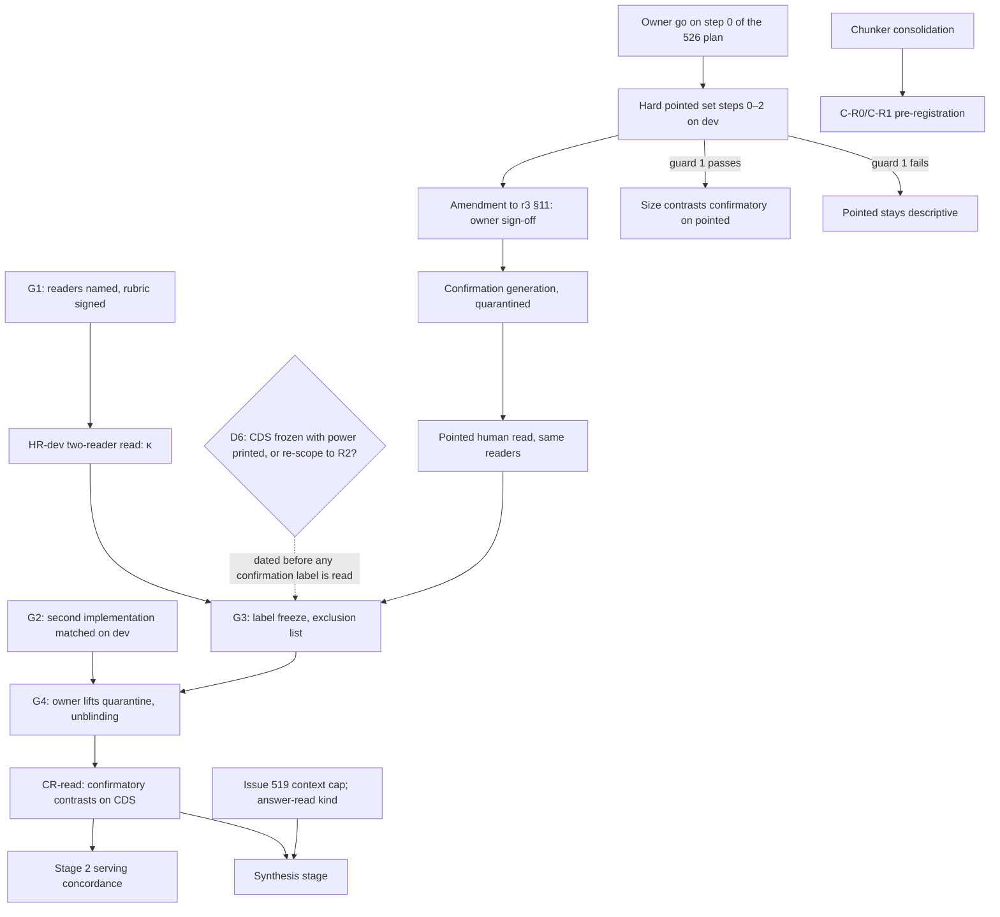

# The chunking study: goal, sub-goals, experiments

**Status, 2026-10-10:** `BLOCKED` on the two-reader human read. No experiment is running. This
page **consolidates** the study plan. The plan was spread across six documents, and the
decision table in [chunking-evaluation.md](chunking-evaluation.md) § *Pre-registration* is
dated 2026-09-04. This page does not make new decisions or measurements. Every number on it
links to the committed record file it comes from. Where a question is still open, the page
lists the options that the record lists.

**Summary.** The study exists to decide how the production index should chunk the
~500k-article PMC Open Access load. The served path is hybrid retrieval plus rerank. The
study asks how coarse and cheap that index can be while it still delivers evidence for
*pointed* questions as well as the fine index does. Phase 0 (2026-09-04/05) settled one axis,
overlap, and showed that document-level metrics answer a different question. It also showed
that chunk size can only be read at matched realised size and matched delivered budget. The
passage-level confirmation run (revision 3) splits its endpoint into reach (`ERET`) and
containment (`EPACK`). Its development-set calibration (Stage 0b′) found three things:

- The 80 CDS confirmation topics cannot power the size contrasts.
- The pointed population sits at its ceiling.
- Growing the corpus does not fix the ceiling.

The confirmation topics were nevertheless retrieved and labeled under quarantine (Scout
finished 2026-09-09, Qwen 2026-09-11; the #513 span filter was applied 2026-09-14). **The critical path is now the two-reader human read**, followed by label
freeze, unblinding and Stage 2. No machine step on that path is outstanding except the second
implementation of the analysis code (gate G2, §5), which has to exist before unblinding. In
parallel, the population that could carry the size question (the hard pointed set, #526)
waits on the owner's go.

**Contents:** [1 Goal](#1-goal) · [2 Sub-goals](#2-sub-goals) · [3 Experiments](#3-experiments) ·
[4 Dependencies and critical path](#4-dependencies-and-the-critical-path) ·
[5 Gates](#5-gates) · [6 Open decisions](#6-open-decisions-for-the-owner) ·
[7 Proposed next steps](#7-proposed-next-steps) · [8 What this is not](#8-what-this-document-is-not)

---

## 1. Goal

**The decision.** How should the production index chunk full-length scientific articles for
the PMC OA load (~500k articles: the bacteria ∪ viruses subset of PMC OA, ~498k, per
[oa-full-ingest.md](oa-full-ingest.md))? Two sub-questions
follow from it: which chunk size and overlap to use, and whether structure-aware chunking or
neighbour delivery should be built or turned on. The served path is fixed as the frame:
`hybrid` (dense + BM25, RRF) followed by `bge-reranker-v2-m3`
([SPEC-confirmation-run-r3.md](results/design/SPEC-confirmation-run-r3.md) §3.4).

**The population**, as the owner declared it on 2026-09-06 (r3 §1): pointed, evidence-seeking
questions of the kind a research agent asks while building an argument (a specific finding,
number, method or claim). The consumer is a research agent, so delivery budgets are agent-sized:
the primary budget is B = 16,384 tokens in the generator's tokenizer (r3 §3.2, §3.3); run (a) read it in SFR tokens, a recorded deviation (D13). Broad topical questions are not what the
index is optimised for. **Limitation that carries through:** the CDS confirmation queries are
clinical narratives, not pointed questions, so on CDS the pointed property is carried by the
endpoint rather than by the query (r3 §1.1).

**The decision rule** (r3 §1, §3.6): the coarser or cheaper index must be **non-inferior** to
the fine reference. The test is one-sided at α = 0.025 per endpoint, **conjunctive on `ERET`
and `EPACK`**, with **ε = 0.05 absolute, unchanged**. Under r3 §11 the rule applies on both
populations. A superiority family under Holm (R1 size extremes, R2 headers, R3 `parent256`,
R4 `nbr1_512`) is read conjunctively with `ERET` non-inferiority (r3 §3.5). Two more owner rules bind: the production index does not
change until the experiments are done, and the knowledge graph is out of scope (r3 §1).
That is r3 as written. **D4(i)** (owner, 2026-10-10, in force once r3 is amended) makes CDS
`ERET`-only for confirmation and moves containment, and with it the superiority family's
`EPACK` bar, to the pointed population.

**What the study feeds** ([docs/papers/README.md](../papers/README.md)):

| paper | what it needs from the study | state per the roster |
|---|---|---|
| A: *Reliable but not canonical* (evidence-localisation judges) | the labeler measurements (E1 below), all of them already on the record | drafting, data complete ([OUTLINE](../papers/paper-a-evidence-localisation/OUTLINE.md)). It does not wait for the chunking verdict, but its validity section waits for the human read |
| B: chunking full-length scientific articles | the confirmatory verdicts (SG1–SG4) | not started; blocked on the human read |

---

## 2. Sub-goals

There is one sub-goal per decision (SG1–SG6) and four enabling sub-goals (E1–E4). Every
evidence line takes its status from this vocabulary where it applies, and the statuses are never merged. Gate, process and prediction lines (*gate passed/failed*, *measured*, *P3 holds*, *done*) are labelled as such:

- **resolved**: the reading clears its pre-registered bar.
- **powered null**: nothing found, at a power floor below the bar.
- **unresolved**: the design could not have seen the effect, which is different from a null.
- **GATE-NOT-EVALUABLE**: the instrument failed its own precondition.
- **calibration**: development topics only, used to size or gate a test, never to decide.
- **descriptive**: pre-registered but not confirmatory, or demoted by a window rule.
- **exploratory**: not pre-registered; may suggest a test, never settles one.

Stage 0b′ numbers are all **calibration**.

### SG1: Chunk size

**Question.** Is a 1024- or 2048-token index non-inferior to the 512/64 shipping index for
pointed evidence delivery at 16k? **Decision informed:** the storage lever. Measured on the
Stage 0 corpus, 512→1024/0 means 2.157× fewer vectors and 512→2048/0 means 3.98× fewer
(r3 §3.6). **Contrasts:** N1 `fixed_tok512` − `fixed_tok1024_ov0pct`, N3 `fixed_tok512` −
`fixed_tok2048_ov0pct`, R1 `fixed_tok256_ov0pct` − `fixed_tok2048_ov0pct` (r3 §3.5–3.6).
**Predictions on record:** Q4 (N1 non-inferior on `EPACK`, a contest on `ERET`) and Q5 (N3
non-inferior on `EPACK`, fails `ERET`) (r3 §7).

| evidence | status | source |
|---|---|---|
| Leg A grid: the 2048 − 256 size effect on nDCG@10 spans zero. On recall@100 it reads +0.0432, which sits *at* its δ80 (0.0466), not above it | unresolved | [stage1-legB/RESULTS-stage1-legB.md](results/stage1-legB/RESULTS-stage1-legB.md) §7.2; item 6 of *Conclusions that were later revised* in [results/README.md](results/README.md) (Leg A's own §4.5 still scores P2 as holding on recall@100) |
| The 512→1024 step on dense nDCG@10: Leg A +0.1204, Leg B −0.0182 | **resolved on each leg, opposite signs: contested**; Q2 (uniform vs size-localised) not establishable | [stage1-legB/RESULTS-stage1-legB.md](results/stage1-legB/RESULTS-stage1-legB.md) §7.2, §7.3, §11 |
| On the 2048 − 256 extremes, each leg's query construction favours the direction it reports; no config may be pruned on either leg's direction | prune gate (until the population is declared and a discriminating population exists) | [long-doc-judged-set.md](long-doc-judged-set.md) §14.5; Leg B §7.2 |
| No size contrast resolves on either leg behind the reranker, including 512→1024 | unresolved | [stage1-legB/RESULTS-stage1-legB.md](results/stage1-legB/RESULTS-stage1-legB.md) §8.1 |
| At a matched 4,096-token budget `tok256` leads `tok2048` (2.2× at m=1, 3.8× at m=16). The fixed-k reading points the other way. Budget-matched *recall* `R_B@4096` does not resolve | direction consistent on two corpora; primary recall unresolved; both constructions favour fine chunks | [breadth-k/RESULTS-breadth-k.md](results/breadth-k/RESULTS-breadth-k.md) §7; [rescore/RESULTS-rescore-small-corpora.md](results/rescore/RESULTS-rescore-small-corpora.md) §4.4 |
| Stage 0 (revision 2, `EUC@4096`) | GATE-NOT-EVALUABLE | [stage0/RESULTS-stage0-calibration.md](results/stage0/RESULTS-stage0-calibration.md) |
| From 256 to 2048 tokens, reach falls 0.277 → 0.112 and containment rises 0.188 → 0.696. Size moves evidence between the two factors | calibration | [stage0/RESULTS-stage0b-prime.md](results/stage0/RESULTS-stage0b-prime.md) §3 |
| Joint power at n = 80: N1 0.560, N3 0.369, R1 0.513 | calibration: fails the 80 % gate | same, §4; [stats.json](results/stage0/artifacts/stage0b-prime/stats.json) `cds_sizing` |
| The 2048 arm's `ERET@16k` is below the 0.15 floor, so **N3 cannot be read as a decision at 16k** | descriptive on `ERET` (window demotion) | same, §3 and §11 item 2; `stats.json` `window_demotions` |
| The pointed population is non-inferior on every contrast, at its ceiling | descriptive (guard 1 failed) | same, §4, §6 |

**Settling test.** Confirmation run (a) on CDS, read with its projected power printed. The
record expects N1/N3/R1 to come out UNRESOLVED (r3 §10 item 5(a)). The size question can
become confirmatory only on a pointed population that clears guard 1, which is what the hard
pointed set is for (r3 §10 items 5(b) and 6;
[PLAN-hard-pointed-set.md](results/design/PLAN-hard-pointed-set.md)). **Status:** open.
**Blocked on:** the human read for CDS, and the owner's go on #526 for the hard set.

### SG2: Overlap

**Question.** Is the 64-token (12.5 %) overlap worth its storage? **Decision informed:** drop
overlap. The record treats the axis as **settled**: r3 §3.6 drops N2 and gives its α to N3.

| evidence | status | source |
|---|---|---|
| Leg A (dense): 12.5 % − 0 % = −0.0210, δ80 0.046 below the 0.05 bar¹. recall@100 \|Δ\| ≤ 0.0033 at every size | powered null (dense) | [stage1/RESULTS-stage1-legA.md](results/stage1/RESULTS-stage1-legA.md) §1, §4.3 |
| Leg B (dense, ×0 judged-only rung): −0.0040, δ80 0.0081 below the 0.010 bar. At ×11.5 the dense replication is −0.0078 with δ80 0.0114 above the bar | powered null at ×0; unresolved at ×11.5 | [stage1-legB/RESULTS-stage1-legB.md](results/stage1-legB/RESULTS-stage1-legB.md) §6, §11 |
| Behind the reranker: Leg A −0.0158, Leg B ×11.5 −0.0034 | unresolved on both legs | Leg B §8.1 |
| Stage 0 N2: σ_d = 0 at 1.7 % coverage | GATE-NOT-EVALUABLE; neither supports nor undermines the null | [stage0/RESULTS-stage0-calibration.md](results/stage0/RESULTS-stage0-calibration.md) §4 |

¹ The Leg B write-up recomputes Leg A's δ80 as 0.041; quote whichever file you cite.

**Caveats.** Both nulls are *dense*, *document*-metric results. The `sentence`/`words` rows carry
≈ 8.9 % effective overlap, not 12.5 % (item 4 of *Conclusions that were later revised* in [results/README.md](results/README.md)).
**Status:** decided by the record. It has not reached a production default: under the owner's
rule above, the index does not change until the study is done.

### SG3: Structure-aware chunking

**Question.** Does chunking that respects document structure (contextual headers,
section-bounded packing) deliver more evidence than fixed windows at the same realised size?
**Decision informed:** the owner decided on 2026-10-06 to build a `section` method in-house,
in `chunkers.py` ([chunking-evaluation-candidates.md](chunking-evaluation-candidates.md)
preamble, §5). Nothing is built yet, and candidates §6 orders the production method after the
C-R0/C-R1 study arms. Whether it *ships* is open (D8). The prediction on record is that structure-aware chunking improves
**reranked** metrics at similar chunk counts
([chunking-evaluation.md](chunking-evaluation.md) § *Pre-registration*).

| evidence | status | source |
|---|---|---|
| `sentence_tok512` − `fixed_tok512` = +0.0606, Holm-adjusted p 0.097 | unresolved (closest signal in the grid) | [stage1/RESULTS-stage1-legA.md](results/stage1/RESULTS-stage1-legA.md) §4.2 |
| Leg B `words512` − `fixed512`: CI excludes 0 and Holm p 0.028, but the effect is below δ80, on a leg whose method readings are construction artefacts | Holm-significant, below δ80: unresolved | candidates §3 |
| R2 `header512` − `fixed_tok512_ov0pct`: joint power at n = 80 is 0.948 on CDS, **the only powered contrast** | calibration: passes the gate | [stage0/RESULTS-stage0b-prime.md](results/stage0/RESULTS-stage0b-prime.md) §4 |
| C-R1 section-bounded packing (512 / 1024 / 2048 caps plus a whole-section variant), with C-R0 length-yoked random boundaries as its control | not designed, not built | candidates §4, §6 |

**Settling test.** R2 in confirmation run (a): the one contrast the record expects to resolve
(r3 §10 item 5(a)) — under r3 as written. Under D4(i) R2's `EPACK` bar moves to the pointed
population and R2 is descriptive on CDS until a pointed population clears guard 1 (D4, D6). C-R1 needs its own pre-registration with size control. Candidates §4
proposes re-running `header512` with the header counted inside the 512 tokens. **Status:** R2
is waiting on the read. C-R0 and C-R1 are not designed, and candidates §6 orders them after
the construction consolidation.

### SG4: Delivery and neighbour context

**Question.** Does delivering surrounding text recover the containment that chunk boundaries
cut, without losing reach? The surrounding text can be the enclosing section (`parent256`) or
the previous and next chunk (`nbr1_512`, which is production's `context_window = 1`).
**Decision informed:** turn on `context_window = 1` by default (R4), or adopt section expansion
(R3) (r3 §1, §3.5). **Predictions on record:** Q6 (R4 clears the 0.05 superiority bar on
`EPACK`) and Q7 (R4's `ERET` is non-inferior) (r3 §7).

| evidence | status | source |
|---|---|---|
| Joint power at n = 80: R3 0.495, R4 0.529 | calibration: fails the gate | [stage0/RESULTS-stage0b-prime.md](results/stage0/RESULTS-stage0b-prime.md) §4 |
| `nbr1_512` (0.101) and `nbr2_512` fall below the 0.15 reach floor at 16k, so **R4's conjunctive `ERET` leg (Q7) cannot be read as a decision at 16k** | descriptive on `ERET` (window demotion) | same, §3; `stats.json` `window_demotions` |
| `parent256` changes sign between 4k (Stage 0) and 16k (Stage 0b′), and its CI spans zero at 16k | calibration | candidates §3, citing the Stage 0 and Stage 0b′ records |
| C-R5 auto-merge (expand only where retrieval votes for a section) | not designed | candidates §4 |

**Product caveat on the record:** production's `llm_max_context_chars = 8000` caps the
generator's context at about 2k tokens, so the served path does not deliver a 16k context today
(#519, open; [SPEC-synthesis-stage.md](results/design/SPEC-synthesis-stage.md) §5 for the ≈ 2k figure, §8 for the limitation). **Status:**
open, underpowered on CDS.

### SG5: Semantic chunking

**Question.** Does a semantic chunker beat fixed windows *at matched realised size*?
**Decision informed:** whether to revisit semantic for the OA load. **Status: deferred by the
owner** to a follow-up after the size answer (r3 §1, §6).

| evidence | status | source |
|---|---|---|
| Worst-scoring kind on Leg A, about 7× the embedding cost, 3.4× the index. Its realised size is pinned near 350 tokens whatever the cap says | exploratory (not pre-registered); never compared at matched realised size | [stage1/RESULTS-stage1-legA.md](results/stage1/RESULTS-stage1-legA.md) §5, §7.1; item 3 of *Conclusions that were later revised* in [results/README.md](results/README.md) |
| `semantic` and `semantic_pooled` are **two different chunkers**: boundary Jaccard 0.0025 on 20 papers (the 09-24 corpus-scale record; the 09-18 shard record reports a different statistic). No retrieval comparison exists | measured (boundaries and cost only) | [semantic-vs-pooled-2026-09-18.md](results/semantic-vs-pooled-2026-09-18.md) (shard); [salmonella-amr-semantic-vs-pooled-2026-09-24.md](results/salmonella-amr-semantic-vs-pooled-2026-09-24.md) (corpus scale) |

**Open within the deferral:** which semantic chunker the arm would be (Paper B must name
one), and C-R0 as the control that makes "method at matched size" a paired contrast.

### SG6: Separability of retrieval modes

**Question.** How does chunk size act under `vector`, `bm25` and `hybrid`, with and without
the reranker? **Decision informed:** none directly. The owner required that the three modes be
separable (r3 §1), and the answer bounds how much the size decision matters on the served path.
**Predictions:** Q8 (BM25 favours coarser chunks than dense does) and Q9 (rerank-off reverses at least one sign).

| evidence | status | source |
|---|---|---|
| The reranker reorders the 24-config grid (r = +0.553). In step 3 it reverses a first-stage verdict: only grade≥2 MRR@10 (+0.299 [+0.074, +0.542]) excludes zero; reranked nDCG@10 spans it | P3 holds (MRR@10, n = 10 topics); grid correlation exploratory | [step3/RESULTS-step3-real-experiment.md](results/step3/RESULTS-step3-real-experiment.md); [stage1/RESULTS-stage1-legA.md](results/stage1/RESULTS-stage1-legA.md) §6 |
| `hybrid` flattens the N1/N3 containment contrast relative to either leg (not R1, where hybrid −0.468 exceeds vector −0.390). Q8 supported; Q9 supported | calibration; pre-registered descriptive table | [stage0/RESULTS-stage0b-prime.md](results/stage0/RESULTS-stage0b-prime.md) §5 |
| In-process BM25 against the dev tenant's Elasticsearch: overlap@50 0.9469 against a 0.90 bar | resolved (concordance check passes) | same, §7; [es_concordance.json](results/stage0/artifacts/stage0b-prime/es_concordance.json) |

**Status:** measured on dev. The confirmation run reports the modes as pre-registered
secondaries. Stage 2 serving-path concordance is not run.

### E1: A reliable *and valid* evidence gold

**Question.** Can the "where" of evidence be labeled reproducibly, and is it right?

| evidence | status | source |
|---|---|---|
| Stage 0 span self-consistency is 0.323 against ≥ 0.90 | gate failed | [label_gates.json](results/stage0/artifacts/label_gates.json) |
| Quote-primary relabel: neither judge passes | gate failed | [stage0/RESULTS-stage0b-relabel.md](results/stage0/RESULTS-stage0b-relabel.md) |
| Whole-sentence anchors (r3.1): the copy gate passes for both judges, self-consistency still fails, and the union does not saturate | copy gate resolved; span gates failed | [stage0/RESULTS-stage0b-relabel-r31.md](results/stage0/RESULTS-stage0b-relabel-r31.md) |
| Graded per-sentence support reaches Spearman–Brown 0.9205 at 30 pooled readings | calibration (dev, pooled two-judge mixture): 0.9205 ≥ 0.90; reliability only | [gates-r31ext.json](results/stage0/artifacts/r31ext/gates-r31ext.json); [RESULTS-stage0b-relabel-r31ext.md](results/stage0/RESULTS-stage0b-relabel-r31ext.md) |
| The two judges' graded support correlates at r = 0.2976 per pair: **reliable is not valid** | measured | same |
| Claude judges (one reading each) pass the copy gate; self-consistency is absent | partial; absent, not passed | [stage0/RESULTS-stage0b-claude-judges.md](results/stage0/RESULTS-stage0b-claude-judges.md) |
| Two-reader human read, κ, enumeration recall | **`PENDING-HUMAN`**: not started | [stage0/README.md](results/stage0/README.md) § *Item 8* |

Two more items on the record: the human-read draw found only 3 of the 20 wanted deep-section
pairs, and no reader has signed the rubric, which r2 §6.6.1 requires before labeling (a
recorded deviation, same README). **Decided in principle 2026-10-10 (D4(i), D5):** CDS containment is
descriptive; the containment primary moves to the pointed population, pending the r3 amendment.

### E2: A query population that discriminates

**Question.** Is there a population of the declared shape on which arms can actually differ?

| evidence | status | source |
|---|---|---|
| The pointed set: 177 queries on dev, 44.2 % yield | done | [stage0/RESULTS-stage0b-pointed-gen.md](results/stage0/RESULTS-stage0b-pointed-gen.md) |
| Guard 1 fails formally on the `EPACK` window (inside it for 1 of 10 hybrid arms), with `ERET` at the ceiling (0.904–0.955) | descriptive population | [stage0/RESULTS-stage0b-prime.md](results/stage0/RESULTS-stage0b-prime.md) §6 |
| **Corpus size is not the lever.** 161 of 177 queries are reached in every cell, and σ_d grows faster than the between-arm spread | calibration (projection; the linear and logit links disagree about the window); step 2 (5×) not run on that basis | [stage0/RESULTS-pointed-at-scale.md](results/stage0/RESULTS-pointed-at-scale.md); [difficulty.json](results/stage0/artifacts/pointed-scale/difficulty.json) |
| Hard pointed set: no unique lexical key, deixis and single-source screens, two-stage selection | planned, awaiting the owner's go | [PLAN-hard-pointed-set.md](results/design/PLAN-hard-pointed-set.md) (#526) |
| Leg C (citances): the tiebreak that long-doc §14.5 called the highest-value unrun measurement | never run against the grid, and not scheduled | [long-doc-judged-set.md](long-doc-judged-set.md) §14.3, §14.5 |
| Real agent queries (opt-in query logging on dev/demo) | issue open (#502) | r3 §11 (*Toward the real population*); [PLAN-hard-pointed-set.md](results/design/PLAN-hard-pointed-set.md) §6 |

**A tooling note on generating the hard set:** the OpenChia R0 calibration found its Episode
stopping statistic calibrated under even sampling, safe but slow under mild heterogeneity, and
rarely or never terminating under heavy heterogeneity, so a generation Episode would end on its
declared bound and not on convergence
([openchia-r0/RESULTS](../design/openchia-r0/RESULTS-R0-stopping-statistic-calibration.md);
[episodes-as-experiments](../design/openchia-episodes-as-experiments.html)).

### E3: Measurement infrastructure that can be trusted twice

The pieces, and where each stands:

- **The analysis code (`ERET`/`EPACK`/NI) has a single implementation.** A second,
  independent implementation, validated on the dev labels, is gate **G2** of the study's run
  plan (working notes, early October, *not yet on the record*; §5), and it must precede
  unblinding. **This page's proposal**, consistent with the owner's 2026-10-06 rule that past
  harnesses keep their pins ([docs/papers/README.md](../papers/README.md) § *Every artifact
  records which code produced it*): build it outside `stage0/`, reading the pinned-checkout
  labels.
- **Provenance.** `experiment_provenance()` is on main (#682). A past study keeps its pin:
  re-runs execute at `55a0fc2` (Stage 0) or `d225cea` (Phase 0), or re-embed. The pins and their
  parent relation are recorded in [RESULTS-stage0-calibration.md](results/stage0/RESULTS-stage0-calibration.md) §0.
- **Snapshots** (not in git). `/rag/snapshots/` holds read-only clones tagged
  `exp/phase0-d225cea`, `exp/stage0-55a0fc2` and `exp/g1-pilot-200-60482e3`, the runners `run_stage0.sh`/`run_phase0.sh`,
  and the dev-10 pipeline regression check `check_dev10_dense.py`. Its README describes them.
- **Library-level regression goldens** (`/rag/snapshots/regression/v1`, test in
  [`python/tests/regression/`](../../python/tests/regression/), #687, merged). Adding a method
  must leave the existing arms' spans byte-identical.
- **A rule learned (snapshots README):** `s0_retrieve` overwrote `dev_queries.npy` on
  re-invocation, so four of the six arms reproduce only to set equality, not bit-identically.
  **A new harness must never overwrite a golden input.**
- **Chunker construction** is not yet consolidated: five builders, three token-budget policies,
  and about 14 places to touch per method. This is the prerequisite before new methods
  (candidates §2, §6 step 2).
- **The confirmation run is on SFR tokens, not the generator's tokenizer.** This is a recorded
  deviation from r3 §3.3 that must be stated in the analysis
  ([RESULTS-confirmation-run-a-setup.md](results/stage0/RESULTS-confirmation-run-a-setup.md) §5
  item 1). The re-embed itself (≈ 1.93 fleet-hours) has not run, and r3 has not been amended
  (D13).

### E4: Answer quality (the synthesis stage)

The record treats the synthesis stage as a stage *after* the evidence study, not as part of the
confirmatory family ([SPEC-synthesis-stage.md](results/design/SPEC-synthesis-stage.md), reviewed
in [REVIEW-synthesis-stage.md](results/design/REVIEW-synthesis-stage.md)). It measures whether
the answer is correct and faithful, whether citations are precise, whether the generator
abstains when it should, and what generation costs, across generator × configuration.
**Status:** proposed, not started. **Blocked on:**

- an `answer-read` grading kind in the contract;
- #519 (the 8,000-character context cap);
- a pointed population admitted by guard 1, needed for any confirmatory reading.

Stage 0b′ §11 item 3 proposes repurposing the ceiling-bound pointed set for it.

---

## 3. Experiments

States:

- **done**: on the record.
- **quarantined**: data exists and may not be read until unblinding.
- **planned**: designed, awaiting a go or an upstream step.
- **not designed**: named only.

| id | what | serves | state | record |
|---|---|---|---|---|
| pre | 7-way known-item and SciFact chunking evals (#677's `fixed_token` default rests on the 7-way result; SciFact is the other committed harness; known-item queries are insensitive to chunking) | SG1, SG3, SG5 | done | `python/scripts/eval/chunking_compare_7way_report.md`, `scifact_chunk_eval_report.md`; candidates §3 |
| P0-1 | TREC CDS coverage gate | E2 | done (PASS) | [step1](results/step1/RESULTS-step1-cds-gate.md) |
| P0-2 | BM25 lead-only ablation | SG6 | done; inference revised by P0-3 | [step2](results/step2/RESULTS-step2-lead-ablation.md) |
| P0-3 | real dense contrast, reranker reversal | SG1, SG6 | done | [step3](results/step3/RESULTS-step3-real-experiment.md) |
| P0-4 | Stage 1 Leg A, 24-config grid, n = 10 topics | SG1–SG3, SG5 | done | [stage1](results/stage1/RESULTS-stage1-legA.md) |
| P0-5 | Stage 1 Leg B grid, two rungs | SG1, SG2 | done | [stage1-legB](results/stage1-legB/RESULTS-stage1-legB.md) |
| P0-6 | §7a oracle; Leg B and Leg C pilots; Leg B re-run | E2 | done | [pilots](results/pilots/RESULTS-legBC-pilots.md), [re-run](results/pilots/RESULTS-legB-rerun.md) |
| P0-7 | small-corpus chunk-granularity re-score | SG1, SG2 | done | [rescore](results/rescore/RESULTS-rescore-small-corpora.md) |
| P0-8 | breadth × k | SG1 | done | [breadth-k](results/breadth-k/RESULTS-breadth-k.md) |
| S0 | Stage 0, revision 2 calibration (`EUC@4096`) | all | done: GATE-NOT-EVALUABLE | [RESULTS-stage0-calibration](results/stage0/RESULTS-stage0-calibration.md) |
| S0-r3 | r3 §5 step 2: quote-primary relabel, two judges | E1 | done: stop | [RESULTS-stage0b-relabel](results/stage0/RESULTS-stage0b-relabel.md) |
| S0-r31 | r3.1 whole-sentence anchors, ×5 | E1 | done: copy gate passes, span gates still fail | [RESULTS-stage0b-relabel-r31](results/stage0/RESULTS-stage0b-relabel-r31.md) |
| S0-r31ext | Scout ×20, Qwen ×10; graded support | E1 | done: graded support 0.9205; span gates still fail | [RESULTS-stage0b-relabel-r31ext](results/stage0/RESULTS-stage0b-relabel-r31ext.md) |
| S0-claude | Sonnet 5, Opus 5, Fable 5.1, one reading each | E1 | done, partial (Fable 251/308) | [RESULTS-stage0b-claude-judges](results/stage0/RESULTS-stage0b-claude-judges.md) |
| S0-pg | pointed population, dev, 177 queries | E2 | done | [RESULTS-stage0b-pointed-gen](results/stage0/RESULTS-stage0b-pointed-gen.md) |
| S0b′ | r3 §5 step 4: split endpoints, three modes, both populations, BM25 concordance | SG1–SG4, SG6, E2 | done: gate fails on power | [RESULTS-stage0b-prime](results/stage0/RESULTS-stage0b-prime.md) |
| S0-scale | option (b): pointed reach versus corpus size | E2 | done; step 2 (5×) not run (owner may overrule, D14) | [RESULTS-pointed-at-scale](results/stage0/RESULTS-pointed-at-scale.md) |
| CR-a | option (a): confirmation retrieval, pooling (3,738 pairs), 30-reading labeling, #513 filter | SG1–SG4, SG6 | **quarantined**: labels complete (Scout 09-09, Qwen 09-11); #513 filter 09-14 | [RESULTS-confirmation-run-a-setup](results/stage0/RESULTS-confirmation-run-a-setup.md) |
| HR-dev | two-reader human read, 100 CDS pairs (item 8 / R-dev), plus about 50 pointed pairs; plus one expert on a stratified ≈ 20–30-pair subset of the same CDS pairs (D4(ii)) | E1, gates all | planned: **critical path, not started**. The draw (`rdev_sample.json`), the pilot sheet (`stage0/artifacts/rdev-pilot-read/`) and the scorer exist | [stage0/README](results/stage0/README.md) § *Item 8*; r3 §11 guard 2; [RUN-PACKAGE.md](results/RUN-PACKAGE.md) §3 |
| HR-conf | R-conf, ≥ 100 confirmation pairs, blind, before freeze | E1 | **unclear whether still required** (§6, D4) | [SPEC-confirmation-run.md](results/design/SPEC-confirmation-run.md) §6.6.2, P.9 |
| REEMB | re-chunk and re-embed the arms in the generator's tokenizer (≈ 1.93 fleet-hours) | E3, SG1 | not run; run (a) used SFR tokens (recorded deviation); r3 not amended | r3 §3.3, §4, §5 step 6; [RUN-PACKAGE.md](results/RUN-PACKAGE.md) §6 |
| G2 | second implementation of `ERET`/`EPACK`/NI, matched on dev | E3 | not built; *working notes, not on the record* | — |
| CR-read | freeze → unblinding → confirmatory analysis with projected power printed | SG1–SG4 | planned, blocked | r3 §5 step 6; P.9 |
| ST2 | Stage 2: serving-path concordance on the dev tenant (blocking) | SG1–SG4, SG6 | planned, blocked | r2 §9; r3 §5 step 7 |
| HPS | hard pointed set, steps 0–6 | E2, then SG1/SG4 | planned: awaiting the owner's go | [PLAN-hard-pointed-set](results/design/PLAN-hard-pointed-set.md) |
| SYN | synthesis stage | E4 | planned (proposed), blocked | [SPEC-synthesis-stage](results/design/SPEC-synthesis-stage.md) |
| C-R0 … C-R5 | new method arms: yoked control, section packing, PIC, TextTiling, late chunking, auto-merge | SG3–SG5 | not designed | [candidates](chunking-evaluation-candidates.md) §4 |
| hdr-in | `header512` re-run with the header counted inside the 512 | SG3 | not designed | candidates §4 |
| LegC | Leg C citances against the grid | E2 | not run, not scheduled | [long-doc-judged-set.md](long-doc-judged-set.md) §14.5 |
| SEM | `semantic` vs `semantic_pooled` boundaries and cost (shard 09-18; corpus scale 09-24); no retrieval | SG5 | done | [09-18](results/semantic-vs-pooled-2026-09-18.md), [09-24](results/salmonella-amr-semantic-vs-pooled-2026-09-24.md) |
| REG | snapshot re-runs and regression subset (#687 library goldens; dev-10 dense check; three pinned clones incl. `exp/g1-pilot-200-60482e3`) | E3 | done for the existing arms; re-run on every code change | `/rag/snapshots/README.md`; [`python/tests/regression/`](../../python/tests/regression/) |

---

## 4. Dependencies and the critical path

**The critical path is the human read.** No machine step remains between the quarantined
labels and the read (handoff §2). **G2 must precede unblinding**, and it can be built while the
read happens. The hard pointed set runs in parallel on dev, and its confirmation generation
needs no retrieval before freeze ([PLAN-hard-pointed-set.md](results/design/PLAN-hard-pointed-set.md)
§5). New method arms (C-R*) sit off the critical path. They need consolidation first, then their
own pre-registration.

## 5. Gates

The study's run plan (working notes, early October), which defines roles (Owner / Experimenter /
Supervisor / two Readers) and gates G1–G7, is **not yet on the record**. The in-repo OpenChia page
([openchia-episodes-as-experiments.html](../design/openchia-episodes-as-experiments.html)) names
G2 and G4 ("/build after G2 · /run after G4"). The fuller definitions below come from an OpenChia
architecture sketch under `/rag/tmp/openchia-pilot/` (not in git), which names four gates:

| gate | meaning as named in the sketch | owner approval |
|---|---|---|
| G1 | rubric signed by the readers (the human-read node's approval) | yes |
| G2 | second implementation of the analysis matched on dev labels; the analysis may not be *built* before it | — |
| G3 | label freeze: κ, exclusion list, freeze hash | — |
| G4 | the owner lifts the quarantine in writing; the analysis may not be *run* before it | yes |
| G5–G7 | not described in any file this page could read (G6 and G7 are owner approvals) | — |

Putting the run plan on the record would let this table cite it.

## 6. Open decisions for the owner

Each item points at where the record already lays out the options. **OPEN — OWNER** unless a row says *decided*.

| # | decision | options as recorded | record's recommendation | where |
|---|---|---|---|---|
| D1 | Hard pointed set: go or no-go on step 0 (about 1 h, reversible). This decides whether *size* can become confirmatory on the pointed population; it does not decide the CDS family (D6) | go / no-go | none explicit; the plan proposes step 0 as the cheap test of the idea | [PLAN-hard-pointed-set.md](results/design/PLAN-hard-pointed-set.md) §8.1 |
| D2 | Accept the estimand narrowing to "pointed questions without a unique lexical key" | accept / keep one mixed set (guard 3's count roughly doubles) | the plan's step 3 is written assuming accept | same, §8.2, §5 step 3 |
| D3 | Rule F's single-source judge | Scout (free) / Opus via the CLI (about $500 projected) | Scout | same, §8.3 |
| D4 | Human reading, and which population carries containment ("where") | r2 P.9 step 3 requires R-conf; [grading-ui.md](grading-ui.md) §1 and the frozen [RUBRIC-evidence.md](results/design/RUBRIC-evidence.md) §4 still assume it. r3, RUN-PACKAGE, the handoff and conf-a cost and gate only R-dev; [REVIEW-synthesis](results/design/REVIEW-synthesis-stage.md) N4 counts reads without it. Options put to the owner 2026-10-10: (1) r3 §10 item 4(b) as worded; (2) the same, with R2 keeping a confirmatory containment bar on CDS; (3) r3 unchanged | **Decided in principle, 2026-10-10 (owner): option (1).** (i) The containment primary moves to the pointed population, whose gold is the construction passage and needs no labeler (r3 §10 item 4(b)); CDS keeps reach (`ERET`) confirmatory and containment descriptive. (ii) One expert reads a stratified subset (≈ 20–30 as proposed; exact size and strata open) of the same CDS pairs, so the reliability of the non-expert read is measured rather than assumed. The available experts are in microbiology, genomics and metagenomics, not clinical medicine, so on CDS's clinical topics (ii) measures expert-versus-non-expert agreement, not clinical correctness. More readers may be added later (owner: "we can try"). **Consequences, shown to the owner before the choice:** CDS's power shortfall is on `EPACK`, not `ERET` (0b′ §4: `ERET` marginals 0.95–1.00, `EPACK` 0.38–0.56 except R2 0.99), so N1 becomes decidable on CDS on reach, while N3 and R4 stay window-demoted on `ERET`. The superiority family R1–R4 has its bar on confirmatory `EPACK@16k` read on CDS (r3 §3.5, §11), so under (i) R2 — the one contrast CDS powers — and R1/R3/R4 become descriptive on CDS and wait for a pointed population that clears guard 1 (the current one fails it, 0b′ §6; D1, D15). **Still open:** the dated amendment to r3 §3.1/§3.5/§3.6/§11 that puts (i) into force, **before any confirmation label is read** (as for D6); whether R-conf survives in any form; any change to the two-reader protocol for more readers (a pre-registered amendment, before freeze) | §8 of this page, contradiction 1; [r3](results/design/SPEC-confirmation-run-r3.md) §10 item 4; [RESULTS-stage0b-prime.md](results/stage0/RESULTS-stage0b-prime.md) §4 |
| D5 | Graded support on CDS: confirmatory after the read, or descriptive under item 4(b) | (a) confirmatory / (b) containment primary moves to pointed, CDS keeps `ERET` plus descriptive graded `EPACK` | **Decided in principle with D4(i), 2026-10-10: (b).** Remaining detail: whether (a)'s graded support is reported as CDS's descriptive containment | r3 §10 item 4 |
| D6 | The CDS confirmatory family: (a) run it under the frozen procedure with projected power printed, or (c) re-scope it | (a) / (c). Recorded as (a) and (b) started, (c) planned as the fallback. (c) applies to CDS **regardless of the hard set** ([PLAN-hard-pointed-set.md](results/design/PLAN-hard-pointed-set.md) §6: "item 5(c) still applies to CDS"). **D4(i) changes the premise:** with CDS containment descriptive, the CDS family is read on `ERET`, where N1 is powered and R2's superiority bar (on `EPACK`) no longer applies — so (c) as recorded ("re-scope to R2") must be re-stated against D4(i) | (a)+(b), with (c) the fallback; to be re-stated after D4's amendment | r3 §10 item 5. A (c) amendment must be dated **before any confirmation label is read**, and is best written together with D4's |
| D7 | Readers: who, and when (32–48 person-hours for CDS plus 10–15 for pointed); rubric sign-off first (G1) | — | — | r3 §4; r3 §11 cost |
| D8 | New method arms: whether and when to pre-register C-R0/C-R1 (and C-R2/3/5) as a follow-up study, on which population | candidates §6 order: consolidate → C-R0 → C-R1 → production `section` | that order | [candidates](chunking-evaluation-candidates.md) §6 |
| D9 | Synthesis stage: go, and on which population; the judge transport and spend (≈ $250 at list to ≈ $1,000 at #514's CLI rate; the CLI could not complete 867 calls, so API key or Batches; review B9); the prompt format (production `[n]` formatting with two named deviations, review B7) | spec as reviewed; Stage 0b′ suggests the ceiling pointed set | none beyond the spec | [SPEC-synthesis-stage.md](results/design/SPEC-synthesis-stage.md) §3, §5, §7; [REVIEW](results/design/REVIEW-synthesis-stage.md) B7, B9; Stage 0b′ §11.3 |
| D10 | #519: should the served path deliver a 16k context? This is a product decision, not a study one | — | "the one that most needs the product owner's decision" | SPEC-synthesis §8 |
| D11 | Leg C: run it as a tiebreak, or retire it explicitly | — | none since r3 | long-doc §14.5; r3 §1.1 |
| D12 | Off-host backup: the recommended set (about 6 GB in total: `work/conf`, `dev10-goldens`, the Phase-0 tarball, code and harness repos, env lock, `hf/`), plus a second copy of `emb/` (34 GB) on another volume group | postponed by the owner on 2026-10-06 | make it | `/rag/snapshots/README.md` § *Data* |
| D13 | The generator-tokenizer re-embed (r3 §3.3, §5 step 6): run it (≈ 1.93 fleet-hours) or amend r3 to accept run (a)'s SFR-token deviation, before freeze | run / amend | none; conf-a says the deviation must be stated in the analysis | [RESULTS-confirmation-run-a-setup.md](results/stage0/RESULTS-confirmation-run-a-setup.md) §5 item 1; [RUN-PACKAGE.md](results/RUN-PACKAGE.md) §6 |
| D14 | The 5× / 500k corpus step for the pointed population: the record did not run it and left the overrule to the owner ("if the owner wants the pointed population as a gate … 500k is the size worth buying") | buy 500k / leave it (query hardness, D1, as the lever) | leave it; the separation argument does not depend on corpus size | [RESULTS-pointed-at-scale.md](results/stage0/RESULTS-pointed-at-scale.md) §5, deviation D2; [stage0/README](results/stage0/README.md) |
| D15 | Where to build the pointed population the experts can read. The OA load is the bacteria ∪ viruses subset (~498k, [oa-full-ingest.md](oa-full-ingest.md)); the readers available are microbiology, genomics and metagenomics experts; CDS topics are clinical cases, and the hard pointed set ([PLAN-hard-pointed-set.md](results/design/PLAN-hard-pointed-set.md)) is drawn on the CDS corpus | build the pointed set on CDS as planned / on a microbiology-virology corpus matching the OA load and the readers / both | **Owner leaning 2026-10-10: both** (not yet decided). Costs of a new corpus: new embeddings for every arm (of the order of the REEMB row's ≈ 1.93 fleet-hours for a corpus the size of the 32,663-document Stage 0 corpus), a new population, the loss of the hard-set plan's "no new corpus embeddings" property and of r3 §11's one-index-per-arm design across populations, and no reuse of the 0b′ or pointed-at-scale calibrations; interacts with D1 and D14. A cheap first step: pilot question generation on the 20 Salmonella-AMR papers already ingested ([salmonella-amr-semantic-vs-pooled-2026-09-24.md](results/salmonella-amr-semantic-vs-pooled-2026-09-24.md)) and have the experts judge whether the questions are realistic | this page, D1, D14 |

## 7. Proposed next steps

**Proposal. None of this is decided.** Ordered by what unblocks the most.

1. **Owner:** name the readers (microbiology / genomics / metagenomics experts are available,
   2026-10-10) and have them sign the rubric (G1, D7). Settle D4's open parts, D6, D13 and D15 at
   the same sitting, because all have to happen before freeze, and D6 before any confirmation
   label is read.
2. **Readers:** the R-dev read of 100 CDS pairs in the Grading view by the two non-expert
   readers, one expert on a stratified ≈ 20–30 subset of the same pairs (D4(ii)), then about 50
   pointed pairs. Score it with `s0_rdev_score.py` (it exists and is tested).
3. **Agent, in parallel with 2:** build G2 outside `stage0/`, run from the `55a0fc2` snapshot,
   and match it on the dev labels against Stage 0b′'s committed outputs. It writes to new paths
   only, never over a golden. Then give it an independent review.
4. **Owner:** D1–D3. **Agent:** if the answer is go, run hard-set step 0 on dev (about 1 h),
   then steps 1–2. **Owner:** sign the r3 §11 amendment.
5. **Owner:** D12, the off-host backup, before anything else touches `work/conf`.
6. **Owner and agent:** freeze (G3) → unblinding (G4) → confirmatory analysis with projected
   power printed beside every contrast → Stage 2.
7. **Agent, off the critical path:** chunker construction consolidation (candidates §6 step 2),
   then a pre-registration for C-R0/C-R1 for owner review (D8).
8. **Owner:** D9/D10 before any synthesis-stage work.
9. **Owner:** put the run plan on the record, so §5 can cite it.

## 8. What this document is not

- **Not the record.** The numbers here point to `docs/plans/results/` and are not restated
  claims. Quote from the record file, not from this page.
- **Not a decision.** Every OPEN item stays the owner's.
- **Not a replacement for the specification.**
  [SPEC-confirmation-run-r3.md](results/design/SPEC-confirmation-run-r3.md), amending r2, is
  authoritative for design. Where this page and r3 disagree, r3 wins.
- **It supersedes the 2026-09-04 decision table** in
  [chunking-evaluation.md](chunking-evaluation.md) § *Pre-registration* **as the place to read
  status**. That table is left unedited.

### Contradictions between sources, reported and not resolved

1. **The scope of the human read.** r2 requires two two-reader reads (R-dev and R-conf), costed
   together at 32–48 person-hours (§6.6.2, §11, P.9). No document after r2 costs or schedules
   R-conf: r3, RUN-PACKAGE, the handoff and the conf-a write-up cost 32–48 person-hours for R-dev
   alone and say freeze waits "only on the human read's κ". Yet [grading-ui.md](grading-ui.md) §1
   and the frozen [RUBRIC-evidence.md](results/design/RUBRIC-evidence.md) (audience, §4) still
   assume R-conf, and [REVIEW-synthesis](results/design/REVIEW-synthesis-stage.md) N4 counts the
   reads without it. (D4: decided in principle 2026-10-10; R-conf's survival still open.)
2. **The confirmation run's tokenizer.** r3 §3.3 and §5 step 6 specify a re-embed in the
   generator's tokenizer. Run (a) reused the SFR-token arms and records this as deviation 1.
   r3 was not amended. (D13.)
3. **The pointed-at-scale projection.** r3 §10 item 5(b) and
   [HANDOFF-2026-09-09.md](../../HANDOFF-2026-09-09.md) quote "0.89–0.93 at 500k". The record
   gives 0.909–0.932 at 150k and 0.885–0.915 at 500k on the linear link, and 0.721–0.838 at 500k
   on the logit link, and says the two links disagree about the gate. `stage0/README.md` lists
   that run twice, with per-decade slopes "0.032–0.046" and "0.031–0.046"; 0.031 is right (the
   smallest fitted slope in `pointed-scale/fit.json` is −0.0311).
4. **The meaning of "Stage 0b′".** r3 §5 uses it for step 4. `stage0/README.md` also calls the
   step-2 relabels "Stage 0b′".
5. **The synthesis stage's dependencies are stale.** SPEC-synthesis §7 says Stage 0b′ "has not
   run". It has, and it failed guard 1 for the pointed population that the stage's confirmatory
   reading requires.
6. **The 2026-09-04 decision table versus r3** (staleness in a dated table, not a disagreement
   between live documents). The table says overlap is "pending Leg B"; Leg B has since confirmed
   the null and r3 calls it settled. The table proposes re-registering size as TOST (two-sided
   equivalence) at 0.02 on nDCG; r3 uses one-sided non-inferiority at ε = 0.05 on `ERET`/`EPACK`.
7. **Leg B sizing.** The [plans index](README.md) says "Leg B needs ~1,500 queries not 1,000",
   which is the Leg B re-run's own verdict ([RESULTS-legB-rerun.md](results/pilots/RESULTS-legB-rerun.md)).
   Item 7 of *Conclusions that were later revised* in [results/README.md](results/README.md) says
   1,000 would already meet δ = 0.02 (the re-run's table gives δ90 0.0210 under Holm at 1,000).
   A difference of emphasis more than of fact.
8. **Overlap and the defaults.** The record calls overlap settled (cut it), but the default for
   new collections is `fixed_token`/512/**64** (candidates preamble and §2 item 3). #677 chose the
   *method*; the 512/64 size and overlap were inherited unchanged. Consistent with "production does
   not change until the experiments are done", but nothing records the overlap being kept with the
   study's result in view.
9. **The whether-agreement cited for `ERET`.** r3 §10 item 4(b) cites 0.92–0.98: the all-k-agree
   conjunction at k = 5 (r3.1). The same statistic at k = 20 is 0.8539 for Scout, below the 0.90
   gate, by arithmetic (a conjunction over more readings can only fall); the mean-pairwise
   agreement is 0.9581 (Scout) and 0.9895 (Qwen)
   ([RESULTS-stage0b-relabel-r31ext.md](results/stage0/RESULTS-stage0b-relabel-r31ext.md) §1;
   [gates-r31ext.json](results/stage0/artifacts/r31ext/gates-r31ext.json)). The confirmation
   labels are Scout ×20 and Qwen ×10, so the gate needs restating for the k it will be read at.
10. **"Build the structure-aware chunker?"** [chunking-evaluation.md](chunking-evaluation.md)
    § *Pre-registration* says "build it only if reranked recall/MRR improves". The owner's
    2026-10-06 decision builds a `section` method in-house (candidates §5) before any such result
    exists. No document says the conditional was superseded.
11. **What "ships".** r3 §3.6 calls `fixed_tok512` (512/64) "what ships", and this page follows
    it. But three default specs coexist (candidates §2 item 3): `fixed_token`/512/64 in
    `Settings`, `fixed`/512/64 (characters) in `ingest_jsonl.py` and for the settings-derived
    default collection, and `fixed_token`/256/32 in the shard tools and every CWL workflow, the
    bulk path. The legacy asm API (:8000) serves `ragstack_sfr_tok256` as its explicit collection
    (`QDRANT_COLLECTION_EXPLICIT`, [production-restore.md](../production-restore.md) §3; the collection is listed in
    [asm-tenant-metadata-audit-2026-09-15.md](results/asm-tenant-metadata-audit-2026-09-15.md);
    its chunk spec is inferred from the name, not read from the stored spec). The shipping control for
    the OA load is therefore not a single settled spec.
    **Owner decision 2026-10-10:** settle on one spec, but only after the initial experiments and
    their data have been repeated and verified (the snapshot re-runs, E3); until then no default is
    treated as the study's baseline.
