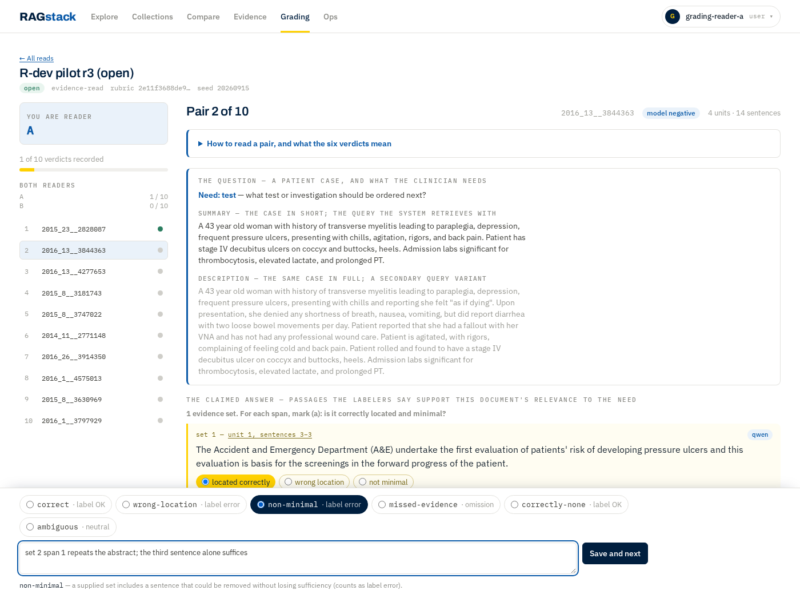
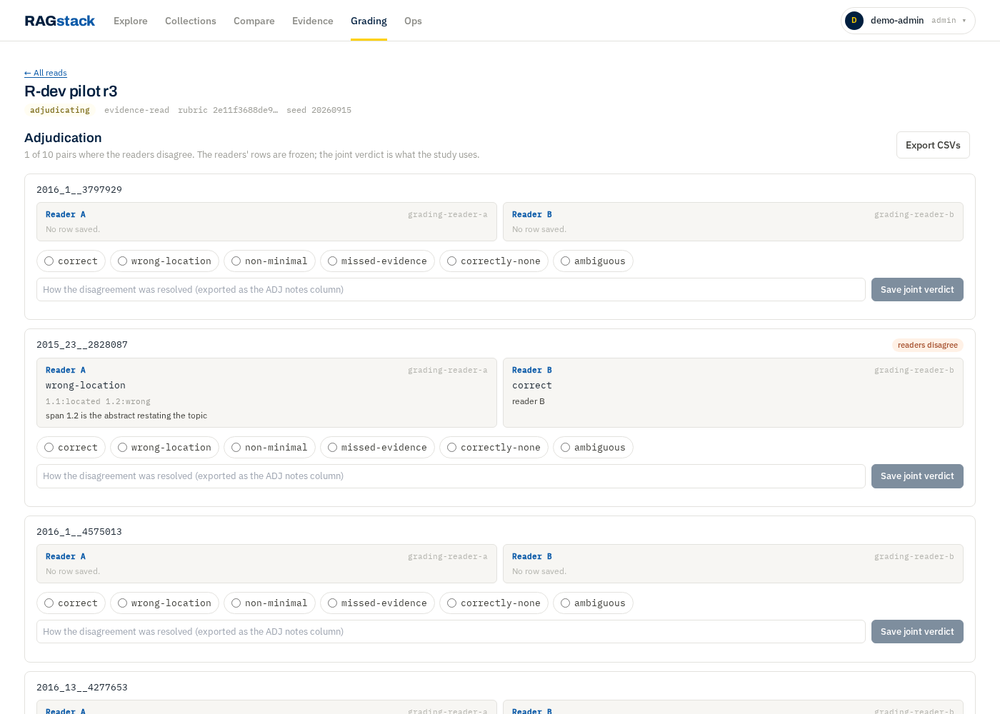

# RAGStack frontend

Dashboard & explorer SPA — **React + Vite + TypeScript**, calling the RAGStack
REST API. Part of the monorepo (`frontend/`, peer to `python/`, `go/`,
`contracts/`). See the tracking issue and `reports/`/the plan for the full
persona-driven design (Explore / Eval / Ops / Overview, role-gated).

This is the **Phase-1a Explore MVP**: a sources-first query console over the
existing `/v1/query`, no new backend required. A single request returns the
answer and its sources atomically; the ranked source list is the trust
centrepiece (rendered first), with the answer settling in below and the citation
actions (Copy DOI / Copy citation / Open at resolver) per source. Thumbs feedback
is **ephemeral** (in-session only — there is no feedback endpoint yet).

**Deliberately deferred** (follow-ups, tracked on #93): true intra-passage
highlighting (needs a chunk-relative `match_start`/`match_end` from the backend —
the model's `start_char`/`end_char` are document-absolute and absent from the
response, so the MVP frames the whole passage as the match), neighbor `±1`
context (needs a `GET /v1/chunks/{id}` endpoint), the AI-eng debug toggle
(score / retrieval_method), streaming answers, and SSO.

**XSS:** all chunk content and metadata are untrusted ingested text and are
rendered as React children (auto-escaped). `dangerouslySetInnerHTML` is banned —
`npm run guard:xss` fails the build if it reappears.

## Grading (`/v1/grading`, docs/plans/grading-ui.md phase 3)

The **Grading** tab is the study's two-independent-reader evidence read
(`GradingView.tsx` + `components/grading/`, logic in `lib/grading.ts`). It
appears only when `GET /v1/grading/batches` returns at least one batch — which
is also how the app learns whether the server implements grading at all (an
older one answers 404 and the tab never appears).

Two rules the screens keep, and neither is cosmetic:

* **The order is the server's.** `GET …/batches/{id}/tasks` returns the caller's
  own seeded permutation — the one `s0_rdev.py` built the paper readsheets with
  — so the UI renders, indexes and advances through `tasks` exactly as it
  arrived. Nothing sorts, filters or reverses it, or a read begun on those
  sheets would silently resume at the wrong pair.
* **Only the caller's own verdict is displayed.** The reader path renders
  `task.verdict`; `GET …/verdicts/{reader}` is never called for anybody and has
  no client helper. `reader_verdicts` reaches the adjudication screen only, and
  only because the server sends it to an admin on a frozen batch.



Adjudication (admin, once `POST …/adjudicate` has frozen the readers' rows) puts
both rows side by side per task and records the joint verdict; **Export**
downloads each `rdev_verdicts_<label>.csv` from the export envelope as a file,
under the name the envelope gives it — `s0_rdev_score.py --a/--b/--adjudicated`
reads them by name.



## Prerequisites
- Node 20+ and npm.
- A running RAGStack API on `http://localhost:8000` (`make run-python`), or set
  `VITE_API_TARGET` to another host.

## Develop
```bash
cd frontend
npm install
npm run gen:api     # generate typed client from ../contracts/openapi.yaml (optional)
npm run dev         # Vite dev server on http://localhost:5173, proxies /v1 + /health
```
Enter an `X-API-Key` (or leave blank if the API is keyless in dev), type a query,
and Search.

## Scripts
- `npm run dev` — dev server (`:5173`, same-origin proxy to the API).
- `npm run build` — type-check + production build to `dist/`.
- `npm run preview` — serve the production build locally.
- `npm run typecheck` — TypeScript only.
- `npm run test` — unit tests (Vitest) for the pure `lib/` modules (highlight, citation).
- `npm run guard:xss` — fails if `dangerouslySetInnerHTML` appears in `src/`.
- `npm run gen:api` — regenerate `src/api/schema.d.ts` from the OpenAPI contract.

## Deployment
Same-origin is recommended: the API serves the built `dist/` (FastAPI
`StaticFiles`) or a shared reverse proxy fronts both — one origin, no CORS, and
the future session cookie "just works". Dev uses the Vite proxy to mirror that.

## Stack (planned as modules land)
Tailwind (styling), TanStack Query (data), TanStack Router (routing), a graph
engine (Cytoscape.js / Sigma.js) for the KG explorer, and charts for the
reporting modules. The generated OpenAPI client keeps types in sync with the
contract.
